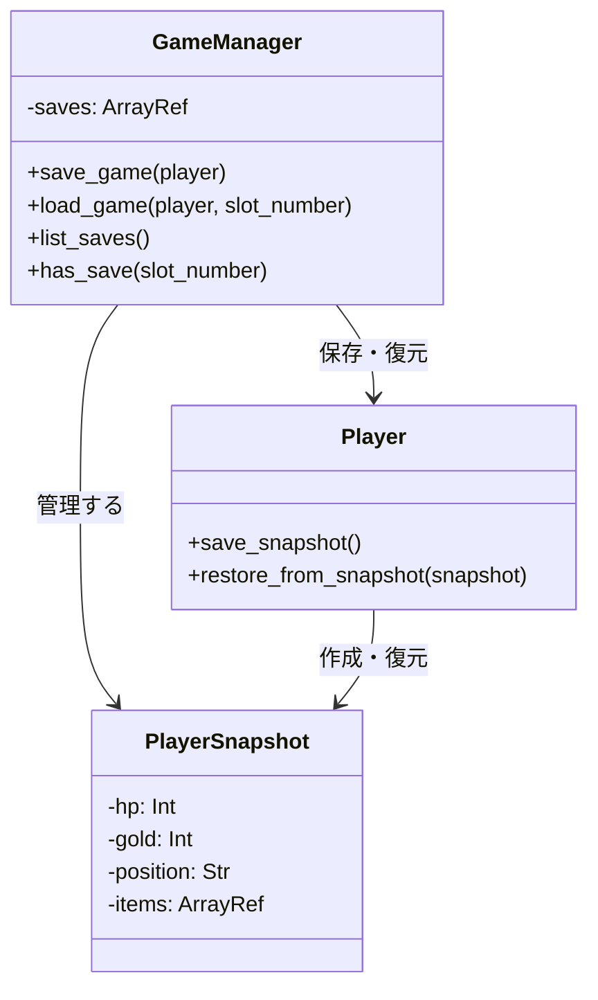
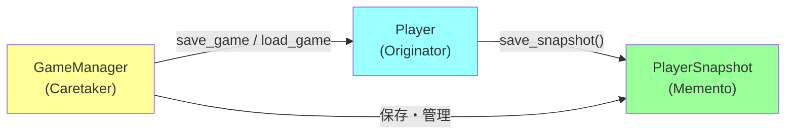
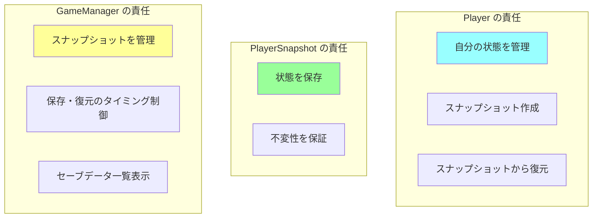

[@nqounet](https://x.com/nqounet)です。

## 前回の振り返り



前回は、保存したスナップショットから、プレイヤーの状態を復元する`restore_from_snapshot`メソッドを実装しました。これにより、セーブ→ダメージ→ロードの基本的な流れが完成しました。



### 前回までに作成したもの

- `PlayerSnapshot`クラス — プレイヤーの状態を保存する不変オブジェクト
- `save_snapshot`メソッド — プレイヤーの状態からスナップショットを作成
- `restore_from_snapshot`メソッド — スナップショットから状態を復元

### まだできていないこと

- **複数のセーブスロットがない** — 1つのスナップショットしか保存できない
- **セーブスロットの管理機能がない** — どのセーブデータをロードするか選べない
- **自動セーブ機能がない** — 手動で`save_snapshot`を呼ぶ必要がある

今回は、複数のセーブポイントを管理する仕組みを作ります。

## 今回のゴール

今回のゴールは、複数のセーブデータを管理できるようにすることです。

- `GameManager`クラスを作成する
- セーブスロット（複数のスナップショット）を管理する
- `save_game`メソッドと`load_game`メソッドを実装する
- セーブデータの一覧表示機能を追加する

これで、実際のゲームのような「セーブスロット1、2、3...」という機能が実現できます。

## なぜGameManagerクラスが必要なのか

現状のコードでは、スナップショットを変数に保存しています。

```perl
my $snapshot = $player->save_snapshot;
```

しかし、これには問題があります。

**問題1：複数のセーブデータを管理できない**

```perl
my $snapshot1 = $player->save_snapshot;  # 町でセーブ
# ...ゲーム進行...
my $snapshot2 = $player->save_snapshot;  # 森でセーブ
# ...ゲーム進行...
my $snapshot3 = $player->save_snapshot;  # 洞窟でセーブ

# どのスナップショットをロードするか？
```

変数が増えるほど管理が大変になります。

**問題2：セーブデータの一覧が見られない**

「いつ、どこでセーブしたか」がわかりません。

**問題3：セーブデータの保存・読み込みロジックが分散**

セーブデータの管理ロジックが、ゲームループのコードに散らばってしまいます。

これらの問題を解決するために、**セーブデータを管理する専門のクラス**を作ります。それが`GameManager`です。

## GameManagerクラスの設計

`GameManager`クラスは、複数のスナップショットを管理する「セーブデータマネージャー」です。



`GameManager`は、複数の`PlayerSnapshot`を配列で管理します。そして、`Player`の状態を保存したり復元したりする窓口になります。

## コード例1：GameManagerクラスの実装

それでは、`GameManager`クラスを作成しましょう。

```perl
# Perl v5.36 以降
# 外部依存: Moo

package GameManager {
    use Moo;
    use v5.36;

    has saves => (
        is      => 'ro',
        default => sub { [] },
    );

    sub save_game ($self, $player) {
        my $snapshot = $player->save_snapshot;
        push $self->saves->@*, $snapshot;
        return scalar $self->saves->@* - 1;  # スロット番号を返す
    }

    sub load_game ($self, $player, $slot_number) {
        unless ($self->has_save($slot_number)) {
            die "セーブデータがありません: スロット $slot_number\n";
        }
        
        my $snapshot = $self->saves->[$slot_number];
        $player->restore_from_snapshot($snapshot);
    }

    sub has_save ($self, $slot_number) {
        return defined $self->saves->[$slot_number];
    }

    sub list_saves ($self) {
        my @saves = $self->saves->@*;
        
        if (@saves == 0) {
            say "セーブデータがありません";
            return;
        }
        
        say "=== セーブデータ一覧 ===";
        for my $i (0 .. $#saves) {
            my $save = $saves[$i];
            say "スロット $i:";
            say "  HP: " . $save->hp;
            say "  所持金: " . $save->gold . "G";
            say "  位置: " . $save->position;
        }
        say "";
    }
};
```

このクラスは、以下の機能を持っています。

### 属性

**`saves`** — セーブデータを保存する配列リファレンス

```perl
has saves => (
    is      => 'ro',
    default => sub { [] },
);
```

`is => 'ro'`で読み取り専用にしていますが、配列の中身は変更できます。これは、配列リファレンス自体は変わらないが、配列の要素は追加・削除できるという意味です。

`default => sub { [] }`で、新しい空の配列リファレンスを作成します。`default => []`ではなく`sub { [] }`を使う理由は、各オブジェクトが独自の配列を持つようにするためです。

### メソッド

**`save_game($player)`** — プレイヤーの状態を保存

```perl
sub save_game ($self, $player) {
    my $snapshot = $player->save_snapshot;
    push @{$self->saves}, $snapshot;
    return scalar @{$self->saves} - 1;  # スロット番号を返す
}
```

プレイヤーからスナップショットを作成し、配列に追加します。そして、保存したスロット番号を返します。

**`load_game($player, $slot_number)`** — セーブデータを読み込む

```perl
sub load_game ($self, $player, $slot_number) {
    unless ($self->has_save($slot_number)) {
        die "セーブデータがありません: スロット $slot_number\n";
    }
    
    my $snapshot = $self->saves->[$slot_number];
    $player->restore_from_snapshot($snapshot);
}
```

指定されたスロット番号のスナップショットを取得し、プレイヤーに復元します。存在しないスロットを指定された場合は、エラーを投げます。

**`has_save($slot_number)`** — セーブデータが存在するか確認

```perl
sub has_save ($self, $slot_number) {
    return defined $self->saves->[$slot_number];
}
```

指定されたスロットにセーブデータがあるかチェックします。

**`list_saves()`** — セーブデータの一覧を表示

```perl
sub list_saves ($self) {
    my @saves = @{$self->saves};
    
    if (@saves == 0) {
        say "セーブデータがありません";
        return;
    }
    
    say "=== セーブデータ一覧 ===";
    for my $i (0 .. $#saves) {
        my $save = $saves[$i];
        say "スロット $i:";
        say "  HP: " . $save->hp;
        say "  所持金: " . $save->gold . "G";
        say "  位置: " . $save->position;
    }
    say "";
}
```

保存されているすべてのセーブデータを一覧表示します。

## GameManagerの役割

`GameManager`クラスは、デザインパターンの用語で**Caretaker（管理者）**と呼ばれる役割を担っています。



3つの役割を整理しましょう。

| 役割 | クラス | 責任 |
|-----|--------|------|
| **Originator（作成者）** | Player | 自分の状態を知っている。スナップショットを作成・復元する |
| **Memento（記念品）** | PlayerSnapshot | 状態を保存する。不変（読み取り専用） |
| **Caretaker（管理者）** | GameManager | スナップショットを管理する。いつ保存・復元するかを決める |

それぞれの責任が明確に分かれています。これが良い設計です。

## コード例2：save_game、load_gameメソッドの動作確認

それでは、`GameManager`を使って、複数のセーブスロットを管理してみましょう。

```perl
# Perl v5.36 以降
# 外部依存: Moo

use v5.36;

package PlayerSnapshot {
    use Moo;

    has hp => (
        is       => 'ro',
        required => 1,
    );

    has gold => (
        is       => 'ro',
        required => 1,
    );

    has position => (
        is       => 'ro',
        required => 1,
    );

    has items => (
        is       => 'ro',
        required => 1,
    );
};

package Player {
    use Moo;

    has hp => (
        is      => 'rw',
        default => 100,
    );

    has gold => (
        is      => 'rw',
        default => 0,
    );

    has position => (
        is      => 'rw',
        default => '町',
    );

    has items => (
        is      => 'rw',
        default => sub { [] },
    );

    sub take_damage ($self, $amount) {
        $self->hp($self->hp - $amount);
        if ($self->hp < 0) {
            $self->hp(0);
        }
    }

    sub earn_gold ($self, $amount) {
        $self->gold($self->gold + $amount);
    }

    sub get_item ($self, $item) {
        push $self->items->@*, $item;
    }

    sub move_to ($self, $location) {
        $self->position($location);
    }

    sub is_alive ($self) {
        return $self->hp > 0;
    }

    sub show_status ($self) {
        say "HP: " . $self->hp;
        say "所持金: " . $self->gold . "G";
        say "位置: " . $self->position;
        if ($self->items->@*) {
            say "持ち物: " . join(', ', $self->items->@*);
        } else {
            say "持ち物: なし";
        }
        say "";
    }

    sub save_snapshot ($self) {
        return PlayerSnapshot->new(
            hp       => $self->hp,
            gold     => $self->gold,
            position => $self->position,
            items    => [ $self->items->@* ], # 重要：参照コピーではなく、新しい配列を作成（シャローコピー）
        );
    }

    sub restore_from_snapshot ($self, $snapshot) {
        $self->hp($snapshot->hp);
        $self->gold($snapshot->gold);
        $self->position($snapshot->position);
        $self->items([ $snapshot->items->@* ]); # 重要：復元時も新しい配列を作成
    }
};

package GameManager {
    use Moo;

    has saves => (
        is      => 'ro',
        default => sub { [] },
    );

    sub save_game ($self, $player) {
        my $snapshot = $player->save_snapshot;
        push $self->saves->@*, $snapshot;
        return scalar $self->saves->@* - 1;
    }

    sub load_game ($self, $player, $slot_number) {
        unless ($self->has_save($slot_number)) {
            die "セーブデータがありません: スロット $slot_number\n";
        }
        
        my $snapshot = $self->saves->[$slot_number];
        $player->restore_from_snapshot($snapshot);
    }

    sub has_save ($self, $slot_number) {
        return defined $self->saves->[$slot_number];
    }

    sub list_saves ($self) {
        my @saves = $self->saves->@*;
        
        if (@saves == 0) {
            say "セーブデータがありません";
            return;
        }
        
        say "=== セーブデータ一覧 ===";
        for my $i (0 .. $#saves) {
            my $save = $saves[$i];
            say "スロット $i:";
            say "  HP: " . $save->hp;
            say "  所持金: " . $save->gold . "G";
            say "  位置: " . $save->position;
        }
        say "";
    }
};

# ゲームループのデモ
my $player  = Player->new;
my $manager = GameManager->new;

say "=== ゲーム開始 ===";
$player->show_status;

# セーブスロット0：町でセーブ
say "=== セーブスロット 0 ===";
my $slot0 = $manager->save_game($player);
say "スロット $slot0 に保存しました";
say "";

say "森へ移動...";
$player->move_to('森');
$player->show_status;

say "スライムと戦闘！";
$player->take_damage(30);
say "30のダメージを受けた！";
$player->show_status;

say "スライムを倒した！";
$player->earn_gold(50);
say "50Gを手に入れた！";
$player->get_item('薬草');
say "薬草を手に入れた！";
$player->show_status;

# セーブスロット1：森でセーブ
say "=== セーブスロット 1 ===";
my $slot1 = $manager->save_game($player);
say "スロット $slot1 に保存しました";
say "";

say "洞窟へ移動...";
$player->move_to('洞窟');
$player->show_status;

# セーブスロット2：洞窟でセーブ
say "=== セーブスロット 2 ===";
my $slot2 = $manager->save_game($player);
say "スロット $slot2 に保存しました";
say "";

# セーブデータ一覧を表示
$manager->list_saves;

# ドラゴンと戦闘
say "ドラゴンと戦闘！";
$player->take_damage(80);
say "80のダメージを受けた！";
$player->show_status;

if (!$player->is_alive) {
    say "=== GAME OVER ===";
    say "";
    
    # スロット1（森）からロード
    say "スロット 1 から復元します...";
    $manager->load_game($player, 1);
    
    say "=== 復元完了 ===";
    $player->show_status;
    
    say "スロット 1（森）からゲームを再開しました。";
}
```

実行結果は以下のようになります。

```
=== ゲーム開始 ===
HP: 100
所持金: 0G
位置: 町
持ち物: なし

=== セーブスロット 0 ===
スロット 0 に保存しました

森へ移動...
HP: 100
所持金: 0G
位置: 森
持ち物: なし

スライムと戦闘！
30のダメージを受けた！
HP: 70
所持金: 0G
位置: 森
持ち物: なし

スライムを倒した！
50Gを手に入れた！
薬草を手に入れた！
HP: 70
所持金: 50G
位置: 森
持ち物: 薬草

=== セーブスロット 1 ===
スロット 1 に保存しました

洞窟へ移動...
HP: 70
所持金: 50G
位置: 洞窟
持ち物: 薬草

=== セーブスロット 2 ===
スロット 2 に保存しました

=== セーブデータ一覧 ===
スロット 0:
  HP: 100
  所持金: 0G
  位置: 町
スロット 1:
  HP: 70
  所持金: 50G
  位置: 森
スロット 2:
  HP: 70
  所持金: 50G
  位置: 洞窟

ドラゴンと戦闘！
80のダメージを受けた！
HP: 0
所持金: 50G
位置: 洞窟
持ち物: 薬草

=== GAME OVER ===

スロット 1 から復元します...
=== 復元完了 ===
HP: 70
所持金: 50G
位置: 森
持ち物: 薬草

スロット 1（森）からゲームを再開しました。
```

完璧です！複数のセーブスロットが管理でき、好きなスロットからロードできるようになりました。

## 設計のポイント

今回の設計には、いくつかの重要なポイントがあります。

### 1. 責任の分離

`Player`、`PlayerSnapshot`、`GameManager`の3つのクラスが、それぞれ明確な責任を持っています。



この分離により、それぞれのクラスが独立して変更できるようになります。

### 2. カプセル化の維持

`GameManager`を使うことで、セーブデータの管理ロジックが隠蔽されます。

```perl
# 外部からは、save_game と load_game を呼ぶだけ
$manager->save_game($player);
$manager->load_game($player, 1);
```

配列の操作やスロット番号の管理は、`GameManager`の中に隠されています。

### 3. 将来の拡張に強い

例えば、セーブデータにタイムスタンプを追加したい場合、`GameManager`クラスだけを修正すれば済みます。

```perl
# 将来の拡張例
sub save_game ($self, $player) {
    my $snapshot = $player->save_snapshot;
    my $save_data = {
        snapshot  => $snapshot,
        timestamp => time,  # 追加
    };
    push @{$self->saves}, $save_data;
    return scalar @{$self->saves} - 1;
}
```

外部のコードは変更不要です。

## default => sub { [] } の重要性

`GameManager`クラスの`saves`属性で、`default => sub { [] }`を使いました。

```perl
has saves => (
    is      => 'ro',
    default => sub { [] },
);
```

なぜ`default => []`ではなく`sub { [] }`を使うのでしょうか。

### 間違った例：default => []

```perl
has saves => (
    is      => 'ro',
    default => [],  # これはダメ
);
```

この書き方だと、すべての`GameManager`オブジェクトが**同じ配列を共有**してしまいます。

```perl
my $manager1 = GameManager->new;
my $manager2 = GameManager->new;

$manager1->save_game($player1);

# $manager2 の saves にも影響してしまう！
say scalar @{$manager2->saves};  # 1
```

これは、Perlのリファレンスの仕組みによるものです。`default => []`は、プログラム起動時に1度だけ配列リファレンスを作成し、それをすべてのオブジェクトで共有します。

### 正しい例：default => sub { [] }

```perl
has saves => (
    is      => 'ro',
    default => sub { [] },  # 正しい
);
```

`sub { [] }`を使うと、オブジェクトが作成されるたびに、新しい配列リファレンスが作成されます。

```perl
my $manager1 = GameManager->new;
my $manager2 = GameManager->new;

$manager1->save_game($player1);

# $manager2 は影響を受けない
say scalar @{$manager2->saves};  # 0
```

これが、`default`にリファレンス（配列やハッシュ）を指定する際の正しい書き方です。

## 参照コピーとシャローコピー

`items`の保存で、以下のようなコードを書きました。

```perl
items => [ $self->items->@* ], # 重要：参照コピーではなく、新しい配列を作成（シャローコピー）
```

なぜ、単純に以下のように書いてはいけないのでしょうか？

```perl
items => $self->items, # 参照コピー（間違い）
```

### 参照コピーの問題点

`$self->items`は配列リファレンスです。これをそのまま保存すると、**「元の配列そのもの」**を保存することになります。

```perl
my $snapshot = $player->save_snapshot; # この時点では items は ['薬草']

# その後、プレイヤーがアイテムを追加
$player->get_item('剣');

# 参照コピーの場合、過去のスナップショットの中身も変わってしまう！
# $snapshot->items も ['薬草', '剣'] になっている
```

これでは、過去の状態を保存したことになりません。

### シャローコピー（浅いコピー）

そこで、`[ $self->items->@* ]` とすることで、**「新しい配列を作って、中身をコピー」**しています。これをシャローコピーと呼びます。

これにより、元の配列が変更されても、スナップショット側の配列は影響を受けません。

### なぜシャローコピーで十分なのか？

「ディープコピー（深いコピー）は必要ないの？」と思うかもしれません。

今回の場合、`items`の中身は「文字列（スカラ）」だけです。文字列は不変（変更不可）なので、配列の側さえ新しくしておけば、中身までコピーする必要はありません。

もし、`items`の中身が「オブジェクト」や「別のリファレンス」だった場合は、ディープコピーが必要になることもありますが、今回のゲームではシャローコピーで十分です。

## まだできていないこと

今回の実装で、複数のセーブスロット管理機能が完成しました。しかし、まだいくつかの課題があります。

1. **自動セーブ機能がない** — 特定のイベントで自動的にセーブする機能
2. **セーブスロット数の制限がない** — 無限にセーブできてしまう
3. **セーブデータの上書き保護がない** — 既存のスロットを上書きする際の確認がない

次回は、特定のイベント（ボス戦前、エリア移動時）で自動的にセーブする「オートセーブ機能」を追加します。

## 今回作成した完成コード

以下が今回作成した完成コードです。1つのスクリプトファイルとして動作します。

```perl
#!/usr/bin/env perl
# Perl v5.36 以降
# 外部依存: Moo

use v5.36;

package PlayerSnapshot {
    use Moo;

    has hp => (
        is       => 'ro',
        required => 1,
    );

    has gold => (
        is       => 'ro',
        required => 1,
    );

    has position => (
        is       => 'ro',
        required => 1,
    );

    has items => (
        is       => 'ro',
        required => 1,
    );
};

package Player {
    use Moo;

    has hp => (
        is      => 'rw',
        default => 100,
    );

    has gold => (
        is      => 'rw',
        default => 0,
    );

    has position => (
        is      => 'rw',
        default => '町',
    );

    has items => (
        is      => 'rw',
        default => sub { [] },
    );

    sub take_damage ($self, $amount) {
        $self->hp($self->hp - $amount);
        if ($self->hp < 0) {
            $self->hp(0);
        }
    }

    sub earn_gold ($self, $amount) {
        $self->gold($self->gold + $amount);
    }

    sub get_item ($self, $item) {
        push $self->items->@*, $item;
    }

    sub move_to ($self, $location) {
        $self->position($location);
    }

    sub is_alive ($self) {
        return $self->hp > 0;
    }

    sub show_status ($self) {
        say "HP: " . $self->hp;
        say "所持金: " . $self->gold . "G";
        say "位置: " . $self->position;
        if ($self->items->@*) {
            say "持ち物: " . join(', ', $self->items->@*);
        } else {
            say "持ち物: なし";
        }
        say "";
    }

    sub save_snapshot ($self) {
        return PlayerSnapshot->new(
            hp       => $self->hp,
            gold     => $self->gold,
            position => $self->position,
            items    => [ $self->items->@* ], # 重要：参照コピーではなく、新しい配列を作成（シャローコピー）
        );
    }

    sub restore_from_snapshot ($self, $snapshot) {
        $self->hp($snapshot->hp);
        $self->gold($snapshot->gold);
        $self->position($snapshot->position);
        $self->items([ $snapshot->items->@* ]); # 重要：復元時も新しい配列を作成
    }
};

package GameManager {
    use Moo;

    has saves => (
        is      => 'ro',
        default => sub { [] },
    );

    sub save_game ($self, $player) {
        my $snapshot = $player->save_snapshot;
        push $self->saves->@*, $snapshot;
        return scalar $self->saves->@* - 1;
    }

    sub load_game ($self, $player, $slot_number) {
        unless ($self->has_save($slot_number)) {
            die "セーブデータがありません: スロット $slot_number\n";
        }
        
        my $snapshot = $self->saves->[$slot_number];
        $player->restore_from_snapshot($snapshot);
    }

    sub has_save ($self, $slot_number) {
        return defined $self->saves->[$slot_number];
    }

    sub list_saves ($self) {
        my @saves = $self->saves->@*;
        
        if (@saves == 0) {
            say "セーブデータがありません";
            return;
        }
        
        say "=== セーブデータ一覧 ===";
        for my $i (0 .. $#saves) {
            my $save = $saves[$i];
            say "スロット $i:";
            say "  HP: " . $save->hp;
            say "  所持金: " . $save->gold . "G";
            say "  位置: " . $save->position;
        }
        say "";
    }
};

# ゲームループのデモ
my $player  = Player->new;
my $manager = GameManager->new;

say "=== ゲーム開始 ===";
$player->show_status;

# セーブスロット0：町でセーブ
say "=== セーブスロット 0 ===";
my $slot0 = $manager->save_game($player);
say "スロット $slot0 に保存しました";
say "";

say "森へ移動...";
$player->move_to('森');
$player->show_status;

say "スライムと戦闘！";
$player->take_damage(30);
say "30のダメージを受けた！";
$player->show_status;

say "スライムを倒した！";
$player->earn_gold(50);
say "50Gを手に入れた！";
$player->get_item('薬草');
say "薬草を手に入れた！";
$player->show_status;

# セーブスロット1：森でセーブ
say "=== セーブスロット 1 ===";
my $slot1 = $manager->save_game($player);
say "スロット $slot1 に保存しました";
say "";

say "洞窟へ移動...";
$player->move_to('洞窟');
$player->show_status;

# セーブスロット2：洞窟でセーブ
say "=== セーブスロット 2 ===";
my $slot2 = $manager->save_game($player);
say "スロット $slot2 に保存しました";
say "";

# セーブデータ一覧を表示
$manager->list_saves;

# ドラゴンと戦闘
say "ドラゴンと戦闘！";
$player->take_damage(80);
say "80のダメージを受けた！";
$player->show_status;

if (!$player->is_alive) {
    say "=== GAME OVER ===";
    say "";
    
    # スロット1（森）からロード
    say "スロット 1 から復元します...";
    $manager->load_game($player, 1);
    
    say "=== 復元完了 ===";
    $player->show_status;
    
    say "スロット 1（森）からゲームを再開しました。";
}
```

## まとめ

今回は、複数のセーブポイントを管理する`GameManager`クラスを作成しました。

**作成したもの:**

- `GameManager`クラスで、複数のスナップショットを管理できるようにした
- `save_game`メソッドで、プレイヤーの状態を配列に保存した
- `load_game`メソッドで、指定したスロットから状態を復元した
- `list_saves`メソッドで、セーブデータの一覧を表示した

**学んだこと:**

- Caretaker（管理者）の役割
- 責任の分離（Player、PlayerSnapshot、GameManagerの3つの役割）
- `default => sub { [] }`の重要性（リファレンスのデフォルト値）
- カプセル化を維持した設計

**設計の利点:**

- 複数のセーブスロットを簡単に管理できる
- セーブデータの管理ロジックが`GameManager`に集約されている
- 将来の拡張（タイムスタンプ追加など）に強い

実際のゲームのような「セーブスロット1、2、3...」という機能が実現できました！次回は、オートセーブ機能を追加します。

## 次回予告

今回、複数のセーブスロット管理機能が完成しました。

しかし、現状では手動で`save_game`を呼ぶ必要があります。実際のゲームでは、ボス戦前やエリア移動時に自動的にセーブされることがよくあります。

次回は、特定のイベント（ボス戦前、エリア移動時）で自動的にセーブする「オートセーブ機能」を追加します。`auto_save`フラグと自動セーブロジックを実装し、より本格的なゲームのセーブ機能に近づけます。

**第6回のテーマ: オートセーブを追加しよう**

お楽しみに。
