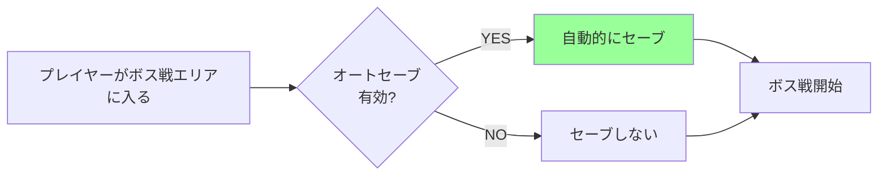
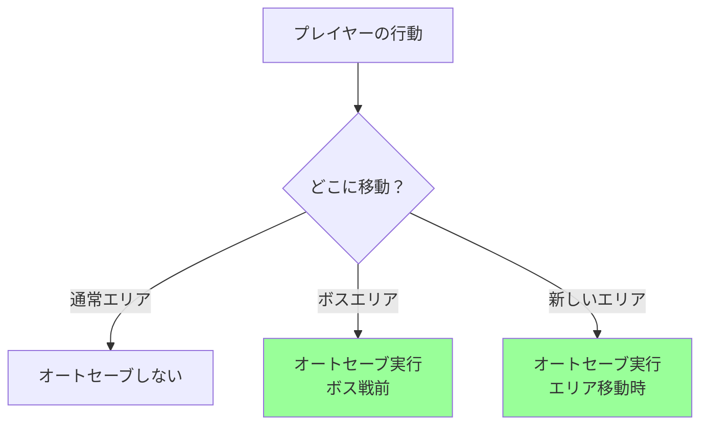

[@nqounet](https://x.com/nqounet)です。

## 前回の振り返り



前回は、複数のセーブポイントを管理する`GameManager`クラスを作成しました。これにより、複数のセーブスロットを管理し、好きなスロットからロードできるようになりました。



### 前回までに作成したもの

- `GameManager`クラス — 複数のスナップショットを管理
- `save_game`メソッド — プレイヤーの状態を配列に保存
- `load_game`メソッド — 指定したスロットから状態を復元
- `list_saves`メソッド — セーブデータの一覧を表示

### まだできていないこと

- 自動セーブ機能がない — 特定のイベントで自動的にセーブする機能
- セーブスロット数の制限がない — 無限にセーブできてしまう
- セーブデータの上書き保護がない — 既存のスロットを上書きする際の確認がない

今回は、特定のイベントで自動的にセーブする「オートセーブ機能」を追加します。

## 今回のゴール

今回のゴールは、特定のイベントで自動的にセーブする機能を追加することです。

- `GameManager`に`auto_save`フラグを追加する
- 特定のタイミング（ボス戦前、エリア移動時）で自動セーブする
- オートセーブのON/OFF切り替えを実装する
- セーブポイント通過時の動作を確認する

これで、プレイヤーがセーブを忘れても、重要なポイントで自動的にセーブされるようになります。

## オートセーブとは

オートセーブは、プレイヤーが明示的にセーブ操作をしなくても、ゲームが自動的に進行状況を保存する機能です。



### オートセーブのメリット

1. セーブ忘れを防ぐ — プレイヤーがセーブを忘れても大丈夫
2. 重要なポイントで確実にセーブ — ボス戦前など、失敗しやすい場所の前にセーブ
3. ゲーム体験の向上 — 手間が減り、ゲームに集中できる

### オートセーブのタイミング

一般的なゲームでは、以下のようなタイミングでオートセーブが行われます。

- ボス戦エリアに入る直前
- 新しいエリアに移動したとき
- 重要なイベントが発生したとき
- 一定時間ごと（5分ごとなど）

今回は、「ボス戦エリアに入る直前」と「新しいエリアに移動したとき」でオートセーブを実装します。

## auto_saveフラグの追加

まず、`GameManager`にオートセーブのON/OFF切り替え機能を追加しましょう。

```perl
# Perl v5.36 以降
# 外部依存: Moo

package GameManager {
    use Moo;
    use v5.36;

    has saves => (
        is      => 'ro',
        default => sub { [] },
    );

    has auto_save => (
        is      => 'rw',
        default => 1,  # デフォルトでON
    );

    sub save_game ($self, $player) {
        my $snapshot = $player->save_snapshot;
        push @{$self->saves}, $snapshot;
        return scalar @{$self->saves} - 1;
    }

    sub load_game ($self, $player, $slot_number) {
        unless ($self->has_save($slot_number)) {
            die "セーブデータがありません: スロット $slot_number\n";
        }
        
        my $snapshot = $self->saves->[$slot_number];
        $player->restore_from_snapshot($snapshot);
    }

    sub has_save ($self, $slot_number) {
        return defined $self->saves->[$slot_number];
    }

    sub list_saves ($self) {
        my @saves = @{$self->saves};
        
        if (@saves == 0) {
            say "セーブデータがありません";
            return;
        }
        
        say "=== セーブデータ一覧 ===";
        for my $i (0 .. $#saves) {
            my $save = $saves[$i];
            say "スロット $i:";
            say "  HP: " . $save->hp;
            say "  所持金: " . $save->gold . "G";
            say "  位置: " . $save->position;
        }
        say "";
    }
};
```

新しい属性`auto_save`を追加しました。

```perl
has auto_save => (
    is      => 'rw',
    default => 1,  # デフォルトでON
);
```

`is => 'rw'`なので、読み書き可能です。これにより、ゲーム中にオートセーブをON/OFFできます。

```perl
$manager->auto_save(1);  # オートセーブON
$manager->auto_save(0);  # オートセーブOFF

if ($manager->auto_save) {
    say "オートセーブは有効です";
}
```

## コード例1：auto_saveフラグと自動セーブロジック

次に、特定のタイミングで自動セーブを行うメソッドを追加しましょう。

```perl
# Perl v5.36 以降
# 外部依存: Moo

package GameManager {
    use Moo;
    use v5.36;

    has saves => (
        is      => 'ro',
        default => sub { [] },
    );

    has auto_save => (
        is      => 'rw',
        default => 1,
    );

    sub save_game ($self, $player) {
        my $snapshot = $player->save_snapshot;
        push @{$self->saves}, $snapshot;
        return scalar @{$self->saves} - 1;
    }

    sub load_game ($self, $player, $slot_number) {
        unless ($self->has_save($slot_number)) {
            die "セーブデータがありません: スロット $slot_number\n";
        }
        
        my $snapshot = $self->saves->[$slot_number];
        $player->restore_from_snapshot($snapshot);
    }

    sub has_save ($self, $slot_number) {
        return defined $self->saves->[$slot_number];
    }

    sub list_saves ($self) {
        my @saves = @{$self->saves};
        
        if (@saves == 0) {
            say "セーブデータがありません";
            return;
        }
        
        say "=== セーブデータ一覧 ===";
        for my $i (0 .. $#saves) {
            my $save = $saves[$i];
            say "スロット $i:";
            say "  HP: " . $save->hp;
            say "  所持金: " . $save->gold . "G";
            say "  位置: " . $save->position;
        }
        say "";
    }

    # 新規追加：オートセーブメソッド
    sub try_auto_save ($self, $player, $reason = '') {
        unless ($self->auto_save) {
            return;  # オートセーブがOFFなら何もしない
        }
        
        my $slot = $self->save_game($player);
        
        if ($reason) {
            say "* オートセーブ: $reason *";
        } else {
            say "* オートセーブしました *";
        }
        say "スロット $slot に保存しました";
        say "";
    }
};
```

新しいメソッド`try_auto_save`を追加しました。

```perl
sub try_auto_save ($self, $player, $reason = '') {
    unless ($self->auto_save) {
        return;  # オートセーブがOFFなら何もしない
    }
    
    my $slot = $self->save_game($player);
    
    if ($reason) {
        say "* オートセーブ: $reason *";
    } else {
        say "* オートセーブしました *";
    }
    say "スロット $slot に保存しました";
    say "";
}
```

このメソッドは、オートセーブが有効な場合のみ、セーブを実行します。`$reason`パラメータで、なぜオートセーブしたかを表示できます。

### デフォルト引数の使い方

Perl v5.36のサブルーチンシグネチャでは、デフォルト引数を指定できます。

```perl
sub try_auto_save ($self, $player, $reason = '') {
    # $reason が渡されなければ、空文字列が使われる
}
```

これにより、以下のように呼び出せます。

```perl
$manager->try_auto_save($player);                    # $reason = ''
$manager->try_auto_save($player, 'ボス戦前');        # $reason = 'ボス戦前'
$manager->try_auto_save($player, 'エリア移動時');    # $reason = 'エリア移動時'
```

## セーブポイントの種類

ゲーム中のどこでオートセーブするかを定義しましょう。



今回は、以下の条件でオートセーブを実行します。

1. ボス戦エリアに入ったとき — 位置が「ボス部屋」になったとき
2. 新しいエリアに移動したとき — 森→洞窟など、エリアが変わったとき

## コード例2：セーブポイント通過のデモ

それでは、オートセーブ機能を動かしてみましょう。

```perl
# Perl v5.36 以降
# 外部依存: Moo

use v5.36;

package PlayerSnapshot {
    use Moo;

    has hp => (
        is       => 'ro',
        required => 1,
    );

    has gold => (
        is       => 'ro',
        required => 1,
    );

    has position => (
        is       => 'ro',
        required => 1,
    );

    has items => (
        is       => 'ro',
        required => 1,
    );
};

package Player {
    use Moo;

    has hp => (
        is      => 'rw',
        default => 100,
    );

    has gold => (
        is      => 'rw',
        default => 0,
    );

    has position => (
        is      => 'rw',
        default => '町',
    );

    has items => (
        is      => 'rw',
        default => sub { [] },
    );

    sub take_damage ($self, $amount) {
        $self->hp($self->hp - $amount);
        if ($self->hp < 0) {
            $self->hp(0);
        }
    }

    sub earn_gold ($self, $amount) {
        $self->gold($self->gold + $amount);
    }

    sub add_item ($self, $item) {
        push $self->items->@*, $item;
    }

    sub move_to ($self, $location) {
        $self->position($location);
    }

    sub is_alive ($self) {
        return $self->hp > 0;
    }

    sub show_status ($self) {
        say "HP: " . $self->hp;
        say "所持金: " . $self->gold . "G";
        say "位置: " . $self->position;
        say "持ち物: " . join(', ', $self->items->@*);
        say "";
    }

    sub save_snapshot ($self) {
        return PlayerSnapshot->new(
            hp       => $self->hp,
            gold     => $self->gold,
            position => $self->position,
            items    => [ $self->items->@* ], # 参照コピーではなく、新しい配列リファレンスを作成（重要！）
        );
    }

    sub restore_from_snapshot ($self, $snapshot) {
        $self->hp($snapshot->hp);
        $self->gold($snapshot->gold);
        $self->position($snapshot->position);
        $self->items([ $snapshot->items->@* ]);
    }
};

package GameManager {
    use Moo;

    has saves => (
        is      => 'ro',
        default => sub { [] },
    );

    has auto_save => (
        is      => 'rw',
        default => 1,
    );

    sub save_game ($self, $player) {
        my $snapshot = $player->save_snapshot;
        push @{$self->saves}, $snapshot;
        return scalar @{$self->saves} - 1;
    }

    sub load_game ($self, $player, $slot_number) {
        unless ($self->has_save($slot_number)) {
            die "セーブデータがありません: スロット $slot_number\n";
        }
        
        my $snapshot = $self->saves->[$slot_number];
        $player->restore_from_snapshot($snapshot);
    }

    sub has_save ($self, $slot_number) {
        return defined $self->saves->[$slot_number];
    }

    sub list_saves ($self) {
        my @saves = @{$self->saves};
        
        if (@saves == 0) {
            say "セーブデータがありません";
            return;
        }
        
        say "=== セーブデータ一覧 ===";
        for my $i (0 .. $#saves) {
            my $save = $saves[$i];
            say "スロット $i:";
            say "  HP: " . $save->hp;
            say "  所持金: " . $save->gold . "G";
            say "  位置: " . $save->position;
        }
        say "";
    }

    sub try_auto_save ($self, $player, $reason = '') {
        unless ($self->auto_save) {
            return;
        }
        
        my $slot = $self->save_game($player);
        
        if ($reason) {
            say "* オートセーブ: $reason *";
        } else {
            say "* オートセーブしました *";
        }
        say "スロット $slot に保存しました";
        say "";
    }
};

# ヘルパー関数：エリア移動とオートセーブ
sub move_to_area ($player, $manager, $location, $is_boss_area = 0) {
    my $old_location = $player->position;
    $player->move_to($location);
    
    say "=== $location へ移動 ===";
    
    # エリアが変わった場合、オートセーブ
    if ($old_location ne $location) {
        if ($is_boss_area) {
            $manager->try_auto_save($player, "ボス戦前");
        } else {
            $manager->try_auto_save($player, "エリア移動時");
        }
    }
    
    $player->show_status;
}

# ゲームループのデモ
my $player  = Player->new;
my $manager = GameManager->new;

say "=== ゲーム開始 ===";
$player->show_status;

# 森へ移動（オートセーブ）
move_to_area($player, $manager, '森');

say "スライムと戦闘！";
$player->take_damage(30);
say "30のダメージを受けた！";
$player->show_status;

say "スライムを倒した！";
$player->earn_gold(50);
say "50Gを手に入れた！";
$player->add_item('薬草');
say "薬草を手に入れた！";
$player->show_status;

# 洞窟へ移動（オートセーブ）
move_to_area($player, $manager, '洞窟');

# ボス部屋へ移動（ボス戦前オートセーブ）
move_to_area($player, $manager, 'ボス部屋', 1);

say "ドラゴンと戦闘！";
$player->take_damage(80);
say "80のダメージを受けた！";
$player->show_status;

if (!$player->is_alive) {
    say "=== GAME OVER ===";
    say "";
    
    # セーブデータ一覧を表示
    $manager->list_saves;
    
    # 最新のオートセーブ（ボス部屋前）からロード
    my $latest_slot = scalar @{$manager->saves} - 1;
    say "最新のオートセーブ（スロット $latest_slot）から復元します...";
    $manager->load_game($player, $latest_slot);
    
    say "=== 復元完了 ===";
    $player->show_status;
    
    say "ボス部屋からゲームを再開しました。";
}
```

実行結果は以下のようになります。

```
=== ゲーム開始 ===
HP: 100
所持金: 0G
位置: 町
持ち物: 

=== 森 へ移動 ===
* オートセーブ: エリア移動時 *
スロット 0 に保存しました

HP: 100
所持金: 0G
位置: 森
持ち物: 

スライムと戦闘！
30のダメージを受けた！
HP: 70
所持金: 0G
位置: 森
持ち物: 

スライムを倒した！
50Gを手に入れた！
薬草を手に入れた！
HP: 70
所持金: 50G
位置: 森
持ち物: 薬草

=== 洞窟 へ移動 ===
* オートセーブ: エリア移動時 *
スロット 1 に保存しました

HP: 70
所持金: 50G
位置: 洞窟
持ち物: 薬草

=== ボス部屋 へ移動 ===
* オートセーブ: ボス戦前 *
スロット 2 に保存しました

HP: 70
所持金: 50G
位置: ボス部屋
持ち物: 薬草

ドラゴンと戦闘！
80のダメージを受けた！
HP: 0
所持金: 50G
位置: ボス部屋
持ち物: 薬草

=== GAME OVER ===

=== セーブデータ一覧 ===
スロット 0:
  HP: 100
  所持金: 0G
  位置: 森
スロット 1:
  HP: 70
  所持金: 50G
  位置: 洞窟
スロット 2:
  HP: 70
  所持金: 50G
  位置: ボス部屋

最新のオートセーブ（スロット 2）から復元します...
=== 復元完了 ===
HP: 70
所持金: 50G
位置: ボス部屋
持ち物: 薬草

ボス部屋からゲームを再開しました。
```

完璧です！エリア移動時とボス戦前に自動的にセーブされ、ゲームオーバー後も安心してリトライできます。

## オートセーブのON/OFF切り替え

オートセーブをOFFにすることもできます。

```perl
# オートセーブをOFFにする
$manager->auto_save(0);

# この移動ではオートセーブされない
move_to_area($player, $manager, '城');

# オートセーブを再びONにする
$manager->auto_save(1);

# この移動ではオートセーブされる
move_to_area($player, $manager, '神殿');
```

これにより、プレイヤーが「自分でセーブタイミングを管理したい」という場合にも対応できます。

## ヘルパー関数の活用

今回、`move_to_area`というヘルパー関数を作成しました。

```perl
sub move_to_area ($player, $manager, $location, $is_boss_area = 0) {
    my $old_location = $player->position;
    $player->move_to($location);
    
    say "=== $location へ移動 ===";
    
    # エリアが変わった場合、オートセーブ
    if ($old_location ne $location) {
        if ($is_boss_area) {
            $manager->try_auto_save($player, "ボス戦前");
        } else {
            $manager->try_auto_save($player, "エリア移動時");
        }
    }
    
    $player->show_status;
}
```

この関数は、以下の処理をまとめています。

1. 移動前の位置を記憶
2. プレイヤーを移動させる
3. エリアが変わったか確認
4. 必要に応じてオートセーブ
5. 状態を表示

これにより、ゲームループのコードがシンプルになります。

```perl
# 以前の書き方（長い）
$player->move_to('森');
if ($manager->auto_save) {
    $manager->save_game($player);
}
$player->show_status;

# ヘルパー関数を使った書き方（短い）
move_to_area($player, $manager, '森');
```

このように、共通の処理をヘルパー関数にまとめることで、コードの重複を減らし、可読性を高めることができます。

## オートセーブの設計思想

オートセーブ機能を追加する際、以下の設計思想を大切にしました。

### 1. プレイヤーの選択を尊重

オートセーブをON/OFFできるようにすることで、プレイヤーのプレイスタイルを尊重します。

```perl
has auto_save => (
    is      => 'rw',  # 読み書き可能
    default => 1,     # デフォルトはON
);
```

### 2. 透明性の確保

オートセーブが実行されたことをプレイヤーに知らせます。

```perl
say "* オートセーブ: ボス戦前 *";
say "スロット $slot に保存しました";
```

### 3. タイミングの明確化

どのタイミングでオートセーブが実行されるか、理由を明示します。

```perl
$manager->try_auto_save($player, "ボス戦前");
$manager->try_auto_save($player, "エリア移動時");
```

これらの設計により、プレイヤーにとって予測可能で、信頼できるオートセーブ機能になります。

## まだできていないこと

今回の実装で、オートセーブ機能が追加されました。しかし、まだいくつかの課題があります。

1. セーブスロット数の制限がない — オートセーブが無限に増えてしまう
2. 古いセーブデータの削除機能がない — メモリを圧迫する可能性
3. セーブデータの上書き保護がない — 重要なセーブデータが消える可能性

次回は、セーブデータを守る仕組みを強化します。スナップショットのカプセル化を徹底し、外部からの不正な変更を防止する設計を学びます。

## 今回作成した完成コード

以下が今回作成した完成コードです。1つのスクリプトファイルとして動作します。

```perl
#!/usr/bin/env perl
# Perl v5.36 以降
# 外部依存: Moo

use v5.36;

package PlayerSnapshot {
    use Moo;

    has hp => (
        is       => 'ro',
        required => 1,
    );

    has gold => (
        is       => 'ro',
        required => 1,
    );

    has position => (
        is       => 'ro',
        required => 1,
    );

    has items => (
        is       => 'ro',
        required => 1,
    );
};

package Player {
    use Moo;

    has hp => (
        is      => 'rw',
        default => 100,
    );

    has gold => (
        is      => 'rw',
        default => 0,
    );

    has position => (
        is      => 'rw',
        default => '町',
    );

    has items => (
        is      => 'rw',
        default => sub { [] },
    );

    sub take_damage ($self, $amount) {
        $self->hp($self->hp - $amount);
        if ($self->hp < 0) {
            $self->hp(0);
        }
    }

    sub earn_gold ($self, $amount) {
        $self->gold($self->gold + $amount);
    }

    sub add_item ($self, $item) {
        push $self->items->@*, $item;
    }

    sub move_to ($self, $location) {
        $self->position($location);
    }

    sub is_alive ($self) {
        return $self->hp > 0;
    }

    sub show_status ($self) {
        say "HP: " . $self->hp;
        say "所持金: " . $self->gold . "G";
        say "位置: " . $self->position;
        say "持ち物: " . join(', ', $self->items->@*);
        say "";
    }

    sub save_snapshot ($self) {
        return PlayerSnapshot->new(
            hp       => $self->hp,
            gold     => $self->gold,
            position => $self->position,
            items    => [ $self->items->@* ], # 参照コピーではなく、新しい配列リファレンスを作成（重要！）
        );
    }

    sub restore_from_snapshot ($self, $snapshot) {
        $self->hp($snapshot->hp);
        $self->gold($snapshot->gold);
        $self->position($snapshot->position);
        $self->items([ $snapshot->items->@* ]);
    }
};

package GameManager {
    use Moo;

    has saves => (
        is      => 'ro',
        default => sub { [] },
    );

    has auto_save => (
        is      => 'rw',
        default => 1,
    );

    sub save_game ($self, $player) {
        my $snapshot = $player->save_snapshot;
        push @{$self->saves}, $snapshot;
        return scalar @{$self->saves} - 1;
    }

    sub load_game ($self, $player, $slot_number) {
        unless ($self->has_save($slot_number)) {
            die "セーブデータがありません: スロット $slot_number\n";
        }
        
        my $snapshot = $self->saves->[$slot_number];
        $player->restore_from_snapshot($snapshot);
    }

    sub has_save ($self, $slot_number) {
        return defined $self->saves->[$slot_number];
    }

    sub list_saves ($self) {
        my @saves = @{$self->saves};
        
        if (@saves == 0) {
            say "セーブデータがありません";
            return;
        }
        
        say "=== セーブデータ一覧 ===";
        for my $i (0 .. $#saves) {
            my $save = $saves[$i];
            say "スロット $i:";
            say "  HP: " . $save->hp;
            say "  所持金: " . $save->gold . "G";
            say "  位置: " . $save->position;
        }
        say "";
    }

    sub try_auto_save ($self, $player, $reason = '') {
        unless ($self->auto_save) {
            return;
        }
        
        my $slot = $self->save_game($player);
        
        if ($reason) {
            say "* オートセーブ: $reason *";
        } else {
            say "* オートセーブしました *";
        }
        say "スロット $slot に保存しました";
        say "";
    }
};

# ヘルパー関数：エリア移動とオートセーブ
sub move_to_area ($player, $manager, $location, $is_boss_area = 0) {
    my $old_location = $player->position;
    $player->move_to($location);
    
    say "=== $location へ移動 ===";
    
    if ($old_location ne $location) {
        if ($is_boss_area) {
            $manager->try_auto_save($player, "ボス戦前");
        } else {
            $manager->try_auto_save($player, "エリア移動時");
        }
    }
    
    $player->show_status;
}

# ゲームループのデモ
my $player  = Player->new;
my $manager = GameManager->new;

say "=== ゲーム開始 ===";
$player->show_status;

move_to_area($player, $manager, '森');

say "スライムと戦闘！";
$player->take_damage(30);
say "30のダメージを受けた！";
$player->show_status;

say "スライムを倒した！";
$player->earn_gold(50);
say "50Gを手に入れた！";
$player->add_item('薬草');
say "薬草を手に入れた！";
$player->show_status;

move_to_area($player, $manager, '洞窟');

move_to_area($player, $manager, 'ボス部屋', 1);

say "ドラゴンと戦闘！";
$player->take_damage(80);
say "80のダメージを受けた！";
$player->show_status;

if (!$player->is_alive) {
    say "=== GAME OVER ===";
    say "";
    
    $manager->list_saves;
    
    my $latest_slot = scalar @{$manager->saves} - 1;
    say "最新のオートセーブ（スロット $latest_slot）から復元します...";
    $manager->load_game($player, $latest_slot);
    
    say "=== 復元完了 ===";
    $player->show_status;
    
    say "ボス部屋からゲームを再開しました。";
}
```

## まとめ

今回は、特定のイベントで自動的にセーブする「オートセーブ機能」を追加しました。

作成したもの:

- `auto_save`フラグで、オートセーブのON/OFF切り替えを実装した
- `try_auto_save`メソッドで、条件付き自動セーブを実装した
- エリア移動時とボス戦前の自動セーブロジックを追加した
- ヘルパー関数`move_to_area`で、コードをシンプルにした

学んだこと:

- デフォルト引数の使い方（`$reason = ''`）
- オートセーブの設計思想（選択の尊重、透明性、タイミングの明確化）
- ヘルパー関数によるコードの整理
- フラグによる機能のON/OFF切り替え
- 参照を持つ属性の保存（`items`の配列リファレンスコピー）

設計の利点:

- プレイヤーがセーブを忘れても安心
- 重要なポイントで確実にセーブ
- プレイヤーのプレイスタイルを尊重（ON/OFF可能）

オートセーブ機能により、より本格的なゲームに近づきました！次回は、セーブデータを守る仕組みを学びます。

## 次回予告

今回、オートセーブ機能を追加し、より便利なゲームになりました。

しかし、現在の設計には1つの懸念があります。それは、スナップショットが外部から改ざんされる可能性です。

次回は、セーブデータを守るための設計を学びます。カプセル化を徹底し、`PlayerSnapshot`の不変性を再確認します。外部からの変更試行を防ぐ仕組みを実装し、セーブデータの安全性を高めます。

第7回のテーマ: セーブデータを守ろう（カプセル化）

お楽しみに。
