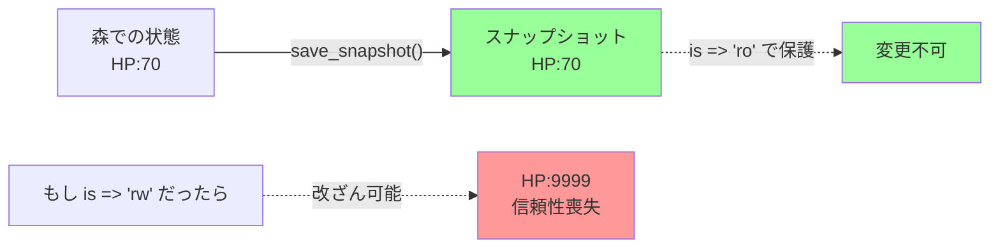
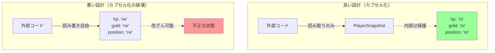
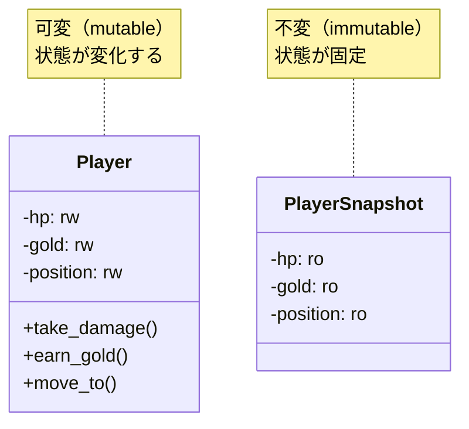

[@nqounet](https://x.com/nqounet)です。

## 前回の振り返り



前回は、特定のイベントで自動的にセーブする「オートセーブ機能」を追加しました。エリア移動時やボス戦前に自動的にセーブされるようになり、プレイヤーがセーブを忘れても安心してゲームを楽しめるようになりました。

### 前回までに作成したもの

- `auto_save`フラグ — オートセーブのON/OFF切り替え
- `try_auto_save`メソッド — 条件付き自動セーブ
- エリア移動時とボス戦前の自動セーブロジック

しかし、現在の設計には1つの懸念があります。それは、スナップショットが外部から改ざんされる可能性です。

今回は、セーブデータを守るための設計を学びます。

## 今回のゴール

今回のゴールは、セーブデータの安全性を確保することです。

- `PlayerSnapshot`の不変性を再確認する
- 外部からの変更試行が失敗することを確認する
- なぜ不変性が重要なのかを理解する
- カプセル化の原則を再確認する

これにより、セーブデータが不正に書き換えられることを防ぎ、ゲームの信頼性を高めます。

## セーブデータ改ざんの問題

まず、なぜセーブデータの保護が重要なのかを考えましょう。

### 問題のシナリオ

もし`PlayerSnapshot`の属性が`is => 'rw'`（読み書き可能）だったら、どうなるでしょうか。

```perl
# もし PlayerSnapshot が is => 'rw' だったら...（悪い例）
my $snapshot = $player->save_snapshot;

# セーブ後にHPを改ざんできてしまう！
$snapshot->hp(9999);
$snapshot->gold(99999999);
$snapshot->items(['最強の剣', '最強の盾']); # アイテムも改ざん！

# 改ざんされたデータから復元
$player->restore_from_snapshot($snapshot);

# プレイヤーはチートで無敵になってしまう
say $player->hp;    # 9999
say $player->gold;  # 99999999
say join(',', $player->items->@*); # 最強の剣, 最強の盾
```

これは重大な問題です。セーブデータが改ざんされると、ゲームバランスが崩れてしまいます。

### セーブデータ改ざんがもたらす問題

1. ゲームバランスの崩壊 — 無敵のプレイヤーができてしまう
2. セーブデータの信頼性低下 — 「このセーブデータは本当にその時点のものか？」がわからなくなる
3. バグの温床 — 意図しない改ざんでゲームがクラッシュする可能性

これらの問題を防ぐために、スナップショットを不変（イミュータブル）にすることが重要です。

## is => 'ro' による保護

第3回で、`PlayerSnapshot`のすべての属性を`is => 'ro'`（読み取り専用）にしました。

```perl
package PlayerSnapshot {
    use Moo;

    has hp => (
        is       => 'ro',  # 読み取り専用
        required => 1,
    );

    has gold => (
        is       => 'ro',  # 読み取り専用
        required => 1,
    );

    has position => (
        is       => 'ro',  # 読み取り専用
        required => 1,
    );

    has items => (
        is       => 'ro',  # 読み取り専用
        required => 1,
    );
};
```

`is => 'ro'`により、スナップショットの属性は作成時にのみ設定でき、後から変更することはできません。

### is => 'ro' と is => 'rw' の違い

| 項目 | is => 'ro' | is => 'rw' |
|-----|-----------|-----------|
| 読み取り | できる | できる |
| 書き込み（作成時） | できる | できる |
| 書き込み（作成後） | できない | できる |
| 用途 | 不変データ | 可変データ |

`PlayerSnapshot`は「過去の記録」なので、`is => 'ro'`で保護します。

`Player`は「今の状態」なので、`is => 'rw'`で変更可能にします。

## コード例1：Mementoのアクセス制御

それでは、`PlayerSnapshot`の不変性を実際に確認してみましょう。

```perl
# Perl v5.36 以降
# 外部依存: Moo

use v5.36;

package PlayerSnapshot {
    use Moo;

    has hp => (
        is       => 'ro',
        required => 1,
    );

    has gold => (
        is       => 'ro',
        required => 1,
    );

    has position => (
        is       => 'ro',
        required => 1,
    );

    has items => (
        is       => 'ro',
        required => 1,
    );
};

# スナップショットを作成
my $snapshot = PlayerSnapshot->new(
    hp       => 70,
    gold     => 50,
    position => '森',
    items    => ['ポーション', '地図'],
);

say "=== 作成直後のスナップショット ===";
say "HP: " . $snapshot->hp;
say "所持金: " . $snapshot->gold . "G";
say "位置: " . $snapshot->position;
say "持ち物: " . join(', ', $snapshot->items->@*);
say "";

# 読み取りは可能
say "=== 読み取りテスト ===";
say "HPを読み取る: " . $snapshot->hp;
say "読み取りは成功しました";
say "";

# 書き込みを試みる（失敗する）
say "=== 書き込みテスト ===";
say "HPを変更しようとします...";

eval {
    $snapshot->hp(9999);
};

if ($@) {
    say "エラー: HPは変更できません";
    say "理由: is => 'ro' で保護されています";
    say "";
    say "エラーメッセージ:";
    say $@;
} else {
    say "警告: HPが変更されてしまいました！";
}

say "アイテムを変更しようとします...";
eval {
    $snapshot->items(['最強の剣']);
};

if ($@) {
    say "エラー: 持ち物は変更できません";
    say "理由: is => 'ro' で保護されています";
    say "";
}

say "=== スナップショットの最終状態 ===";
say "HP: " . $snapshot->hp;
say "所持金: " . $snapshot->gold . "G";
say "位置: " . $snapshot->position;
say "持ち物: " . join(', ', $snapshot->items->@*);
say "";
say "スナップショットは保護されました。";
```

実行結果は以下のようになります。

```
=== 作成直後のスナップショット ===
HP: 70
所持金: 50G
位置: 森
持ち物: ポーション, 地図

=== 読み取りテスト ===
HPを読み取る: 70
読み取りは成功しました

=== 書き込みテスト ===
HPを変更しようとします...
エラー: HPは変更できません
理由: is => 'ro' で保護されています

エラーメッセージ:
Usage: PlayerSnapshot::hp(self) at ... line ...

アイテムを変更しようとします...
エラー: 持ち物は変更できません
理由: is => 'ro' で保護されています

=== スナップショットの最終状態 ===
HP: 70
所持金: 50G
位置: 森
持ち物: ポーション, 地図

スナップショットは保護されました。
```

完璧です！`is => 'ro'`により、スナップショットの書き込みは拒否されました。

## コード例2：外部からの変更試行と失敗のデモ

次に、より実践的なシナリオで、セーブデータの改ざん試行を確認してみましょう。

```perl
# Perl v5.36 以降
# 外部依存: Moo

use v5.36;

package PlayerSnapshot {
    use Moo;

    has hp => (
        is       => 'ro',
        required => 1,
    );

    has gold => (
        is       => 'ro',
        required => 1,
    );

    has position => (
        is       => 'ro',
        required => 1,
    );

    has items => (
        is       => 'ro',
        required => 1,
    );
};

package Player {
    use Moo;

    has hp => (
        is      => 'rw',
        default => 100,
    );

    has gold => (
        is      => 'rw',
        default => 0,
    );

    has position => (
        is      => 'rw',
        default => '町',
    );

    has items => (
        is      => 'rw',
        default => sub { [] },
    );

    sub take_damage ($self, $amount) {
        $self->hp($self->hp - $amount);
        if ($self->hp < 0) {
            $self->hp(0);
        }
    }

    sub earn_gold ($self, $amount) {
        $self->gold($self->gold + $amount);
    }

    sub move_to ($self, $location) {
        $self->position($location);
    }

    sub add_item ($self, $item) {
        push $self->items->@*, $item;
    }

    sub show_status ($self) {
        say "HP: " . $self->hp;
        say "所持金: " . $self->gold . "G";
        say "位置: " . $self->position;
        say "持ち物: " . join(', ', $self->items->@*);
        say "";
    }

    sub save_snapshot ($self) {
        return PlayerSnapshot->new(
            hp       => $self->hp,
            gold     => $self->gold,
            position => $self->position,
            items    => [ $self->items->@* ], # 配列の中身を展開して新しい配列リファレンスを作成（重要！）
            # items => $self->items だと、参照コピーになってしまい、
            # Playerのitemsを変更するとSnapshotのitemsも変わってしまう
        );
    }

    sub restore_from_snapshot ($self, $snapshot) {
        $self->hp($snapshot->hp);
        $self->gold($snapshot->gold);
        $self->position($snapshot->position);
        $self->items([ $snapshot->items->@* ]);
    }
};

my $player = Player->new;

say "=== ゲーム開始 ===";
$player->show_status;

$player->move_to('森');
$player->take_damage(30);
$player->earn_gold(50);
$player->add_item('ポーション');
$player->add_item('地図');

say "=== 森での状態 ===";
$player->show_status;

say "=== セーブポイント ===";
my $snapshot = $player->save_snapshot;
say "状態を保存しました";
say "";

$player->add_item('毒消し草');

say "=== 改ざん試行 ===";
say "セーブデータをチートで改ざんしようとしています...";
say "";

eval {
    say "試行1: HPを9999にしようとする";
    $snapshot->hp(9999);
};
if ($@) {
    say "失敗: HPは変更できません";
}
say "";

eval {
    say "試行2: アイテムリストを最強装備に書き換えようとする";
    $snapshot->items(['最強の剣', '最強の盾']);
};
if ($@) {
    say "失敗: 持ち物は変更できません";
}
say "";

say "=== 改ざん試行後のスナップショット ===";
say "HP: " . $snapshot->hp;
say "所持金: " . $snapshot->gold . "G";
say "位置: " . $snapshot->position;
say "持ち物: " . join(', ', $snapshot->items->@*);
say "";
say "すべての改ざん試行が失敗しました。";
say "セーブデータは保護されています。";
say "";

say "=== 復元テスト ===";
$player->move_to('洞窟');
$player->take_damage(50);
$player->items([]);
$player->show_status;

say "セーブポイントから復元します...";
$player->restore_from_snapshot($snapshot);

say "=== 復元完了 ===";
$player->show_status;

say "復元されたデータは正しい（改ざんされていない）状態です。";
```

実行結果は以下のようになります。

```
=== ゲーム開始 ===
HP: 100
所持金: 0G
位置: 町
持ち物: 

=== 森での状態 ===
HP: 70
所持金: 50G
位置: 森
持ち物: ポーション, 地図

=== セーブポイント ===
状態を保存しました

=== 改ざん試行 ===
セーブデータをチートで改ざんしようとしています...

試行1: HPを9999にしようとする
失敗: HPは変更できません

試行2: アイテムリストを最強装備に書き換えようとする
失敗: 持ち物は変更できません

=== 改ざん試行後のスナップショット ===
HP: 70
所持金: 50G
位置: 森
持ち物: ポーション, 地図

すべての改ざん試行が失敗しました。
セーブデータは保護されています。

=== 復元テスト ===
HP: 20
所持金: 50G
位置: 洞窟
持ち物: 

セーブポイントから復元します...
=== 復元完了 ===
HP: 70
所持金: 50G
位置: 森
持ち物: ポーション, 地図

復元されたデータは正しい（改ざんされていない）状態です。
```

素晴らしい！すべての改ざん試行が失敗し、セーブデータは保護されました。

## なぜ不変性が重要なのか（再確認）

第3回でも不変性について学びましたが、今回のシナリオでその重要性を再確認しました。

### 1. セーブデータの信頼性

セーブデータは「ある時点での状態の記録」です。後から改ざんされたら、それはもう「その時点の状態」ではありません。



### 2. ゲームバランスの維持

不変性により、プレイヤーがチートでゲームバランスを崩すことを防ぎます。

### 3. バグの防止

意図しない書き込みによるバグを防ぎます。プログラマのミスでスナップショットを変更してしまうことがありません。

```perl
# プログラマのミス例（もし is => 'rw' だったら）
sub some_function ($snapshot) {
    # うっかり書き込んでしまう
    $snapshot->hp(0);  # バグ！
}
```

`is => 'ro'`なら、このようなミスをコンパイル時に検出できます。

## カプセル化の原則（再確認）

今回のセーブデータ保護は、カプセル化の原則を体現しています。

### カプセル化とは

カプセル化は、オブジェクトの内部状態を隠し、外部からは制御されたインターフェースのみでアクセスできるようにする原則です。



### カプセル化の3要素

1. 情報隠蔽 — 内部実装を隠す
2. アクセス制御 — `is => 'ro'` / `is => 'rw'` で制御
3. インターフェースの提供 — 公開メソッドのみで操作

`PlayerSnapshot`は、これらすべてを満たしています。

## Playerクラスとの対比

`Player`クラスと`PlayerSnapshot`クラスのアクセス制御を対比してみましょう。

| 項目 | Player | PlayerSnapshot |
|-----|--------|----------------|
| 属性のアクセス | `is => 'rw'` | `is => 'ro'` |
| 目的 | 現在の状態（変化する） | 過去の記録（変化しない） |
| 変更可能性 | いつでも変更できる | 作成後は変更できない |
| メソッド | 状態を変更するメソッドあり | メソッドなし（読み取りのみ） |



この使い分けが、設計の鍵です。

## is => 'ro' の実装詳細

Mooの`is => 'ro'`は、どのように実装されているのでしょうか。

実際には、Mooは以下のようなアクセサメソッドを生成します。

```perl
# is => 'ro' の場合（Mooが生成するコードのイメージ）
sub hp {
    my $self = shift;
    if (@_) {
        # 引数が渡された = 書き込み試行
        die "Usage: PlayerSnapshot::hp(self)";
    }
    return $self->{hp};  # 読み取りのみ
}

# is => 'rw' の場合（Mooが生成するコードのイメージ）
sub hp {
    my $self = shift;
    if (@_) {
        # 引数が渡された = 書き込み
        $self->{hp} = shift;
    }
    return $self->{hp};
}
```

`is => 'ro'`の場合、引数が渡されると（書き込み試行）、即座にエラーを投げます。これが、不変性を保証する仕組みです。

## まだできていないこと

今回の検証で、セーブデータの安全性が確保されていることを確認しました。しかし、まだいくつかの課題があります。

1. セーブスロット数の制限がない — オートセーブが無限に増える
2. セーブスロット選択機能が弱い — 複数スロットの管理がまだ手動
3. セーブデータの永続化がない — プログラム終了後も保存できない

次回は、セーブスロットを増やし、複数のスロットから選んでロードできる機能を強化します。

## 今回作成した完成コード

以下が今回作成した完成コードです。外部からの変更試行と失敗を確認するデモを含みます。

```perl
#!/usr/bin/env perl
# Perl v5.36 以降
# 外部依存: Moo

use v5.36;

package PlayerSnapshot {
    use Moo;

    has hp => (
        is       => 'ro',
        required => 1,
    );

    has gold => (
        is       => 'ro',
        required => 1,
    );

    has position => (
        is       => 'ro',
        required => 1,
    );

    has items => (
        is       => 'ro',
        required => 1,
    );
};

package Player {
    use Moo;

    has hp => (
        is      => 'rw',
        default => 100,
    );

    has gold => (
        is      => 'rw',
        default => 0,
    );

    has position => (
        is      => 'rw',
        default => '町',
    );

    has items => (
        is      => 'rw',
        default => sub { [] },
    );

    sub take_damage ($self, $amount) {
        $self->hp($self->hp - $amount);
        if ($self->hp < 0) {
            $self->hp(0);
        }
    }

    sub earn_gold ($self, $amount) {
        $self->gold($self->gold + $amount);
    }

    sub move_to ($self, $location) {
        $self->position($location);
    }

    sub add_item ($self, $item) {
        push $self->items->@*, $item;
    }

    sub show_status ($self) {
        say "HP: " . $self->hp;
        say "所持金: " . $self->gold . "G";
        say "位置: " . $self->position;
        say "持ち物: " . join(', ', $self->items->@*);
        say "";
    }

    sub save_snapshot ($self) {
        return PlayerSnapshot->new(
            hp       => $self->hp,
            gold     => $self->gold,
            position => $self->position,
            items    => [ $self->items->@* ], # 参照コピー回避のための重要な処理
        );
    }

    sub restore_from_snapshot ($self, $snapshot) {
        $self->hp($snapshot->hp);
        $self->gold($snapshot->gold);
        $self->position($snapshot->position);
        $self->items([ $snapshot->items->@* ]);
    }
};

# ゲームシナリオ
my $player = Player->new;

say "=== ゲーム開始 ===";
$player->show_status;

$player->move_to('森');
$player->take_damage(30);
$player->earn_gold(50);
$player->add_item('ポーション');
$player->add_item('地図');

say "=== 森での状態 ===";
$player->show_status;

# セーブ
say "=== セーブポイント ===";
my $snapshot = $player->save_snapshot;
say "状態を保存しました";
say "";

# 改ざん試行
say "=== 改ざん試行 ===";
say "セーブデータをチートで改ざんしようとしています...";
say "";

eval {
    say "試行1: HPを9999にしようとする";
    $snapshot->hp(9999);
};
if ($@) {
    say "失敗: HPは変更できません";
}
say "";

eval {
    say "試行2: 持ち物を最強装備にしようとする";
    $snapshot->items(['最強の剣']);
};
if ($@) {
    say "失敗: 持ち物は変更できません";
}
say "";

# 改ざん試行後のスナップショット確認
say "=== 改ざん試行後のスナップショット ===";
say "HP: " . $snapshot->hp;
say "所持金: " . $snapshot->gold . "G";
say "位置: " . $snapshot->position;
say "持ち物: " . join(', ', $snapshot->items->@*);
say "";
say "すべての改ざん試行が失敗しました。";
say "セーブデータは保護されています。";
say "";

# 復元テスト
say "=== 復元テスト ===";
$player->move_to('洞窟');
$player->take_damage(50);
$player->items([]); # アイテムを失う
$player->show_status;

say "セーブポイントから復元します...";
$player->restore_from_snapshot($snapshot);

say "=== 復元完了 ===";
$player->show_status;

say "復元されたデータは正しい（改ざんされていない）状態です。";
```

## まとめ

今回は、セーブデータの安全性を確保するための設計を再確認しました。

確認したこと:

- `PlayerSnapshot`の不変性（`is => 'ro'`）による保護
- 外部からの変更試行がすべて失敗することを確認
- セーブデータの信頼性が保たれることを確認

学んだこと:

- 不変性がゲームバランスとバグ防止に重要
- カプセル化の原則（情報隠蔽、アクセス制御、インターフェース）
- `Player`（可変）と`PlayerSnapshot`（不変）の使い分け
- Mooの`is => 'ro'`の実装詳細

設計の利点:

- セーブデータの改ざんを防止
- プログラマのミスによるバグを防止
- ゲームの信頼性と公平性を維持

`is => 'ro'`という単純な設定が、これほど重要な役割を果たしていることがわかりました！次回は、複数のセーブスロット機能を強化します。

## 次回予告

今回、セーブデータの安全性が確保されていることを確認しました。

次回は、セーブスロット機能を強化します。3つのセーブスロットから選んでロードできる機能を追加し、複数履歴の管理と選択インターフェースを実装します。

プレイヤーが「スロット1は安全プレイ用」「スロット2は冒険用」「スロット3は最新オートセーブ」のように使い分けられるようになります。

第8回のテーマ: セーブスロットを増やそう

お楽しみに。
