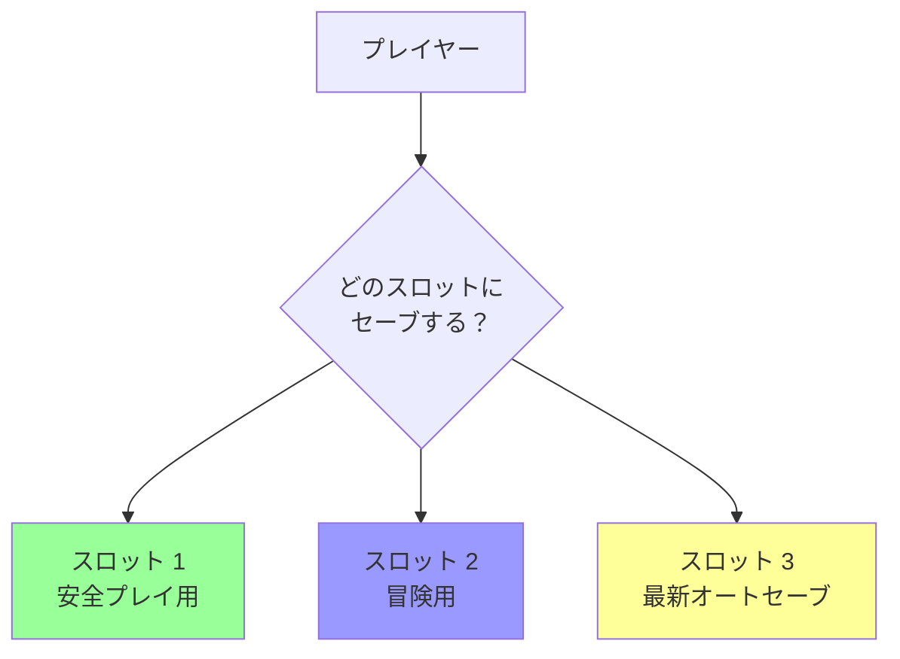
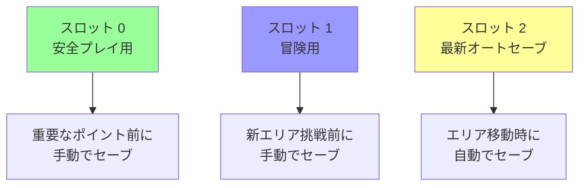

[@nqounet](https://x.com/nqounet)です。

## 前回の振り返り



前回は、セーブデータの安全性を確保するための設計を再確認しました。`PlayerSnapshot`の不変性（`is => 'ro'`）により、セーブデータが外部から改ざんされることを防ぎ、ゲームの信頼性を高めました。



### 前回までに確認したこと

- `PlayerSnapshot`の不変性による保護
- 外部からの変更試行がすべて失敗すること
- カプセル化の原則の重要性

今回は、セーブスロット機能を強化し、複数のスロットから選んでロードできる仕組みを作ります。

## 今回のゴール

今回のゴールは、プレイヤーが複数のセーブスロットを使い分けられるようにすることです。

- セーブスロット選択インターフェースを作成する
- 複数スロットの管理デモを実装する
- スロットの上書き機能を追加する
- セーブスロット情報の表示を改善する

これで、実際のゲームのような「スロット1、2、3から選んでセーブ・ロード」という体験が実現できます。

## セーブスロットとは

セーブスロットは、複数のセーブデータを保存するための「枠」です。



### セーブスロットの用途

プレイヤーは、スロットを以下のように使い分けることができます。

1. **スロット1：安全プレイ用** — ボス戦前など、確実に勝てる状態でセーブ
2. **スロット2：冒険用** — 新しいエリアに挑戦する前にセーブ
3. **スロット3：最新オートセーブ** — 自動的に最新の状態を保存

## 現在の実装の課題

現在の`GameManager`は、セーブデータを配列に追加していくだけです。

```perl
sub save_game ($self, $player) {
    my $snapshot = $player->save_snapshot;
    push @{$self->saves}, $snapshot;  # 常に末尾に追加
    return scalar @{$self->saves} - 1;
}
```

この実装には、以下の課題があります。

1. **スロットを選べない** — 常に新しいスロットが作られる
2. **上書きができない** — 同じスロットに保存できない
3. **スロット数が無限に増える** — メモリを圧迫する

これらを解決するために、セーブスロット選択機能を追加します。

## コード例1：セーブスロット選択インターフェース

まず、スロットを指定してセーブできるようにしましょう。

```perl
# Perl v5.36 以降
# 外部依存: Moo

package GameManager {
    use Moo;
    use v5.36;

    has saves => (
        is      => 'ro',
        default => sub { [] },
    );

    has auto_save => (
        is      => 'rw',
        default => 1,
    );

    has max_slots => (
        is      => 'ro',
        default => 3,  # 最大3スロット
    );

    # 新規：スロット番号を指定してセーブ
    sub save_game_to_slot ($self, $player, $slot_number) {
        if ($slot_number < 0 || $slot_number >= $self->max_slots) {
            die "無効なスロット番号: $slot_number (0〜" . ($self->max_slots - 1) . ")\n";
        }
        
        my $snapshot = $player->save_snapshot;
        $self->saves->[$slot_number] = $snapshot;
        
        return $slot_number;
    }

    # 既存のsave_gameは、次の空きスロットに保存
    sub save_game ($self, $player) {
        # 空きスロットを探す
        for my $i (0 .. $self->max_slots - 1) {
            unless (defined $self->saves->[$i]) {
                return $self->save_game_to_slot($player, $i);
            }
        }
        
        # 空きがなければ、最後のスロットに上書き
        return $self->save_game_to_slot($player, $self->max_slots - 1);
    }

    sub load_game ($self, $player, $slot_number) {
        unless ($self->has_save($slot_number)) {
            die "セーブデータがありません: スロット $slot_number\n";
        }
        
        my $snapshot = $self->saves->[$slot_number];
        $player->restore_from_snapshot($snapshot);
    }

    sub has_save ($self, $slot_number) {
        return defined $self->saves->[$slot_number];
    }

    sub list_saves ($self) {
        say "=== セーブデータ一覧 ===";
        
        for my $i (0 .. $self->max_slots - 1) {
            if ($self->has_save($i)) {
                my $save = $self->saves->[$i];
                say "スロット $i: ★";
                say "  HP: " . $save->hp;
                say "  所持金: " . $save->gold . "G";
                say "  位置: " . $save->position;
            } else {
                say "スロット $i: （空き）";
            }
        }
        say "";
    }

    sub try_auto_save ($self, $player, $reason = '') {
        unless ($self->auto_save) {
            return;
        }
        
        # オートセーブは最後のスロットを使う
        my $slot = $self->save_game_to_slot($player, $self->max_slots - 1);
        
        if ($reason) {
            say "*** オートセーブ: $reason ***";
        } else {
            say "*** オートセーブしました ***";
        }
        say "スロット $slot に保存しました";
        say "";
    }
};
```

新しい属性とメソッドを追加しました。

### 新しい属性

**`max_slots`** — 最大スロット数（デフォルト3）

```perl
has max_slots => (
    is      => 'ro',
    default => 3,
);
```

### 新しいメソッド

**`save_game_to_slot($player, $slot_number)`** — 指定したスロットに保存

```perl
sub save_game_to_slot ($self, $player, $slot_number) {
    if ($slot_number < 0 || $slot_number >= $self->max_slots) {
        die "無効なスロット番号: $slot_number\n";
    }
    
    my $snapshot = $player->save_snapshot;
    $self->saves->[$slot_number] = $snapshot;  # 指定位置に保存
    
    return $slot_number;
}
```

### 既存メソッドの改善

**`save_game`** — 空きスロットを探して保存

```perl
sub save_game ($self, $player) {
    # 空きスロットを探す
    for my $i (0 .. $self->max_slots - 1) {
        unless (defined $self->saves->[$i]) {
            return $self->save_game_to_slot($player, $i);
        }
    }
    
    # 空きがなければ、最後のスロットに上書き
    return $self->save_game_to_slot($player, $self->max_slots - 1);
}
```

**`list_saves`** — 空きスロットも表示

```perl
sub list_saves ($self) {
    say "=== セーブデータ一覧 ===";
    
    for my $i (0 .. $self->max_slots - 1) {
        if ($self->has_save($i)) {
            my $save = $self->saves->[$i];
            say "スロット $i: ★";
            say "  HP: " . $save->hp;
            say "  所持金: " . $save->gold . "G";
            say "  位置: " . $save->position;
        } else {
            say "スロット $i: （空き）";
        }
    }
    say "";
}
```

## コード例2：複数スロットの管理デモ

それでは、複数のセーブスロットを使い分けてみましょう。

```perl
# Perl v5.36 以降
# 外部依存: Moo

use v5.36;

package PlayerSnapshot {
    use Moo;

    has hp => (
        is       => 'ro',
        required => 1,
    );

    has gold => (
        is       => 'ro',
        required => 1,
    );

    has position => (
        is       => 'ro',
        required => 1,
    );
};

package Player {
    use Moo;

    has hp => (
        is      => 'rw',
        default => 100,
    );

    has gold => (
        is      => 'rw',
        default => 0,
    );

    has position => (
        is      => 'rw',
        default => '町',
    );

    sub take_damage ($self, $amount) {
        $self->hp($self->hp - $amount);
        if ($self->hp < 0) {
            $self->hp(0);
        }
    }

    sub earn_gold ($self, $amount) {
        $self->gold($self->gold + $amount);
    }

    sub move_to ($self, $location) {
        $self->position($location);
    }

    sub is_alive ($self) {
        return $self->hp > 0;
    }

    sub show_status ($self) {
        say "HP: " . $self->hp;
        say "所持金: " . $self->gold . "G";
        say "位置: " . $self->position;
        say "";
    }

    sub save_snapshot ($self) {
        return PlayerSnapshot->new(
            hp       => $self->hp,
            gold     => $self->gold,
            position => $self->position,
        );
    }

    sub restore_from_snapshot ($self, $snapshot) {
        $self->hp($snapshot->hp);
        $self->gold($snapshot->gold);
        $self->position($snapshot->position);
    }
};

package GameManager {
    use Moo;

    has saves => (
        is      => 'ro',
        default => sub { [] },
    );

    has auto_save => (
        is      => 'rw',
        default => 1,
    );

    has max_slots => (
        is      => 'ro',
        default => 3,
    );

    sub save_game_to_slot ($self, $player, $slot_number) {
        if ($slot_number < 0 || $slot_number >= $self->max_slots) {
            die "無効なスロット番号: $slot_number (0〜" . ($self->max_slots - 1) . ")\n";
        }
        
        my $snapshot = $player->save_snapshot;
        $self->saves->[$slot_number] = $snapshot;
        
        return $slot_number;
    }

    sub save_game ($self, $player) {
        for my $i (0 .. $self->max_slots - 1) {
            unless (defined $self->saves->[$i]) {
                return $self->save_game_to_slot($player, $i);
            }
        }
        
        return $self->save_game_to_slot($player, $self->max_slots - 1);
    }

    sub load_game ($self, $player, $slot_number) {
        unless ($self->has_save($slot_number)) {
            die "セーブデータがありません: スロット $slot_number\n";
        }
        
        my $snapshot = $self->saves->[$slot_number];
        $player->restore_from_snapshot($snapshot);
    }

    sub has_save ($self, $slot_number) {
        return defined $self->saves->[$slot_number];
    }

    sub list_saves ($self) {
        say "=== セーブデータ一覧 ===";
        
        for my $i (0 .. $self->max_slots - 1) {
            if ($self->has_save($i)) {
                my $save = $self->saves->[$i];
                say "スロット $i: ★";
                say "  HP: " . $save->hp;
                say "  所持金: " . $save->gold . "G";
                say "  位置: " . $save->position;
            } else {
                say "スロット $i: （空き）";
            }
        }
        say "";
    }

    sub try_auto_save ($self, $player, $reason = '') {
        unless ($self->auto_save) {
            return;
        }
        
        my $slot = $self->save_game_to_slot($player, $self->max_slots - 1);
        
        if ($reason) {
            say "*** オートセーブ: $reason ***";
        } else {
            say "*** オートセーブしました ***";
        }
        say "スロット $slot に保存しました";
        say "";
    }
};

# ゲームシナリオ
my $player  = Player->new;
my $manager = GameManager->new;

say "=== ゲーム開始 ===";
$player->show_status;

# スロット0：町で手動セーブ（安全プレイ用）
say "=== スロット 0 に手動セーブ（安全プレイ用） ===";
$manager->save_game_to_slot($player, 0);
say "スロット 0 に保存しました";
say "";

$manager->list_saves;

# ゲーム進行
$player->move_to('森');
$player->take_damage(30);
$player->earn_gold(50);
$player->show_status;

# スロット1：森で手動セーブ（冒険用）
say "=== スロット 1 に手動セーブ（冒険用） ===";
$manager->save_game_to_slot($player, 1);
say "スロット 1 に保存しました";
say "";

$manager->list_saves;

# さらにゲーム進行
$player->move_to('洞窟');
$player->take_damage(20);
$player->show_status;

# スロット2：オートセーブ
say "=== スロット 2 にオートセーブ ===";
$manager->try_auto_save($player, "エリア移動時");

$manager->list_saves;

# ボス戦
$player->move_to('ボス部屋');
$player->show_status;

say "ドラゴンと戦闘！";
$player->take_damage(100);
say "100のダメージを受けた！";
$player->show_status;

if (!$player->is_alive) {
    say "=== GAME OVER ===";
    say "";
    
    $manager->list_saves;
    
    # プレイヤーが選択
    say "どのスロットから復元しますか？";
    say "0: 町（安全）";
    say "1: 森（冒険用）";
    say "2: 洞窟（最新オートセーブ）";
    say "";
    
    # ここではスロット1を選択
    my $choice = 1;
    say "スロット $choice を選択しました";
    say "";
    
    $manager->load_game($player, $choice);
    
    say "=== 復元完了 ===";
    $player->show_status;
    
    say "森からゲームを再開しました。";
}
```

実行結果は以下のようになります。

```
=== ゲーム開始 ===
HP: 100
所持金: 0G
位置: 町

=== スロット 0 に手動セーブ（安全プレイ用） ===
スロット 0 に保存しました

=== セーブデータ一覧 ===
スロット 0: ★
  HP: 100
  所持金: 0G
  位置: 町
スロット 1: （空き）
スロット 2: （空き）

HP: 70
所持金: 50G
位置: 森

=== スロット 1 に手動セーブ（冒険用） ===
スロット 1 に保存しました

=== セーブデータ一覧 ===
スロット 0: ★
  HP: 100
  所持金: 0G
  位置: 町
スロット 1: ★
  HP: 70
  所持金: 50G
  位置: 森
スロット 2: （空き）

HP: 50
所持金: 50G
位置: 洞窟

=== スロット 2 にオートセーブ ===
*** オートセーブ: エリア移動時 ***
スロット 2 に保存しました

=== セーブデータ一覧 ===
スロット 0: ★
  HP: 100
  所持金: 0G
  位置: 町
スロット 1: ★
  HP: 70
  所持金: 50G
  位置: 森
スロット 2: ★
  HP: 50
  所持金: 50G
  位置: 洞窟

HP: 50
所持金: 50G
位置: ボス部屋

ドラゴンと戦闘！
100のダメージを受けた！
HP: 0
所持金: 50G
位置: ボス部屋

=== GAME OVER ===

=== セーブデータ一覧 ===
スロット 0: ★
  HP: 100
  所持金: 0G
  位置: 町
スロット 1: ★
  HP: 70
  所持金: 50G
  位置: 森
スロット 2: ★
  HP: 50
  所持金: 50G
  位置: 洞窟

どのスロットから復元しますか？
0: 町（安全）
1: 森（冒険用）
2: 洞窟（最新オートセーブ）

スロット 1 を選択しました

=== 復元完了 ===
HP: 70
所持金: 50G
位置: 森

森からゲームを再開しました。
```

完璧です！3つのセーブスロットを使い分け、好きなスロットからロードできるようになりました。

## セーブスロットの使い分け

今回の実装で、プレイヤーは以下のようにスロットを使い分けられます。



この使い分けにより、プレイヤーは自分のプレイスタイルに合わせてセーブ・ロードを管理できます。

## スロット管理の設計ポイント

### 1. スロット数の制限

`max_slots`を導入することで、無限にセーブデータが増えることを防ぎます。

```perl
has max_slots => (
    is      => 'ro',
    default => 3,
);
```

### 2. 空きスロットの表示

`list_saves`で空きスロットも表示することで、プレイヤーに選択肢を明示します。

```perl
if ($self->has_save($i)) {
    # 保存済み
} else {
    say "スロット $i: （空き）";
}
```

### 3. オートセーブ専用スロット

オートセーブは常に最後のスロット（スロット2）を使うことで、手動セーブと分離します。

```perl
sub try_auto_save ($self, $player, $reason = '') {
    # ...
    my $slot = $self->save_game_to_slot($player, $self->max_slots - 1);
    # ...
}
```

### 4. エラーハンドリング

無効なスロット番号を指定された場合は、明確なエラーメッセージを表示します。

```perl
if ($slot_number < 0 || $slot_number >= $self->max_slots) {
    die "無効なスロット番号: $slot_number (0〜" . ($self->max_slots - 1) . ")\n";
}
```

## まだできていないこと

今回の実装で、複数セーブスロット機能が完成しました。しかし、まだいくつかの改善の余地があります。

1. **対話的なインターフェースがない** — ユーザー入力によるスロット選択
2. **セーブデータの永続化がない** — プログラム終了後も保存できない
3. **セーブデータのメタ情報がない** — セーブ日時やプレイ時間など

次回は、これまでに作成したすべての機能を統合し、対話的なCLIでゲームをプレイできるようにします。

## 今回作成した完成コード

以下が今回作成した完成コードです。1つのスクリプトファイルとして動作します。

```perl
#!/usr/bin/env perl
# Perl v5.36 以降
# 外部依存: Moo

use v5.36;

package PlayerSnapshot {
    use Moo;

    has hp => (
        is       => 'ro',
        required => 1,
    );

    has gold => (
        is       => 'ro',
        required => 1,
    );

    has position => (
        is       => 'ro',
        required => 1,
    );
};

package Player {
    use Moo;

    has hp => (
        is      => 'rw',
        default => 100,
    );

    has gold => (
        is      => 'rw',
        default => 0,
    );

    has position => (
        is      => 'rw',
        default => '町',
    );

    sub take_damage ($self, $amount) {
        $self->hp($self->hp - $amount);
        if ($self->hp < 0) {
            $self->hp(0);
        }
    }

    sub earn_gold ($self, $amount) {
        $self->gold($self->gold + $amount);
    }

    sub move_to ($self, $location) {
        $self->position($location);
    }

    sub is_alive ($self) {
        return $self->hp > 0;
    }

    sub show_status ($self) {
        say "HP: " . $self->hp;
        say "所持金: " . $self->gold . "G";
        say "位置: " . $self->position;
        say "";
    }

    sub save_snapshot ($self) {
        return PlayerSnapshot->new(
            hp       => $self->hp,
            gold     => $self->gold,
            position => $self->position,
        );
    }

    sub restore_from_snapshot ($self, $snapshot) {
        $self->hp($snapshot->hp);
        $self->gold($snapshot->gold);
        $self->position($snapshot->position);
    }
};

package GameManager {
    use Moo;

    has saves => (
        is      => 'ro',
        default => sub { [] },
    );

    has auto_save => (
        is      => 'rw',
        default => 1,
    );

    has max_slots => (
        is      => 'ro',
        default => 3,
    );

    sub save_game_to_slot ($self, $player, $slot_number) {
        if ($slot_number < 0 || $slot_number >= $self->max_slots) {
            die "無効なスロット番号: $slot_number (0〜" . ($self->max_slots - 1) . ")\n";
        }
        
        my $snapshot = $player->save_snapshot;
        $self->saves->[$slot_number] = $snapshot;
        
        return $slot_number;
    }

    sub save_game ($self, $player) {
        for my $i (0 .. $self->max_slots - 1) {
            unless (defined $self->saves->[$i]) {
                return $self->save_game_to_slot($player, $i);
            }
        }
        
        return $self->save_game_to_slot($player, $self->max_slots - 1);
    }

    sub load_game ($self, $player, $slot_number) {
        unless ($self->has_save($slot_number)) {
            die "セーブデータがありません: スロット $slot_number\n";
        }
        
        my $snapshot = $self->saves->[$slot_number];
        $player->restore_from_snapshot($snapshot);
    }

    sub has_save ($self, $slot_number) {
        return defined $self->saves->[$slot_number];
    }

    sub list_saves ($self) {
        say "=== セーブデータ一覧 ===";
        
        for my $i (0 .. $self->max_slots - 1) {
            if ($self->has_save($i)) {
                my $save = $self->saves->[$i];
                say "スロット $i: ★";
                say "  HP: " . $save->hp;
                say "  所持金: " . $save->gold . "G";
                say "  位置: " . $save->position;
            } else {
                say "スロット $i: （空き）";
            }
        }
        say "";
    }

    sub try_auto_save ($self, $player, $reason = '') {
        unless ($self->auto_save) {
            return;
        }
        
        my $slot = $self->save_game_to_slot($player, $self->max_slots - 1);
        
        if ($reason) {
            say "*** オートセーブ: $reason ***";
        } else {
            say "*** オートセーブしました ***";
        }
        say "スロット $slot に保存しました";
        say "";
    }
};

# ゲームシナリオ（省略。上記のコード例2と同じ）
```

## まとめ

今回は、複数のセーブスロットから選んでロードできる機能を追加しました。

**作成したもの:**

- `max_slots`属性で、セーブスロット数を制限した
- `save_game_to_slot`メソッドで、指定したスロットにセーブできるようにした
- `list_saves`メソッドで、空きスロットも表示するよう改善した
- オートセーブ専用スロットを分離した

**学んだこと:**

- セーブスロットの使い分け（安全プレイ用、冒険用、オートセーブ用）
- スロット数の制限によるメモリ管理
- 空きスロットの表示による選択肢の明示
- エラーハンドリングの重要性

**設計の利点:**

- プレイヤーが自分のプレイスタイルに合わせて管理できる
- 手動セーブとオートセーブの分離
- 無限にセーブデータが増えることを防止

実際のゲームのようなセーブスロット機能が完成しました！次回は、全機能を統合した完成版RPGを作ります。

## 次回予告

今回、複数セーブスロット機能が完成しました。

次回は、これまでに作成したすべての機能を統合し、セーブ機能付きRPGを完成させます。対話的なCLIでゲームをプレイできるようにし、実際のゲームプレイデモを行います。

すべての機能が組み合わさった、完成したゲームスクリプトをお見せします。

**第9回のテーマ: 完成！セーブ機能付きRPG**

お楽しみに。
