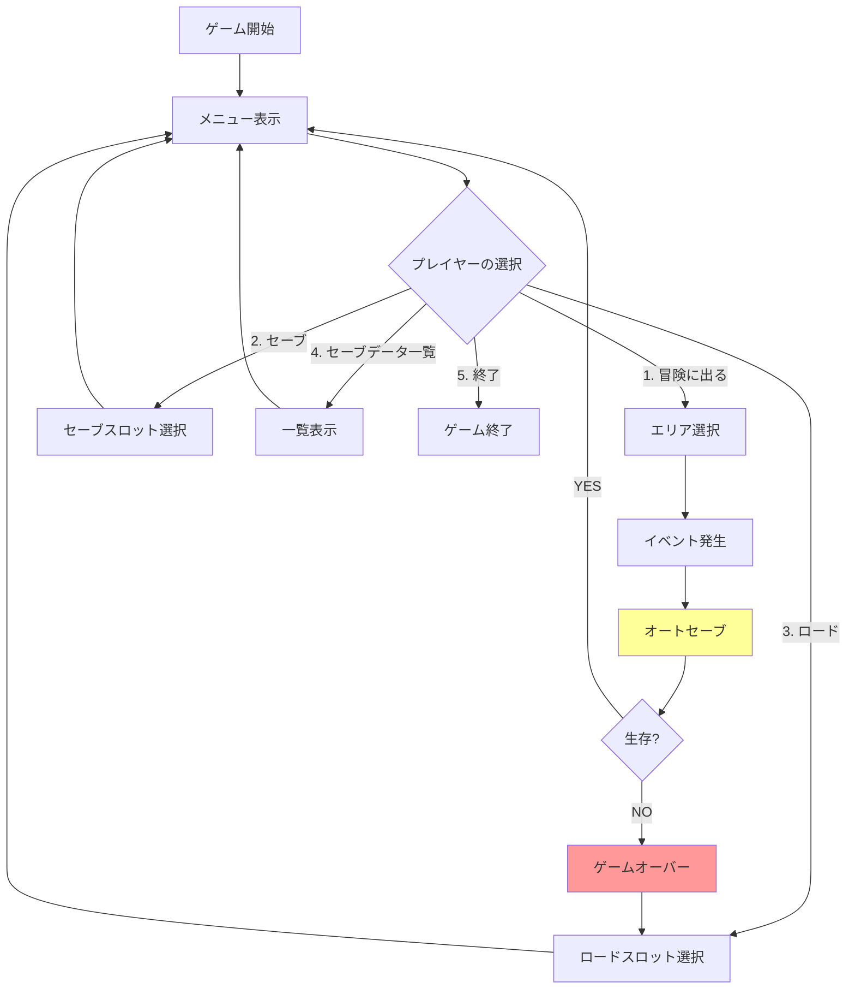
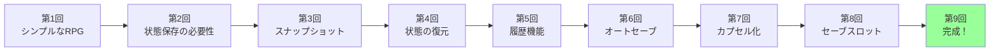
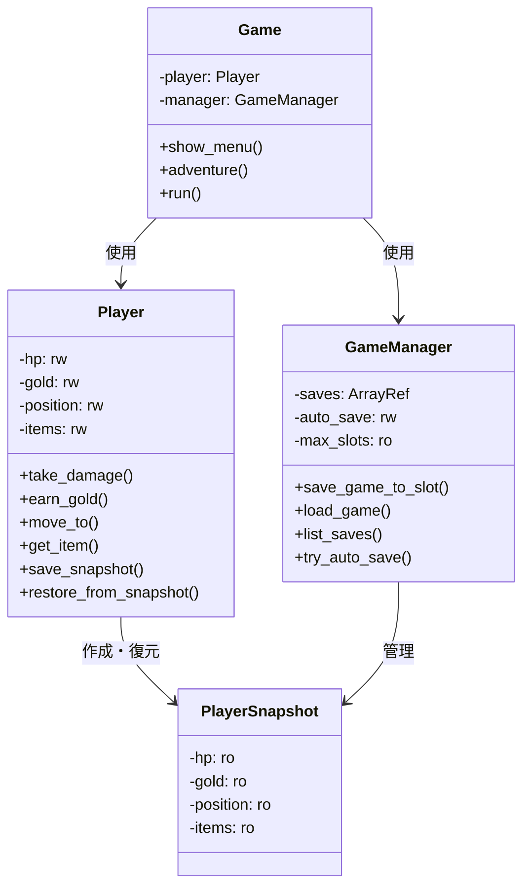

[@nqounet](https://x.com/nqounet)です。

## 前回の振り返り



前回は、複数のセーブスロットから選んでロードできる機能を追加しました。3つのセーブスロットを使い分け、プレイヤーが自分のプレイスタイルに合わせてセーブ・ロードを管理できるようになりました。

### これまでに作成したもの

- `Player`クラス — プレイヤーの状態管理
- `PlayerSnapshot`クラス — 不変なセーブデータ
- `GameManager`クラス — セーブスロット管理
- オートセーブ機能
- 複数セーブスロット機能

今回は、これらすべての機能を統合し、セーブ機能付きRPGを完成させます。

## 今回のゴール

今回のゴールは、完全に動作するセーブ機能付きRPGを完成させることです。

- 対話的なCLIインターフェースを実装する
- すべての機能を統合する
- 実際のゲームプレイデモを行う
- 完成したゲームスクリプト全体を確認する

これで、第1回から積み上げてきた機能がすべて組み合わさり、実際に遊べるゲームが完成します。

## ゲームの全体像

完成するゲームの流れを確認しましょう。



## 完成したゲームスクリプト

それでは、完成したゲームスクリプト全体を見てみましょう。

```perl
#!/usr/bin/env perl
# Perl v5.36 以降
# 外部依存: Moo

use v5.36;
use utf8;
binmode STDOUT, ':encoding(UTF-8)';

package PlayerSnapshot {
    use Moo;

    has hp => (
        is       => 'ro',
        required => 1,
    );

    has gold => (
        is       => 'ro',
        required => 1,
    );

    has position => (
        is       => 'ro',
        required => 1,
    );

    has items => (
        is       => 'ro',
        required => 1,
    );
};

package Player {
    use Moo;

    has hp => (
        is      => 'rw',
        default => 100,
    );

    has gold => (
        is      => 'rw',
        default => 0,
    );

    has position => (
        is      => 'rw',
        default => '町',
    );

    has items => (
        is      => 'rw',
        default => sub { [] },
    );

    sub take_damage ($self, $amount) {
        $self->hp($self->hp - $amount);
        if ($self->hp < 0) {
            $self->hp(0);
        }
    }

    sub earn_gold ($self, $amount) {
        $self->gold($self->gold + $amount);
    }

    sub move_to ($self, $location) {
        $self->position($location);
    }

    sub get_item ($self, $item) {
        push $self->items->@*, $item;
    }

    sub is_alive ($self) {
        return $self->hp > 0;
    }

    sub show_status ($self) {
        say "━━━━━━━━━━━━━━━━━━━━";
        say "HP: " . $self->hp;
        say "所持金: " . $self->gold . "G";
        say "位置: " . $self->position;
        say "所持品: " . join(', ', $self->items->@*);
        say "━━━━━━━━━━━━━━━━━━━━";
    }

    sub save_snapshot ($self) {
        return PlayerSnapshot->new(
            hp       => $self->hp,
            gold     => $self->gold,
            position => $self->position,
            # 配列リファレンスの浅いコピー問題を避けるため、
            # 新しい配列リファレンスを作成してコピーする（デリファレンスして再構築）
            items    => [ $self->items->@* ],
        );
    }

    sub restore_from_snapshot ($self, $snapshot) {
        $self->hp($snapshot->hp);
        $self->gold($snapshot->gold);
        $self->position($snapshot->position);
        # 復元時も同様に新しい配列リファレンスとしてコピーする
        $self->items([ $snapshot->items->@* ]);
    }
};

package GameManager {
    use Moo;

    has saves => (
        is      => 'ro',
        default => sub { [] },
    );

    has auto_save => (
        is      => 'rw',
        default => 1,
    );

    has max_slots => (
        is      => 'ro',
        default => 3,
    );

    sub save_game_to_slot ($self, $player, $slot_number) {
        if ($slot_number < 0 || $slot_number >= $self->max_slots) {
            die "無効なスロット番号: $slot_number\n";
        }
        
        my $snapshot = $player->save_snapshot;
        $self->saves->[$slot_number] = $snapshot;
        
        return $slot_number;
    }

    sub save_game ($self, $player) {
        for my $i (0 .. $self->max_slots - 1) {
            unless (defined $self->saves->[$i]) {
                return $self->save_game_to_slot($player, $i);
            }
        }
        
        return $self->save_game_to_slot($player, $self->max_slots - 1);
    }

    sub load_game ($self, $player, $slot_number) {
        unless ($self->has_save($slot_number)) {
            die "セーブデータがありません: スロット $slot_number\n";
        }
        
        my $snapshot = $self->saves->[$slot_number];
        $player->restore_from_snapshot($snapshot);
    }

    sub has_save ($self, $slot_number) {
        return defined $self->saves->[$slot_number];
    }

    sub list_saves ($self) {
        say "";
        say "╔═══════════════════════════╗";
        say "║   セーブデータ一覧        ║";
        say "╚═══════════════════════════╝";
        
        for my $i (0 .. $self->max_slots - 1) {
            if ($self->has_save($i)) {
                my $save = $self->saves->[$i];
                say "スロット $i: ★";
                say "  HP: " . $save->hp;
                say "  所持金: " . $save->gold . "G";
                say "  位置: " . $save->position;
                say "  所持品: " . join(', ', $save->items->@*);
            } else {
                say "スロット $i: （空き）";
            }
            say "";
        }
    }

    sub try_auto_save ($self, $player, $reason = '') {
        unless ($self->auto_save) {
            return;
        }
        
        my $slot = $self->save_game_to_slot($player, $self->max_slots - 1);
        
        say "";
        if ($reason) {
            say "~~~ オートセーブ: $reason ~~~";
        } else {
            say "~~~ オートセーブしました ~~~";
        }
        say "スロット $slot に保存しました";
        say "";
    }
};

# ゲームエンジン
package Game {
    use Moo;

    has player => (
        is      => 'ro',
        default => sub { Player->new },
    );

    has manager => (
        is      => 'ro',
        default => sub { GameManager->new },
    );

    sub show_menu ($self) {
        say "";
        say "╔═══════════════════════════╗";
        say "║  セーブ機能付きRPG        ║";
        say "╚═══════════════════════════╝";
        say "";
        $self->player->show_status;
        say "";
        say "1. 冒険に出る";
        say "2. セーブ";
        say "3. ロード";
        say "4. セーブデータ一覧";
        say "5. 終了";
        say "";
        print "選択してください: ";
    }

    sub adventure ($self) {
        say "";
        say "どこへ行きますか？";
        say "1. 森（スライム出現）";
        say "2. 洞窟（ゴブリン出現）";
        say "3. ボス部屋（ドラゴン出現）";
        say "4. 戻る";
        say "";
        print "選択してください: ";
        
        my $choice = <STDIN>;
        chomp $choice;
        
        if ($choice eq '1') {
            $self->visit_forest;
        } elsif ($choice eq '2') {
            $self->visit_cave;
        } elsif ($choice eq '3') {
            $self->visit_boss_room;
        }
    }

    sub visit_forest ($self) {
        say "";
        say "=== 森 ===";
        $self->player->move_to('森');
        $self->manager->try_auto_save($self->player, "エリア移動時");
        
        say "スライムが現れた！";
        $self->player->take_damage(30);
        say "30のダメージを受けた！";
        
        if ($self->player->is_alive) {
            say "スライムを倒した！";
            $self->player->earn_gold(50);
            say "50Gを手に入れた！";
            $self->player->get_item('薬草');
            say "薬草を手に入れた！";
        }
        
        $self->check_game_over;
    }

    sub visit_cave ($self) {
        say "";
        say "=== 洞窟 ===";
        $self->player->move_to('洞窟');
        $self->manager->try_auto_save($self->player, "エリア移動時");
        
        say "ゴブリンが現れた！";
        $self->player->take_damage(50);
        say "50のダメージを受けた！";
        
        if ($self->player->is_alive) {
            say "ゴブリンを倒した！";
            $self->player->earn_gold(100);
            say "100Gを手に入れた！";
            $self->player->get_item('鉄の剣');
            say "鉄の剣を手に入れた！";
        }
        
        $self->check_game_over;
    }

    sub visit_boss_room ($self) {
        say "";
        say "=== ボス部屋 ===";
        $self->player->move_to('ボス部屋');
        $self->manager->try_auto_save($self->player, "ボス戦前");
        
        say "ドラゴンが現れた！";
        $self->player->take_damage(80);
        say "80のダメージを受けた！";
        
        if ($self->player->is_alive) {
            say "ドラゴンを倒した！";
            $self->player->earn_gold(500);
            say "500Gを手に入れた！";
            say "";
            say "おめでとうございます！ゲームクリア！";
            say "";
        }
        
        $self->check_game_over;
    }

    sub check_game_over ($self) {
        unless ($self->player->is_alive) {
            say "";
            say "╔═══════════════════════════╗";
            say "║     GAME OVER            ║";
            say "╚═══════════════════════════╝";
            say "";
            say "セーブデータからロードしますか？ (y/n): ";
            
            my $answer = <STDIN>;
            chomp $answer;
            
            if ($answer eq 'y') {
                $self->load_game_interactive;
            } else {
                say "ゲームを終了します...";
                exit;
            }
        }
    }

    sub save_game_interactive ($self) {
        say "";
        say "どのスロットにセーブしますか？";
        
        for my $i (0 .. $self->manager->max_slots - 1) {
            if ($self->manager->has_save($i)) {
                say "$i: 上書き";
            } else {
                say "$i: 空き";
            }
        }
        
        print "選択してください: ";
        my $slot = <STDIN>;
        chomp $slot;
        
        eval {
            $self->manager->save_game_to_slot($self->player, $slot);
            say "";
            say "スロット $slot に保存しました";
        };
        if ($@) {
            say "";
            say "エラー: $@";
        }
    }

    sub load_game_interactive ($self) {
        $self->manager->list_saves;
        
        say "どのスロットからロードしますか？";
        print "選択してください: ";
        my $slot = <STDIN>;
        chomp $slot;
        
        eval {
            $self->manager->load_game($self->player, $slot);
            say "";
            say "スロット $slot から復元しました";
        };
        if ($@) {
            say "";
            say "エラー: $@";
        }
    }

    sub run ($self) {
        say "";
        say "╔═══════════════════════════╗";
        say "║ セーブ機能付きRPGへようこそ！║";
        say "╚═══════════════════════════╝";
        say "";
        
        while (1) {
            $self->show_menu;
            
            my $choice = <STDIN>;
            chomp $choice;
            
            if ($choice eq '1') {
                $self->adventure;
            } elsif ($choice eq '2') {
                $self->save_game_interactive;
            } elsif ($choice eq '3') {
                $self->load_game_interactive;
            } elsif ($choice eq '4') {
                $self->manager->list_saves;
            } elsif ($choice eq '5') {
                say "";
                say "ゲームを終了します...";
                last;
            } else {
                say "";
                say "無効な選択です";
            }
        }
    }
};

# ゲーム起動
my $game = Game->new;
$game->run;
```

これが、完成したセーブ機能付きRPGの全体です。

## ゲームの特徴

完成したゲームには、以下の機能があります。

### 1. 対話的なメニューシステム

プレイヤーは、メニューから行動を選択できます。

```
╔═══════════════════════════╗
║  セーブ機能付きRPG        ║
╚═══════════════════════════╝

1. 冒険に出る
2. セーブ
3. ロード
4. セーブデータ一覧
5. 終了
```

### 2. 3つのエリア

- 森 — スライムが出現（ダメージ30）
- 洞窟 — ゴブリンが出現（ダメージ50）
- ボス部屋 — ドラゴンが出現（ダメージ80）

### 3. オートセーブ機能

エリア移動時とボス戦前に自動的にセーブされます。

### 4. 3つのセーブスロット

プレイヤーは、3つのスロットを使い分けできます。

### 5. ゲームオーバー時のロード機能

HPが0になったら、セーブデータからロードできます。

## 実際のゲームプレイデモ

完成したゲームを実際にプレイしてみましょう。以下は、実行例です。

```
╔═══════════════════════════╗
║ セーブ機能付きRPGへようこそ！║
╚═══════════════════════════╝

╔═══════════════════════════╗
║  セーブ機能付きRPG        ║
╚═══════════════════════════╝

━━━━━━━━━━━━━━━━━━━━
HP: 100
所持金: 0G
位置: 町
所持品: 
━━━━━━━━━━━━━━━━━━━━

1. 冒険に出る
2. セーブ
3. ロード
4. セーブデータ一覧
5. 終了

選択してください: 2

どのスロットにセーブしますか？
0: 空き
1: 空き
2: 空き
選択してください: 0

スロット 0 に保存しました

（メニューに戻る）

選択してください: 1

どこへ行きますか？
1. 森（スライム出現）
2. 洞窟（ゴブリン出現）
3. ボス部屋（ドラゴン出現）
4. 戻る

選択してください: 1

=== 森 ===

~~~ オートセーブ: エリア移動時 ~~~
スロット 2 に保存しました

スライムが現れた！
30のダメージを受けた！
スライムを倒した！
50Gを手に入れた！
薬草を手に入れた！

（メニューに戻る）

選択してください: 1

どこへ行きますか？
選択してください: 3

=== ボス部屋 ===

~~~ オートセーブ: ボス戦前 ~~~
スロット 2 に保存しました

ドラゴンが現れた！
80のダメージを受けた！

╔═══════════════════════════╗
║     GAME OVER            ║
╚═══════════════════════════╝

セーブデータからロードしますか？ (y/n): y

╔═══════════════════════════╗
║   セーブデータ一覧        ║
╚═══════════════════════════╝
スロット 0: ★
  HP: 100
  所持金: 0G
  位置: 町
  所持品: 

スロット 1: （空き）

スロット 2: ★
  HP: 70
  所持金: 50G
  位置: ボス部屋
  所持品: 薬草

どのスロットからロードしますか？
選択してください: 2

スロット 2 から復元しました

（メニューに戻る、ボス部屋からリトライ可能）
```

このように、実際のゲームとして遊べるRPGが完成しました！

## これまでの道のり

第1回から第9回まで、段階的に機能を追加してきました。



### 各回で学んだこと

| 回 | テーマ | 学んだこと |
|----|--------|-----------|
| 第1回 | 素朴な実装 | Playerクラスの基本 |
| 第2回 | 問題発見 | 参照コピーの罠、カプセル化の重要性 |
| 第3回 | スナップショット | `is => 'ro'`による不変性 |
| 第4回 | 状態の復元 | `restore_from_snapshot`メソッド |
| 第5回 | 履歴機能 | GameManager、Caretakerの役割 |
| 第6回 | オートセーブ | フラグによる機能制御 |
| 第7回 | カプセル化 | セーブデータ保護の重要性 |
| 第8回 | セーブスロット | 複数履歴の管理 |
| 第9回 | 完成 | 対話的CLI、統合 |

## 完成コードの構造

完成したゲームは、以下のクラスで構成されています。



4つのクラスが協調して動作し、完全なゲームを実現しています。

## 設計の総括

完成したゲームの設計には、以下の重要な原則が反映されています。

### 1. 責任の分離

各クラスが明確な責任を持っています。

- Player — 自分の状態を管理
- PlayerSnapshot — 状態を保存
- GameManager — セーブデータを管理
- Game — ゲームの進行を制御

### 2. カプセル化の維持

内部実装が隠蔽され、外部からは公開メソッドのみでアクセスできます。

### 3. 不変性の活用

`PlayerSnapshot`は`is => 'ro'`で不変であり、セーブデータの信頼性を保証します。

### 4. 拡張性

新しい機能（例えば、アイテムシステム、経験値システム）を追加する際も、既存のコードを大きく変更せずに済みます。

## まだできていないこと

完成したゲームですが、さらなる改善の余地があります。

1. セーブデータの永続化 — ファイルやデータベースへの保存
2. より複雑なゲームロジック — スキル、装備、クエスト
3. セーブデータのメタ情報 — セーブ日時、プレイ時間

しかし、これらは「セーブ機能」の本質ではありません。今回作成した仕組みは、これらの拡張にも対応できる柔軟性を持っています。

次回（最終回）は、作ってきたものが実はMementoパターンだったことを明かし、デザインパターンの観点から総括します。

## 今回作成した完成コード

上記の完成したゲームスクリプト全体が、今回の完成コードです。1つのスクリプトファイルとして動作し、実際に遊べます。

## まとめ

今回は、これまでに作成したすべての機能を統合し、セーブ機能付きRPGを完成させました。

作成したもの:

- 対話的なCLIインターフェース
- メニューシステム
- 3つのエリア（森、洞窟、ボス部屋）
- ゲームオーバー時のロード機能
- 完全に動作するRPG

学んだこと:

- 複数のクラスを統合する設計
- ユーザー入力の処理
- ゲームループの実装
- エラーハンドリング（`eval`の使い方）

達成したこと:

- 第1回から積み上げた機能がすべて組み合わさった
- 実際に遊べるゲームが完成した
- セーブ・ロード機能の基本を習得した

Perlとmooで、ここまで本格的なゲームが作れることがわかりました！次回は、このシリーズの総括です。

## 次回予告（最終回）

今回、セーブ機能付きRPGが完成しました。

次回（最終回）は、作ってきたものが実はMementoパターンというデザインパターンだったことを明かします。

- Mementoパターンの3つの役割（Originator、Memento、Caretaker）
- Commandパターンとの違い
- 他のデザインパターンとの関係
- Mementoパターンの実務での活用例

シリーズの総括として、オブジェクト指向設計の深い理解を得られる内容になります。

第10回（最終回）のテーマ: これがMementoパターンだ！

お楽しみに。
