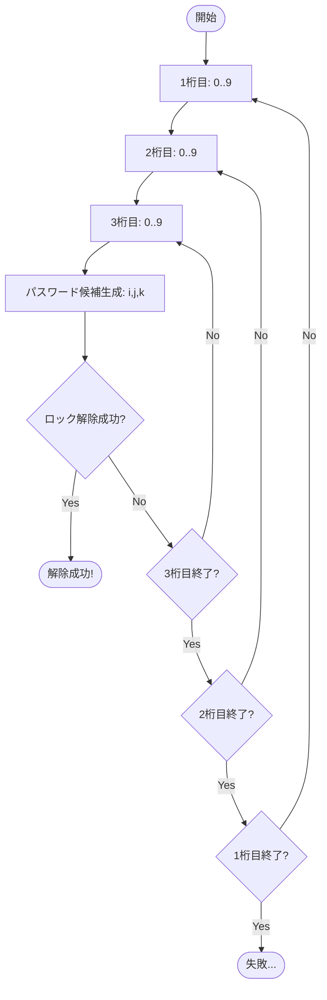

こんにちは。Perl入学式を卒業し、Mooでオブジェクト指向の基礎を学んだ皆さんに、少し刺激的な新しいシリーズをお届けします。

今回のテーマは「ブルートフォース攻撃シミュレータ」です。

「ブルートフォース攻撃（総当たり攻撃）」とは、可能なパスワードの組み合わせを片っ端から試して、正解を見つけ出す攻撃手法のことです。もちろん、これを他人のサーバーに対して行うことは犯罪ですが、自分の手元でシミュレーターを作ることは、プログラミング、特に「反復処理」と「アルゴリズム」を深く理解する上で非常に優れた教材になります。

第1回となる今回は、3桁の数字パスワードを特定する単純なスクリプトを作成します。

## ターゲット：3桁のダイヤル錠

まず、攻撃対象となる「鍵（ロック）」クラスを作成しましょう。これは3桁の数字（000〜999）で解錠できるシンプルなダイヤル錠です。

`PasswordLock.pm` というファイルを作成します。

```perl
package PasswordLock;
use Moo;
use experimental qw(signatures);

# 正解のパスワード（外部からは見えない）
has _secret => (
    is      => 'ro',
    default => '777',    # デモ用の正解
);

# 解除を試みるメソッド
sub unlock ($self, $attempt) {
    if ($attempt eq $self->_secret) {
        return 1;        # 解除成功
    }
    return 0;            # 解除失敗
}

1;
```

このクラスは非常に単純です。`unlock` メソッドにパスワード候補を渡し、正解（`777`）と一致すれば `1`（真）を、外れれば `0`（偽）を返します。

## 3桁ならfor文で勝てる

さて、この鍵を開けるための「クラッカー（攻撃ツール）」を作ってみましょう。
パスワードは3桁の数字ですから、`000` から `999` までの1000通りしかありません。

これなら、for文を3回重ねる（ネストする）ことで、全ての組み合わせを生成できます。

このアルゴリズムの流れをフローチャートにすると、以下のようになります。



`cracker_v1.pl` を作成します。

```perl
use v5.36;
use PasswordLock;

# ターゲットの鍵を準備
my $lock = PasswordLock->new;

say "クラッキングを開始します...";

# 1桁目（100の位）
for my $i (0 .. 9) {
    # 2桁目（10の位）
    for my $j (0 .. 9) {
        # 3桁目（1の位）
        for my $k (0 .. 9) {
            # 3桁の文字列を作成 (例: "007")
            my $attempt = "$i$j$k";

            # ロック解除を試行
            if ($lock->unlock($attempt)) {
                say "解除成功！ パスワードは [ $attempt ] です！";
                exit; # 見つかったら終了
            }
        }
    }
}

say "パスワードが見つかりませんでした...";
```

このスクリプトを実行してみましょう。

```bash
$ perl -I. cracker_v1.pl
クラッキングを開始します...
解除成功！ パスワードは [ 777 ] です！
```

一瞬で解除できましたね！

このように、桁数が少なく固定されている場合、for文のネスト（多重ループ）は直感的で強力な解決策になります。

## for文の限界

しかし、この方法には致命的な弱点があります。

もし、ターゲットの鍵が「4桁」になったらどうなるでしょうか？
for文をもう一つ内側に追加して、4重ループにする必要があります。

```perl
for my $i (0 .. 9) {
    for my $j (0 .. 9) {
        for my $k (0 .. 9) {
            for my $l (0 .. 9) { # 4桁目を追加
                # ...
            }
        }
    }
}
```

では、5桁なら？ 10桁なら？
あるいは、「桁数がわからない（実行時に決まる）」場合は？

for文のネストは、プログラムを書く時点で「深さ」が決まっていなければなりません。実行時に「N回ネストする」という命令は、通常のfor文では書けないのです。

## 次回予告

次回は、この「ループの深さを変えられない問題」に立ち向かいます。桁数が増えると途端に牙を剥く「多重ループの絶望」と、それを乗り越えるための「再帰呼び出し」というテクニックについて見ていきましょう。

実は、そこにはさらなる深い落とし穴が待っているのです...。

お楽しみに！
