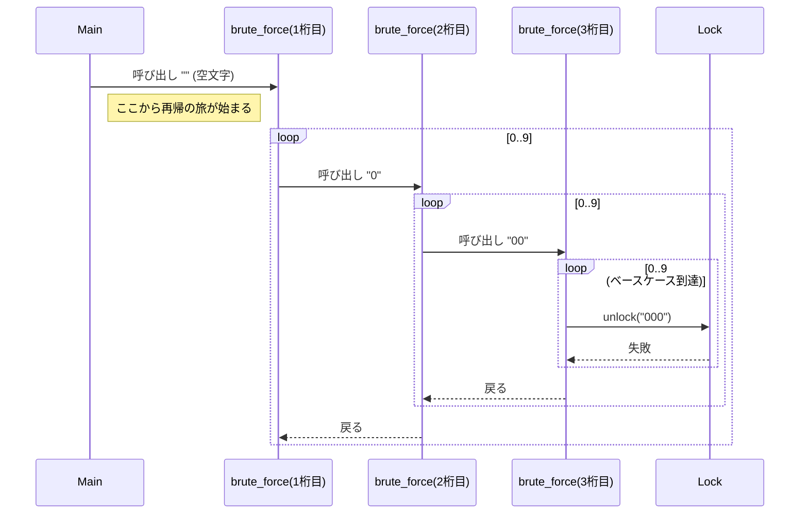

前回は、3桁のパスワードを3重のforループで特定しました。しかし、現実のパスワードは3桁とは限りません。

今回は、桁数が「4桁」「5桁」あるいは「N桁」と増えていった時に、単純なforループのアプローチがどう破綻するかを見ていきます。

## ソースコードを書き換える手間

前回作成した `cracker_v1.pl` は、3桁専用でした。もしターゲットが4桁になったら、プログラム自体を書き換えてfor文を増やす必要があります。

```perl
# 4桁の場合
for my $i (0 .. 9) {
    for my $j (0 .. 9) {
        for my $k (0 .. 9) {
            for my $l (0 .. 9) {
                 # ...
            }
        }
    }
}
```

これでは、汎用的なツールとは言えません。「実行時に桁数（長さ）を指定して、その桁数の組み合わせを全て試す」ようなプログラムを作りたいですよね。

例えば、コマンドライン引数で長さを指定できるようにしたいはずです。

```bash
$ perl cracker.pl --length 4  # 4桁を総当たり
$ perl cracker.pl --length 8  # 8桁を総当たり
```

しかし、Perlの文法には `nest_loop($n)` のような、動的にループの深さを変える構文はありません。ここで行き詰まってしまいます。

## 再帰呼び出し（Recursion）への挑戦

この問題を解決する一般的なアルゴリズムの手法として「再帰呼び出し（Recursion）」があります。関数の中で自分自身を呼び出すテクニックです。

N桁のループを、「1回のループの中で、(N-1)桁のループを呼ぶ」という形に置き換えるのです。

再帰呼び出しがどのように深くなっていくか、イメージ図で見てみましょう。関数が自分自身を呼び出し、まるでマトリョーシカ人形のように内側へ入っていきます。



試しに書いてみましょう。少し難しくなりますよ。

`cracker_recursive.pl`

```perl
use v5.36;
use PasswordLock;

my $target_length = 4; # ここを変えると桁数が変わる
my $lock = PasswordLock->new;

sub brute_force ($current_string) {
    # ベースケース: 指定した桁数に達したらチェックを行う
    if (length($current_string) == $target_length) {
        if ($lock->unlock($current_string)) {
            say "解除成功！ パスワードは [ $current_string ] です！";
            exit;
        }
        return;
    }

    # 再帰ステップ: 0〜9を付加して自分自身を呼び出す
    for my $i (0 .. 9) {
        brute_force($current_string . $i);
    }
}

say "クラッキングを開始します（長さ: $target_length）...";
brute_force(""); # 空文字からスタート
say "見つかりませんでした。";
```

これで、`$target_length` を変えるだけで、何桁でも対応できるようになりました！

## 再帰の「認知負荷」と「制御の難しさ」

再帰を使えば問題は解決したように見えます。しかし、このコードにはいくつかの問題があります。

1.  理解しにくい: 初心者にとって、再帰ロジック（特にベースケースと再帰ステップ）を正しく理解し、バグなく実装するのは難しいことです。
2.  中断・再開が難しい: もし途中で一時停止して、状態を保存し、後から再開したいとしたらどうでしょう？ 再帰の深く潜った状態（コールスタック）を保存するのは非常に困難です。
3.  メモリ消費: 桁数が極端に多い場合、再帰が深すぎてスタックオーバーフローを起こす可能性があります（Perlではデフォルトで深い再帰が可能ですが、限界はあります）。

そして何より、コードが「アルゴリズムの都合」に支配されています。「パスワードを試す」というビジネスロジック（？）と、「組み合わせを作り出す」という制御ロジックが、`brute_force` 関数の中で密結合してしまっています。

もっとシンプルに、「for文のようにフラットに書けて、かつ無限にループできる」 方法はないのでしょうか？

```perl
# 理想的なコード
my $generator = Generator->new(length => 4);

while (my $pass = $generator->next) {
    $lock->unlock($pass);
}
```

こんな風に書けたら最高ですよね。これなら、ループの中身（解錠試行）と、ループの制御（パスワード生成）が完全に分かれています。

## 次回予告

次回は、この「理想的なコード」を実現するために、Mooを使って「組み合わせ生成機」を作ります。

ここで登場するのが、シリーズの核心であるIterator（反復子）の考え方です。複雑な再帰ロジックをオブジェクトの中に隠蔽（カプセル化）して、使う側にはシンプルな `next` メソッドだけを見せる魔法のようなテクニックを紹介します。

[前回記事: Perlでパスワードクラッカーを作ろう - 3桁の秘密]()
