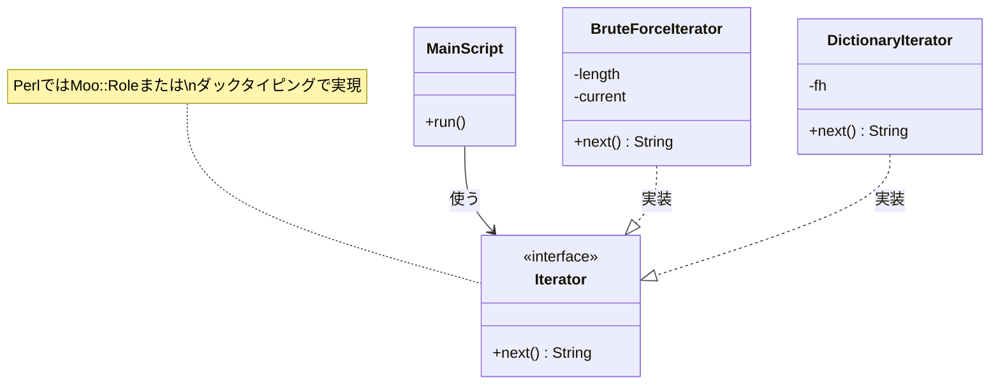

前回は、`BruteForceIterator` を作成し、パスワード生成ロジックをオブジェクトに閉じ込めました。

今回は、もっと現実的な攻撃手法である「辞書攻撃（Dictionary Attack）」を実装します。辞書攻撃とは、よく使われるパスワード（"password", "123456", "admin" など）のリストを使って攻撃する方法です。

## 辞書攻撃用のIteratorを作る

辞書攻撃も、使う側から見れば「次々とパスワード候補が出てくる」という点ではブルートフォースと同じです。
つまり、`next` メソッドを持つ同じインターフェースのクラスを作れば、メインのコードを変えずに攻撃手法だけを切り替えられるはずです。

`DictionaryIterator.pm` を作成します。

```perl
package DictionaryIterator;
use Moo;
use experimental qw(signatures);

# 辞書ファイルのパス
has dict_file => (
    is       => 'ro',
    required => 1,
);

# ファイルハンドル（内部で保持）
has _fh => (
    is  => 'rw',
);

# 初期化時（BUILD）にファイルを開く
sub BUILD ($self, $args) {
    open my $fh, '<', $self->dict_file or die "辞書ファイルが開けません: $!";
    $self->_fh($fh);
}

# 次の単語を返す
sub next ($self) {
    my $fh = $self->_fh;

    # ファイルから1行読む
    my $line = <$fh>;

    # ファイルの末尾ならundefを返す
    return undef unless defined $line;

    chomp $line; # 改行削除
    return $line;
}

# デストラクタ（オブジェクト消滅時にファイルを閉じる）
sub DEMOLISH ($self, $in_global_destruction) {
    close $self->_fh if $self->_fh;
}

1;
```

このクラスは、数字をインクリメントするのではなく、ファイルを1行ずつ読み込んで返します。しかし、外から見れば `next` を呼ぶだけです。

## 攻撃ツールのアップグレード

では、メインのスクリプト `cracker_poly.pl` を書き換えて、攻撃手法を選べるようにしましょう。

```perl
use v5.36;
use PasswordLock;
use BruteForceIterator;
use DictionaryIterator;
use Getopt::Long;

# オプション処理
my $mode = 'brute'; # デフォルトはブルートフォース
GetOptions("mode=s" => \$mode);

my $iterator;

# モードによってIteratorを切り替える（ポリモーフィズム！）
if ($mode eq 'brute') {
    say "モード: ブルートフォース攻撃";
    $iterator = BruteForceIterator->new(length => 3);
}
elsif ($mode eq 'dict') {
    say "モード: 辞書攻撃";
    # 簡易辞書ファイルを作成して使う
    open my $fh, '>', 'passwords.txt';
    print $fh "password\nadmin\n777\n123456\n";
    close $fh;

    $iterator = DictionaryIterator->new(dict_file => 'passwords.txt');
}
else {
    die "不明なモードです: $mode";
}

my $lock = PasswordLock->new;

say "攻撃を開始します...";

# ここは共通！ $iteratorが何者か気にする必要はない
while (defined(my $attempt = $iterator->next)) {
    if ($lock->unlock($attempt)) {
        say "解除成功！ パスワードは [ $attempt ] です！";
        exit;
    }
}

say "失敗しました...";
```

## ポリモーフィズム（多態性）の威力

このコードの重要な点は、`while` ループの部分が一切変更されていないことです。

```perl
while (defined(my $attempt = $iterator->next)) {
```

`$iterator` が `BruteForceIterator` のインスタンスだろうと、`DictionaryIterator` のインスタンスだろうと、メインのロジックは「`next` を呼んで試す」ことだけを知っていれば良いのです。

これをポリモーフィズム（多態性）と呼びます。

共通のインターフェース（ここでは `next` メソッド）に従う限り、中身の実装を自由に交換できる。これこそがオブジェクト指向設計の強力な武器であり、拡張性の高いツールを作る秘訣です。

クラス図で見ると、この関係性がよく分かります。Mainスクリプトは具体的なクラス（BruteForceIteratorなど）に直接依存するのではなく、「nextメソッドを持つ何か（Iterator）」を使っているだけなのです。



## 次回予告

ここまでで、私たちは知らず知らずのうちに、ある有名なデザインパターンを実装していました。

次回は最終回。これまで作ってきたものが、ソフトウェア工学の歴史の中で何と呼ばれているのか、その正体を明かします。そして、このパターンがPerlの標準機能や他の言語でどのように使われているかを総括します。

[前回記事: 組み合わせ生成機を作る - Mooでループをオブジェクトにする]()
