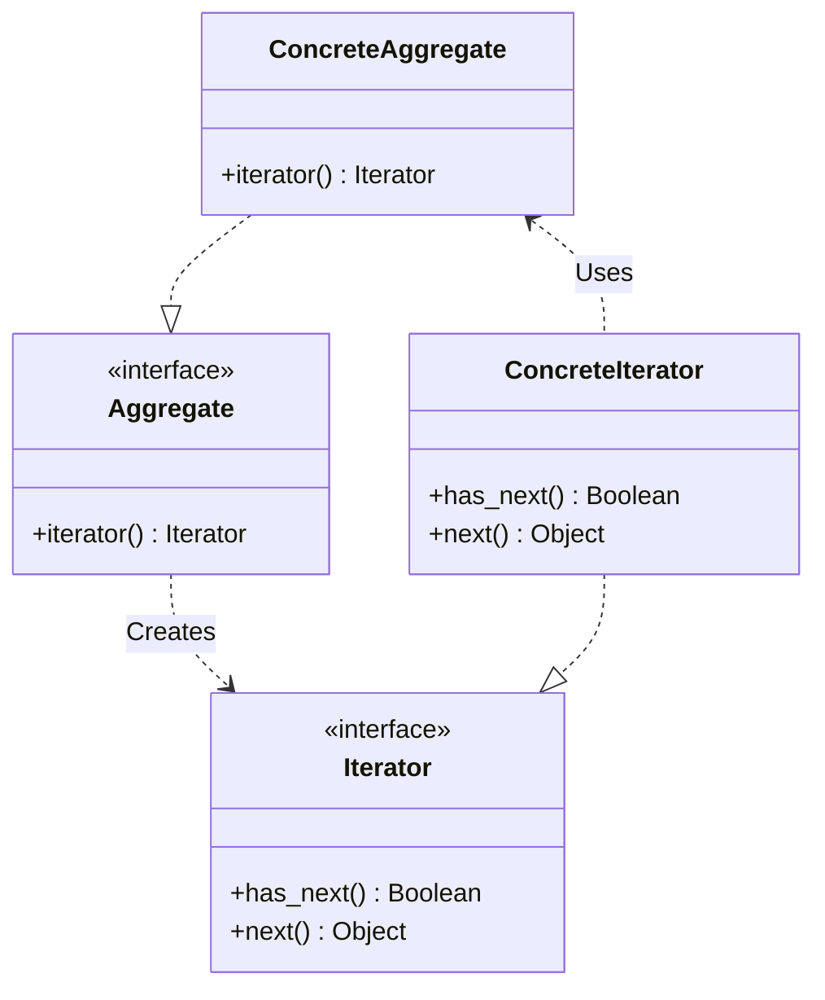
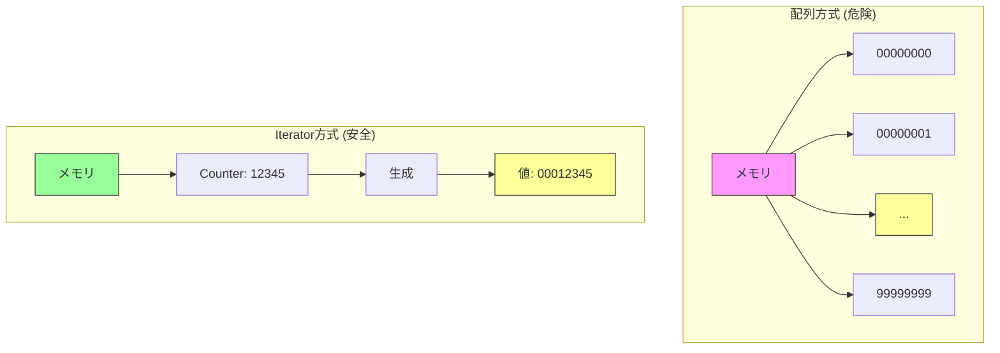

これまで私たちは、パスワードクラッカーを作りながら、以下の問題を解決してきました。

1.  for文のネスト問題: 桁数が増えるとループが書けない
2.  再帰の複雑さ: ロジックが難解でメモリ効率が悪い
3.  実装の切り替え: 攻撃手法（数字順、辞書順）を柔軟に変えたい

これらを解決するために導入した「`next` メソッドを持つオブジェクト」という仕組み。
これこそが、GoF（Gang of Four）のデザインパターンの一つ、Iterator（イテレータ）パターン です。

## Iteratorパターンとは

Iteratorパターンは、「集合体の内部構造を隠蔽し、要素を順番に取り出す方法を提供する」パターンです。

今回のシリーズでは、少し特殊なIteratorを作成しました。
通常、Iteratorは「配列（本棚）」などの既存のコレクションを走査するために使われます。しかし、今回は「パスワードの全組み合わせ」という、仮想的な無限のコレクションを走査するために使いました。

### 今回の構成要素

- Iterator（反復子）: `next` メソッドを持つインターフェース
  - 今回は明示的な `Moo::Role` は作りませんでしたが、`BruteForceIterator` と `DictionaryIterator` がこの役割を果たしました。
- ConcreteIterator（具体的な反復子）: 実際の実装クラス
  - `BruteForceIterator`: 計算によって次の値を生成
  - `DictionaryIterator`: ファイルから読み込んで次の値を生成

これをGoFの標準的なクラス図に当てはめると、以下のようになります。



※ 今回の実装では `Aggregate`（集合体そのもの）は明示的に作らず、いきなり `Iterator` を生成しましたが、本質的な役割は同じです。

## なぜIteratorだったのか？

このシリーズのテーマとしてIteratorを選んだ理由は、「遅延評価（Lazy Evaluation）」の価値を最も直感的に理解できるからです。

もしIteratorを使わず、全ての候補を配列に入れてから処理していたらどうなっていたでしょう？

```perl
# 8桁の数字（1億通り）を配列に入れる
my @passwords = ('00000000' .. '99999999');
# -> メモリ爆発でスクリプトが死にます！
```

これを図解すると、配列方式とIterator方式の違いは一目瞭然です。



Iteratorを使えば、「今まさに試そうとしている1つのパスワード」 だけがメモリ上に存在します。これにより、理論上は無限に近い長さのパスワードや、数テラバイトある辞書ファイルでも、一定のメモリ消費量で処理し続けることができます。

## PerlとIterator

実は、Perlのファイル読み込み自体が、組み込みのIteratorのような動作をします。

```perl
while (my $line = <$fh>) { ... }
```

この `<$fh>` も、ファイル全体を読み込むのではなく、1行ずつ取得する（イテレートする）仕組みです。

また、CPANにはIteratorに関連するモジュールがたくさんあります。
- `Iterator::Simple`: 手軽にイテレータを作れる
- `Path::Tiny` の `iterator` メソッド: ディレクトリ内のファイルを走査する

## デザインパターンを学ぶ意義

「デザインパターン」と聞くと、難解な教科書を思い浮かべるかもしれません。しかし、今回体験したように、パターンは「直面した具体的な問題（多重ループの辛さ）を解決しようとした結果、自然とたどり着く形」に名前を付けたものです。

「ああ、これはIteratorパターンで解決できるな」と気づくことができれば、ゼロから悩む時間を節約し、先人たちの知恵を借りて堅牢なコードを書くことができます。

## 最後に

この「ブルートフォース攻撃シミュレータ」シリーズはこれでおしまいです。
MooとIteratorパターンを使って、少し生意気で強力なツールを作ることができました。

この知識は、ログ解析、データマイニング、大規模バッチ処理など、攻撃ツール以外の多くの平和的な用途でも強力な武器になります。ぜひ、あなたのコードに応用してみてください。

そしてもちろん、作ったツールは自分の管理下のシステムだけで試してくださいね！

Happy Hacking!

[前回記事: 辞書攻撃もしたい - 攻撃手法の切り替え]()
