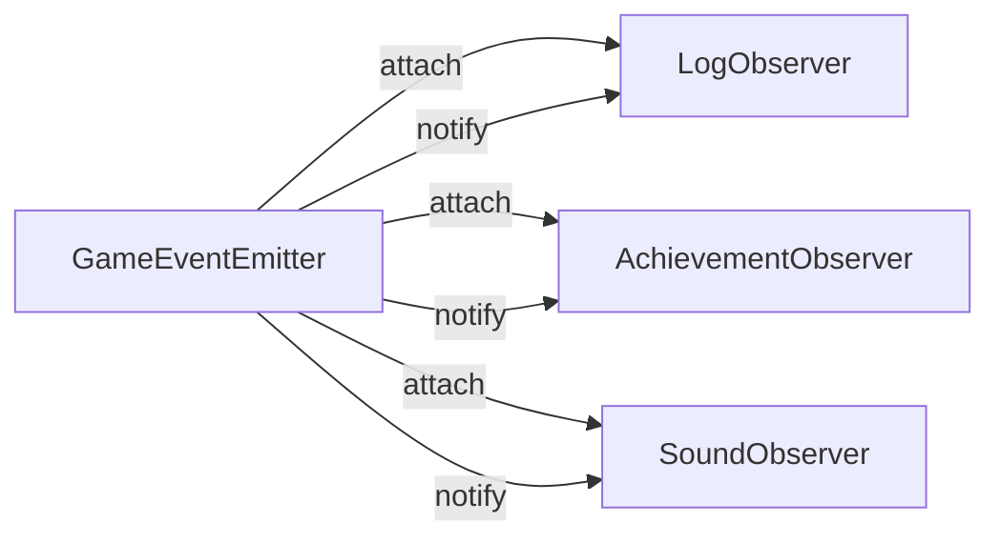

[@nqounet](https://x.com/nqounet)です。

「Perlでローグライク通知システムを作ろう」シリーズの第5回です。前回は、Observerが持つべきメソッドを`Moo::Role`で定義しました。今回は、複数のObserverへの通知を一元管理する`GameEventEmitter`を作成します。

## 前回の振り返り

前回は、`GameEventObserver`というRoleを作成し、Observerは必ず`update`メソッドを持つという約束を定義しました。



## 現在の問題点

前回のコードでは、イベントを各Observerに通知するとき、このように書いていました。

```perl
for my $event (@events) {
    $log_observer->update($event);
    $achievement_observer->update($event);
    $sound_observer->update($event);
}
```

新しいObserverを追加するたびに、この部分を修正する必要があります。Observerの数が増えるほど、管理が大変になりますね。

## 解決策：イベント発生元（EventEmitter）を作る

この問題を解決するために、Observerのリストを管理し、イベント発生時に全Observerへ通知する仕組みを作ります。



## GameEventEmitterクラスを作成する

イベント発生元を表す`GameEventEmitter`クラスを作成しましょう。

```perl
#!/usr/bin/env perl
# 言語: perl
# バージョン: 5.36以上
# 依存: Moo（cpanmでインストール）

use v5.36;

package GameEvent {
    use Moo;
    use v5.36;

    has 'type' => (
        is       => 'ro',
        required => 1,
    );

    has 'message' => (
        is       => 'ro',
        required => 1,
    );

    has 'timestamp' => (
        is      => 'ro',
        default => sub { time() },
    );

    has 'data' => (
        is      => 'ro',
        default => sub { {} },
    );
}

package GameEventObserver {
    use Moo::Role;
    use v5.36;

    requires 'update';
}

# イベント発生元を表すクラス
package GameEventEmitter {
    use Moo;
    use v5.36;

    # Observerのリストを保持
    has 'observers' => (
        is      => 'ro',
        default => sub { [] },
    );

    # Observerを登録する
    sub attach ($self, $observer) {
        push @{$self->observers}, $observer;
        say "[EMITTER] Observerを登録しました";
    }

    # Observerを解除する
    sub detach ($self, $observer) {
        @{$self->observers} = grep { $_ != $observer } @{$self->observers};
        say "[EMITTER] Observerを解除しました";
    }

    # 全てのObserverに通知する
    sub notify ($self, $event) {
        for my $observer (@{$self->observers}) {
            $observer->update($event);
        }
    }
}

package main {
    use v5.36;

    # EventEmitterを作成
    my $emitter = GameEventEmitter->new();

    # Observerがない状態でイベントを発生させてみる
    my $event = GameEvent->new(
        type    => 'enemy_defeated',
        message => 'スライムを倒した！',
    );

    say "=== Observerなしで通知 ===";
    $emitter->notify($event);
    say "(何も起きない)";
    say "";
}
```

実行結果は以下のようになります。

```
=== Observerなしで通知 ===
(何も起きない)
```

Observerがいないので、通知しても何も起きません。

## Observerを登録して通知する

では、Observerを登録してから通知してみましょう。

```perl
#!/usr/bin/env perl
# 言語: perl
# バージョン: 5.36以上
# 依存: Moo（cpanmでインストール）

use v5.36;

package GameEvent {
    use Moo;
    use v5.36;

    has 'type' => (
        is       => 'ro',
        required => 1,
    );

    has 'message' => (
        is       => 'ro',
        required => 1,
    );

    has 'timestamp' => (
        is      => 'ro',
        default => sub { time() },
    );

    has 'data' => (
        is      => 'ro',
        default => sub { {} },
    );
}

package GameEventObserver {
    use Moo::Role;
    use v5.36;

    requires 'update';
}

package LogObserver {
    use Moo;
    use v5.36;

    with 'GameEventObserver';

    has 'prefix' => (
        is      => 'ro',
        default => '[LOG]',
    );

    sub update ($self, $event) {
        say $self->prefix . " " . $event->message;
    }
}

package AchievementObserver {
    use Moo;
    use v5.36;

    with 'GameEventObserver';

    has 'unlocked' => (
        is      => 'ro',
        default => sub { [] },
    );

    has 'defeated_count' => (
        is      => 'rw',
        default => 0,
    );

    sub update ($self, $event) {
        my $type = $event->type;

        if ($type eq 'enemy_defeated') {
            my $count = $self->defeated_count + 1;
            $self->defeated_count($count);

            if ($count == 1) {
                $self->_unlock('はじめての勝利');
            }
        }
        elsif ($type eq 'level_up') {
            my $level = $event->data->{level} // 0;
            if ($level == 5) {
                $self->_unlock('成長');
            }
        }
    }

    sub _unlock ($self, $name) {
        push @{$self->unlocked}, $name;
        say "[ACHIEVEMENT] 実績解除: $name";
    }
}

package GameEventEmitter {
    use Moo;
    use v5.36;

    has 'observers' => (
        is      => 'ro',
        default => sub { [] },
    );

    sub attach ($self, $observer) {
        push @{$self->observers}, $observer;
    }

    sub detach ($self, $observer) {
        @{$self->observers} = grep { $_ != $observer } @{$self->observers};
    }

    sub notify ($self, $event) {
        for my $observer (@{$self->observers}) {
            $observer->update($event);
        }
    }
}

package main {
    use v5.36;

    # EventEmitterを作成
    my $emitter = GameEventEmitter->new();

    # Observerを作成
    my $log_observer = LogObserver->new();
    my $achievement_observer = AchievementObserver->new();

    # Observerを登録
    $emitter->attach($log_observer);
    $emitter->attach($achievement_observer);

    say "=== ダンジョン探索開始 ===";
    say "";

    # イベントを発生させて通知
    my $event1 = GameEvent->new(
        type    => 'enemy_defeated',
        message => 'スライムを倒した！',
    );
    $emitter->notify($event1);

    say "";

    my $event2 = GameEvent->new(
        type    => 'item_acquired',
        message => '薬草を手に入れた！',
    );
    $emitter->notify($event2);
}
```

実行結果は以下のようになります。

```
=== ダンジョン探索開始 ===

[LOG] スライムを倒した！
[ACHIEVEMENT] 実績解除: はじめての勝利

[LOG] 薬草を手に入れた！
```

`emitter->notify($event)`を1回呼ぶだけで、登録されている全てのObserverに通知されます。

## attach/detach/notifyの役割

`GameEventEmitter`が持つ3つのメソッドの役割をまとめます。

| メソッド | 役割 | 引数 |
|----------|------|------|
| `attach` | Observerを登録する | Observer オブジェクト |
| `detach` | Observerを解除する | Observer オブジェクト |
| `notify` | 全Observerに通知する | GameEvent オブジェクト |

## 改善された点

`GameEventEmitter`を導入したことで、以下の点が改善されました。

| 改善点 | 説明 |
|--------|------|
| 一元管理 | Observerのリストをemitterが管理 |
| 通知の簡略化 | `notify`を1回呼ぶだけで全Observerに通知 |
| 追加が容易 | 新しいObserverは`attach`で登録するだけ |

## 今回のまとめ

今回は、イベント発生元を管理する`GameEventEmitter`クラスを作成しました。

- Observerのリストを保持
- `attach`: Observerを登録
- `detach`: Observerを解除
- `notify`: 全Observerに通知

## 完成コード

今回の完成コードは以下の通りです。

```perl
#!/usr/bin/env perl
# 言語: perl
# バージョン: 5.36以上
# 依存: Moo（cpanmでインストール）

use v5.36;

package GameEvent {
    use Moo;
    use v5.36;

    has 'type' => (
        is       => 'ro',
        required => 1,
    );

    has 'message' => (
        is       => 'ro',
        required => 1,
    );

    has 'timestamp' => (
        is      => 'ro',
        default => sub { time() },
    );

    has 'data' => (
        is      => 'ro',
        default => sub { {} },
    );
}

package GameEventObserver {
    use Moo::Role;
    use v5.36;

    requires 'update';
}

package LogObserver {
    use Moo;
    use v5.36;

    with 'GameEventObserver';

    has 'prefix' => (
        is      => 'ro',
        default => '[LOG]',
    );

    sub update ($self, $event) {
        say $self->prefix . " " . $event->message;
    }
}

package AchievementObserver {
    use Moo;
    use v5.36;

    with 'GameEventObserver';

    has 'unlocked' => (
        is      => 'ro',
        default => sub { [] },
    );

    has 'defeated_count' => (
        is      => 'rw',
        default => 0,
    );

    sub update ($self, $event) {
        my $type = $event->type;

        if ($type eq 'enemy_defeated') {
            my $count = $self->defeated_count + 1;
            $self->defeated_count($count);

            if ($count == 1) {
                $self->_unlock('はじめての勝利');
            }
            if ($count == 10) {
                $self->_unlock('ハンター');
            }
        }
        elsif ($type eq 'level_up') {
            my $level = $event->data->{level} // 0;
            if ($level == 5) {
                $self->_unlock('成長');
            }
        }
    }

    sub _unlock ($self, $name) {
        push @{$self->unlocked}, $name;
        say "[ACHIEVEMENT] 実績解除: $name";
    }
}

package SoundObserver {
    use Moo;
    use v5.36;

    with 'GameEventObserver';

    has 'sound_map' => (
        is      => 'ro',
        default => sub {{
            enemy_defeated => 'victory.wav',
            item_acquired  => 'pickup.wav',
            level_up       => 'levelup.wav',
        }},
    );

    sub update ($self, $event) {
        my $type = $event->type;
        my $sound = $self->sound_map->{$type};

        if ($sound) {
            say "[SOUND] $sound を再生";
        }
    }
}

package GameEventEmitter {
    use Moo;
    use v5.36;

    has 'observers' => (
        is      => 'ro',
        default => sub { [] },
    );

    sub attach ($self, $observer) {
        push @{$self->observers}, $observer;
    }

    sub detach ($self, $observer) {
        @{$self->observers} = grep { $_ != $observer } @{$self->observers};
    }

    sub notify ($self, $event) {
        for my $observer (@{$self->observers}) {
            $observer->update($event);
        }
    }
}

package main {
    use v5.36;

    my $emitter = GameEventEmitter->new();

    my $log_observer = LogObserver->new();
    my $achievement_observer = AchievementObserver->new();
    my $sound_observer = SoundObserver->new();

    $emitter->attach($log_observer);
    $emitter->attach($achievement_observer);
    $emitter->attach($sound_observer);

    say "=== ダンジョン探索開始 ===";
    say "";

    my @events = (
        GameEvent->new(
            type    => 'enemy_defeated',
            message => 'スライムを倒した！',
        ),
        GameEvent->new(
            type    => 'item_acquired',
            message => '薬草を手に入れた！',
        ),
        GameEvent->new(
            type    => 'level_up',
            message => 'レベルが5になった！',
            data    => { level => 5 },
        ),
    );

    for my $event (@events) {
        $emitter->notify($event);
        say "";
    }

    say "=== 解除した実績 ===";
    say "- $_" for @{$achievement_observer->unlocked};
}
```

## 次回予告

次回は「Observerを動的に追加・削除しよう」です。ゲーム中にサウンドをON/OFFしたい場合など、実行時にObserverを追加・削除する方法を学びます。
