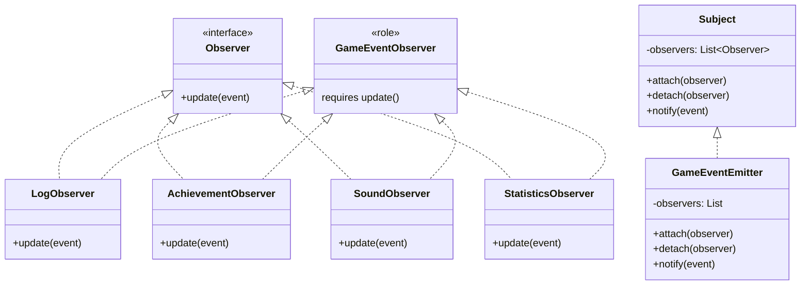

[@nqounet](https://x.com/nqounet)です。

「Perlでローグライク通知システムを作ろう」シリーズの最終回です。9回にわたって通知システムを作ってきましたが、実はこれ、**Observerパターン**というデザインパターンを実装していたのです。

## 前回の振り返り

前回は、すべての機能を統合して対話的なダンジョン探索ゲームを完成させました。



## シリーズの振り返り

このシリーズで作ってきた機能を振り返りましょう。

| 回 | 学んだこと | Observerパターンでの名前 |
|----|-----------|------------------------|
| 第1回 | ログ出力の基本 | - |
| 第2回 | 複数システムへの通知問題 | 動機：なぜパターンが必要か |
| 第3回 | クラスの分離 | ConcreteObserver |
| 第4回 | Moo::Roleで共通インターフェース | Observer（インターフェース） |
| 第5回 | イベント発生元の管理 | Subject（Observable） |
| 第6回 | 動的な追加・削除 | attach/detach |
| 第7回 | 型チェック | - |
| 第8回 | OCPを体感 | パターンのメリット |
| 第9回 | 統合と完成 | - |

## Observerパターンとは

**Observerパターン**は、GoF（Gang of Four）が1994年に発表した23のデザインパターンの1つです。

> **「オブジェクト間に一対多の依存関係を定義し、あるオブジェクトの状態が変化したとき、依存するすべてのオブジェクトに自動的に通知・更新される」**

簡単に言うと、「何かが起きたら、関係するみんなに知らせる」仕組みです。

## 私たちが作ったものとの対応



| Observerパターンの概念 | 私たちが作ったもの |
|----------------------|------------------|
| Subject（被観察者） | GameEventEmitter |
| Observer（観察者）インターフェース | GameEventObserver（Moo::Role） |
| ConcreteObserver（具象観察者） | LogObserver, AchievementObserver, SoundObserver, StatisticsObserver |
| attach() | $emitter->attach($observer) |
| detach() | $emitter->detach($observer) |
| notify() | $emitter->notify($event) |
| update() | $observer->update($event) |

私たちは知らず知らずのうちに、Observerパターンを実装していたのです。

## Observerパターンのメリット

このパターンを使うことで、以下のメリットが得られます。

| メリット | 説明 | 本シリーズでの体験 |
|----------|------|------------------|
| **疎結合** | SubjectはObserverの具体的な実装を知らない | GameEventEmitterはLogObserverの中身を知らない |
| **開放閉鎖原則（OCP）** | 新しいObserverを追加しても既存コードを変更せずに済む | 第8回でStatisticsObserverを追加 |
| **動的な管理** | 実行時にObserverを追加・削除できる | 第6回でサウンドON/OFFを実装 |
| **一対多の通知** | 1つのイベントを複数のシステムに同時通知 | 全Observerがイベントを受け取る |

## 類似パターンとの比較

Observerパターンに似たパターンがいくつかあります。違いを理解しておきましょう。

### Pub/Subパターンとの違い

| 項目 | Observerパターン | Pub/Subパターン |
|-----|-----------------|----------------|
| 結合度 | 直接的（SubjectがObserverを参照） | 間接的（Broker経由） |
| 通信方式 | 通常は同期的 | 通常は非同期的 |
| スコープ | 同一プロセス内 | プロセス間・システム間も可能 |
| 典型例 | GUIイベント | メッセージキュー、マイクロサービス |

```
【Observerパターン】
Subject ───直接通知───> Observer1
       └───直接通知───> Observer2

【Pub/Subパターン】
Publisher ───> Broker ───> Subscriber1
                      └───> Subscriber2
```

### Mediatorパターンとの違い

| 項目 | Observerパターン | Mediatorパターン |
|-----|-----------------|-----------------|
| 通信構造 | 一対多 | 多対多 |
| データフロー | 一方向（Subject→Observer） | 双方向 |
| 役割 | 状態変化の通知 | 相互作用の調整 |
| 典型例 | イベント通知 | チャットルーム |

## 発展的な学習

Observerパターンを理解した今、次のステップとして以下のトピックを学ぶことをお勧めします。

### イベント駆動プログラミング

Perlでは、以下のモジュールでより本格的なイベント駆動プログラミングができます。



- **IO::Async**: Future/Promiseベースの非同期フレームワーク
- **Mojo::IOLoop**: Mojoliciousのイベントループ

### 他のデザインパターン

Observerパターンを学んだら、他の振る舞いパターンも学んでみましょう。



## シリーズのまとめ

このシリーズを通して、以下のことを学びました。

1. **問題の発見**: if/elseの増殖、責務の混在
2. **クラスの分離**: 各Observerを独立したクラスに
3. **インターフェースの定義**: Moo::Roleでupdateメソッドを要求
4. **一元管理**: GameEventEmitterで通知を管理
5. **動的な管理**: 実行時にObserverを追加・削除
6. **型チェック**: does制約でバグを防止
7. **OCP実践**: 既存コードを変更せずに機能追加
8. **統合**: 対話的なゲームを完成

そして最後に、これが「Observerパターン」というデザインパターンだったことを明かしました。

## 参考文献





## おわりに

「Perlでローグライク通知システムを作ろう」シリーズをお読みいただき、ありがとうございました。

デザインパターンは「暗記するもの」ではなく、「問題を解決する過程で自然に見つかるもの」です。このシリーズで体験したように、問題にぶつかり、解決策を考え、それがパターンと呼ばれる設計であることを後から知る。これがパターン学習の理想的な形だと思います。

次のシリーズでお会いしましょう！
