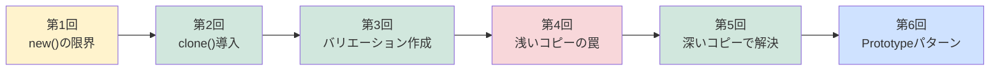

[@nqounet](https://x.com/nqounet)です。

このページは「PerlとMooでモンスター軍団を量産してみよう」シリーズの目次です。

## シリーズ概要

このシリーズでは、既存オブジェクトをコピーして新しいオブジェクトを効率的に生成する方法を学びます。 GoFデザインパターンの一つ「Prototypeパターン」をPerlとMooで実践的に習得できる内容です。

### 学習ゴール

- 既存オブジェクトをコピーして新しいオブジェクトを効率的に生成する方法を習得
- 「浅いコピー」と「深いコピー」の違いを実体験で理解
- MooX::CloneやStorable::dclone()を使いこなせるようになる
- Prototypeパターンを自然に身につける

### 対象読者

- Perl入学式を卒業したばかりの方
- Mooの基本（`has`、`new`、`extends`）を理解している方
- 「Mooで覚えるオブジェクト指向プログラミング」シリーズを読了した方

### 前提知識

このシリーズは「[Mooで覚えるオブジェクト指向プログラミング](/2021/10/31/191008/)」シリーズの続編です。まだ読んでいない方は、先にそちらをご覧ください。



## 全6回の目次

### 第1回 - モンスターを量産したい！new()の限界

スライムを大量に作りたいが、`new()`で毎回全属性を指定するのは面倒。10体のスライムを作るコードが30行に膨れ上がる問題を体験します。



---

### 第2回 - MooX::Cloneでモンスターを量産しよう

MooX::Cloneを導入して`clone()`メソッドを追加。ベースモンスターを1体作り、`clone()`で量産。コードが劇的に短くなります。



---

### 第3回 - clone()で色違いモンスターを量産しよう

赤スライム、青スライム、金スライムを`clone()`で生成し、色だけ変更。テンプレートからのバリエーション量産の楽しさを体験します。



---

### 第4回 - 浅いコピーの罠！装備を持ったモンスターで問題発生

武器オブジェクトを持つドラゴンをクローン。武器を変更したら、元のドラゴンの武器も変わってしまう！「浅いコピー」の問題を発見します。



---

### 第5回 - Storable::dclone()で深いコピー！

Storable::dclone()を使って「深いコピー」を実装。ネストしたオブジェクトも完全に独立したコピーになり、浅いコピーの問題を解決します。



---

### 第6回 - これがPrototypeパターンだ！

作ってきたものが「Prototypeパターン」だったことを明かします。GoFデザインパターンの生成パターンを学び、Factory Methodとの違いも解説します。



## シリーズの流れ

## 参考資料




