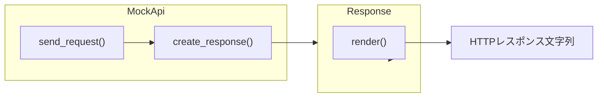

[@nqounet](https://x.com/nqounet)です。

バックエンドAPIがまだ完成していないのに、フロントエンドの開発を進めなければならない。そんな経験はありませんか？本シリーズでは、PerlとMooを使って「偽API」を作り、この課題を解決する方法を学んでいきます。

## このシリーズについて

このシリーズは「Mooで覚えるオブジェクト指向プログラミング」シリーズの続編です。Perl入学式卒業レベルで、MooでのOOP入門を完了した読者を対象としています。

全8回を通じて、シナリオに応じて異なるAPIレスポンスを生成できる「APIレスポンスシミュレーター」を構築します。最初はシンプルに始めて、段階的に機能を追加しながら、設計上の課題とその解決方法を一緒に体験していきましょう。

このシリーズで得られるもの:
- 実務でありがちな「APIがないと検証できない」問題を自作ツールで解決できる
- シナリオ追加のたびに設計が改善される実感を得られる
- 最終的にはFactory Methodパターンを自然に習得できる

前提知識:
- Perl v5.36以降の基本文法（signatures、postfix dereferenceなど）
- Mooによるクラス定義の基礎

シリーズ全体の目次は以下をご覧ください。



## 今回のゴール

成功レスポンスを返すだけの、最もシンプルなAPIシミュレーターを作ります。



## Responseクラスを作る

まずは、APIのレスポンスを表現するクラスを作りましょう。HTTPステータスコード、Content-Type、そしてJSONボディを持つシンプルな構造です。

```perl
#!/usr/bin/env perl
# 言語: perl
# バージョン: 5.36以上
# 依存: Moo, JSON（cpanmでインストール）

use v5.36;

package Response {
    use Moo;
    use JSON qw(encode_json);

    has status => (
        is       => 'ro',
        required => 1,
    );

    has content_type => (
        is      => 'ro',
        default => sub { 'application/json' },
    );

    has body => (
        is       => 'ro',
        required => 1,
    );

    sub render($self) {
        my $json_body = encode_json($self->body);
        return sprintf(
            "HTTP/1.1 %s\nContent-Type: %s\n\n%s",
            $self->status,
            $self->content_type,
            $json_body,
        );
    }
}
```

`Response`クラスは3つの属性を持っています:
- `status`: HTTPステータスコード（例: "200 OK"）
- `content_type`: コンテンツタイプ（デフォルトは"application/json"）
- `body`: レスポンスボディ（Perlのデータ構造）

`render`メソッドは、これらの属性を組み合わせてHTTPレスポンス風の文字列を生成します。

## MockApiクラスを作る

次に、このResponseを生成して返すMockApiクラスを作りましょう。

```perl
package MockApi {
    use Moo;

    sub create_response($self) {
        return Response->new(
            status => '200 OK',
            body   => {
                success => JSON::true,
                message => 'リクエストが正常に処理されました',
                data    => {
                    id   => 1,
                    name => 'サンプルアイテム',
                },
            },
        );
    }

    sub send_request($self) {
        my $response = $self->create_response;
        return $response->render;
    }
}

# 実行
my $api = MockApi->new;
say $api->send_request;
```

`MockApi`クラスは2つのメソッドを持っています:
- `create_response`: 成功レスポンスを生成する
- `send_request`: レスポンスを生成し、レンダリングして返す

## 実行結果

このスクリプトを実行すると、以下のような出力が得られます。

```text
HTTP/1.1 200 OK
Content-Type: application/json

{"data":{"id":1,"name":"サンプルアイテム"},"message":"リクエストが正常に処理されました","success":true}
```

見事に成功レスポンスが生成できました。これで、バックエンドがなくてもフロントエンドの開発を進められます。

## 完成コード

今回の完成コードを1ファイルにまとめると、以下のようになります。

```perl
#!/usr/bin/env perl
# 言語: perl
# バージョン: 5.36以上
# 依存: Moo, JSON（cpanmでインストール）

use v5.36;

package Response {
    use Moo;
    use JSON qw(encode_json);

    has status => (
        is       => 'ro',
        required => 1,
    );

    has content_type => (
        is      => 'ro',
        default => sub { 'application/json' },
    );

    has body => (
        is       => 'ro',
        required => 1,
    );

    sub render($self) {
        my $json_body = encode_json($self->body);
        return sprintf(
            "HTTP/1.1 %s\nContent-Type: %s\n\n%s",
            $self->status,
            $self->content_type,
            $json_body,
        );
    }
}

package MockApi {
    use Moo;

    sub create_response($self) {
        return Response->new(
            status => '200 OK',
            body   => {
                success => JSON::true,
                message => 'リクエストが正常に処理されました',
                data    => {
                    id   => 1,
                    name => 'サンプルアイテム',
                },
            },
        );
    }

    sub send_request($self) {
        my $response = $self->create_response;
        return $response->render;
    }
}

my $api = MockApi->new;
say $api->send_request;
```

## まとめ

今回は、シンプルなAPIレスポンスシミュレーターの土台を作りました:
- `Response`クラス: HTTPレスポンスをオブジェクトとして表現
- `MockApi`クラス: レスポンスを生成して返す

しかし、実際のAPI開発では成功レスポンスだけでなく、エラーレスポンスも必要です。次回は「エラーも返したい！」という要求に対応しながら、コードがどのように複雑化していくかを見ていきます。

次回の記事はこちらです。


