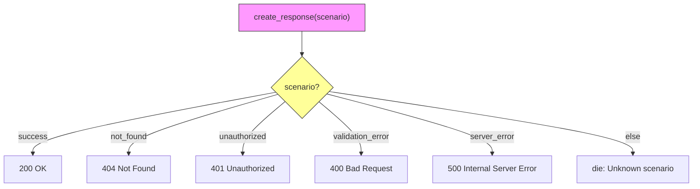

[@nqounet](https://x.com/nqounet)です。

前回は成功レスポンスだけを返すシンプルなAPIシミュレーターを作りました。しかし実際のAPI開発では、エラーレスポンスも必要です。今回は「エラーも返したい！」という要求に対応しながら、コードがどのように複雑化していくかを体験します。

## このシリーズについて

シリーズ全体の目次は以下をご覧ください。



## 前回の振り返り



前回は、`Response`クラスと`MockApi`クラスを作成し、成功レスポンスを返せるようになりました。

```perl
sub create_response($self) {
    return Response->new(
        status => '200 OK',
        body   => {
            success => JSON::true,
            message => 'リクエストが正常に処理されました',
            # ...
        },
    );
}
```

## 今回のゴール

成功と失敗、両方のレスポンスを返せるようにします。ただし、その過程でコードがどれだけ複雑になるかに注目してください。



## シナリオ引数を追加する

まず、どのレスポンスを返すかを指定できるように、`send_request`メソッドにシナリオ引数を追加しましょう。

```perl
#!/usr/bin/env perl
# 言語: perl
# バージョン: 5.36以上
# 依存: Moo, JSON（cpanmでインストール）

use v5.36;

package Response {
    use Moo;
    use JSON qw(encode_json);

    has status => (
        is       => 'ro',
        required => 1,
    );

    has content_type => (
        is      => 'ro',
        default => sub { 'application/json' },
    );

    has body => (
        is       => 'ro',
        required => 1,
    );

    sub render($self) {
        my $json_body = encode_json($self->body);
        return sprintf(
            "HTTP/1.1 %s\nContent-Type: %s\n\n%s",
            $self->status,
            $self->content_type,
            $json_body,
        );
    }
}

package MockApi {
    use Moo;

    sub create_response($self, $scenario) {
        if ($scenario eq 'success') {
            return Response->new(
                status => '200 OK',
                body   => {
                    success => JSON::true,
                    message => 'リクエストが正常に処理されました',
                    data    => { id => 1, name => 'サンプルアイテム' },
                },
            );
        }
        elsif ($scenario eq 'not_found') {
            return Response->new(
                status => '404 Not Found',
                body   => {
                    success => JSON::false,
                    error   => 'リソースが見つかりません',
                    code    => 'NOT_FOUND',
                },
            );
        }
        else {
            die "Unknown scenario: $scenario";
        }
    }

    sub send_request($self, $scenario = 'success') {
        my $response = $self->create_response($scenario);
        return $response->render;
    }
}

my $api = MockApi->new;
say "=== Success ===";
say $api->send_request('success');
say "";
say "=== Not Found ===";
say $api->send_request('not_found');
```

動きました。しかし、`create_response`メソッドの中にif/elseが登場しています。

## シナリオが増えるとどうなるか

実際のAPIでは、もっと多くのエラーパターンがあります。認証エラー、バリデーションエラー、サーバーエラーなどを追加してみましょう。

```perl
sub create_response($self, $scenario) {
    if ($scenario eq 'success') {
        return Response->new(
            status => '200 OK',
            body   => {
                success => JSON::true,
                message => 'リクエストが正常に処理されました',
                data    => { id => 1, name => 'サンプルアイテム' },
            },
        );
    }
    elsif ($scenario eq 'not_found') {
        return Response->new(
            status => '404 Not Found',
            body   => {
                success => JSON::false,
                error   => 'リソースが見つかりません',
                code    => 'NOT_FOUND',
            },
        );
    }
    elsif ($scenario eq 'unauthorized') {
        return Response->new(
            status => '401 Unauthorized',
            body   => {
                success => JSON::false,
                error   => '認証が必要です',
                code    => 'UNAUTHORIZED',
            },
        );
    }
    elsif ($scenario eq 'validation_error') {
        return Response->new(
            status => '400 Bad Request',
            body   => {
                success => JSON::false,
                error   => '入力データが不正です',
                code    => 'VALIDATION_ERROR',
                details => [
                    { field => 'email', message => 'メールアドレスの形式が正しくありません' },
                ],
            },
        );
    }
    elsif ($scenario eq 'server_error') {
        return Response->new(
            status => '500 Internal Server Error',
            body   => {
                success => JSON::false,
                error   => 'サーバー内部エラーが発生しました',
                code    => 'INTERNAL_ERROR',
            },
        );
    }
    else {
        die "Unknown scenario: $scenario";
    }
}
```

5つのシナリオを追加しただけで、`create_response`メソッドは60行を超えてしまいました。

## この設計の問題点

現在の設計には、いくつかの問題があります:
- 1つのメソッドに全てのシナリオが詰め込まれている
- 新しいシナリオを追加するたびに、既存のコードを修正する必要がある
- シナリオごとのレスポンス生成ロジックが分離されていない
- テストを書くときに、全てのシナリオを1つのメソッドでテストしなければならない

これは「オープン・クローズドの原則」に違反しています。拡張に対しては開いていて、修正に対しては閉じているべきなのに、新しいシナリオを追加するたびに`create_response`を修正しなければなりません。

## 完成コード

今回の完成コード（5シナリオ版）を1ファイルにまとめると、以下のようになります。

```perl
#!/usr/bin/env perl
# 言語: perl
# バージョン: 5.36以上
# 依存: Moo, JSON（cpanmでインストール）

use v5.36;

package Response {
    use Moo;
    use JSON qw(encode_json);

    has status => (
        is       => 'ro',
        required => 1,
    );

    has content_type => (
        is      => 'ro',
        default => sub { 'application/json' },
    );

    has body => (
        is       => 'ro',
        required => 1,
    );

    sub render($self) {
        my $json_body = encode_json($self->body);
        return sprintf(
            "HTTP/1.1 %s\nContent-Type: %s\n\n%s",
            $self->status,
            $self->content_type,
            $json_body,
        );
    }
}

package MockApi {
    use Moo;

    sub create_response($self, $scenario) {
        if ($scenario eq 'success') {
            return Response->new(
                status => '200 OK',
                body   => {
                    success => JSON::true,
                    message => 'リクエストが正常に処理されました',
                    data    => { id => 1, name => 'サンプルアイテム' },
                },
            );
        }
        elsif ($scenario eq 'not_found') {
            return Response->new(
                status => '404 Not Found',
                body   => {
                    success => JSON::false,
                    error   => 'リソースが見つかりません',
                    code    => 'NOT_FOUND',
                },
            );
        }
        elsif ($scenario eq 'unauthorized') {
            return Response->new(
                status => '401 Unauthorized',
                body   => {
                    success => JSON::false,
                    error   => '認証が必要です',
                    code    => 'UNAUTHORIZED',
                },
            );
        }
        elsif ($scenario eq 'validation_error') {
            return Response->new(
                status => '400 Bad Request',
                body   => {
                    success => JSON::false,
                    error   => '入力データが不正です',
                    code    => 'VALIDATION_ERROR',
                    details => [
                        { field => 'email', message => 'メールアドレスの形式が正しくありません' },
                    ],
                },
            );
        }
        elsif ($scenario eq 'server_error') {
            return Response->new(
                status => '500 Internal Server Error',
                body   => {
                    success => JSON::false,
                    error   => 'サーバー内部エラーが発生しました',
                    code    => 'INTERNAL_ERROR',
                },
            );
        }
        else {
            die "Unknown scenario: $scenario";
        }
    }

    sub send_request($self, $scenario = 'success') {
        my $response = $self->create_response($scenario);
        return $response->render;
    }
}

my $api = MockApi->new;
for my $scenario (qw(success not_found unauthorized validation_error server_error)) {
    say "=== $scenario ===";
    say $api->send_request($scenario);
    say "";
}
```

## まとめ

今回は、エラーレスポンスを追加しようとした結果、if/elseの条件分岐が肥大化する問題を体験しました:
- シナリオが増えるほど、`create_response`メソッドが長くなる
- 既存コードを修正しないと新しいシナリオを追加できない
- 責務が1つのメソッドに集中している

次回は、この問題を解決するために継承を使ってシナリオごとの生成クラスに分けていきます。


