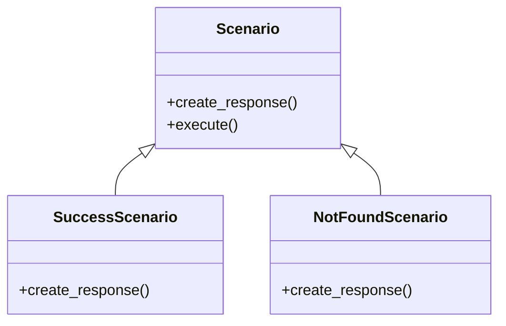

[@nqounet](https://x.com/nqounet)です。

前回は、シナリオが増えるにつれてif/elseが肥大化し、管理が難しくなる問題を体験しました。今回は、継承を使ってシナリオごとにクラスを分けることで、この問題を解決していきます。

## このシリーズについて

シリーズ全体の目次は以下をご覧ください。



## 前回の振り返り



前回の`create_response`メソッドは、こんな状態でした。

```perl
sub create_response($self, $scenario) {
    if ($scenario eq 'success') {
        # 成功レスポンス生成
    }
    elsif ($scenario eq 'not_found') {
        # 404レスポンス生成
    }
    elsif ($scenario eq 'unauthorized') {
        # 401レスポンス生成
    }
    # ... さらに続く
}
```

1つのメソッドに全ての生成ロジックが詰め込まれていました。

## 今回のゴール

シナリオごとに専用のクラスを作り、レスポンス生成の責務を分離します。



## Scenario基底クラスを作る

まず、全てのシナリオに共通する振る舞いを持つ基底クラスを作ります。

```perl
#!/usr/bin/env perl
# 言語: perl
# バージョン: 5.36以上
# 依存: Moo, JSON（cpanmでインストール）

use v5.36;

package Response {
    use Moo;
    use JSON qw(encode_json);

    has status => (
        is       => 'ro',
        required => 1,
    );

    has content_type => (
        is      => 'ro',
        default => sub { 'application/json' },
    );

    has body => (
        is       => 'ro',
        required => 1,
    );

    sub render($self) {
        my $json_body = encode_json($self->body);
        return sprintf(
            "HTTP/1.1 %s\nContent-Type: %s\n\n%s",
            $self->status,
            $self->content_type,
            $json_body,
        );
    }
}

package Scenario {
    use Moo;

    sub create_response($self) {
        die "create_response must be implemented by subclass";
    }

    sub execute($self) {
        my $response = $self->create_response;
        return $response->render;
    }
}
```

`Scenario`基底クラスには2つのメソッドがあります:
- `create_response`: サブクラスで実装する抽象的なメソッド（未実装だとエラー）
- `execute`: レスポンスを生成してレンダリングする共通処理

## SuccessScenarioを作る

成功シナリオ専用のクラスを作りましょう。`Scenario`を継承して`create_response`を実装します。

```perl
package SuccessScenario {
    use Moo;
    extends 'Scenario';

    sub create_response($self) {
        return Response->new(
            status => '200 OK',
            body   => {
                success => JSON::true,
                message => 'リクエストが正常に処理されました',
                data    => { id => 1, name => 'サンプルアイテム' },
            },
        );
    }
}
```

`extends 'Scenario'`で基底クラスを継承し、`create_response`メソッドをオーバーライドしています。

## NotFoundScenarioを作る

同様に、404エラー用のクラスも作ります。

```perl
package NotFoundScenario {
    use Moo;
    extends 'Scenario';

    sub create_response($self) {
        return Response->new(
            status => '404 Not Found',
            body   => {
                success => JSON::false,
                error   => 'リソースが見つかりません',
                code    => 'NOT_FOUND',
            },
        );
    }
}
```

各シナリオクラスは、自分自身のレスポンス生成ロジックだけを持っています。他のシナリオのことは知りません。

## 使ってみる

作成したシナリオクラスを使ってみましょう。

```perl
my $success = SuccessScenario->new;
say "=== Success ===";
say $success->execute;
say "";

my $not_found = NotFoundScenario->new;
say "=== Not Found ===";
say $not_found->execute;
```

実行結果:

```text
=== Success ===
HTTP/1.1 200 OK
Content-Type: application/json

{"data":{"id":1,"name":"サンプルアイテム"},"message":"リクエストが正常に処理されました","success":true}

=== Not Found ===
HTTP/1.1 404 Not Found
Content-Type: application/json

{"code":"NOT_FOUND","error":"リソースが見つかりません","success":false}
```

## この設計の利点

クラスを分けたことで、いくつかの利点が得られました:
- 各シナリオのロジックが独立している
- 新しいシナリオを追加しても、既存のクラスを修正する必要がない
- テストをシナリオごとに分けて書ける
- コードの見通しが良くなった

## 完成コード

今回の完成コードを1ファイルにまとめると、以下のようになります。

```perl
#!/usr/bin/env perl
# 言語: perl
# バージョン: 5.36以上
# 依存: Moo, JSON（cpanmでインストール）

use v5.36;

package Response {
    use Moo;
    use JSON qw(encode_json);

    has status => (
        is       => 'ro',
        required => 1,
    );

    has content_type => (
        is      => 'ro',
        default => sub { 'application/json' },
    );

    has body => (
        is       => 'ro',
        required => 1,
    );

    sub render($self) {
        my $json_body = encode_json($self->body);
        return sprintf(
            "HTTP/1.1 %s\nContent-Type: %s\n\n%s",
            $self->status,
            $self->content_type,
            $json_body,
        );
    }
}

package Scenario {
    use Moo;

    sub create_response($self) {
        die "create_response must be implemented by subclass";
    }

    sub execute($self) {
        my $response = $self->create_response;
        return $response->render;
    }
}

package SuccessScenario {
    use Moo;
    extends 'Scenario';

    sub create_response($self) {
        return Response->new(
            status => '200 OK',
            body   => {
                success => JSON::true,
                message => 'リクエストが正常に処理されました',
                data    => { id => 1, name => 'サンプルアイテム' },
            },
        );
    }
}

package NotFoundScenario {
    use Moo;
    extends 'Scenario';

    sub create_response($self) {
        return Response->new(
            status => '404 Not Found',
            body   => {
                success => JSON::false,
                error   => 'リソースが見つかりません',
                code    => 'NOT_FOUND',
            },
        );
    }
}

my $success = SuccessScenario->new;
say "=== Success ===";
say $success->execute;
say "";

my $not_found = NotFoundScenario->new;
say "=== Not Found ===";
say $not_found->execute;
```

## まとめ

今回は、継承を使ってシナリオごとのクラスに分けました:
- `Scenario`基底クラス: 共通の`execute`メソッドを持つ
- `SuccessScenario`/`NotFoundScenario`: 各シナリオ専用の`create_response`を実装

しかし、現状ではResponseクラスに共通のルールがありません。次回は、Roleを使ってResponseが必ず持つべきインターフェースを定義します。


