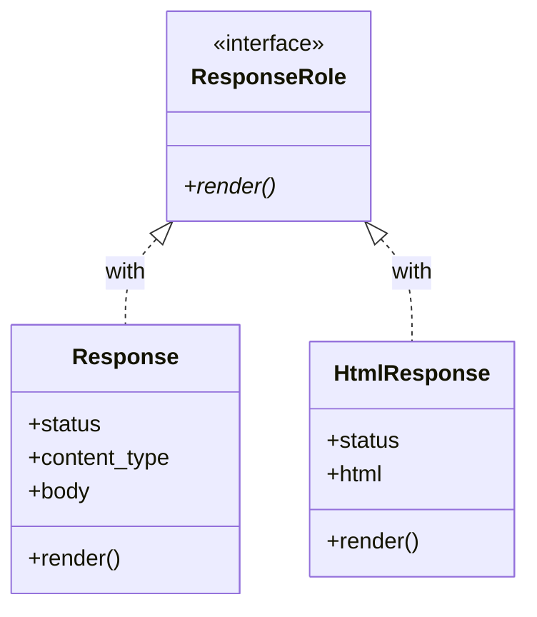

[@nqounet](https://x.com/nqounet)です。

前回は、継承を使ってシナリオごとにクラスを分けました。今回は、Moo::Roleを使ってレスポンスクラスに共通のインターフェースを定義します。

## このシリーズについて

シリーズ全体の目次は以下をご覧ください。



## 前回の振り返り



前回は、`Scenario`基底クラスと、それを継承する`SuccessScenario`、`NotFoundScenario`を作りました。

```perl
package Scenario {
    use Moo;

    sub create_response($self) {
        die "create_response must be implemented by subclass";
    }

    sub execute($self) {
        my $response = $self->create_response;
        return $response->render;
    }
}
```

`execute`メソッドは、`create_response`が返すオブジェクトに`render`メソッドがあることを期待しています。

## 今回のゴール

`render`メソッドを必須にするRoleを定義し、レスポンスクラスに適用します。



## なぜRoleが必要か

現状では、`create_response`が返すオブジェクトに`render`メソッドがあるかどうかは、実行時まで分かりません。もし誰かが`render`メソッドを持たないオブジェクトを返したら、実行時エラーになります。

Roleを使うと、クラスに「このメソッドを必ず持つこと」というルールを強制できます。

## ResponseRoleを定義する

`render`メソッドを必須にするRoleを作りましょう。

```perl
#!/usr/bin/env perl
# 言語: perl
# バージョン: 5.36以上
# 依存: Moo, JSON（cpanmでインストール）

use v5.36;

package ResponseRole {
    use Moo::Role;

    requires 'render';
}
```

`requires 'render'`は、「このRoleを適用するクラスは`render`メソッドを持っていなければならない」という宣言です。

## ResponseクラスにRoleを適用する

ResponseクラスにResponseRoleを適用します。

```perl
package Response {
    use Moo;
    use JSON qw(encode_json);
    with 'ResponseRole';

    has status => (
        is       => 'ro',
        required => 1,
    );

    has content_type => (
        is      => 'ro',
        default => sub { 'application/json' },
    );

    has body => (
        is       => 'ro',
        required => 1,
    );

    sub render($self) {
        my $json_body = encode_json($self->body);
        return sprintf(
            "HTTP/1.1 %s\nContent-Type: %s\n\n%s",
            $self->status,
            $self->content_type,
            $json_body,
        );
    }
}
```

`with 'ResponseRole'`でRoleを適用しています。Responseクラスは`render`メソッドを持っているので、問題なくコンパイルできます。

## Roleの効果を確認する

試しに、`render`メソッドを持たないクラスにResponseRoleを適用してみましょう。

```perl
package BrokenResponse {
    use Moo;
    with 'ResponseRole';
    # render メソッドがない！
}
```

このコードを実行すると、以下のようなエラーが発生します。

```text
Can't apply ResponseRole to BrokenResponse - missing render
```

Roleのおかげで、必要なメソッドが実装されていないことをすぐに検出できます。

## 別のResponseを作ってみる

Roleがあれば、異なる形式のレスポンスも作れます。例えば、HTMLレスポンス用のクラスを作ってみましょう。

```perl
package HtmlResponse {
    use Moo;
    with 'ResponseRole';

    has status => (
        is       => 'ro',
        required => 1,
    );

    has html => (
        is       => 'ro',
        required => 1,
    );

    sub render($self) {
        return sprintf(
            "HTTP/1.1 %s\nContent-Type: text/html\n\n%s",
            $self->status,
            $self->html,
        );
    }
}
```

HtmlResponseも`render`メソッドを持っているので、ResponseRoleを適用できます。そして、Scenarioクラスから使うことができます。

## 完成コード

今回の完成コードを1ファイルにまとめると、以下のようになります。

```perl
#!/usr/bin/env perl
# 言語: perl
# バージョン: 5.36以上
# 依存: Moo, JSON（cpanmでインストール）

use v5.36;

package ResponseRole {
    use Moo::Role;

    requires 'render';
}

package Response {
    use Moo;
    use JSON qw(encode_json);
    with 'ResponseRole';

    has status => (
        is       => 'ro',
        required => 1,
    );

    has content_type => (
        is      => 'ro',
        default => sub { 'application/json' },
    );

    has body => (
        is       => 'ro',
        required => 1,
    );

    sub render($self) {
        my $json_body = encode_json($self->body);
        return sprintf(
            "HTTP/1.1 %s\nContent-Type: %s\n\n%s",
            $self->status,
            $self->content_type,
            $json_body,
        );
    }
}

package Scenario {
    use Moo;

    sub create_response($self) {
        die "create_response must be implemented by subclass";
    }

    sub execute($self) {
        my $response = $self->create_response;
        return $response->render;
    }
}

package SuccessScenario {
    use Moo;
    extends 'Scenario';

    sub create_response($self) {
        return Response->new(
            status => '200 OK',
            body   => {
                success => JSON::true,
                message => 'リクエストが正常に処理されました',
                data    => { id => 1, name => 'サンプルアイテム' },
            },
        );
    }
}

package NotFoundScenario {
    use Moo;
    extends 'Scenario';

    sub create_response($self) {
        return Response->new(
            status => '404 Not Found',
            body   => {
                success => JSON::false,
                error   => 'リソースが見つかりません',
                code    => 'NOT_FOUND',
            },
        );
    }
}

my $success = SuccessScenario->new;
say "=== Success ===";
say $success->execute;
say "";

my $not_found = NotFoundScenario->new;
say "=== Not Found ===";
say $not_found->execute;
```

## まとめ

今回は、Moo::Roleを使ってレスポンスの共通インターフェースを定義しました:
- `ResponseRole`: `render`メソッドを必須にするRole
- `with 'ResponseRole'`でクラスにRoleを適用
- Roleは「契約」として機能し、必要なメソッドの実装を保証する

次回は、実際に`create_response`をオーバーライドして、シナリオごとに異なるレスポンスを生成する仕組みを詳しく見ていきます。


