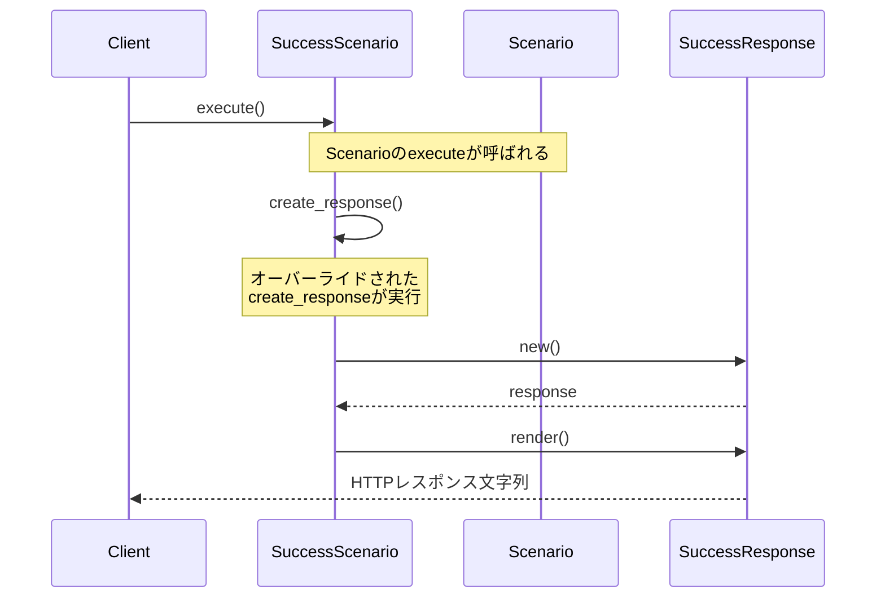

[@nqounet](https://x.com/nqounet)です。

前回は、Moo::Roleを使ってレスポンスの共通インターフェースを定義しました。今回は、シナリオごとに異なるレスポンスを生成する仕組み、つまり「生成処理のオーバーライド」を詳しく見ていきます。

## このシリーズについて

シリーズ全体の目次は以下をご覧ください。



## 前回の振り返り



前回までに、以下の構造ができあがりました:
- `ResponseRole`: `render`メソッドを必須にするRole
- `Response`: JSONレスポンスを生成するクラス
- `Scenario`: 基底クラス、`create_response`と`execute`を持つ
- `SuccessScenario`/`NotFoundScenario`: 各シナリオの実装

## 今回のゴール

「オーバーライド」という概念を深く理解し、より多くのシナリオを追加してパターンを体感します。



## オーバーライドとは

オーバーライドとは、親クラスのメソッドを子クラスで再定義することです。Perlでは、同じ名前のメソッドを子クラスに定義するだけで自然にオーバーライドされます。

```perl
package Parent {
    use Moo;
    
    sub greet($self) {
        return "Hello from Parent";
    }
}

package Child {
    use Moo;
    extends 'Parent';
    
    # greet をオーバーライド
    sub greet($self) {
        return "Hello from Child";
    }
}

my $parent = Parent->new;
my $child  = Child->new;

say $parent->greet;  # Hello from Parent
say $child->greet;   # Hello from Child
```

## create_responseのオーバーライド

私たちの設計では、`Scenario`基底クラスの`create_response`を各サブクラスでオーバーライドしています。

```perl
#!/usr/bin/env perl
# 言語: perl
# バージョン: 5.36以上
# 依存: Moo, JSON（cpanmでインストール）

use v5.36;

package ResponseRole {
    use Moo::Role;
    requires 'render';
}

package Response {
    use Moo;
    use JSON qw(encode_json);
    with 'ResponseRole';

    has status       => (is => 'ro', required => 1);
    has content_type => (is => 'ro', default => sub { 'application/json' });
    has body         => (is => 'ro', required => 1);

    sub render($self) {
        my $json_body = encode_json($self->body);
        return sprintf(
            "HTTP/1.1 %s\nContent-Type: %s\n\n%s",
            $self->status, $self->content_type, $json_body,
        );
    }
}

package Scenario {
    use Moo;

    sub create_response($self) {
        die "create_response must be implemented by subclass";
    }

    sub execute($self) {
        my $response = $self->create_response;
        return $response->render;
    }
}
```

基底クラスの`create_response`は、呼び出されるとエラーを投げます。これは「サブクラスで必ず実装してね」というメッセージです。

## SuccessResponseクラスを作る

レスポンスの種類ごとにクラスを分けることで、より明確な設計になります。

```perl
package SuccessResponse {
    use Moo;
    use JSON qw(encode_json);
    with 'ResponseRole';

    has data => (is => 'ro', required => 1);

    sub render($self) {
        my $body = encode_json({
            success => JSON::true,
            message => 'リクエストが正常に処理されました',
            data    => $self->data,
        });
        return "HTTP/1.1 200 OK\nContent-Type: application/json\n\n$body";
    }
}

package SuccessScenario {
    use Moo;
    extends 'Scenario';

    sub create_response($self) {
        return SuccessResponse->new(
            data => { id => 1, name => 'サンプルアイテム' },
        );
    }
}
```

`SuccessScenario`は`SuccessResponse`を生成する責務を持ちます。

## ErrorResponseクラスを作る

エラー系のレスポンスも専用クラスにしましょう。

```perl
package ErrorResponse {
    use Moo;
    use JSON qw(encode_json);
    with 'ResponseRole';

    has status     => (is => 'ro', required => 1);
    has error_code => (is => 'ro', required => 1);
    has message    => (is => 'ro', required => 1);

    sub render($self) {
        my $body = encode_json({
            success => JSON::false,
            error   => $self->message,
            code    => $self->error_code,
        });
        return sprintf(
            "HTTP/1.1 %s\nContent-Type: application/json\n\n%s",
            $self->status, $body,
        );
    }
}

package NotFoundScenario {
    use Moo;
    extends 'Scenario';

    sub create_response($self) {
        return ErrorResponse->new(
            status     => '404 Not Found',
            error_code => 'NOT_FOUND',
            message    => 'リソースが見つかりません',
        );
    }
}

package UnauthorizedScenario {
    use Moo;
    extends 'Scenario';

    sub create_response($self) {
        return ErrorResponse->new(
            status     => '401 Unauthorized',
            error_code => 'UNAUTHORIZED',
            message    => '認証が必要です',
        );
    }
}
```

`NotFoundScenario`と`UnauthorizedScenario`は、同じ`ErrorResponse`クラスを使いますが、異なるパラメータで生成します。

## 実行してみる

作成したシナリオを実行してみましょう。

```perl
for my $scenario_class (qw(
    SuccessScenario
    NotFoundScenario
    UnauthorizedScenario
)) {
    say "=== $scenario_class ===";
    my $scenario = $scenario_class->new;
    say $scenario->execute;
    say "";
}
```

## 完成コード

今回の完成コードを1ファイルにまとめると、以下のようになります。

```perl
#!/usr/bin/env perl
# 言語: perl
# バージョン: 5.36以上
# 依存: Moo, JSON（cpanmでインストール）

use v5.36;

package ResponseRole {
    use Moo::Role;
    requires 'render';
}

package SuccessResponse {
    use Moo;
    use JSON qw(encode_json);
    with 'ResponseRole';

    has data => (is => 'ro', required => 1);

    sub render($self) {
        my $body = encode_json({
            success => JSON::true,
            message => 'リクエストが正常に処理されました',
            data    => $self->data,
        });
        return "HTTP/1.1 200 OK\nContent-Type: application/json\n\n$body";
    }
}

package ErrorResponse {
    use Moo;
    use JSON qw(encode_json);
    with 'ResponseRole';

    has status     => (is => 'ro', required => 1);
    has error_code => (is => 'ro', required => 1);
    has message    => (is => 'ro', required => 1);

    sub render($self) {
        my $body = encode_json({
            success => JSON::false,
            error   => $self->message,
            code    => $self->error_code,
        });
        return sprintf(
            "HTTP/1.1 %s\nContent-Type: application/json\n\n%s",
            $self->status, $body,
        );
    }
}

package Scenario {
    use Moo;

    sub create_response($self) {
        die "create_response must be implemented by subclass";
    }

    sub execute($self) {
        my $response = $self->create_response;
        return $response->render;
    }
}

package SuccessScenario {
    use Moo;
    extends 'Scenario';

    sub create_response($self) {
        return SuccessResponse->new(
            data => { id => 1, name => 'サンプルアイテム' },
        );
    }
}

package NotFoundScenario {
    use Moo;
    extends 'Scenario';

    sub create_response($self) {
        return ErrorResponse->new(
            status     => '404 Not Found',
            error_code => 'NOT_FOUND',
            message    => 'リソースが見つかりません',
        );
    }
}

package UnauthorizedScenario {
    use Moo;
    extends 'Scenario';

    sub create_response($self) {
        return ErrorResponse->new(
            status     => '401 Unauthorized',
            error_code => 'UNAUTHORIZED',
            message    => '認証が必要です',
        );
    }
}

for my $scenario_class (qw(
    SuccessScenario
    NotFoundScenario
    UnauthorizedScenario
)) {
    say "=== $scenario_class ===";
    my $scenario = $scenario_class->new;
    say $scenario->execute;
    say "";
}
```

## まとめ

今回は、生成処理のオーバーライドを実装しました:
- 基底クラスの`create_response`をサブクラスでオーバーライド
- レスポンスの種類ごとに`SuccessResponse`、`ErrorResponse`を定義
- 各シナリオが専用のレスポンスを生成する責務を持つ

次回は、共通の送信フローを基底クラスに集約して、コードの重複を減らします。


