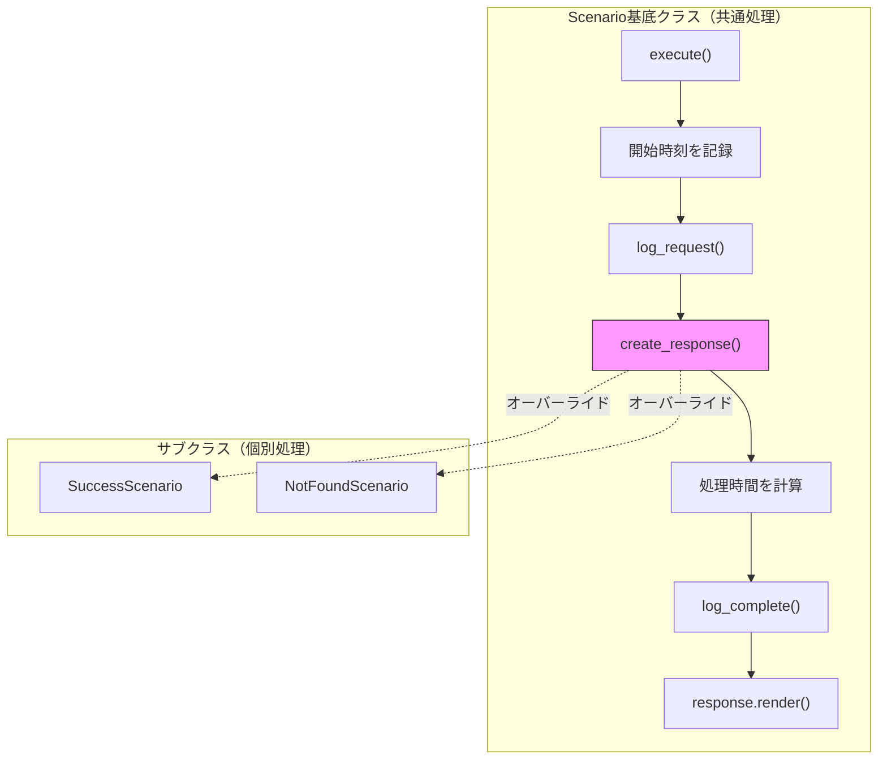

[@nqounet](https://x.com/nqounet)です。

前回は、生成処理のオーバーライドを実装しました。今回は、送信処理やログ出力など、全シナリオで共通する処理を基底クラスに集約します。

## このシリーズについて

シリーズ全体の目次は以下をご覧ください。



## 前回の振り返り



前回までに、各シナリオが`create_response`をオーバーライドして専用のレスポンスを生成するようになりました。

```perl
package SuccessScenario {
    use Moo;
    extends 'Scenario';

    sub create_response($self) {
        return SuccessResponse->new(
            data => { id => 1, name => 'サンプルアイテム' },
        );
    }
}
```

## 今回のゴール

共通処理（ログ出力、タイムスタンプ追加など）を基底クラスに集約し、サブクラスでは「レスポンス生成」だけに集中できるようにします。



## 現状の問題

現在の`execute`メソッドは非常にシンプルです。

```perl
sub execute($self) {
    my $response = $self->create_response;
    return $response->render;
}
```

しかし実際のAPIシミュレーターでは、以下のような処理も必要になるでしょう:
- リクエストのログ出力
- 処理時間の記録
- タイムスタンプの追加

これらの処理を各サブクラスに書くと、コードが重複してしまいます。

## 共通処理を基底クラスに追加する

`Scenario`基底クラスに共通処理を追加しましょう。

```perl
#!/usr/bin/env perl
# 言語: perl
# バージョン: 5.36以上
# 依存: Moo, JSON, Time::HiRes（cpanmでインストール）

use v5.36;

package ResponseRole {
    use Moo::Role;
    requires 'render';
}

package SuccessResponse {
    use Moo;
    use JSON qw(encode_json);
    with 'ResponseRole';

    has data => (is => 'ro', required => 1);

    sub render($self) {
        my $body = encode_json({
            success => JSON::true,
            message => 'リクエストが正常に処理されました',
            data    => $self->data,
        });
        return "HTTP/1.1 200 OK\nContent-Type: application/json\n\n$body";
    }
}

package ErrorResponse {
    use Moo;
    use JSON qw(encode_json);
    with 'ResponseRole';

    has status     => (is => 'ro', required => 1);
    has error_code => (is => 'ro', required => 1);
    has message    => (is => 'ro', required => 1);

    sub render($self) {
        my $body = encode_json({
            success => JSON::false,
            error   => $self->message,
            code    => $self->error_code,
        });
        return sprintf(
            "HTTP/1.1 %s\nContent-Type: application/json\n\n%s",
            $self->status, $body,
        );
    }
}

package Scenario {
    use Moo;
    use Time::HiRes qw(gettimeofday tv_interval);

    sub create_response($self) {
        die "create_response must be implemented by subclass";
    }

    sub scenario_name($self) {
        my $class = ref($self);
        $class =~ s/Scenario$//;
        return $class;
    }

    sub log_request($self) {
        my $name = $self->scenario_name;
        my $timestamp = localtime();
        say STDERR "[$timestamp] Processing: $name";
    }

    sub log_complete($self, $elapsed) {
        my $name = $self->scenario_name;
        my $timestamp = localtime();
        say STDERR "[$timestamp] Completed: $name (${elapsed}ms)";
    }

    sub execute($self) {
        my $start = [gettimeofday];
        
        # リクエストログ
        $self->log_request;
        
        # レスポンス生成
        my $response = $self->create_response;
        
        # 処理時間計算
        my $elapsed = int(tv_interval($start) * 1000);
        
        # 完了ログ
        $self->log_complete($elapsed);
        
        return $response->render;
    }
}
```

`execute`メソッドは以下の流れになりました:
1. 開始時刻を記録
2. リクエストログを出力
3. レスポンスを生成（サブクラスの`create_response`を呼ぶ）
4. 処理時間を計算
5. 完了ログを出力
6. レスポンスを返す

## サブクラスはシンプルなまま

共通処理は基底クラスにあるので、サブクラスはレスポンス生成だけに集中できます。

```perl
package SuccessScenario {
    use Moo;
    extends 'Scenario';

    sub create_response($self) {
        return SuccessResponse->new(
            data => { id => 1, name => 'サンプルアイテム' },
        );
    }
}

package NotFoundScenario {
    use Moo;
    extends 'Scenario';

    sub create_response($self) {
        return ErrorResponse->new(
            status     => '404 Not Found',
            error_code => 'NOT_FOUND',
            message    => 'リソースが見つかりません',
        );
    }
}
```

サブクラスは何も変わっていません。共通処理を意識する必要がありません。

## 実行ログの例

```text
[Sat Jan 17 13:23:20 2026] Processing: Success
[Sat Jan 17 13:23:20 2026] Completed: Success (0ms)
HTTP/1.1 200 OK
Content-Type: application/json

{"data":{"id":1,"name":"サンプルアイテム"},"message":"リクエストが正常に処理されました","success":true}
```

ログが自動的に出力されるようになりました。

## 完成コード

今回の完成コードを1ファイルにまとめると、以下のようになります。

```perl
#!/usr/bin/env perl
# 言語: perl
# バージョン: 5.36以上
# 依存: Moo, JSON, Time::HiRes（cpanmでインストール）

use v5.36;

package ResponseRole {
    use Moo::Role;
    requires 'render';
}

package SuccessResponse {
    use Moo;
    use JSON qw(encode_json);
    with 'ResponseRole';

    has data => (is => 'ro', required => 1);

    sub render($self) {
        my $body = encode_json({
            success => JSON::true,
            message => 'リクエストが正常に処理されました',
            data    => $self->data,
        });
        return "HTTP/1.1 200 OK\nContent-Type: application/json\n\n$body";
    }
}

package ErrorResponse {
    use Moo;
    use JSON qw(encode_json);
    with 'ResponseRole';

    has status     => (is => 'ro', required => 1);
    has error_code => (is => 'ro', required => 1);
    has message    => (is => 'ro', required => 1);

    sub render($self) {
        my $body = encode_json({
            success => JSON::false,
            error   => $self->message,
            code    => $self->error_code,
        });
        return sprintf(
            "HTTP/1.1 %s\nContent-Type: %s\n\n%s",
            $self->status,
            'application/json',
            $body,
        );
    }
}

package Scenario {
    use Moo;
    use Time::HiRes qw(gettimeofday tv_interval);

    sub create_response($self) {
        die "create_response must be implemented by subclass";
    }

    sub scenario_name($self) {
        my $class = ref($self);
        $class =~ s/Scenario$//;
        return $class;
    }

    sub log_request($self) {
        my $name = $self->scenario_name;
        my $timestamp = localtime();
        say STDERR "[$timestamp] Processing: $name";
    }

    sub log_complete($self, $elapsed) {
        my $name = $self->scenario_name;
        my $timestamp = localtime();
        say STDERR "[$timestamp] Completed: $name (${elapsed}ms)";
    }

    sub execute($self) {
        my $start = [gettimeofday];
        $self->log_request;
        my $response = $self->create_response;
        my $elapsed = int(tv_interval($start) * 1000);
        $self->log_complete($elapsed);
        return $response->render;
    }
}

package SuccessScenario {
    use Moo;
    extends 'Scenario';

    sub create_response($self) {
        return SuccessResponse->new(
            data => { id => 1, name => 'サンプルアイテム' },
        );
    }
}

package NotFoundScenario {
    use Moo;
    extends 'Scenario';

    sub create_response($self) {
        return ErrorResponse->new(
            status     => '404 Not Found',
            error_code => 'NOT_FOUND',
            message    => 'リソースが見つかりません',
        );
    }
}

for my $scenario_class (qw(SuccessScenario NotFoundScenario)) {
    say "=== $scenario_class ===";
    my $scenario = $scenario_class->new;
    say $scenario->execute;
    say "";
}
```

## まとめ

今回は、共通処理を基底クラスに集約しました:
- ログ出力、処理時間計測を`Scenario`基底クラスに追加
- サブクラスは`create_response`の実装だけに集中
- 共通処理の変更が1箇所で済むようになった

次回は、新しいシナリオ「レート制限」を追加して、既存コードを修正せずに拡張できることを体験します。


