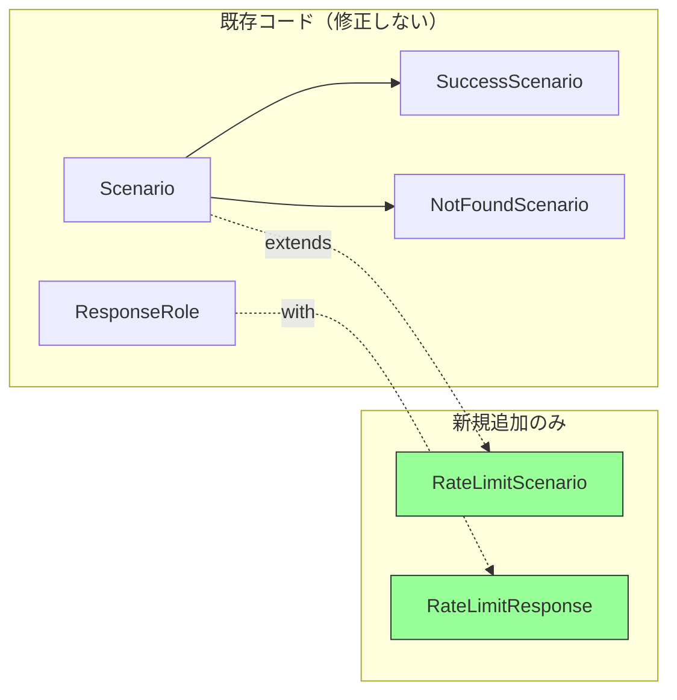

[@nqounet](https://x.com/nqounet)です。

前回は、共通処理を基底クラスに集約しました。今回は、新しいシナリオ「レート制限」を追加して、既存コードを修正せずに拡張できることを体験します。

## このシリーズについて

シリーズ全体の目次は以下をご覧ください。



## 前回の振り返り



前回までに、以下の構造ができあがりました:
- `Scenario`基底クラス: 共通の`execute`メソッド（ログ出力、処理時間計測を含む）
- 各サブクラス: `create_response`をオーバーライドして専用のレスポンスを生成

## 今回のゴール

APIのレート制限（429 Too Many Requests）シナリオを追加します。重要なのは、既存のコードを一切変更しないことです。



## オープン・クローズドの原則（OCP）

「拡張に対しては開いていて、修正に対しては閉じている」

この原則は、新しい機能を追加するときに既存のコードを変更してはいけない、という考え方です。私たちの設計がこの原則に従っているか確認してみましょう。

## RateLimitResponseを作る

まず、レート制限用のレスポンスクラスを作ります。

```perl
#!/usr/bin/env perl
# 言語: perl
# バージョン: 5.36以上
# 依存: Moo, JSON（cpanmでインストール）

use v5.36;

# ... （既存のパッケージ定義は省略）

package RateLimitResponse {
    use Moo;
    use JSON qw(encode_json);
    with 'ResponseRole';

    has retry_after => (is => 'ro', default => sub { 60 });

    sub render($self) {
        my $body = encode_json({
            success     => JSON::false,
            error       => 'リクエスト数が上限を超えました',
            code        => 'RATE_LIMIT_EXCEEDED',
            retry_after => $self->retry_after,
        });
        return sprintf(
            "HTTP/1.1 429 Too Many Requests\nContent-Type: application/json\nRetry-After: %d\n\n%s",
            $self->retry_after,
            $body,
        );
    }
}
```

`RateLimitResponse`は`Retry-After`ヘッダーを含むレスポンスを生成します。

## RateLimitScenarioを作る

次に、このレスポンスを生成するシナリオクラスを作ります。

```perl
package RateLimitScenario {
    use Moo;
    extends 'Scenario';

    has retry_after => (is => 'ro', default => sub { 60 });

    sub create_response($self) {
        return RateLimitResponse->new(
            retry_after => $self->retry_after,
        );
    }
}
```

たったこれだけです。既存のクラスは一切変更していません。

## 使ってみる

```perl
my $rate_limit = RateLimitScenario->new(retry_after => 30);
say $rate_limit->execute;
```

実行結果:

```text
[Sat Jan 17 13:23:37 2026] Processing: RateLimit
[Sat Jan 17 13:23:37 2026] Completed: RateLimit (0ms)
HTTP/1.1 429 Too Many Requests
Content-Type: application/json
Retry-After: 30

{"code":"RATE_LIMIT_EXCEEDED","error":"リクエスト数が上限を超えました","retry_after":30,"success":false}
```

ログ出力や処理時間計測も自動的に適用されています。基底クラスの共通処理が効いていますね。

## OCPの確認

新しいシナリオを追加するために行ったことを振り返りましょう:
- `RateLimitResponse`クラスを新規作成
- `RateLimitScenario`クラスを新規作成

行わなかったこと:
- 既存のクラスの修正
- if/elseの追加
- 基底クラスの変更

これがオープン・クローズドの原則です。拡張（新しいシナリオの追加）に対しては開いていて、修正（既存コードの変更）に対しては閉じています。

## さらにシナリオを追加してみる

勢いに乗って、サーバーエラーシナリオも追加してみましょう。

```perl
package ServerErrorResponse {
    use Moo;
    use JSON qw(encode_json);
    with 'ResponseRole';

    has error_id => (is => 'ro', required => 1);

    sub render($self) {
        my $body = encode_json({
            success  => JSON::false,
            error    => 'サーバー内部エラーが発生しました',
            code     => 'INTERNAL_ERROR',
            error_id => $self->error_id,
        });
        return "HTTP/1.1 500 Internal Server Error\nContent-Type: application/json\n\n$body";
    }
}

package ServerErrorScenario {
    use Moo;
    extends 'Scenario';

    sub create_response($self) {
        my $error_id = sprintf("ERR-%06d", int(rand(1000000)));
        return ServerErrorResponse->new(error_id => $error_id);
    }
}
```

やはり既存コードは一切変更していません。

## 完成コード

今回の完成コードを1ファイルにまとめると、以下のようになります。

```perl
#!/usr/bin/env perl
# 言語: perl
# バージョン: 5.36以上
# 依存: Moo, JSON, Time::HiRes（cpanmでインストール）

use v5.36;

package ResponseRole {
    use Moo::Role;
    requires 'render';
}

package SuccessResponse {
    use Moo;
    use JSON qw(encode_json);
    with 'ResponseRole';

    has data => (is => 'ro', required => 1);

    sub render($self) {
        my $body = encode_json({
            success => JSON::true,
            message => 'リクエストが正常に処理されました',
            data    => $self->data,
        });
        return "HTTP/1.1 200 OK\nContent-Type: application/json\n\n$body";
    }
}

package ErrorResponse {
    use Moo;
    use JSON qw(encode_json);
    with 'ResponseRole';

    has status     => (is => 'ro', required => 1);
    has error_code => (is => 'ro', required => 1);
    has message    => (is => 'ro', required => 1);

    sub render($self) {
        my $body = encode_json({
            success => JSON::false,
            error   => $self->message,
            code    => $self->error_code,
        });
        return sprintf(
            "HTTP/1.1 %s\nContent-Type: application/json\n\n%s",
            $self->status, $body,
        );
    }
}

package RateLimitResponse {
    use Moo;
    use JSON qw(encode_json);
    with 'ResponseRole';

    has retry_after => (is => 'ro', default => sub { 60 });

    sub render($self) {
        my $body = encode_json({
            success     => JSON::false,
            error       => 'リクエスト数が上限を超えました',
            code        => 'RATE_LIMIT_EXCEEDED',
            retry_after => $self->retry_after,
        });
        return sprintf(
            "HTTP/1.1 429 Too Many Requests\nContent-Type: application/json\nRetry-After: %d\n\n%s",
            $self->retry_after, $body,
        );
    }
}

package ServerErrorResponse {
    use Moo;
    use JSON qw(encode_json);
    with 'ResponseRole';

    has error_id => (is => 'ro', required => 1);

    sub render($self) {
        my $body = encode_json({
            success  => JSON::false,
            error    => 'サーバー内部エラーが発生しました',
            code     => 'INTERNAL_ERROR',
            error_id => $self->error_id,
        });
        return "HTTP/1.1 500 Internal Server Error\nContent-Type: application/json\n\n$body";
    }
}

package Scenario {
    use Moo;
    use Time::HiRes qw(gettimeofday tv_interval);

    sub create_response($self) {
        die "create_response must be implemented by subclass";
    }

    sub scenario_name($self) {
        my $class = ref($self);
        $class =~ s/Scenario$//;
        return $class;
    }

    sub log_request($self) {
        my $name = $self->scenario_name;
        my $timestamp = localtime();
        say STDERR "[$timestamp] Processing: $name";
    }

    sub log_complete($self, $elapsed) {
        my $name = $self->scenario_name;
        my $timestamp = localtime();
        say STDERR "[$timestamp] Completed: $name (${elapsed}ms)";
    }

    sub execute($self) {
        my $start = [gettimeofday];
        $self->log_request;
        my $response = $self->create_response;
        my $elapsed = int(tv_interval($start) * 1000);
        $self->log_complete($elapsed);
        return $response->render;
    }
}

package SuccessScenario {
    use Moo;
    extends 'Scenario';

    sub create_response($self) {
        return SuccessResponse->new(
            data => { id => 1, name => 'サンプルアイテム' },
        );
    }
}

package NotFoundScenario {
    use Moo;
    extends 'Scenario';

    sub create_response($self) {
        return ErrorResponse->new(
            status     => '404 Not Found',
            error_code => 'NOT_FOUND',
            message    => 'リソースが見つかりません',
        );
    }
}

package RateLimitScenario {
    use Moo;
    extends 'Scenario';

    has retry_after => (is => 'ro', default => sub { 60 });

    sub create_response($self) {
        return RateLimitResponse->new(
            retry_after => $self->retry_after,
        );
    }
}

package ServerErrorScenario {
    use Moo;
    extends 'Scenario';

    sub create_response($self) {
        my $error_id = sprintf("ERR-%06d", int(rand(1000000)));
        return ServerErrorResponse->new(error_id => $error_id);
    }
}

for my $scenario_class (qw(
    SuccessScenario
    NotFoundScenario
    RateLimitScenario
    ServerErrorScenario
)) {
    say "=== $scenario_class ===";
    my $scenario = $scenario_class->new;
    say $scenario->execute;
    say "";
}
```

## まとめ

今回は、レート制限シナリオを追加してOCPを体験しました:
- 新しいクラスを追加するだけで機能拡張が可能
- 既存のコードは一切修正しない
- 基底クラスの共通処理が自動的に適用される

次回はいよいよ最終回。この設計がFactory Methodパターンであることを明かし、全体を振り返ります。


