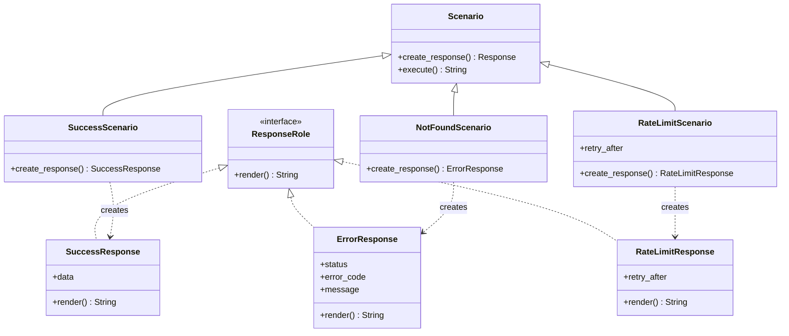

[@nqounet](https://x.com/nqounet)です。

いよいよ最終回です。これまで作ってきたAPIレスポンスシミュレーターの設計が、実は「Factory Methodパターン」というデザインパターンであることを明かします。

## このシリーズについて

シリーズ全体の目次は以下をご覧ください。



## シリーズの振り返り



8回を通じて、以下のように設計を進化させてきました:
1. 第1回: シンプルなMockApiを作る（基底クラスでの生成）
2. 第2回: シナリオが増えてif/elseが肥大化（問題の認識）
3. 第3回: シナリオごとにクラスを分ける（継承によるCreator分離）
4. 第4回: Roleで共通インターフェースを定義（Productインターフェース）
5. 第5回: 生成処理をオーバーライド（Factory Methodのオーバーライド）
6. 第6回: 共通処理を基底クラスに集約（共通処理の集約）
7. 第7回: 新しいシナリオを追加してOCPを体験（オープン・クローズドの原則）

この段階的な設計改善こそが、Factory Methodパターンを自然に習得するための道のりでした。そして今回、この設計パターンに名前がついていることをお伝えします。

## Factory Methodパターンとは

GoF（Gang of Four）のデザインパターンの1つで、以下のように定義されています:

> オブジェクトを生成するためのインターフェースを定義し、どのクラスをインスタンス化するかはサブクラスに決定させる。Factory Methodは、インスタンス化をサブクラスに委ねる。

難しく聞こえますが、私たちが作ったものそのものです。

## 構造の対応関係

Factory Methodパターンの登場人物と、私たちの実装を対応させてみましょう。

| Factory Method用語 | 私たちの実装 | 役割 |
|-------------------|-------------|------|
| Product | ResponseRole | 生成されるオブジェクトのインターフェース |
| ConcreteProduct | SuccessResponse, ErrorResponse, RateLimitResponse | 実際に生成されるオブジェクト |
| Creator | Scenario | factory method（create_response）を宣言する抽象クラス |
| ConcreteCreator | SuccessScenario, NotFoundScenario, RateLimitScenario | factory methodを実装する具象クラス |

## クラス図で確認する



## Factory Methodのメリット

このパターンを使うことで得られるメリットを整理しましょう:
- 生成処理の分離: オブジェクトの生成と使用を分離できる
- 拡張性: 新しい種類のオブジェクトを追加しやすい（OCP）
- 一貫性: 共通処理を基底クラスで保証できる
- テスト容易性: 各Creatorを独立してテストできる

## Factory Methodの適用場面

以下のような場面でFactory Methodが有効です:
- どのクラスを生成するかが実行時まで決まらない
- サブクラスで生成するオブジェクトを決定したい
- 生成処理を局所化して、変更の影響範囲を限定したい

## 完成コード

シリーズ全体の完成コードを1ファイルにまとめると、以下のようになります。

```perl
#!/usr/bin/env perl
# 言語: perl
# バージョン: 5.36以上
# 依存: Moo, JSON, Time::HiRes（cpanmでインストール）
#
# === Factory Methodパターン ===
# Product: ResponseRole
# ConcreteProduct: SuccessResponse, ErrorResponse, RateLimitResponse, ServerErrorResponse
# Creator: Scenario (create_response がfactory method)
# ConcreteCreator: SuccessScenario, NotFoundScenario, RateLimitScenario, ServerErrorScenario

use v5.36;

# ========================================
# Product（インターフェース）
# ========================================
package ResponseRole {
    use Moo::Role;
    requires 'render';
}

# ========================================
# ConcreteProduct（具象クラス群）
# ========================================
package SuccessResponse {
    use Moo;
    use JSON qw(encode_json);
    with 'ResponseRole';

    has data => (is => 'ro', required => 1);

    sub render($self) {
        my $body = encode_json({
            success => JSON::true,
            message => 'リクエストが正常に処理されました',
            data    => $self->data,
        });
        return "HTTP/1.1 200 OK\nContent-Type: application/json\n\n$body";
    }
}

package ErrorResponse {
    use Moo;
    use JSON qw(encode_json);
    with 'ResponseRole';

    has status     => (is => 'ro', required => 1);
    has error_code => (is => 'ro', required => 1);
    has message    => (is => 'ro', required => 1);

    sub render($self) {
        my $body = encode_json({
            success => JSON::false,
            error   => $self->message,
            code    => $self->error_code,
        });
        return sprintf(
            "HTTP/1.1 %s\nContent-Type: application/json\n\n%s",
            $self->status, $body,
        );
    }
}

package RateLimitResponse {
    use Moo;
    use JSON qw(encode_json);
    with 'ResponseRole';

    has retry_after => (is => 'ro', default => sub { 60 });

    sub render($self) {
        my $body = encode_json({
            success     => JSON::false,
            error       => 'リクエスト数が上限を超えました',
            code        => 'RATE_LIMIT_EXCEEDED',
            retry_after => $self->retry_after,
        });
        return sprintf(
            "HTTP/1.1 429 Too Many Requests\nContent-Type: application/json\nRetry-After: %d\n\n%s",
            $self->retry_after, $body,
        );
    }
}

package ServerErrorResponse {
    use Moo;
    use JSON qw(encode_json);
    with 'ResponseRole';

    has error_id => (is => 'ro', required => 1);

    sub render($self) {
        my $body = encode_json({
            success  => JSON::false,
            error    => 'サーバー内部エラーが発生しました',
            code     => 'INTERNAL_ERROR',
            error_id => $self->error_id,
        });
        return "HTTP/1.1 500 Internal Server Error\nContent-Type: application/json\n\n$body";
    }
}

# ========================================
# Creator（抽象クラス）
# ========================================
package Scenario {
    use Moo;
    use Time::HiRes qw(gettimeofday tv_interval);

    # Factory Method（サブクラスでオーバーライドする）
    sub create_response($self) {
        die "create_response must be implemented by subclass";
    }

    sub scenario_name($self) {
        my $class = ref($self);
        $class =~ s/Scenario$//;
        return $class;
    }

    sub log_request($self) {
        my $name = $self->scenario_name;
        my $timestamp = localtime();
        say STDERR "[$timestamp] Processing: $name";
    }

    sub log_complete($self, $elapsed) {
        my $name = $self->scenario_name;
        my $timestamp = localtime();
        say STDERR "[$timestamp] Completed: $name (${elapsed}ms)";
    }

    # Template Methodパターン風の共通処理
    sub execute($self) {
        my $start = [gettimeofday];
        $self->log_request;
        my $response = $self->create_response;  # Factory Methodを呼ぶ
        my $elapsed = int(tv_interval($start) * 1000);
        $self->log_complete($elapsed);
        return $response->render;
    }
}

# ========================================
# ConcreteCreator（具象クラス群）
# ========================================
package SuccessScenario {
    use Moo;
    extends 'Scenario';

    sub create_response($self) {
        return SuccessResponse->new(
            data => { id => 1, name => 'サンプルアイテム' },
        );
    }
}

package NotFoundScenario {
    use Moo;
    extends 'Scenario';

    sub create_response($self) {
        return ErrorResponse->new(
            status     => '404 Not Found',
            error_code => 'NOT_FOUND',
            message    => 'リソースが見つかりません',
        );
    }
}

package UnauthorizedScenario {
    use Moo;
    extends 'Scenario';

    sub create_response($self) {
        return ErrorResponse->new(
            status     => '401 Unauthorized',
            error_code => 'UNAUTHORIZED',
            message    => '認証が必要です',
        );
    }
}

package RateLimitScenario {
    use Moo;
    extends 'Scenario';

    has retry_after => (is => 'ro', default => sub { 60 });

    sub create_response($self) {
        return RateLimitResponse->new(
            retry_after => $self->retry_after,
        );
    }
}

package ServerErrorScenario {
    use Moo;
    extends 'Scenario';

    sub create_response($self) {
        my $error_id = sprintf("ERR-%06d", int(rand(1000000)));
        return ServerErrorResponse->new(error_id => $error_id);
    }
}

# ========================================
# メイン処理
# ========================================
say "=== APIレスポンスシミュレーター（Factory Methodパターン） ===\n";

for my $scenario_class (qw(
    SuccessScenario
    NotFoundScenario
    UnauthorizedScenario
    RateLimitScenario
    ServerErrorScenario
)) {
    say "--- $scenario_class ---";
    my $scenario = $scenario_class->new;
    say $scenario->execute;
    say "";
}
```

## まとめ

全8回を通じて、if/elseの肥大化問題をFactory Methodパターンで解決する過程を体験しました:
1. 問題の認識: シナリオが増えると条件分岐が爆発する
2. 継承による分離: シナリオごとにクラスを分ける
3. インターフェースの定義: Roleで共通ルールを強制
4. 共通処理の集約: 基底クラスにロジックをまとめる
5. OCPの実践: 既存コードを修正せずに拡張

Factory Methodは、オブジェクトの生成を柔軟に行いたい場面で強力なパターンです。ぜひ実際の開発でも活用してみてください。

## 参考資料


