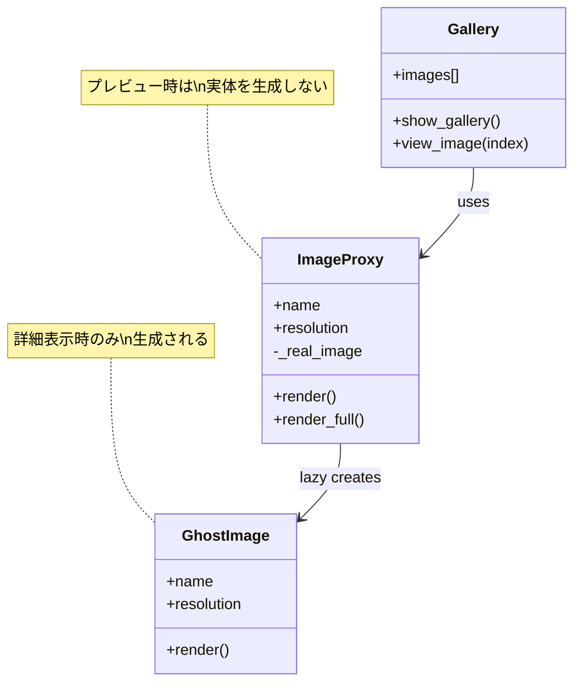
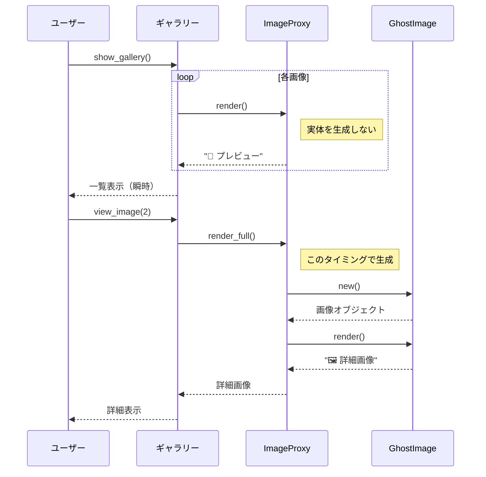

[@nqounet](https://x.com/nqounet)です。

今回から新シリーズ「Mooで作るゴーストギャラリー・ビューワ」を始めます。このシリーズでは、呪われた高解像度アートを「覗き見」できるギャラリーアプリを作りながら、Proxyパターンの様々なバリエーションを学んでいきます。

## このシリーズについて

このシリーズでは、Proxyパターン（代理パターン）を段階的に学んでいきます。各回で「動くものを作る→機能追加で破綻→Proxyで解決」という流れを体験し、なぜProxyが必要なのかを実感していただけます。

### 想定読者

- Perl入学式を修了した程度のPerl初学者
- 「Mooで覚えるオブジェクト指向プログラミング」シリーズを読んだ方
- デザインパターンに興味があるが、教科書的な解説に退屈している方

### シリーズ構成（全5回）

1. 第1回：高解像度で画面が固まる（Virtual Proxy - 遅延初期化）← 今回
2. 第2回：呪いの絵は誰でも見ていい？（Protection Proxy - アクセス制御）
3. 第3回：何度も見るなら貯めたい（Caching Proxy - キャッシュ）
4. 第4回：誰が覗いたか記録せよ（Logging Proxy - ロギング）
5. 第5回：遠隔アーカイブへ引っ越し（Remote Proxy - リモート）

## 今回のゴール

呪われた高解像度アート画像をギャラリーで表示するアプリを作ります。しかし、全画像を一気に読み込むと画面がフリーズしてしまいます。Virtual Proxyを使って、必要なときにだけ画像をロードする仕組みを実装します。

## まずは動くものを作る

最初に、シンプルなギャラリーシステムを作ってみましょう。画像を表すクラスと、ギャラリー全体を管理するクラスを用意します。

```perl
#!/usr/bin/env perl
# 言語: perl
# バージョン: 5.36以上
# 依存: Moo（cpanmでインストール）

use v5.36;

# === 高解像度アート画像クラス ===
package GhostImage {
    use Moo;
    use Time::HiRes qw(sleep);

    has name => (
        is       => 'ro',
        required => 1,
    );

    has resolution => (
        is      => 'ro',
        default => sub { '8K' },
    );

    has _data => (
        is       => 'ro',
        lazy     => 1,
        builder  => '_load_image_data',
        init_arg => undef,
    );

    sub BUILD ($self, $args) {
        # コンストラクタで「重い読み込み処理」を実行
        say "  [LOADING] " . $self->name . " (" . $self->resolution . ")...";
        sleep(0.5);  # 重い読み込みをシミュレート
        say "  [LOADED] " . $self->name;
    }

    sub _load_image_data ($self) {
        return "ImageData<" . $self->name . ">";
    }

    sub render ($self) {
        return "🖼️ " . $self->name . " [" . $self->resolution . "]";
    }
}

# === ギャラリークラス ===
package GhostGallery {
    use Moo;

    has images => (
        is      => 'ro',
        default => sub { [] },
    );

    sub add_image ($self, $image) {
        push @{$self->images}, $image;
    }

    sub show_gallery ($self) {
        say "\n=== 👻 ゴーストギャラリー ===\n";
        my $index = 1;
        for my $image (@{$self->images}) {
            say "$index. " . $image->render;
            $index++;
        }
        say "\n============================\n";
    }

    sub view_image ($self, $index) {
        my $image = $self->images->[$index - 1];
        if ($image) {
            say "\n🔍 詳細表示: " . $image->render;
        }
        else {
            say "画像が見つかりません。";
        }
    }
}

# === メイン処理 ===
package main {
    use v5.36;

    say "📸 ギャラリーを初期化中...";
    say "(全画像を読み込んでいます...)\n";

    my $gallery = GhostGallery->new;

    # 5枚の呪われたアートを追加
    $gallery->add_image(GhostImage->new(name => '叫ぶ亡霊'));
    $gallery->add_image(GhostImage->new(name => '真夜中の肖像画'));
    $gallery->add_image(GhostImage->new(name => '消えた家族写真'));
    $gallery->add_image(GhostImage->new(name => '赤い月の風景'));
    $gallery->add_image(GhostImage->new(name => '最後の晩餐（呪）'));

    say "\n✅ 初期化完了！\n";

    # ギャラリーを表示
    $gallery->show_gallery;

    # 1枚だけ詳細表示
    $gallery->view_image(2);
}
```

このコードを実行すると、以下のような出力になります。

```
📸 ギャラリーを初期化中...
(全画像を読み込んでいます...)

  [LOADING] 叫ぶ亡霊 (8K)...
  [LOADED] 叫ぶ亡霊
  [LOADING] 真夜中の肖像画 (8K)...
  [LOADED] 真夜中の肖像画
  [LOADING] 消えた家族写真 (8K)...
  [LOADED] 消えた家族写真
  [LOADING] 赤い月の風景 (8K)...
  [LOADED] 赤い月の風景
  [LOADING] 最後の晩餐（呪） (8K)...
  [LOADED] 最後の晩餐（呪）

✅ 初期化完了！

=== 👻 ゴーストギャラリー ===

1. 🖼️ 叫ぶ亡霊 [8K]
2. 🖼️ 真夜中の肖像画 [8K]
3. 🖼️ 消えた家族写真 [8K]
4. 🖼️ 赤い月の風景 [8K]
5. 🖼️ 最後の晩餐（呪） [8K]

============================

🔍 詳細表示: 🖼️ 真夜中の肖像画 [8K]
```

## 問題が発生

見てください、5枚の画像を追加しただけで、全部の読み込みに約2.5秒もかかっています。しかも、実際に詳細表示したのは1枚だけです。

これが100枚、1000枚になったらどうなるでしょうか。ユーザーは画面が固まったと思って、アプリを強制終了してしまうかもしれません。呪いの絵を見る前に、アプリ自体が呪われてしまいました。

### 破綻のポイント

- 全画像をコンストラクタで一気にロードしている（やりすぎ）
- ユーザーが見たい画像だけをロードすれば十分なのに、使わない画像もロードしている（無駄）
- 画像が増えるほど、初期化時間が線形に増加する（スケールしない）
- `GhostImage`クラスに「ロードのタイミング制御」という余計な責務が暗黙的に含まれている（SRP違反の芽）

## Virtual Proxyで解決する

ここで登場するのがVirtual Proxyです。Virtual Proxyは、重いオブジェクトの生成を必要になるまで遅延させるパターンです。

代理（Proxy）オブジェクトを作り、実際のオブジェクト（RealSubject）と同じインターフェースを持たせます。呼び出し側は代理と実体を区別せずに使えます。

### Virtual Proxyの構造



### 遅延初期化のシーケンス



```perl
#!/usr/bin/env perl
# 言語: perl
# バージョン: 5.36以上
# 依存: Moo（cpanmでインストール）

use v5.36;

# === 高解像度アート画像クラス（実体） ===
package GhostImage {
    use Moo;
    use Time::HiRes qw(sleep);

    has name => (
        is       => 'ro',
        required => 1,
    );

    has resolution => (
        is      => 'ro',
        default => sub { '8K' },
    );

    sub BUILD ($self, $args) {
        say "  [LOADING] " . $self->name . " (" . $self->resolution . ")...";
        sleep(0.5);  # 重い読み込みをシミュレート
        say "  [LOADED] " . $self->name;
    }

    sub render ($self) {
        return "🖼️ " . $self->name . " [" . $self->resolution . "]";
    }

    sub get_full_data ($self) {
        return "FullImageData<" . $self->name . ">";
    }
}

# === 画像プロキシ（代理）クラス ===
package ImageProxy {
    use Moo;

    has name => (
        is       => 'ro',
        required => 1,
    );

    has resolution => (
        is      => 'ro',
        default => sub { '8K' },
    );

    has _real_image => (
        is       => 'lazy',
        init_arg => undef,
        builder  => '_build_real_image',
    );

    sub _build_real_image ($self) {
        return GhostImage->new(
            name       => $self->name,
            resolution => $self->resolution,
        );
    }

    sub render ($self) {
        # 軽量なプレビュー用レンダリング（実体を生成しない）
        return "👻 " . $self->name . " [プレビュー]";
    }

    sub render_full ($self) {
        # 詳細表示時のみ実体を生成
        return $self->_real_image->render;
    }

    sub get_full_data ($self) {
        return $self->_real_image->get_full_data;
    }
}

# === ギャラリークラス ===
package GhostGallery {
    use Moo;

    has images => (
        is      => 'ro',
        default => sub { [] },
    );

    sub add_image ($self, $image) {
        push @{$self->images}, $image;
    }

    sub show_gallery ($self) {
        say "\n=== 👻 ゴーストギャラリー ===\n";
        my $index = 1;
        for my $image (@{$self->images}) {
            say "$index. " . $image->render;
            $index++;
        }
        say "\n============================\n";
    }

    sub view_image ($self, $index) {
        my $image = $self->images->[$index - 1];
        if ($image) {
            say "\n🔍 詳細表示中...";
            say $image->render_full;
        }
        else {
            say "画像が見つかりません。";
        }
    }
}

# === メイン処理 ===
package main {
    use v5.36;

    say "📸 ギャラリーを初期化中...";
    say "(プロキシのみ作成、実画像は遅延ロード)\n";

    my $gallery = GhostGallery->new;

    # プロキシを追加（この時点では実画像は読み込まれない）
    $gallery->add_image(ImageProxy->new(name => '叫ぶ亡霊'));
    $gallery->add_image(ImageProxy->new(name => '真夜中の肖像画'));
    $gallery->add_image(ImageProxy->new(name => '消えた家族写真'));
    $gallery->add_image(ImageProxy->new(name => '赤い月の風景'));
    $gallery->add_image(ImageProxy->new(name => '最後の晩餐（呪）'));

    say "✅ 初期化完了！（瞬時！）\n";

    # ギャラリーを表示（プレビューのみ）
    $gallery->show_gallery;

    # 1枚だけ詳細表示（このタイミングで実際にロード）
    $gallery->view_image(2);
}
```

実行結果は以下のようになります。

```
📸 ギャラリーを初期化中...
(プロキシのみ作成、実画像は遅延ロード)

✅ 初期化完了！（瞬時！）

=== 👻 ゴーストギャラリー ===

1. 👻 叫ぶ亡霊 [プレビュー]
2. 👻 真夜中の肖像画 [プレビュー]
3. 👻 消えた家族写真 [プレビュー]
4. 👻 赤い月の風景 [プレビュー]
5. 👻 最後の晩餐（呪） [プレビュー]

============================

🔍 詳細表示中...
  [LOADING] 真夜中の肖像画 (8K)...
  [LOADED] 真夜中の肖像画
🖼️ 真夜中の肖像画 [8K]
```

### 何が変わったか

1. 初期化が瞬時に完了するようになりました
2. ギャラリー一覧表示ではプレビューのみ表示
3. 詳細表示を要求したときに初めて実画像がロードされる
4. 見なかった4枚の画像はロードされない

## Virtual Proxyのポイント

Virtual Proxyを実装する際のポイントを整理します。

### 代理と実体のインターフェースを揃える

`ImageProxy`と`GhostImage`は同じメソッド（`render`、`get_full_data`）を持っています。呼び出し側は代理か実体かを意識する必要がありません。

### 遅延初期化には`lazy`属性を使う

Mooの`lazy`属性を使うと、最初にアクセスされたときにだけビルダーが呼ばれます。

```perl
has _real_image => (
    is       => 'lazy',
    init_arg => undef,
    builder  => '_build_real_image',
);
```

### 軽量な操作と重量な操作を分ける

- `render`：プレビュー表示（軽量、実体不要）
- `render_full`：詳細表示（重量、実体が必要）

このように、どの操作で実体が必要かを設計段階で考えておくことが重要です。

## 完成コード

最終的な完成コードを掲載します。

```perl
#!/usr/bin/env perl
# 言語: perl
# バージョン: 5.36以上
# 依存: Moo（cpanmでインストール）
# ファイル名: ghost_gallery_virtual.pl

use v5.36;

# === 高解像度アート画像クラス（RealSubject） ===
package GhostImage {
    use Moo;
    use Time::HiRes qw(sleep);

    has name => (
        is       => 'ro',
        required => 1,
    );

    has resolution => (
        is      => 'ro',
        default => sub { '8K' },
    );

    sub BUILD ($self, $args) {
        say "  [LOADING] " . $self->name . " (" . $self->resolution . ")...";
        sleep(0.5);
        say "  [LOADED] " . $self->name;
    }

    sub render ($self) {
        return "🖼️ " . $self->name . " [" . $self->resolution . "]";
    }

    sub get_full_data ($self) {
        return "FullImageData<" . $self->name . ">";
    }
}

# === Virtual Proxy ===
package ImageProxy {
    use Moo;

    has name => (
        is       => 'ro',
        required => 1,
    );

    has resolution => (
        is      => 'ro',
        default => sub { '8K' },
    );

    has _real_image => (
        is       => 'lazy',
        init_arg => undef,
        builder  => '_build_real_image',
    );

    sub _build_real_image ($self) {
        return GhostImage->new(
            name       => $self->name,
            resolution => $self->resolution,
        );
    }

    sub render ($self) {
        return "👻 " . $self->name . " [プレビュー]";
    }

    sub render_full ($self) {
        return $self->_real_image->render;
    }

    sub get_full_data ($self) {
        return $self->_real_image->get_full_data;
    }
}

# === ギャラリークラス ===
package GhostGallery {
    use Moo;

    has images => (
        is      => 'ro',
        default => sub { [] },
    );

    sub add_image ($self, $image) {
        push @{$self->images}, $image;
    }

    sub show_gallery ($self) {
        say "\n=== 👻 ゴーストギャラリー ===\n";
        my $index = 1;
        for my $image (@{$self->images}) {
            say "$index. " . $image->render;
            $index++;
        }
        say "\n============================\n";
    }

    sub view_image ($self, $index) {
        my $image = $self->images->[$index - 1];
        if ($image) {
            say "\n🔍 詳細表示中...";
            say $image->render_full;
        }
        else {
            say "画像が見つかりません。";
        }
    }
}

# === メイン処理 ===
package main {
    use v5.36;

    say "📸 ギャラリーを初期化中...\n";

    my $gallery = GhostGallery->new;

    $gallery->add_image(ImageProxy->new(name => '叫ぶ亡霊'));
    $gallery->add_image(ImageProxy->new(name => '真夜中の肖像画'));
    $gallery->add_image(ImageProxy->new(name => '消えた家族写真'));
    $gallery->add_image(ImageProxy->new(name => '赤い月の風景'));
    $gallery->add_image(ImageProxy->new(name => '最後の晩餐（呪）'));

    say "✅ 初期化完了！\n";

    $gallery->show_gallery;
    $gallery->view_image(2);
}
```

## まとめ

今回は、Virtual Proxy（遅延初期化プロキシ）を学びました。

- 重いオブジェクトの生成を必要時まで遅延
- 代理と実体のインターフェースを揃えて透過的に扱う
- Mooの`lazy`属性で簡単に実装可能

次回は「呪いの絵は誰でも見ていい？」と題して、Protection Proxy（アクセス制御プロキシ）を学びます。鍵付きの呪いの絵にアクセス権限を追加し、許可されたユーザーだけが閲覧できるようにします。

シリーズ全体の目次は以下をご覧ください。



## 参考リンク




