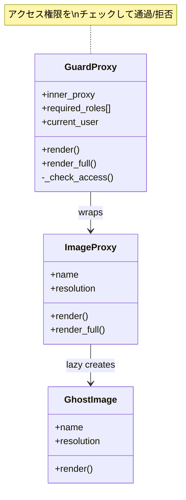
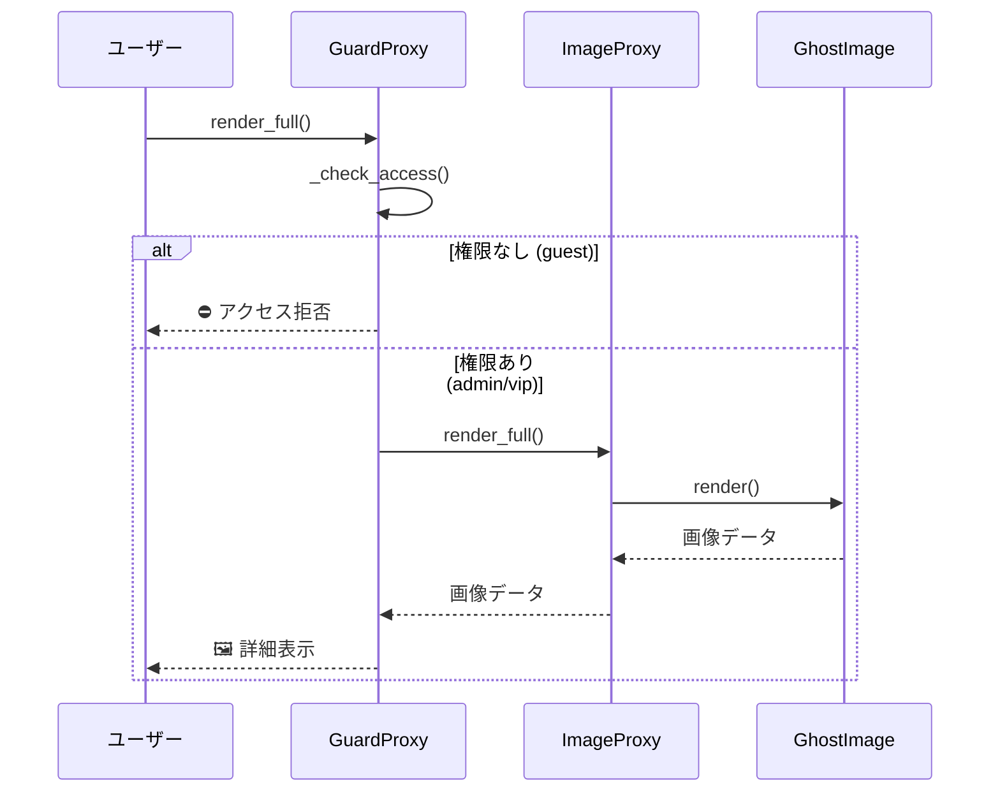

[@nqounet](https://x.com/nqounet)です。

「Mooで作るゴーストギャラリー・ビューワ」シリーズの第2回です。前回はVirtual Proxyを使って画像の遅延初期化を実装しました。



今回は「呪いの絵は誰でも見ていいのか？」という問いに答えます。一部の呪いの絵は、見た人に不幸をもたらすかもしれません。そこで、アクセス制御を導入します。

## 今回のゴール

ギャラリーに「鍵付き」の呪いの絵を追加します。鍵付きの絵は、適切な権限を持つユーザーだけが閲覧できるようにします。Protection Proxy（アクセス制御プロキシ）を使って、権限チェックを実装します。

## 前回までの状態

前回作成したコードでは、Virtual Proxyを使って遅延初期化を実装しました。今回は、このコードに「権限」の概念を追加していきます。

## 新しい要件

ギャラリーのオーナーから新しい要求が来ました。

- 一部の絵には「鍵」がかかっている
- 鍵付きの絵は「管理者」または「VIP会員」しか見られない
- 一般ユーザーが鍵付きの絵を見ようとしたらブロックする

最初は、既存のコードに直接権限チェックを追加しようと思いました。

## 直接追加する方法（破綻パターン）

```perl
#!/usr/bin/env perl
# 言語: perl
# バージョン: 5.36以上
# 依存: Moo（cpanmでインストール）

use v5.36;

package GhostImage {
    use Moo;

    has name => (
        is       => 'ro',
        required => 1,
    );

    has is_locked => (
        is      => 'ro',
        default => sub { 0 },
    );

    sub render ($self, $user) {
        # 画像クラスに権限チェックを追加（良くない設計）
        if ($self->is_locked) {
            my $role = $user->{role} // 'guest';
            unless ($role eq 'admin' || $role eq 'vip') {
                return "🔒 [アクセス拒否] " . $self->name;
            }
        }
        return "🖼️ " . $self->name;
    }
}

package main {
    my $image = GhostImage->new(
        name      => '禁断の肖像画',
        is_locked => 1,
    );

    my $guest_user = { name => 'ゲスト', role => 'guest' };
    my $admin_user = { name => '管理者', role => 'admin' };

    say $image->render($guest_user);
    say $image->render($admin_user);
}
```

出力は以下です。

```
🔒 [アクセス拒否] 禁断の肖像画
🖼️ 禁断の肖像画
```

一見動いていますが、この設計には**大きな問題**があります。動けばいいってものじゃない。

### 破綻のポイント

- 画像クラス（`GhostImage`）にアクセス制御の責務が混入している（まずい）
- `render`メソッドの引数として`$user`を渡す必要がある（インターフェースが変わると既存コード全滅）
- 権限のロジックが複雑になると、画像クラスが肥大化する（太ったクラスは悪）
- 今後、ロギングやキャッシュなど別の機能を追加するたびに、同じクラスが変更される（閉じてない！）

これは単一責任の原則（SRP）に違反しています。画像クラスは「画像を表現する」ことだけに集中すべきです。余計な仕事を押し付けられた画像クラスは、いつか限界を迎えます。

## Protection Proxyで解決する

Protection Proxyを導入して、アクセス制御の責務を分離します。

### Protection Proxyの構造



### アクセス制御のシーケンス



```perl
#!/usr/bin/env perl
# 言語: perl
# バージョン: 5.36以上
# 依存: Moo（cpanmでインストール）

use v5.36;

# === 高解像度アート画像クラス（RealSubject） ===
package GhostImage {
    use Moo;
    use Time::HiRes qw(sleep);

    has name => (
        is       => 'ro',
        required => 1,
    );

    has resolution => (
        is      => 'ro',
        default => sub { '8K' },
    );

    sub BUILD ($self, $args) {
        say "  [LOADING] " . $self->name . "...";
        sleep(0.3);
        say "  [LOADED] " . $self->name;
    }

    sub render ($self) {
        return "🖼️ " . $self->name . " [" . $self->resolution . "]";
    }
}

# === Virtual Proxy（遅延初期化） ===
package ImageProxy {
    use Moo;

    has name => (
        is       => 'ro',
        required => 1,
    );

    has resolution => (
        is      => 'ro',
        default => sub { '8K' },
    );

    has _real_image => (
        is       => 'lazy',
        init_arg => undef,
        builder  => '_build_real_image',
    );

    sub _build_real_image ($self) {
        return GhostImage->new(
            name       => $self->name,
            resolution => $self->resolution,
        );
    }

    sub render ($self) {
        return "👻 " . $self->name . " [プレビュー]";
    }

    sub render_full ($self) {
        return $self->_real_image->render;
    }
}

# === Protection Proxy（アクセス制御）: Guard Proxy ===
package GuardProxy {
    use Moo;

    has inner_proxy => (
        is       => 'ro',
        required => 1,
    );

    has required_roles => (
        is      => 'ro',
        default => sub { ['admin', 'vip'] },
    );

    has current_user => (
        is      => 'rw',
        default => sub { { name => 'ゲスト', role => 'guest' } },
    );

    sub name ($self) {
        return $self->inner_proxy->name;
    }

    sub _check_access ($self) {
        my $user_role = $self->current_user->{role} // 'guest';
        my @allowed = @{$self->required_roles};
        return grep { $_ eq $user_role } @allowed;
    }

    sub render ($self) {
        if ($self->_check_access) {
            return "🔓 " . $self->inner_proxy->render;
        }
        return "🔒 [鍵付き] " . $self->inner_proxy->name;
    }

    sub render_full ($self) {
        unless ($self->_check_access) {
            return "⛔ [アクセス拒否] " . $self->inner_proxy->name . " - 権限がありません";
        }
        return $self->inner_proxy->render_full;
    }
}

# === ギャラリークラス ===
package GhostGallery {
    use Moo;

    has images => (
        is      => 'ro',
        default => sub { [] },
    );

    has current_user => (
        is      => 'rw',
        default => sub { { name => 'ゲスト', role => 'guest' } },
    );

    sub add_image ($self, $image) {
        push @{$self->images}, $image;
    }

    sub set_user ($self, $user) {
        $self->current_user($user);
        # 全てのGuardProxyにユーザーを設定
        for my $image (@{$self->images}) {
            if ($image->isa('GuardProxy')) {
                $image->current_user($user);
            }
        }
    }

    sub show_gallery ($self) {
        say "\n=== 👻 ゴーストギャラリー ===";
        say "ログイン中: " . $self->current_user->{name} . " (" . $self->current_user->{role} . ")\n";
        my $index = 1;
        for my $image (@{$self->images}) {
            say "$index. " . $image->render;
            $index++;
        }
        say "\n============================\n";
    }

    sub view_image ($self, $index) {
        my $image = $self->images->[$index - 1];
        if ($image) {
            say "\n🔍 詳細表示中...";
            say $image->render_full;
        }
        else {
            say "画像が見つかりません。";
        }
    }
}

# === メイン処理 ===
package main {
    use v5.36;

    say "📸 ギャラリーを初期化中...\n";

    my $gallery = GhostGallery->new;

    # 通常の画像（Virtual Proxyのみ）
    $gallery->add_image(
        ImageProxy->new(name => '叫ぶ亡霊')
    );

    # 鍵付きの画像（GuardProxy + Virtual Proxy）
    $gallery->add_image(
        GuardProxy->new(
            inner_proxy => ImageProxy->new(name => '禁断の肖像画'),
        )
    );

    # 通常の画像
    $gallery->add_image(
        ImageProxy->new(name => '消えた家族写真')
    );

    # VIP限定の画像
    $gallery->add_image(
        GuardProxy->new(
            inner_proxy    => ImageProxy->new(name => '呪われた王冠'),
            required_roles => ['vip'],
        )
    );

    say "✅ 初期化完了！\n";

    # ゲストユーザーとして表示
    $gallery->show_gallery;
    $gallery->view_image(2);

    say "\n" . "=" x 50 . "\n";

    # VIPユーザーとしてログイン
    $gallery->set_user({ name => 'VIP太郎', role => 'vip' });
    $gallery->show_gallery;
    $gallery->view_image(2);
    $gallery->view_image(4);
}
```

実行結果は以下のようになります。

```
📸 ギャラリーを初期化中...

✅ 初期化完了！

=== 👻 ゴーストギャラリー ===
ログイン中: ゲスト (guest)

1. 👻 叫ぶ亡霊 [プレビュー]
2. 🔒 [鍵付き] 禁断の肖像画
3. 👻 消えた家族写真 [プレビュー]
4. 🔒 [鍵付き] 呪われた王冠

============================

🔍 詳細表示中...
⛔ [アクセス拒否] 禁断の肖像画 - 権限がありません

==================================================

=== 👻 ゴーストギャラリー ===
ログイン中: VIP太郎 (vip)

1. 👻 叫ぶ亡霊 [プレビュー]
2. 🔓 👻 禁断の肖像画 [プレビュー]
3. 👻 消えた家族写真 [プレビュー]
4. 🔓 👻 呪われた王冠 [プレビュー]

============================

🔍 詳細表示中...
  [LOADING] 禁断の肖像画...
  [LOADED] 禁断の肖像画
🖼️ 禁断の肖像画 [8K]

🔍 詳細表示中...
  [LOADING] 呪われた王冠...
  [LOADED] 呪われた王冠
🖼️ 呪われた王冠 [8K]
```

### 何が変わったか

1. `GhostImage`クラスにはアクセス制御のコードがない
2. `GuardProxy`がアクセス制御の責務を担う
3. `GuardProxy`は内部に`ImageProxy`を持ち、チェーンのように動作する
4. 権限要件は`required_roles`で柔軟に設定可能

## Proxyのチェーン構造

今回のコードでは、2つのProxyがチェーンになっています。

```
GuardProxy (アクセス制御)
    └── ImageProxy (遅延初期化)
            └── GhostImage (実体)
```

この構造のメリットは以下です。

- 各Proxyが単一の責務を持つ
- 必要に応じてProxyを追加・削除できる
- 既存のコードを変更せずに機能を拡張できる

## Protection Proxyのポイント

### 権限チェックは呼び出し前に行う

```perl
sub render_full ($self) {
    unless ($self->_check_access) {
        return "⛔ [アクセス拒否] ...";
    }
    return $self->inner_proxy->render_full;
}
```

権限がなければ、内部のProxyにアクセスする前に処理を中断します。

### 権限要件を柔軟に設定する

```perl
has required_roles => (
    is      => 'ro',
    default => sub { ['admin', 'vip'] },
);
```

画像ごとに異なる権限要件を設定できます。VIP限定、管理者限定など、用途に応じて変更できます。

## 完成コード

最終的な完成コードを掲載します。

```perl
#!/usr/bin/env perl
# 言語: perl
# バージョン: 5.36以上
# 依存: Moo（cpanmでインストール）
# ファイル名: ghost_gallery_guard.pl

use v5.36;

# === 高解像度アート画像クラス（RealSubject） ===
package GhostImage {
    use Moo;
    use Time::HiRes qw(sleep);

    has name => (
        is       => 'ro',
        required => 1,
    );

    has resolution => (
        is      => 'ro',
        default => sub { '8K' },
    );

    sub BUILD ($self, $args) {
        say "  [LOADING] " . $self->name . "...";
        sleep(0.3);
        say "  [LOADED] " . $self->name;
    }

    sub render ($self) {
        return "🖼️ " . $self->name . " [" . $self->resolution . "]";
    }
}

# === Virtual Proxy ===
package ImageProxy {
    use Moo;

    has name => ( is => 'ro', required => 1 );
    has resolution => ( is => 'ro', default => sub { '8K' } );

    has _real_image => (
        is       => 'lazy',
        init_arg => undef,
        builder  => '_build_real_image',
    );

    sub _build_real_image ($self) {
        return GhostImage->new(
            name       => $self->name,
            resolution => $self->resolution,
        );
    }

    sub render ($self) { "👻 " . $self->name . " [プレビュー]" }
    sub render_full ($self) { $self->_real_image->render }
}

# === Protection Proxy (Guard Proxy) ===
package GuardProxy {
    use Moo;

    has inner_proxy => ( is => 'ro', required => 1 );
    has required_roles => ( is => 'ro', default => sub { ['admin', 'vip'] } );
    has current_user => ( is => 'rw', default => sub { { role => 'guest' } } );

    sub name ($self) { $self->inner_proxy->name }

    sub _check_access ($self) {
        my $role = $self->current_user->{role} // 'guest';
        return grep { $_ eq $role } @{$self->required_roles};
    }

    sub render ($self) {
        $self->_check_access
            ? "🔓 " . $self->inner_proxy->render
            : "🔒 [鍵付き] " . $self->inner_proxy->name;
    }

    sub render_full ($self) {
        return "⛔ [アクセス拒否] " . $self->inner_proxy->name
            unless $self->_check_access;
        return $self->inner_proxy->render_full;
    }
}

# === ギャラリークラス ===
package GhostGallery {
    use Moo;

    has images => ( is => 'ro', default => sub { [] } );
    has current_user => ( is => 'rw', default => sub { { role => 'guest' } } );

    sub add_image ($self, $img) { push @{$self->images}, $img }

    sub set_user ($self, $user) {
        $self->current_user($user);
        $_->current_user($user) for grep { $_->isa('GuardProxy') } @{$self->images};
    }

    sub show_gallery ($self) {
        say "\n=== 👻 ゴーストギャラリー ===";
        say "ログイン: " . ($self->current_user->{name} // 'ゲスト') . "\n";
        my $i = 1;
        say "$i. " . $_->render and $i++ for @{$self->images};
        say "\n============================\n";
    }

    sub view_image ($self, $idx) {
        my $img = $self->images->[$idx - 1];
        say "\n🔍 詳細表示...\n" . ($img ? $img->render_full : "画像が見つかりません");
    }
}

# === メイン ===
package main {
    my $gallery = GhostGallery->new;

    $gallery->add_image(ImageProxy->new(name => '叫ぶ亡霊'));
    $gallery->add_image(GuardProxy->new(inner_proxy => ImageProxy->new(name => '禁断の肖像画')));
    $gallery->add_image(ImageProxy->new(name => '消えた家族写真'));
    $gallery->add_image(GuardProxy->new(inner_proxy => ImageProxy->new(name => '呪われた王冠'), required_roles => ['vip']));

    $gallery->show_gallery;
    $gallery->view_image(2);

    say "\n" . "=" x 40 . "\n";

    $gallery->set_user({ name => 'VIP太郎', role => 'vip' });
    $gallery->show_gallery;
    $gallery->view_image(2);
}
```

## まとめ

今回は、Protection Proxy（アクセス制御プロキシ）を学びました。

- 権限チェックを代理オブジェクトに分離
- 元のクラスはシンプルなまま維持
- 複数のProxyをチェーンして組み合わせ可能

次回は「何度も見るなら貯めたい」と題して、Caching Proxy（キャッシュプロキシ）を学びます。高解像度の再描画が遅い問題を、キャッシュで高速化します。

シリーズ全体の目次は以下をご覧ください。



## 参考リンク





