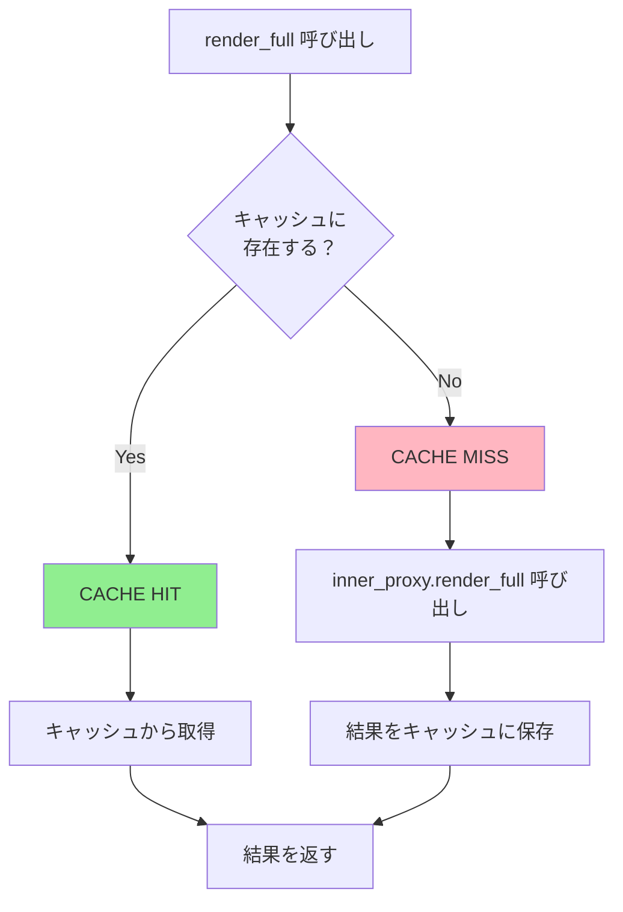
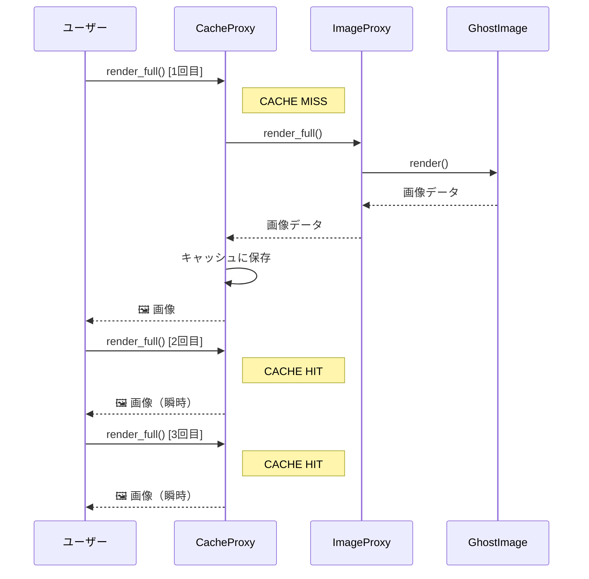

[@nqounet](https://x.com/nqounet)です。

「Mooで作るゴーストギャラリー・ビューワ」シリーズの第3回です。前回はProtection Proxyを使ってアクセス制御を実装しました。



今回は「何度も見るなら貯めたい」というテーマです。同じ呪いの絵を何度も見るのに、毎回ロードを待つのは時間の無駄です。キャッシュで高速化しましょう。

## 今回のゴール

高解像度の画像を複数回閲覧する際、2回目以降はキャッシュから瞬時に表示されるようにします。Caching Proxy（キャッシュプロキシ）を使って、取得済みのデータを保持し、高コストな処理を省略します。

## 問題の発生

ギャラリーのヘビーユーザーから苦情が来ました。

- お気に入りの呪いの絵を何度も見たい
- でも毎回ロードに0.5秒かかって遅い
- 同じ絵なのに、なぜ毎回待たされるのか

確かに、現在の実装では毎回`render_full`を呼ぶたびに新しいオブジェクトを生成しているわけではありませんが、より高コストな処理（例えばリモートからのデータ取得や画像変換）があった場合、毎回実行されてしまいます。

## キャッシュなしパターン（破綻例）

まず、キャッシュを直接`GhostImage`クラスに追加する方法を考えてみます。

```perl
#!/usr/bin/env perl
# 言語: perl
# バージョン: 5.36以上
# 依存: Moo（cpanmでインストール）

use v5.36;

package GhostImage {
    use Moo;
    use Time::HiRes qw(sleep);

    has name => (
        is       => 'ro',
        required => 1,
    );

    has _render_cache => (
        is      => 'rw',
        default => sub { undef },
    );

    sub render ($self) {
        # キャッシュがあれば返す
        return $self->_render_cache if defined $self->_render_cache;

        # 重い処理をシミュレート
        say "  [RENDERING] " . $self->name . "...";
        sleep(0.5);

        my $result = "🖼️ " . $self->name . " [HD Rendered]";
        $self->_render_cache($result);
        return $result;
    }
}

package main {
    my $image = GhostImage->new(name => '叫ぶ亡霊');

    say "1回目の表示:";
    say $image->render;

    say "\n2回目の表示:";
    say $image->render;
}
```

出力は以下のようになります。

```
1回目の表示:
  [RENDERING] 叫ぶ亡霊...
🖼️ 叫ぶ亡霊 [HD Rendered]

2回目の表示:
🖼️ 叫ぶ亡霊 [HD Rendered]
```

2回目は瞬時に表示されていますが、この設計には問題があります。動くからといって、良い設計とは限りません。

### 破綻のポイント

- `GhostImage`クラスにキャッシュの責務が混入している（また同じクラスが肥大化！）
- キャッシュの有効期限、無効化ロジックを追加するたびにクラスがさらに太る
- 前回のProtection Proxyと同様、単一責任の原則（SRP）に違反
- キャッシュ戦略を変えたい場合、`GhostImage`クラスを変更する必要がある（閉じてない！）

## Caching Proxyで解決する

キャッシュの責務を専用のProxyに分離します。

### Caching Proxyの動作フロー



### キャッシュヒット率の可視化



```perl
#!/usr/bin/env perl
# 言語: perl
# バージョン: 5.36以上
# 依存: Moo（cpanmでインストール）

use v5.36;

# === 高解像度アート画像クラス（RealSubject） ===
package GhostImage {
    use Moo;
    use Time::HiRes qw(sleep);

    has name => (
        is       => 'ro',
        required => 1,
    );

    has resolution => (
        is      => 'ro',
        default => sub { '8K' },
    );

    sub BUILD ($self, $args) {
        say "  [LOADING] " . $self->name . "...";
        sleep(0.3);
        say "  [LOADED] " . $self->name;
    }

    sub render ($self) {
        return "🖼️ " . $self->name . " [" . $self->resolution . "]";
    }

    sub get_high_res_data ($self) {
        say "  [PROCESSING] 高解像度データを生成中...";
        sleep(0.5);
        return "HighResData<" . $self->name . ">";
    }
}

# === Virtual Proxy ===
package ImageProxy {
    use Moo;

    has name => ( is => 'ro', required => 1 );
    has resolution => ( is => 'ro', default => sub { '8K' } );

    has _real_image => (
        is       => 'lazy',
        init_arg => undef,
        builder  => '_build_real_image',
    );

    sub _build_real_image ($self) {
        return GhostImage->new(
            name       => $self->name,
            resolution => $self->resolution,
        );
    }

    sub render ($self) {
        return "👻 " . $self->name . " [プレビュー]";
    }

    sub render_full ($self) {
        return $self->_real_image->render;
    }

    sub get_high_res_data ($self) {
        return $self->_real_image->get_high_res_data;
    }
}

# === Caching Proxy ===
package CacheProxy {
    use Moo;

    has inner_proxy => (
        is       => 'ro',
        required => 1,
    );

    has _cache => (
        is      => 'ro',
        default => sub { {} },
    );

    has cache_hits => (
        is      => 'rw',
        default => sub { 0 },
    );

    has cache_misses => (
        is      => 'rw',
        default => sub { 0 },
    );

    sub name ($self) {
        return $self->inner_proxy->name;
    }

    sub render ($self) {
        return $self->inner_proxy->render;
    }

    sub render_full ($self) {
        my $key = 'render_full';
        if (exists $self->_cache->{$key}) {
            say "  [CACHE HIT] " . $self->name;
            $self->cache_hits($self->cache_hits + 1);
            return $self->_cache->{$key};
        }

        say "  [CACHE MISS] " . $self->name;
        $self->cache_misses($self->cache_misses + 1);
        my $result = $self->inner_proxy->render_full;
        $self->_cache->{$key} = $result;
        return $result;
    }

    sub get_high_res_data ($self) {
        my $key = 'high_res_data';
        if (exists $self->_cache->{$key}) {
            say "  [CACHE HIT] 高解像度データ";
            $self->cache_hits($self->cache_hits + 1);
            return $self->_cache->{$key};
        }

        say "  [CACHE MISS] 高解像度データ";
        $self->cache_misses($self->cache_misses + 1);
        my $result = $self->inner_proxy->get_high_res_data;
        $self->_cache->{$key} = $result;
        return $result;
    }

    sub clear_cache ($self) {
        %{$self->_cache} = ();
        say "  [CACHE CLEARED] " . $self->name;
    }

    sub stats ($self) {
        return sprintf("Hits: %d, Misses: %d",
            $self->cache_hits, $self->cache_misses);
    }
}

# === ギャラリークラス ===
package GhostGallery {
    use Moo;

    has images => ( is => 'ro', default => sub { [] } );

    sub add_image ($self, $img) {
        push @{$self->images}, $img;
    }

    sub show_gallery ($self) {
        say "\n=== 👻 ゴーストギャラリー ===\n";
        my $i = 1;
        for my $img (@{$self->images}) {
            say "$i. " . $img->render;
            $i++;
        }
        say "\n============================\n";
    }

    sub view_image ($self, $idx) {
        my $img = $self->images->[$idx - 1];
        if ($img) {
            say "\n🔍 詳細表示:";
            say $img->render_full;
        }
    }

    sub download_high_res ($self, $idx) {
        my $img = $self->images->[$idx - 1];
        if ($img) {
            say "\n📥 高解像度データ取得:";
            say $img->get_high_res_data;
        }
    }
}

# === メイン処理 ===
package main {
    use v5.36;

    say "📸 ギャラリーを初期化中...\n";

    my $gallery = GhostGallery->new;

    # CacheProxy + Virtual Proxy のチェーン
    my $cached_image = CacheProxy->new(
        inner_proxy => ImageProxy->new(name => '叫ぶ亡霊'),
    );
    $gallery->add_image($cached_image);

    $gallery->add_image(
        CacheProxy->new(
            inner_proxy => ImageProxy->new(name => '真夜中の肖像画'),
        )
    );

    say "✅ 初期化完了！\n";

    $gallery->show_gallery;

    # 同じ画像を3回表示
    say "--- 1回目 ---";
    $gallery->view_image(1);

    say "\n--- 2回目 ---";
    $gallery->view_image(1);

    say "\n--- 3回目 ---";
    $gallery->view_image(1);

    # 高解像度データも取得
    say "\n--- 高解像度データ（1回目）---";
    $gallery->download_high_res(1);

    say "\n--- 高解像度データ（2回目）---";
    $gallery->download_high_res(1);

    # キャッシュ統計
    say "\n📊 キャッシュ統計: " . $cached_image->stats;
}
```

実行結果は以下のようになります。

```
📸 ギャラリーを初期化中...

✅ 初期化完了！

=== 👻 ゴーストギャラリー ===

1. 👻 叫ぶ亡霊 [プレビュー]
2. 👻 真夜中の肖像画 [プレビュー]

============================

--- 1回目 ---

🔍 詳細表示:
  [CACHE MISS] 叫ぶ亡霊
  [LOADING] 叫ぶ亡霊...
  [LOADED] 叫ぶ亡霊
🖼️ 叫ぶ亡霊 [8K]

--- 2回目 ---

🔍 詳細表示:
  [CACHE HIT] 叫ぶ亡霊
🖼️ 叫ぶ亡霊 [8K]

--- 3回目 ---

🔍 詳細表示:
  [CACHE HIT] 叫ぶ亡霊
🖼️ 叫ぶ亡霊 [8K]

--- 高解像度データ（1回目）---

📥 高解像度データ取得:
  [CACHE MISS] 高解像度データ
  [PROCESSING] 高解像度データを生成中...
HighResData<叫ぶ亡霊>

--- 高解像度データ（2回目）---

📥 高解像度データ取得:
  [CACHE HIT] 高解像度データ
HighResData<叫ぶ亡霊>

📊 キャッシュ統計: Hits: 3, Misses: 2
```

### 何が変わったか

1. 1回目はキャッシュミスで実際のロード処理が走る
2. 2回目以降はキャッシュヒットで瞬時に結果が返る
3. 高解像度データも同様にキャッシュされる
4. `GhostImage`クラスにはキャッシュのコードがない

## Proxyチェーンの拡張

これまでに学んだProxyを組み合わせてみましょう。

```
GuardProxy (アクセス制御)
    └── CacheProxy (キャッシュ)
            └── ImageProxy (遅延初期化)
                    └── GhostImage (実体)
```

この構成で、以下の機能を実現できます。

- 権限のないユーザーはブロック
- 権限があれば、キャッシュを確認
- キャッシュがなければ遅延初期化

## Caching Proxyのポイント

### キャッシュキーの設計

```perl
my $key = 'render_full';
```

メソッド名をキャッシュキーにするシンプルな方法です。引数がある場合は、引数を含めたキーにします。

### キャッシュの無効化

```perl
sub clear_cache ($self) {
    %{$self->_cache} = ();
}
```

キャッシュを無効化する手段を用意しておくことが重要です。データが更新された場合や、メモリを解放したい場合に使います。

### キャッシュ統計

```perl
has cache_hits => ( is => 'rw', default => sub { 0 } );
has cache_misses => ( is => 'rw', default => sub { 0 } );
```

ヒット率を計測できるようにしておくと、キャッシュの効果を可視化できます。

## 完成コード

最終的な完成コードを掲載します。

```perl
#!/usr/bin/env perl
# 言語: perl
# バージョン: 5.36以上
# 依存: Moo（cpanmでインストール）
# ファイル名: ghost_gallery_cache.pl

use v5.36;

# === 高解像度アート画像クラス（RealSubject） ===
package GhostImage {
    use Moo;
    use Time::HiRes qw(sleep);

    has name => ( is => 'ro', required => 1 );
    has resolution => ( is => 'ro', default => sub { '8K' } );

    sub BUILD ($self, $args) {
        say "  [LOADING] " . $self->name . "...";
        sleep(0.3);
        say "  [LOADED] " . $self->name;
    }

    sub render ($self) {
        return "🖼️ " . $self->name . " [" . $self->resolution . "]";
    }

    sub get_high_res_data ($self) {
        say "  [PROCESSING] 高解像度データを生成中...";
        sleep(0.5);
        return "HighResData<" . $self->name . ">";
    }
}

# === Virtual Proxy ===
package ImageProxy {
    use Moo;

    has name => ( is => 'ro', required => 1 );
    has resolution => ( is => 'ro', default => sub { '8K' } );
    has _real_image => ( is => 'lazy', init_arg => undef, builder => '_build_real_image' );

    sub _build_real_image ($self) {
        GhostImage->new(name => $self->name, resolution => $self->resolution);
    }

    sub render ($self) { "👻 " . $self->name . " [プレビュー]" }
    sub render_full ($self) { $self->_real_image->render }
    sub get_high_res_data ($self) { $self->_real_image->get_high_res_data }
}

# === Caching Proxy ===
package CacheProxy {
    use Moo;

    has inner_proxy => ( is => 'ro', required => 1 );
    has _cache => ( is => 'ro', default => sub { {} } );
    has cache_hits => ( is => 'rw', default => 0 );
    has cache_misses => ( is => 'rw', default => 0 );

    sub name ($self) { $self->inner_proxy->name }
    sub render ($self) { $self->inner_proxy->render }

    sub _cached ($self, $key, $code) {
        if (exists $self->_cache->{$key}) {
            say "  [CACHE HIT] $key";
            $self->cache_hits($self->cache_hits + 1);
            return $self->_cache->{$key};
        }
        say "  [CACHE MISS] $key";
        $self->cache_misses($self->cache_misses + 1);
        my $result = $code->();
        $self->_cache->{$key} = $result;
        return $result;
    }

    sub render_full ($self) {
        $self->_cached('render_full', sub { $self->inner_proxy->render_full });
    }

    sub get_high_res_data ($self) {
        $self->_cached('high_res', sub { $self->inner_proxy->get_high_res_data });
    }

    sub clear_cache ($self) { %{$self->_cache} = () }
    sub stats ($self) { "Hits: " . $self->cache_hits . ", Misses: " . $self->cache_misses }
}

# === ギャラリー ===
package GhostGallery {
    use Moo;

    has images => ( is => 'ro', default => sub { [] } );

    sub add_image ($self, $img) { push @{$self->images}, $img }

    sub show_gallery ($self) {
        say "\n=== 👻 ゴーストギャラリー ===\n";
        my $i = 1;
        say "$i. " . $_->render and $i++ for @{$self->images};
        say "\n============================\n";
    }

    sub view_image ($self, $idx) {
        my $img = $self->images->[$idx - 1];
        say "\n🔍 " . ($img ? $img->render_full : "not found");
    }
}

# === メイン ===
package main {
    my $gallery = GhostGallery->new;
    my $img = CacheProxy->new(inner_proxy => ImageProxy->new(name => '叫ぶ亡霊'));
    $gallery->add_image($img);

    $gallery->show_gallery;
    $gallery->view_image(1) for 1..3;

    say "\n📊 " . $img->stats;
}
```

## まとめ

今回は、Caching Proxy（キャッシュプロキシ）を学びました。

- 高コストな処理結果をキャッシュして高速化
- キャッシュの責務をProxyに分離
- キャッシュキーと無効化の設計が重要

次回は「誰が覗いたか記録せよ」と題して、Logging Proxy（ロギングプロキシ）を学びます。アクセス履歴を監査ログとして記録します。

シリーズ全体の目次は以下をご覧ください。



## 参考リンク





