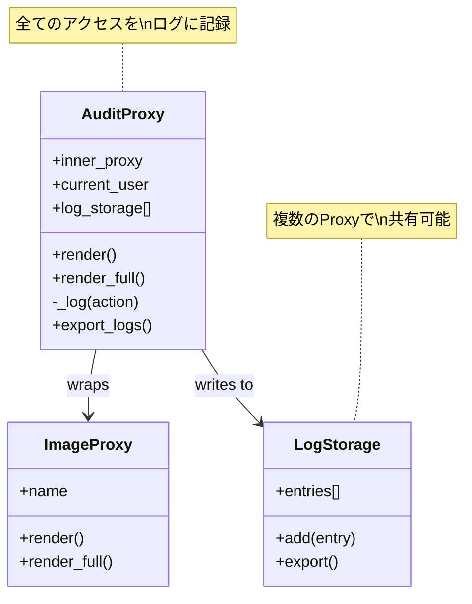
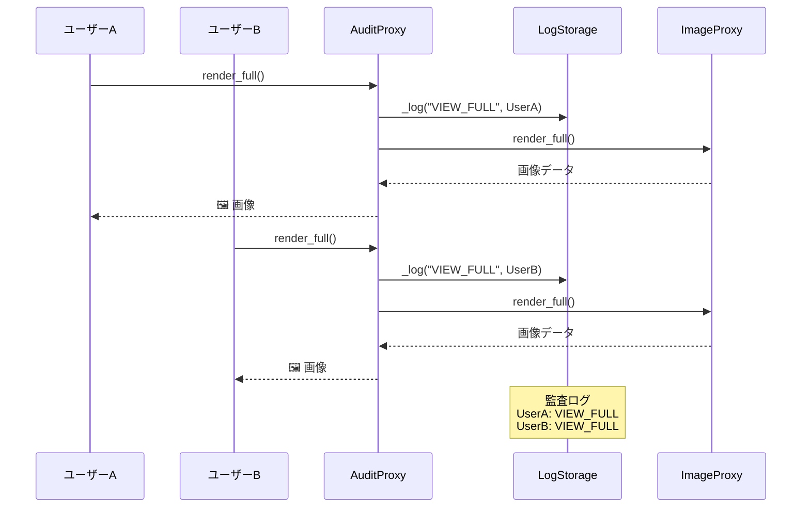

[@nqounet](https://x.com/nqounet)です。

「Mooで作るゴーストギャラリー・ビューワ」シリーズの第4回です。前回はCaching Proxyを使って高速化を実装しました。



今回は「誰が覗いたか記録せよ」というテーマです。呪いの絵を見たユーザーを追跡できるように、監査ログを実装します。

## 今回のゴール

ギャラリーへのアクセスを監査ログとして記録します。誰が、いつ、どの絵を見たかを追跡できるようにします。Logging Proxy（ロギングプロキシ）を使って、ログ出力の責務を分離します。

## 新しい要件

ギャラリーのオーナーから監査要件が追加されました。

- 呪いの絵を見たユーザーを記録したい
- 万が一の呪い被害に備えて、閲覧履歴を保全する
- ログは集約して保管したい

## ログ散乱パターン（破綻例）

まず、各クラスに直接ログを追加する方法を試してみます。

```perl
#!/usr/bin/env perl
# 言語: perl
# バージョン: 5.36以上
# 依存: Moo（cpanmでインストール）

use v5.36;

package GhostImage {
    use Moo;
    use Time::HiRes qw(time);

    has name => ( is => 'ro', required => 1 );

    sub render ($self, $user) {
        # ログを直接出力（良くない設計）
        my $timestamp = localtime(time);
        say "[LOG] $timestamp - User: $user->{name} viewed: " . $self->name;

        return "🖼️ " . $self->name;
    }
}

package ImageProxy {
    use Moo;
    use Time::HiRes qw(time);

    has name => ( is => 'ro', required => 1 );
    has _real_image => (
        is       => 'lazy',
        builder  => '_build_real_image',
    );

    sub _build_real_image ($self) {
        GhostImage->new(name => $self->name);
    }

    sub render ($self, $user) {
        # ここにもログを追加（散乱）
        say "[PROXY LOG] Accessing " . $self->name;
        return $self->_real_image->render($user);
    }
}

package main {
    my $proxy = ImageProxy->new(name => '叫ぶ亡霊');
    my $user = { name => '田中太郎' };

    $proxy->render($user);
}
```

出力は以下のようになります。

```
[PROXY LOG] Accessing 叫ぶ亡霊
[LOG] Tue Jan 17 23:10:44 2026 - User: 田中太郎 viewed: 叫ぶ亡霊
```

### 破綻のポイント

- ログのコードが複数のクラスに散乱している（カオス）
- ログフォーマットが統一されていない（`[LOG]`と`[PROXY LOG]`、どっちが正式？）
- ログ出力先を変えたい場合、全クラスを変更する必要がある（OCP違反）
- `render`メソッドの引数に`$user`が必要になる（インターフェースが変わって後方互換崩壊）
- テスト時にログを無効化するのが困難（テストが地獄に）

これもまた、単一責任の原則（SRP）違反です。画像クラスは画像、プロキシはプロキシ、そしてログはログ専門に任せるべき。

## Logging Proxyで解決する

ログの責務を専用のProxyに分離します。

### Logging Proxyの構造



### ロギングのシーケンス



```perl
#!/usr/bin/env perl
# 言語: perl
# バージョン: 5.36以上
# 依存: Moo（cpanmでインストール）

use v5.36;

# === 高解像度アート画像クラス（RealSubject） ===
package GhostImage {
    use Moo;
    use Time::HiRes qw(sleep);

    has name => ( is => 'ro', required => 1 );
    has resolution => ( is => 'ro', default => sub { '8K' } );

    sub BUILD ($self, $args) {
        sleep(0.2);
    }

    sub render ($self) {
        return "🖼️ " . $self->name . " [" . $self->resolution . "]";
    }
}

# === Virtual Proxy ===
package ImageProxy {
    use Moo;

    has name => ( is => 'ro', required => 1 );
    has resolution => ( is => 'ro', default => sub { '8K' } );
    has _real_image => (
        is       => 'lazy',
        init_arg => undef,
        builder  => '_build_real_image',
    );

    sub _build_real_image ($self) {
        GhostImage->new(name => $self->name, resolution => $self->resolution);
    }

    sub render ($self) { "👻 " . $self->name . " [プレビュー]" }
    sub render_full ($self) { $self->_real_image->render }
}

# === Audit Proxy (Logging Proxy) ===
package AuditProxy {
    use Moo;

    has inner_proxy => ( is => 'ro', required => 1 );
    has current_user => ( is => 'rw', default => sub { { name => 'anonymous' } } );
    has log_storage => ( is => 'ro', default => sub { [] } );

    sub name ($self) { $self->inner_proxy->name }

    sub _log ($self, $action, $details = '') {
        my ($sec, $min, $hour, $mday, $mon, $year) = localtime;
        my $timestamp = sprintf("%04d-%02d-%02d %02d:%02d:%02d",
            $year + 1900, $mon + 1, $mday, $hour, $min, $sec);

        my $entry = {
            timestamp => $timestamp,
            user      => $self->current_user->{name},
            action    => $action,
            target    => $self->name,
            details   => $details,
        };

        push @{$self->log_storage}, $entry;

        say sprintf("[AUDIT] %s | %-12s | %-10s | %s%s",
            $timestamp,
            $entry->{user},
            $entry->{action},
            $entry->{target},
            $details ? " ($details)" : "",
        );
    }

    sub render ($self) {
        $self->_log('PREVIEW');
        return $self->inner_proxy->render;
    }

    sub render_full ($self) {
        $self->_log('VIEW_FULL');
        return $self->inner_proxy->render_full;
    }

    sub get_logs ($self) {
        return @{$self->log_storage};
    }

    sub export_logs ($self) {
        say "\n📋 監査ログエクスポート";
        say "=" x 70;
        for my $entry (@{$self->log_storage}) {
            say sprintf("%s | %-12s | %-10s | %s",
                $entry->{timestamp},
                $entry->{user},
                $entry->{action},
                $entry->{target},
            );
        }
        say "=" x 70;
        say "Total entries: " . scalar(@{$self->log_storage});
    }
}

# === ギャラリークラス ===
package GhostGallery {
    use Moo;

    has images => ( is => 'ro', default => sub { [] } );
    has current_user => ( is => 'rw', default => sub { { name => 'ゲスト' } } );
    has audit_log => ( is => 'ro', default => sub { [] } );

    sub add_image ($self, $img) {
        # 共有の監査ログストレージを設定
        if ($img->isa('AuditProxy')) {
            $img = AuditProxy->new(
                inner_proxy => $img->inner_proxy,
                log_storage => $self->audit_log,
            );
        }
        push @{$self->images}, $img;
    }

    sub set_user ($self, $user) {
        $self->current_user($user);
        for my $img (@{$self->images}) {
            if ($img->isa('AuditProxy')) {
                $img->current_user($user);
            }
        }
    }

    sub show_gallery ($self) {
        say "\n=== 👻 ゴーストギャラリー ===";
        say "ログイン: " . $self->current_user->{name} . "\n";
        my $i = 1;
        for my $img (@{$self->images}) {
            say "$i. " . $img->render;
            $i++;
        }
        say "\n============================\n";
    }

    sub view_image ($self, $idx) {
        my $img = $self->images->[$idx - 1];
        if ($img) {
            say "\n🔍 詳細表示:";
            say $img->render_full;
        }
    }

    sub export_audit_log ($self) {
        say "\n📋 ギャラリー監査ログ";
        say "=" x 70;
        for my $entry (@{$self->audit_log}) {
            say sprintf("%s | %-12s | %-10s | %s",
                $entry->{timestamp},
                $entry->{user},
                $entry->{action},
                $entry->{target},
            );
        }
        say "=" x 70;
        say "Total entries: " . scalar(@{$self->audit_log});
    }
}

# === メイン処理 ===
package main {
    use v5.36;

    say "📸 ギャラリーを初期化中...\n";

    my $gallery = GhostGallery->new;

    # AuditProxy + Virtual Proxy のチェーン
    $gallery->add_image(
        AuditProxy->new(
            inner_proxy => ImageProxy->new(name => '叫ぶ亡霊'),
        )
    );

    $gallery->add_image(
        AuditProxy->new(
            inner_proxy => ImageProxy->new(name => '禁断の肖像画'),
        )
    );

    $gallery->add_image(
        AuditProxy->new(
            inner_proxy => ImageProxy->new(name => '呪われた王冠'),
        )
    );

    say "✅ 初期化完了！\n";

    # ユーザーAがギャラリーを閲覧
    $gallery->set_user({ name => '田中太郎' });
    $gallery->show_gallery;
    $gallery->view_image(1);
    $gallery->view_image(2);

    say "\n" . "-" x 50 . "\n";

    # ユーザーBがギャラリーを閲覧
    $gallery->set_user({ name => '山田花子' });
    $gallery->show_gallery;
    $gallery->view_image(1);
    $gallery->view_image(3);

    # 監査ログをエクスポート
    $gallery->export_audit_log;
}
```

実行結果は以下のようになります。

```
📸 ギャラリーを初期化中...

✅ 初期化完了！

=== 👻 ゴーストギャラリー ===
ログイン: 田中太郎

[AUDIT] 2026-01-17 23:10:44 | 田中太郎      | PREVIEW    | 叫ぶ亡霊
1. 👻 叫ぶ亡霊 [プレビュー]
[AUDIT] 2026-01-17 23:10:44 | 田中太郎      | PREVIEW    | 禁断の肖像画
2. 👻 禁断の肖像画 [プレビュー]
[AUDIT] 2026-01-17 23:10:44 | 田中太郎      | PREVIEW    | 呪われた王冠
3. 👻 呪われた王冠 [プレビュー]

============================


🔍 詳細表示:
[AUDIT] 2026-01-17 23:10:44 | 田中太郎      | VIEW_FULL  | 叫ぶ亡霊
🖼️ 叫ぶ亡霊 [8K]

🔍 詳細表示:
[AUDIT] 2026-01-17 23:10:44 | 田中太郎      | VIEW_FULL  | 禁断の肖像画
🖼️ 禁断の肖像画 [8K]

--------------------------------------------------

=== 👻 ゴーストギャラリー ===
ログイン: 山田花子

[AUDIT] 2026-01-17 23:10:44 | 山田花子      | PREVIEW    | 叫ぶ亡霊
1. 👻 叫ぶ亡霊 [プレビュー]
[AUDIT] 2026-01-17 23:10:44 | 山田花子      | PREVIEW    | 禁断の肖像画
2. 👻 禁断の肖像画 [プレビュー]
[AUDIT] 2026-01-17 23:10:44 | 山田花子      | PREVIEW    | 呪われた王冠
3. 👻 呪われた王冠 [プレビュー]

============================


🔍 詳細表示:
[AUDIT] 2026-01-17 23:10:45 | 山田花子      | VIEW_FULL  | 叫ぶ亡霊
🖼️ 叫ぶ亡霊 [8K]

🔍 詳細表示:
[AUDIT] 2026-01-17 23:10:45 | 山田花子      | VIEW_FULL  | 呪われた王冠
🖼️ 呪われた王冠 [8K]

📋 ギャラリー監査ログ
======================================================================
2026-01-17 23:10:44 | 田中太郎      | PREVIEW    | 叫ぶ亡霊
2026-01-17 23:10:44 | 田中太郎      | PREVIEW    | 禁断の肖像画
2026-01-17 23:10:44 | 田中太郎      | PREVIEW    | 呪われた王冠
2026-01-17 23:10:44 | 田中太郎      | VIEW_FULL  | 叫ぶ亡霊
2026-01-17 23:10:44 | 田中太郎      | VIEW_FULL  | 禁断の肖像画
2026-01-17 23:10:44 | 山田花子      | PREVIEW    | 叫ぶ亡霊
2026-01-17 23:10:44 | 山田花子      | PREVIEW    | 禁断の肖像画
2026-01-17 23:10:44 | 山田花子      | PREVIEW    | 呪われた王冠
2026-01-17 23:10:45 | 山田花子      | VIEW_FULL  | 叫ぶ亡霊
2026-01-17 23:10:45 | 山田花子      | VIEW_FULL  | 呪われた王冠
======================================================================
Total entries: 10
```

### 何が変わったか

1. ログ出力が`AuditProxy`に集約されている
2. ログフォーマットが統一されている
3. 複数画像のログを一箇所で管理できる
4. `GhostImage`や`ImageProxy`にはログのコードがない
5. ログストレージを差し替えれば、出力先を簡単に変更できる

## Logging Proxyのポイント

### ログエントリの構造化

```perl
my $entry = {
    timestamp => $timestamp,
    user      => $self->current_user->{name},
    action    => $action,
    target    => $self->name,
    details   => $details,
};
```

構造化されたログにすることで、後から検索・分析しやすくなります。

### ログストレージの共有

```perl
has log_storage => ( is => 'ro', default => sub { [] } );
```

複数のAuditProxyで同じストレージを共有することで、ログを一元管理できます。

### アクション名の明確化

```perl
$self->_log('PREVIEW');
$self->_log('VIEW_FULL');
```

どの操作が行われたかを明確にするアクション名を定義します。

## 完成コード

最終的な完成コードを掲載します。

```perl
#!/usr/bin/env perl
# 言語: perl
# バージョン: 5.36以上
# 依存: Moo（cpanmでインストール）
# ファイル名: ghost_gallery_audit.pl

use v5.36;

# === 高解像度アート画像クラス（RealSubject） ===
package GhostImage {
    use Moo;
    use Time::HiRes qw(sleep);

    has name => ( is => 'ro', required => 1 );
    has resolution => ( is => 'ro', default => sub { '8K' } );

    sub BUILD ($self, $args) { sleep(0.2) }
    sub render ($self) { "🖼️ " . $self->name . " [" . $self->resolution . "]" }
}

# === Virtual Proxy ===
package ImageProxy {
    use Moo;

    has name => ( is => 'ro', required => 1 );
    has resolution => ( is => 'ro', default => sub { '8K' } );
    has _real_image => ( is => 'lazy', init_arg => undef, builder => '_build_real_image' );

    sub _build_real_image ($self) {
        GhostImage->new(name => $self->name, resolution => $self->resolution);
    }

    sub render ($self) { "👻 " . $self->name . " [プレビュー]" }
    sub render_full ($self) { $self->_real_image->render }
}

# === Audit Proxy (Logging Proxy) ===
package AuditProxy {
    use Moo;

    has inner_proxy => ( is => 'ro', required => 1 );
    has current_user => ( is => 'rw', default => sub { { name => 'anonymous' } } );
    has log_storage => ( is => 'ro', default => sub { [] } );

    sub name ($self) { $self->inner_proxy->name }

    sub _log ($self, $action) {
        my ($s, $m, $h, $d, $mo, $y) = localtime;
        my $ts = sprintf("%04d-%02d-%02d %02d:%02d:%02d", $y+1900, $mo+1, $d, $h, $m, $s);
        push @{$self->log_storage}, {
            timestamp => $ts, user => $self->current_user->{name},
            action => $action, target => $self->name,
        };
        say "[AUDIT] $ts | " . $self->current_user->{name} . " | $action | " . $self->name;
    }

    sub render ($self) { $self->_log('PREVIEW'); $self->inner_proxy->render }
    sub render_full ($self) { $self->_log('VIEW_FULL'); $self->inner_proxy->render_full }
}

# === ギャラリー ===
package GhostGallery {
    use Moo;

    has images => ( is => 'ro', default => sub { [] } );
    has current_user => ( is => 'rw', default => sub { { name => 'ゲスト' } } );
    has audit_log => ( is => 'ro', default => sub { [] } );

    sub add_image ($self, $img) {
        $img = AuditProxy->new(inner_proxy => $img->inner_proxy, log_storage => $self->audit_log)
            if $img->isa('AuditProxy');
        push @{$self->images}, $img;
    }

    sub set_user ($self, $user) {
        $self->current_user($user);
        $_->current_user($user) for grep { $_->isa('AuditProxy') } @{$self->images};
    }

    sub show_gallery ($self) {
        say "\n=== 👻 ゴーストギャラリー ===\nログイン: " . $self->current_user->{name} . "\n";
        my $i = 1; say "$i. " . $_->render and $i++ for @{$self->images};
        say "\n============================\n";
    }

    sub view_image ($self, $idx) {
        my $img = $self->images->[$idx - 1];
        say "\n🔍 " . ($img ? $img->render_full : "not found") if $img;
    }

    sub export_audit_log ($self) {
        say "\n📋 監査ログ\n" . "=" x 60;
        say "$_->{timestamp} | $_->{user} | $_->{action} | $_->{target}" for @{$self->audit_log};
        say "=" x 60 . "\nTotal: " . scalar(@{$self->audit_log});
    }
}

# === メイン ===
package main {
    my $gallery = GhostGallery->new;
    $gallery->add_image(AuditProxy->new(inner_proxy => ImageProxy->new(name => '叫ぶ亡霊')));
    $gallery->add_image(AuditProxy->new(inner_proxy => ImageProxy->new(name => '禁断の肖像画')));

    $gallery->set_user({ name => '田中太郎' });
    $gallery->show_gallery;
    $gallery->view_image(1);

    $gallery->set_user({ name => '山田花子' });
    $gallery->view_image(2);

    $gallery->export_audit_log;
}
```

## まとめ

今回は、Logging Proxy（ロギングプロキシ）を学びました。

- ログ出力を代理オブジェクトに集約
- ログフォーマットの統一
- ログストレージの一元管理

次回は「遠隔アーカイブへ引っ越し」と題して、Remote Proxy（リモートプロキシ）を学びます。画像を外部のアーカイブサーバーに移動し、ネットワーク越しのアクセスを透過的に扱います。

シリーズ全体の目次は以下をご覧ください。



## 参考リンク





