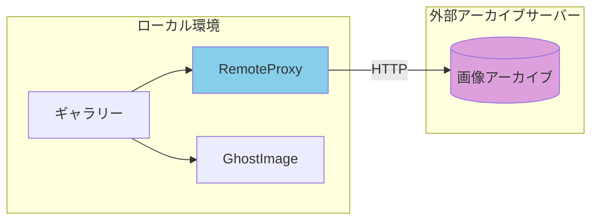
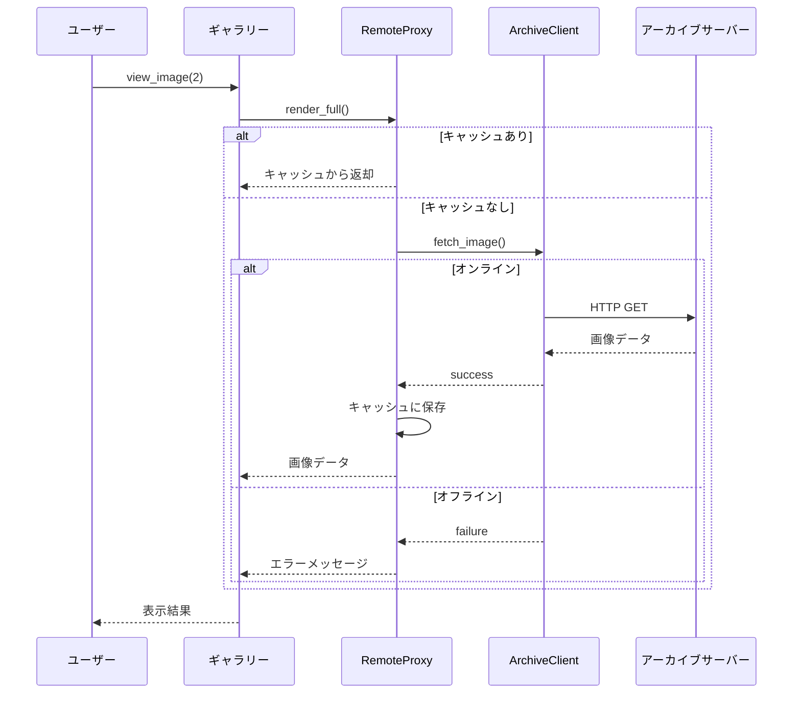
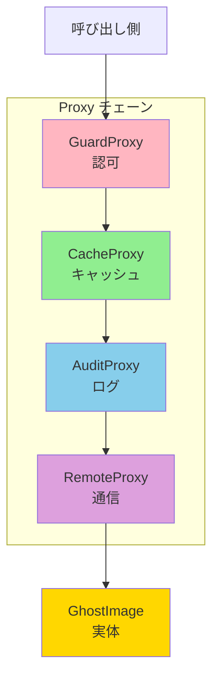

[@nqounet](https://x.com/nqounet)です。

「Mooで作るゴーストギャラリー・ビューワ」シリーズの最終回（第5回）です。前回はLogging Proxyを使って監査ログを実装しました。



今回は「遠隔アーカイブへ引っ越し」というテーマです。呪いの絵をローカルから外部のアーカイブサーバーに移動し、ネットワーク越しにアクセスできるようにします。

## 今回のゴール

画像データを外部のアーカイブサーバーに移動し、Remote Proxy（リモートプロキシ）を使ってネットワーク越しのアクセスを透過的に扱います。呼び出し側のコードは変更せずに、ローカルからリモートへの移行を実現します。

## 新しい要件

ギャラリーの運用に変更がありました。

- サーバーのストレージが逼迫している
- 高解像度の呪いの絵を外部のアーカイブサーバーに移動する
- ギャラリーの既存コードは変更したくない

## 直接HTTPアクセスパターン（破綻例）

まず、外部サーバーへの直接アクセスを実装してみます。

```perl
#!/usr/bin/env perl
# 言語: perl
# バージョン: 5.36以上
# 依存: Moo（cpanmでインストール）

use v5.36;

package GhostGallery {
    use Moo;
    use HTTP::Tiny;  # 実際にはモック

    has images => ( is => 'ro', default => sub { [] } );
    has http => ( is => 'ro', default => sub { MockHTTP->new } );

    sub add_image ($self, $image_id) {
        push @{$self->images}, $image_id;
    }

    sub view_image ($self, $idx) {
        my $image_id = $self->images->[$idx - 1];
        if ($image_id) {
            # 直接HTTPリクエスト（良くない設計）
            say "  [HTTP] GET /images/$image_id";
            my $response = $self->http->get("https://archive.example.com/images/$image_id");

            if ($response->{success}) {
                say "🖼️ " . $response->{content};
            }
            else {
                say "❌ 取得失敗: " . $response->{reason};
            }
        }
    }
}

package MockHTTP {
    use Moo;
    use Time::HiRes qw(sleep);

    sub get ($self, $url) {
        sleep(0.3);  # ネットワーク遅延をシミュレート
        return {
            success => 1,
            content => "RemoteImage from $url",
        };
    }
}

package main {
    my $gallery = GhostGallery->new;
    $gallery->add_image('ghost-001');
    $gallery->add_image('ghost-002');

    $gallery->view_image(1);
    $gallery->view_image(2);
}
```

### 破綻のポイント

- HTTPリクエストのコードがギャラリークラスに混入している（また混入パターン！）
- エラーハンドリングが複雑になる（ネットワークは信用できない）
- テスト時にHTTPをモックするのが困難（統合テストでしか確認できない地獄）
- オフライン時の動作を別途実装する必要がある
- 既存のローカル画像用コードと互換性がない（同じインターフェースなのに！）

ここまで来ると、パターンが見えてきましたね。「何か新しい機能を追加するたびに、本来関係ないクラスを変更している」——これこそがSRP違反・OCP違反の典型です。

## Remote Proxyで解決する

Remote Proxyを導入して、ネットワークアクセスの詳細を隠蔽します。

### Remote Proxyの構造



### ローカル/リモート透過的アクセス



```perl
#!/usr/bin/env perl
# 言語: perl
# バージョン: 5.36以上
# 依存: Moo（cpanmでインストール）

use v5.36;

# === ローカル画像クラス（従来のRealSubject） ===
package GhostImage {
    use Moo;
    use Time::HiRes qw(sleep);

    has name => ( is => 'ro', required => 1 );
    has resolution => ( is => 'ro', default => sub { '8K' } );

    sub BUILD ($self, $args) {
        say "  [LOCAL] Loading " . $self->name . "...";
        sleep(0.2);
    }

    sub render ($self) {
        return "🖼️ " . $self->name . " [" . $self->resolution . "] (local)";
    }
}

# === HTTPクライアント（モック） ===
package ArchiveClient {
    use Moo;
    use Time::HiRes qw(sleep);

    has base_url => (
        is      => 'ro',
        default => sub { 'https://archive.example.com' },
    );

    has is_online => (
        is      => 'rw',
        default => sub { 1 },
    );

    sub fetch_image ($self, $image_id) {
        unless ($self->is_online) {
            return { success => 0, reason => 'Network offline' };
        }

        say "  [HTTP] GET " . $self->base_url . "/images/$image_id";
        sleep(0.3);  # ネットワーク遅延

        # アーカイブにある画像をシミュレート
        my %archive = (
            'ghost-001' => '叫ぶ亡霊（アーカイブ版）',
            'ghost-002' => '禁断の肖像画（アーカイブ版）',
            'ghost-003' => '呪われた王冠（アーカイブ版）',
        );

        if (exists $archive{$image_id}) {
            return {
                success => 1,
                content => $archive{$image_id},
                resolution => '8K',
            };
        }
        return { success => 0, reason => 'Not found' };
    }
}

# === Remote Proxy ===
package RemoteProxy {
    use Moo;

    has image_id => ( is => 'ro', required => 1 );
    has name => ( is => 'ro', required => 1 );
    has archive_client => (
        is      => 'ro',
        default => sub { ArchiveClient->new },
    );

    has _cached_data => (
        is      => 'rw',
        default => sub { undef },
    );

    sub render ($self) {
        return "👻 " . $self->name . " [リモート]";
    }

    sub render_full ($self) {
        # キャッシュがあれば使用
        if (defined $self->_cached_data) {
            say "  [CACHE] Using cached data for " . $self->name;
            return $self->_cached_data;
        }

        my $response = $self->archive_client->fetch_image($self->image_id);

        if ($response->{success}) {
            my $result = "🖼️ " . $response->{content} . " [" . $response->{resolution} . "] (remote)";
            $self->_cached_data($result);
            return $result;
        }
        else {
            return "❌ 取得失敗: " . $self->name . " - " . $response->{reason};
        }
    }
}

# === ハイブリッドProxy（ローカル/リモート自動選択） ===
package HybridProxy {
    use Moo;

    has name => ( is => 'ro', required => 1 );
    has image_id => ( is => 'ro' );
    has local_path => ( is => 'ro' );
    has archive_client => ( is => 'ro', default => sub { ArchiveClient->new } );

    has _inner_proxy => (
        is       => 'lazy',
        init_arg => undef,
        builder  => '_build_inner_proxy',
    );

    sub _build_inner_proxy ($self) {
        if (defined $self->local_path) {
            say "  [HYBRID] Using local: " . $self->name;
            return GhostImage->new(name => $self->name);
        }
        else {
            say "  [HYBRID] Using remote: " . $self->name;
            return RemoteProxy->new(
                image_id       => $self->image_id,
                name           => $self->name,
                archive_client => $self->archive_client,
            );
        }
    }

    sub render ($self) {
        return $self->_inner_proxy->render;
    }

    sub render_full ($self) {
        return $self->_inner_proxy->render_full;
    }
}

# === ギャラリークラス ===
package GhostGallery {
    use Moo;

    has images => ( is => 'ro', default => sub { [] } );

    sub add_image ($self, $img) {
        push @{$self->images}, $img;
    }

    sub show_gallery ($self) {
        say "\n=== 👻 ゴーストギャラリー ===\n";
        my $i = 1;
        for my $img (@{$self->images}) {
            say "$i. " . $img->render;
            $i++;
        }
        say "\n============================\n";
    }

    sub view_image ($self, $idx) {
        my $img = $self->images->[$idx - 1];
        if ($img) {
            say "\n🔍 詳細表示:";
            say $img->render_full;
        }
    }
}

# === メイン処理 ===
package main {
    use v5.36;

    say "📸 ギャラリーを初期化中...\n";

    my $client = ArchiveClient->new;
    my $gallery = GhostGallery->new;

    # ローカル画像
    say "--- ローカル画像を追加 ---";
    $gallery->add_image(
        HybridProxy->new(
            name       => '消えた家族写真',
            local_path => '/images/ghost-local.jpg',
        )
    );

    # リモート画像
    say "\n--- リモート画像を追加 ---";
    $gallery->add_image(
        HybridProxy->new(
            name           => '叫ぶ亡霊',
            image_id       => 'ghost-001',
            archive_client => $client,
        )
    );

    $gallery->add_image(
        HybridProxy->new(
            name           => '禁断の肖像画',
            image_id       => 'ghost-002',
            archive_client => $client,
        )
    );

    say "\n✅ 初期化完了！";

    # ギャラリー表示
    $gallery->show_gallery;

    # 各画像を詳細表示
    say "--- ローカル画像 ---";
    $gallery->view_image(1);

    say "\n--- リモート画像（1回目）---";
    $gallery->view_image(2);

    say "\n--- リモート画像（2回目、キャッシュ）---";
    $gallery->view_image(2);

    # オフライン時のテスト
    say "\n" . "=" x 50;
    say "ネットワークをオフラインにします...";
    $client->is_online(0);

    say "\n--- オフライン時のリモート画像（キャッシュあり）---";
    $gallery->view_image(2);

    say "\n--- オフライン時のリモート画像（キャッシュなし）---";
    $gallery->view_image(3);
}
```

実行結果は以下のようになります。

```
📸 ギャラリーを初期化中...

--- ローカル画像を追加 ---
  [HYBRID] Using local: 消えた家族写真
  [LOCAL] Loading 消えた家族写真...

--- リモート画像を追加 ---
  [HYBRID] Using remote: 叫ぶ亡霊
  [HYBRID] Using remote: 禁断の肖像画

✅ 初期化完了！

=== 👻 ゴーストギャラリー ===

1. 🖼️ 消えた家族写真 [8K] (local)
2. 👻 叫ぶ亡霊 [リモート]
3. 👻 禁断の肖像画 [リモート]

============================

--- ローカル画像 ---

🔍 詳細表示:
🖼️ 消えた家族写真 [8K] (local)

--- リモート画像（1回目）---

🔍 詳細表示:
  [HTTP] GET https://archive.example.com/images/ghost-001
🖼️ 叫ぶ亡霊（アーカイブ版） [8K] (remote)

--- リモート画像（2回目、キャッシュ）---

🔍 詳細表示:
  [CACHE] Using cached data for 叫ぶ亡霊
🖼️ 叫ぶ亡霊（アーカイブ版） [8K] (remote)

==================================================
ネットワークをオフラインにします...

--- オフライン時のリモート画像（キャッシュあり）---

🔍 詳細表示:
  [CACHE] Using cached data for 叫ぶ亡霊
🖼️ 叫ぶ亡霊（アーカイブ版） [8K] (remote)

--- オフライン時のリモート画像（キャッシュなし）---

🔍 詳細表示:
  [HTTP] GET https://archive.example.com/images/ghost-002
❌ 取得失敗: 禁断の肖像画 - Network offline
```

### 何が変わったか

1. ギャラリークラスはHTTPの詳細を知らない
2. ローカル画像とリモート画像を同じインターフェースで扱える
3. キャッシュ機能でネットワークアクセスを最小化
4. オフライン時もキャッシュがあれば動作する
5. 既存のコードを変更せずにリモート対応を追加できた

## Remote Proxyのポイント

### 透過的なアクセス

```perl
sub render_full ($self) {
    return $self->_inner_proxy->render_full;
}
```

呼び出し側は、画像がローカルにあるかリモートにあるかを意識しません。

### エラーハンドリングの一元化

```perl
if ($response->{success}) {
    # 成功時の処理
}
else {
    return "❌ 取得失敗: " . $response->{reason};
}
```

ネットワークエラーをProxyで処理し、呼び出し側に適切なメッセージを返します。

### キャッシュとの組み合わせ

```perl
if (defined $self->_cached_data) {
    return $self->_cached_data;
}
```

Remote ProxyにCaching機能を組み込むことで、ネットワーク負荷を軽減できます。

## 完成コード

最終的な完成コードを掲載します。

```perl
#!/usr/bin/env perl
# 言語: perl
# バージョン: 5.36以上
# 依存: Moo（cpanmでインストール）
# ファイル名: ghost_gallery_remote.pl

use v5.36;

# === ローカル画像 ===
package GhostImage {
    use Moo;
    use Time::HiRes qw(sleep);

    has name => ( is => 'ro', required => 1 );
    has resolution => ( is => 'ro', default => sub { '8K' } );

    sub BUILD ($self, $args) { sleep(0.2) }
    sub render ($self) { "🖼️ " . $self->name . " [" . $self->resolution . "] (local)" }
    sub render_full ($self) { $self->render }
}

# === HTTPクライアント（モック） ===
package ArchiveClient {
    use Moo;
    use Time::HiRes qw(sleep);

    has base_url => ( is => 'ro', default => sub { 'https://archive.example.com' } );
    has is_online => ( is => 'rw', default => 1 );

    sub fetch_image ($self, $image_id) {
        return { success => 0, reason => 'Network offline' } unless $self->is_online;
        say "  [HTTP] GET " . $self->base_url . "/images/$image_id";
        sleep(0.3);
        my %archive = ( 'ghost-001' => '叫ぶ亡霊', 'ghost-002' => '禁断の肖像画' );
        return exists $archive{$image_id}
            ? { success => 1, content => $archive{$image_id} . "（アーカイブ版）", resolution => '8K' }
            : { success => 0, reason => 'Not found' };
    }
}

# === Remote Proxy ===
package RemoteProxy {
    use Moo;

    has image_id => ( is => 'ro', required => 1 );
    has name => ( is => 'ro', required => 1 );
    has archive_client => ( is => 'ro', default => sub { ArchiveClient->new } );
    has _cached => ( is => 'rw' );

    sub render ($self) { "👻 " . $self->name . " [リモート]" }

    sub render_full ($self) {
        return $self->_cached if defined $self->_cached;
        my $resp = $self->archive_client->fetch_image($self->image_id);
        return $resp->{success}
            ? do { my $r = "🖼️ $resp->{content} [$resp->{resolution}] (remote)"; $self->_cached($r); $r }
            : "❌ 取得失敗: " . $self->name . " - " . $resp->{reason};
    }
}

# === ギャラリー ===
package GhostGallery {
    use Moo;

    has images => ( is => 'ro', default => sub { [] } );

    sub add_image ($self, $img) { push @{$self->images}, $img }

    sub show_gallery ($self) {
        say "\n=== 👻 ゴーストギャラリー ===\n";
        my $i = 1; say "$i. " . $_->render and $i++ for @{$self->images};
        say "\n============================\n";
    }

    sub view_image ($self, $idx) {
        my $img = $self->images->[$idx - 1];
        say "\n🔍 " . ($img ? $img->render_full : "not found") if $img;
    }
}

# === メイン ===
package main {
    my $client = ArchiveClient->new;
    my $gallery = GhostGallery->new;

    $gallery->add_image(GhostImage->new(name => '消えた家族写真'));
    $gallery->add_image(RemoteProxy->new(image_id => 'ghost-001', name => '叫ぶ亡霊', archive_client => $client));
    $gallery->add_image(RemoteProxy->new(image_id => 'ghost-002', name => '禁断の肖像画', archive_client => $client));

    $gallery->show_gallery;
    $gallery->view_image(1);
    $gallery->view_image(2);
    $gallery->view_image(2);  # キャッシュ

    $client->is_online(0);
    $gallery->view_image(2);  # オフラインでもキャッシュで動作
    $gallery->view_image(3);  # キャッシュなし→失敗
}
```

## シリーズのまとめ

全5回にわたって、Proxyパターンの様々なバリエーションを学んできました。

| 回 | Proxy種類 | 主な目的 |
|----|---------|---------|
| 第1回 | Virtual Proxy | 遅延初期化 |
| 第2回 | Protection Proxy | アクセス制御 |
| 第3回 | Caching Proxy | キャッシュによる高速化 |
| 第4回 | Logging Proxy | 監査ログの集約 |
| 第5回 | Remote Proxy | リモートアクセスの抽象化 |

### Proxyパターンの本質

Proxyパターンの本質は「代理を通じて責務を分離する」ことです。

- 元のクラス（RealSubject）はシンプルに保つ
- 追加の責務（遅延初期化、認可、キャッシュ、ログ、通信）は代理に任せる
- 呼び出し側は代理と実体を区別せずに使える

### Proxyのチェーン

複数のProxyを組み合わせることで、様々な機能を透過的に追加できます。



この設計は、開放閉鎖の原則（OCP）に従っています。既存のコードを変更せずに、新しい機能を追加できます。

## 参考リンク





## シリーズ全体の目次

シリーズ全体の目次は以下をご覧ください。


