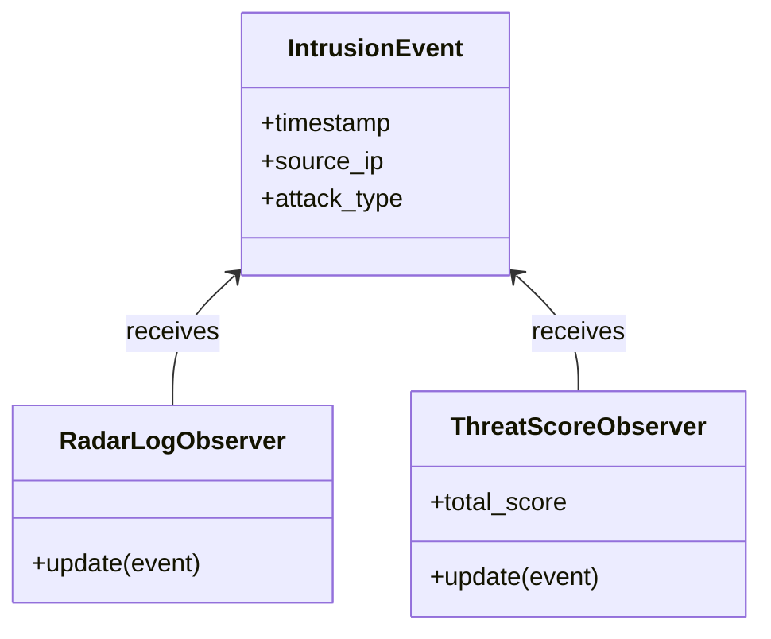

[@nqounet](https://x.com/nqounet)です。

[前回](/2026/01/18/061232/)は通知先を増やそうとしてコードが破綻する様子を見ました。1つのループで「ログ出力」「スコア計算」「アラート」と何でもやろうとして、修正が大変になる未来が見えましたね。

今回はこの問題を解決するため、**通知担当を別クラスに分離**します。

## 分離の方針

現在のコードでは、1つのループ内で複数の処理を行っています。

```perl
for my $event (@events) {
    # ログ出力
    # スコア計算
    # アラートチェック
    # ...全部ここに詰め込み
}
```

これを「担当者ごとに分ける」という発想で改善します。



- **ログ担当**: 侵入イベントをコンソールに表示する
- **スコア担当**: 脅威スコアを計算して累計を管理する

それぞれの担当は、自分の仕事だけに集中します。

## ログ担当クラスを作る

まず、ログ出力だけを担当するクラスを作りましょう。

```perl
#!/usr/bin/env perl
# 言語: perl
# バージョン: 5.36以上
# 依存: Moo（cpanmでインストール）

use v5.36;

package IntrusionEvent;
use Moo;

has timestamp => (
    is       => 'ro',
    required => 1,
);

has source_ip => (
    is       => 'ro',
    required => 1,
);

has attack_type => (
    is       => 'ro',
    required => 1,
);

package RadarLogObserver;
use Moo;

sub update ($self, $event) {
    say "=== 侵入イベント検知 ===";
    say "時刻: " . $event->timestamp;
    say "発信元: " . $event->source_ip;
    say "攻撃種別: " . $event->attack_type;
    say "";
}

package ThreatScoreObserver;
use Moo;

my %threat_scores = (
    'SSH Brute Force'       => 80,
    'Port Scan'             => 30,
    'SQL Injection Attempt' => 90,
    'XSS Attack'            => 70,
);

has total_score => (
    is      => 'rw',
    default => 0,
);

sub update ($self, $event) {
    my $score = $threat_scores{$event->attack_type} // 50;
    $self->total_score($self->total_score + $score);
    say "[脅威スコア] $score 加算 (累計: " . $self->total_score . ")";
}

package main;

# 通知担当を用意
my $log_observer   = RadarLogObserver->new;
my $score_observer = ThreatScoreObserver->new;

# イベントを作成
my @events = (
    IntrusionEvent->new(
        timestamp   => '2026-01-18T06:00:00+09:00',
        source_ip   => '192.168.1.100',
        attack_type => 'SSH Brute Force',
    ),
    IntrusionEvent->new(
        timestamp   => '2026-01-18T06:01:15+09:00',
        source_ip   => '10.0.0.55',
        attack_type => 'Port Scan',
    ),
);

# 各イベントを処理
for my $event (@events) {
    $log_observer->update($event);
    $score_observer->update($event);
}
```

実行結果はこうなります。

```
=== 侵入イベント検知 ===
時刻: 2026-01-18T06:00:00+09:00
発信元: 192.168.1.100
攻撃種別: SSH Brute Force

[脅威スコア] 80 加算 (累計: 80)
=== 侵入イベント検知 ===
時刻: 2026-01-18T06:01:15+09:00
発信元: 10.0.0.55
攻撃種別: Port Scan

[脅威スコア] 30 加算 (累計: 110)
```

## 何が良くなったのか

前回のコードと比べて、大きく改善した点があります。

### 改善1: 責務が分離された

- `RadarLogObserver`: ログ出力だけを担当
- `ThreatScoreObserver`: スコア計算だけを担当

それぞれのクラスは「自分の仕事」に集中しています。これが**単一責任の原則（SRP）**です。

### 改善2: 共通のインターフェース

どちらのクラスも`update`というメソッドを持っています。これにより、イベント処理のループがシンプルになりました。

```perl
for my $event (@events) {
    $log_observer->update($event);
    $score_observer->update($event);
}
```

新しい通知先を追加したくなったら、`update`メソッドを持つ新しいクラスを作れば良いのです。

## 今回のまとめ

今回は通知担当を別クラスに分離することで、コードの責務を明確にしました。

- `RadarLogObserver`: ログ出力専門
- `ThreatScoreObserver`: スコア計算専門
- 共通の`update`メソッドで統一的に呼び出せる

これで各クラスは自分の仕事に集中でき、変更の影響範囲も限定されます。

## 次回予告

次回は「この`update`メソッド、ちゃんと持っていることを保証したい」という話です。Moo::Roleを使って、通知担当が満たすべき**契約**を定義します。

インターフェースの力を感じてください。
