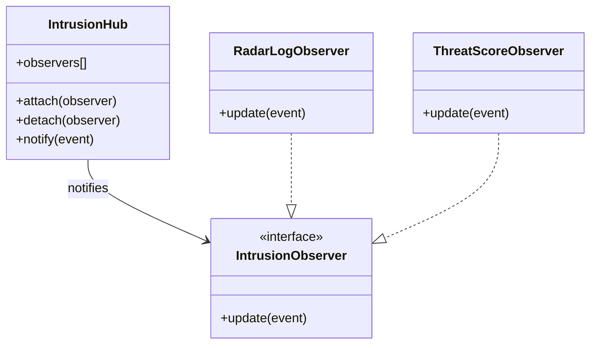

[@nqounet](https://x.com/nqounet)です。

[前回](/2026/01/18/061306/)はMoo::Roleで通知担当の契約を定義しました。Observerは`update`メソッドを持つことが保証されています。

でも、現在のコードには面倒な点が残っています。

```perl
for my $event (@events) {
    $log_observer->update($event);
    $score_observer->update($event);
    # 通知先が増えるたびにここに追加...
}
```

通知先が増えるたびに、ループ内のコードを変更しなければなりません。今回は「通知を一元管理する司令塔」を作って、この問題を解決します。

## 司令塔の設計

司令塔（IntrusionHub）は以下の役割を持ちます。

- Observerを登録する（attach）
- Observerを解除する（detach）
- 全Observerに通知する（notify）



イベントが発生したら、司令塔が登録されているすべてのObserverに通知を送ります。

```perl
#!/usr/bin/env perl
# 言語: perl
# バージョン: 5.36以上
# 依存: Moo（cpanmでインストール）

use v5.36;

package IntrusionEvent;
use Moo;

has timestamp => (
    is       => 'ro',
    required => 1,
);

has source_ip => (
    is       => 'ro',
    required => 1,
);

has attack_type => (
    is       => 'ro',
    required => 1,
);

package IntrusionObserver;
use Moo::Role;

requires 'update';

package RadarLogObserver;
use Moo;
with 'IntrusionObserver';

sub update ($self, $event) {
    say "=== 侵入イベント検知 ===";
    say "時刻: " . $event->timestamp;
    say "発信元: " . $event->source_ip;
    say "攻撃種別: " . $event->attack_type;
    say "";
}

package ThreatScoreObserver;
use Moo;
with 'IntrusionObserver';

my %threat_scores = (
    'SSH Brute Force'       => 80,
    'Port Scan'             => 30,
    'SQL Injection Attempt' => 90,
    'XSS Attack'            => 70,
);

has total_score => (
    is      => 'rw',
    default => 0,
);

sub update ($self, $event) {
    my $score = $threat_scores{$event->attack_type} // 50;
    $self->total_score($self->total_score + $score);
    say "[脅威スコア] $score 加算 (累計: " . $self->total_score . ")";
}

# 司令塔クラス
package IntrusionHub;
use Moo;

has observers => (
    is      => 'ro',
    default => sub { [] },
);

sub attach ($self, $observer) {
    push $self->observers->@*, $observer;
    say "[司令塔] Observerを登録しました";
}

sub detach ($self, $observer) {
    $self->observers->@* = grep { $_ != $observer } $self->observers->@*;
    say "[司令塔] Observerを解除しました";
}

sub notify ($self, $event) {
    for my $observer ($self->observers->@*) {
        $observer->update($event);
    }
}

package main;

# 司令塔を作成
my $hub = IntrusionHub->new;

# Observerを登録
my $log_observer   = RadarLogObserver->new;
my $score_observer = ThreatScoreObserver->new;

$hub->attach($log_observer);
$hub->attach($score_observer);

# イベント発生！
my @events = (
    IntrusionEvent->new(
        timestamp   => '2026-01-18T06:00:00+09:00',
        source_ip   => '192.168.1.100',
        attack_type => 'SSH Brute Force',
    ),
    IntrusionEvent->new(
        timestamp   => '2026-01-18T06:01:15+09:00',
        source_ip   => '10.0.0.55',
        attack_type => 'Port Scan',
    ),
);

# 司令塔を通じて通知
for my $event (@events) {
    $hub->notify($event);
}
```

実行結果はこうなります。

```
[司令塔] Observerを登録しました
[司令塔] Observerを登録しました
=== 侵入イベント検知 ===
時刻: 2026-01-18T06:00:00+09:00
発信元: 192.168.1.100
攻撃種別: SSH Brute Force

[脅威スコア] 80 加算 (累計: 80)
=== 侵入イベント検知 ===
時刻: 2026-01-18T06:01:15+09:00
発信元: 10.0.0.55
攻撃種別: Port Scan

[脅威スコア] 30 加算 (累計: 110)
```

## コードが簡潔になった

注目してほしいのは、イベント処理のループです。

```perl
for my $event (@events) {
    $hub->notify($event);
}
```

たった1行です。どのObserverが登録されているかは、ループ側は知りません。「司令塔に通知を依頼する」だけで、司令塔が登録済みの全Observerに通知を届けてくれます。

## attach/detach/notify

司令塔の3つのメソッドを確認しましょう。

```perl
sub attach ($self, $observer) {
    push $self->observers->@*, $observer;
}
```

`attach`はObserverをリストに追加します。

```perl
sub detach ($self, $observer) {
    $self->observers->@* = grep { $_ != $observer } $self->observers->@*;
}
```

`detach`はObserverをリストから削除します（今回は使っていませんが、次回活躍します）。

```perl
sub notify ($self, $event) {
    for my $observer ($self->observers->@*) {
        $observer->update($event);
    }
}
```

`notify`は登録されているすべてのObserverの`update`を呼び出します。

## 今回のまとめ

今回は司令塔（IntrusionHub）を作成し、Observerを一元管理できるようにしました。

- `attach`: Observerを登録
- `detach`: Observerを解除
- `notify`: 全Observerに通知

イベント処理のコードがシンプルになり、新しいObserverを追加するときも`attach`で登録するだけで済むようになりました。

## 次回予告

次回は`detach`の出番です。「深夜帯だけアラートを有効にしたい」という要望に応えるため、Observerを動的に登録・解除する機能を活用します。

ランタイムでの切り替えがいかに便利か、体感してください。
