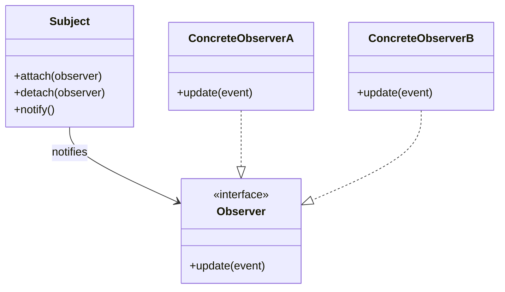

[@nqounet](https://x.com/nqounet)です。

[前回](/2026/01/18/061431/)でハニーポット侵入レーダーの司令室が完成しました。ログ・スコア・リスクレベル・アラートが連動する、なかなか本格的なシステムになりましたね。

最終回の今回は、ここまで作ってきた設計の**正体**を明かします。

## 実は有名なパターンだった

このシリーズで作った設計、実は**Observerパターン**というGoF（Gang of Four）のデザインパターンの1つです。

## クラス対応表

私たちが作ったクラスと、Observerパターンの標準的な役割を対応させてみましょう。

| パターン上の役割 | 私たちのクラス | 責務 |
|-----------------|---------------|------|
| Subject（発行者） | IntrusionHub | Observerの管理と通知 |
| Observer（購読者インターフェース） | IntrusionObserver（Role） | updateメソッドの契約 |
| ConcreteObserver（具体的な購読者） | RadarLogObserver | ログ出力 |
| ConcreteObserver | ThreatScoreObserver | スコア計算 |
| ConcreteObserver | RiskLevelObserver | リスクレベル判定 |
| ConcreteObserver | AlertObserver | アラート通知 |
| Event（イベント） | IntrusionEvent | 通知データ |

## Observerパターンの本質

Observerパターンの本質は「**1対多の依存関係を定義し、一つのオブジェクトの状態が変化したら、依存するすべてのオブジェクトに自動的に通知する**」ことです。

私たちのシステムでは、これが以下のように実現されています。

- **1（Subject）**: IntrusionHub（侵入イベントの発生源）
- **多（Observers）**: RadarLogObserver、ThreatScoreObserver、RiskLevelObserver、AlertObserver
- **状態変化**: 侵入イベントの発生
- **自動通知**: `notify`による一斉呼び出し

## なぜObserverパターンが有効か

このパターンには以下の利点があります。

*疎結合*

SubjectはObserverの具体的な実装を知りません。「`update`を持っている何か」としか認識していません。これにより、新しいObserverを追加しても既存コードへの影響がありません。

*柔軟性*

Observerを動的に追加・削除できます。深夜だけアラートをONにする、といった運用が可能です。

*拡張性*

開放閉鎖の原則（OCP）を自然に満たします。新機能は新しいクラスとして追加するだけ。

## Pub/Subとの比較

Observerパターンと似た仕組みに「Pub/Sub（Publish-Subscribe）」があります。

| 項目 | Observer | Pub/Sub |
|------|----------|---------|
| 結合度 | SubjectはObserverを直接知っている | PublisherはSubscriberを知らない |
| 仲介者 | なし | メッセージブローカーが仲介 |
| 通知 | 同期的 | 非同期的が多い |
| スケール | 小〜中規模 | 大規模分散システム向け |

Observerパターンはより直接的でシンプル、Pub/Subはより疎結合で大規模向けです。今回の侵入レーダーのようなアプリケーション内通知にはObserverが適しています。

## 注意点とデメリット

Observerパターンにも課題はあります。実運用で気をつけるべき点を挙げておきましょう。

| 注意点 | 説明 | 対策 |
|-------|------|------|
| 通知順序が不定 | Observerの呼び出し順序は保証されない | 順序に依存しない設計にする |
| 参照保持によるリーク | detachを忘れるとObserverが解放されない | 不要になったら必ずdetach |
| 大量通知の負荷 | Observerが増えるほど通知コストが増加 | 必要なものだけ登録する |

今回のシリーズではこれらの問題には深入りしませんでしたが、実際のプロジェクトでは意識しておくと良いでしょう。

## デザインパターンを学ぶ意義

「パターンなんて覚えなくても動くコードは書ける」という意見もあります。確かにその通りです。

しかし、パターンを知っていると以下の利点があります。

- **共通語彙**: 「これObserverパターンね」で設計の意図が伝わる
- **車輪の再発明を防ぐ**: 先人の知恵を活用できる
- **思考の引き出し**: 問題に対する解決策の候補が増える

## シリーズまとめ

全10回を通じて、以下のことを学びました。

| 回 | テーマ | 学んだこと |
|----|-------|-----------|
| 第1回 | 最小構成 | イベントクラスの設計 |
| 第2回 | 破綻 | SRP/OCP違反の弊害 |
| 第3回 | クラス分離 | 責務の分離 |
| 第4回 | Role契約 | インターフェースの定義 |
| 第5回 | 司令塔 | Subject/Observerの関係 |
| 第6回 | 動的登録 | 柔軟な運用 |
| 第7回 | 型チェック | 堅牢性の向上 |
| 第8回 | OCP実践 | 拡張容易性 |
| 第9回 | 統合完成 | 達成感 |
| 第10回 | パターン | 設計知識の体系化 |

## おわりに

このシリーズでは「知っている知識で動くものを作る → 破綻する → パターンで解決する」という流れを体験しました。

Observerパターンは、イベント駆動型のシステムでよく使われます。GUIのイベントハンドラ、ログシステム、通知機能など、応用範囲は広いです。

ぜひ、自分のプロジェクトでも活用してみてください。

お疲れさまでした！

## 参考リンク


