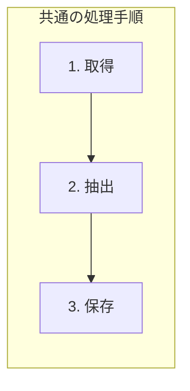

[@nqounet](https://x.com/nqounet)です。

前回は、ニューススクレイパーをコピペして天気予報スクレイパーを作ったところ、大量の重複コードが発生する問題を見ました。今回は、この重複を解消するために「共通部分」と「異なる部分」を整理していきましょう。

## このシリーズについて

このシリーズは「Mooで覚えるオブジェクト指向プログラミング」シリーズを読了した方を対象に、実践的なWebスクレイパーを作りながらオブジェクト指向設計を深く学ぶシリーズです。

シリーズ全体の目次は以下をご覧ください。



## スクレイピングの「処理の流れ」を整理する


まず、ニューススクレイパーと天気スクレイパーで行っている処理を、ステップごとに整理してみましょう。

| ステップ | ニューススクレイパー | 天気スクレイパー |
|---------|---------------------|-----------------|
| 1. 取得 | ニュースサイトからHTML取得 | 天気サイトからHTML取得 |
| 2. 抽出 | h2.headlineを抽出 | tr.day-forecastを抽出 |
| 3. 保存 | 画面に表示 | ファイルに保存 |

この表を見ると、「取得→抽出→保存」という処理の流れ（手順）自体は共通していることがわかります。違うのは、各ステップの具体的な内容です。

これを図にすると、以下のようになります。



## まずは関数化してみる

共通する処理を関数化することで、重複を減らすことができます。まずは、「取得」の部分を関数にしてみましょう。

```perl
#!/usr/bin/env perl
# 言語: perl
# バージョン: 5.36以上
# 依存: Mojo::UserAgent（Mojoliciousに含まれる）

use v5.36;
use Mojo::UserAgent;

# 共通の「取得」処理を関数化
sub fetch_html ($url) {
    my $ua = Mojo::UserAgent->new;
    my $res = $ua->get($url)->result;
    
    if ($res->is_success) {
        return $res->dom;
    }
    die "取得失敗: " . $res->message;
}

# ニュースを取得・表示
sub scrape_news () {
    my $dom = fetch_html('file://./sample_news.html');
    
    say "=== ニュース見出し一覧 ===";
    for my $headline ($dom->find('h2.headline')->each) {
        say "- " . $headline->text;
    }
}

# 天気を取得・保存
sub scrape_weather () {
    my $dom = fetch_html('file://./sample_weather.html');
    
    say "=== 週間天気予報 ===";
    for my $row ($dom->find('tr.day-forecast')->each) {
        my $date = $row->at('td.date')->text;
        my $weather = $row->at('td.weather')->text;
        say "$date: $weather";
    }
}

# メイン処理
scrape_news();
say "";
scrape_weather();
```

`fetch_html`関数を共通化したことで、HTTPリクエストの処理を1箇所にまとめることができました。

## さらに共通化を進める

「取得」だけでなく、「保存」の処理も共通化できないでしょうか？たとえば、「配列を受け取って、何らかの形式で出力する」という関数を作ってみましょう。

```perl
#!/usr/bin/env perl
# 言語: perl
# バージョン: 5.36以上
# 依存: Mojo::UserAgent（Mojoliciousに含まれる）

use v5.36;
use Mojo::UserAgent;

# 共通の「取得」処理
sub fetch_html ($url) {
    my $ua = Mojo::UserAgent->new;
    my $res = $ua->get($url)->result;
    
    if ($res->is_success) {
        return $res->dom;
    }
    die "取得失敗: " . $res->message;
}

# 共通の「保存」処理（画面出力）
sub save_to_screen ($title, @data) {
    say "=== $title ===";
    for my $item (@data) {
        say "- $item";
    }
}

# ニュースを抽出（スクレイパー固有の処理）
sub extract_news ($dom) {
    my @headlines;
    for my $headline ($dom->find('h2.headline')->each) {
        push @headlines, $headline->text;
    }
    return @headlines;
}

# 天気を抽出（スクレイパー固有の処理）
sub extract_weather ($dom) {
    my @forecasts;
    for my $row ($dom->find('tr.day-forecast')->each) {
        my $date = $row->at('td.date')->text;
        my $weather = $row->at('td.weather')->text;
        push @forecasts, "$date: $weather";
    }
    return @forecasts;
}

# メイン処理
my $news_dom = fetch_html('file://./sample_news.html');
my @news = extract_news($news_dom);
save_to_screen("ニュース見出し一覧", @news);

say "";

my $weather_dom = fetch_html('file://./sample_weather.html');
my @weather = extract_weather($weather_dom);
save_to_screen("週間天気予報", @weather);
```

これで、処理が3つのステップに明確に分離されました。

## 処理の「骨格」が見えてきた

ここまでリファクタリングを進めると、スクレイピング処理には共通の「骨格（パターン）」があることがはっきり見えてきます。

```perl
# スクレイピングの処理手順（骨格）
sub scrape ($url, $extractor, $title) {
    my $dom = fetch_html($url);        # 1. 取得（共通）
    my @data = $extractor->($dom);     # 2. 抽出（サイトごとに違う）
    save_to_screen($title, @data);     # 3. 保存（今回は共通化）
}
```

この「骨格」を使えば、新しいスクレイパーを追加するときも以下のように書けます。

```perl
# ニューススクレイパー
scrape(
    'file://./sample_news.html',
    \&extract_news,
    "ニュース見出し一覧"
);

# 天気スクレイパー
scrape(
    'file://./sample_weather.html',
    \&extract_weather,
    "週間天気予報"
);
```

## まだ解決できていない問題

関数化によってコードの重複はかなり減りました。しかし、まだいくつかの問題が残っています。

1. 抽出処理の追加が煩雑: 新しいスクレイパーを追加するたびに、新しい関数を定義してコードリファレンスを渡す必要がある
2. 保存方法の切り替えが難しい: 「画面表示」ではなく「ファイル保存」にしたいスクレイパーがあった場合、`save_to_screen`を変更するか、別の保存関数を作る必要がある
3. 状態の管理ができない: 例えば「取得結果をキャッシュしておきたい」「取得したURLを記録しておきたい」といった状態を持てない
4. 拡張性が低い: 「取得前に何か処理をしたい」「保存後にログを残したい」といった追加処理を入れにくい

これらの問題は、関数だけでは解決が難しい問題です。

## オブジェクト指向の出番

ここで、「Mooで覚えるオブジェクト指向プログラミング」で学んだ知識が活きてきます。

オブジェクト指向プログラミングでは、「データ」と「処理」をひとまとめにした「クラス」を定義し、継承やオーバーライドを使って共通部分と固有部分を分離できます。

次回からは、Mooを使ってスクレイパーをクラス化していきます。

## 今回のまとめ

今回は以下のことを学びました。

- スクレイピング処理には「取得→抽出→保存」という共通の骨格がある
- 関数化によってコードの重複を減らせる
- ただし、関数化だけでは拡張性や状態管理に限界がある

## 次回予告

次回は、いよいよMooを使ってスクレイパーをクラス化します。「WebScraper」という基底クラスを作成し、`scrape`メソッドで処理の流れを定義します。そして、各ステップは「抽象メソッド」として宣言し、サブクラスで具体的な実装を行う形にしていきます。

お楽しみに！
