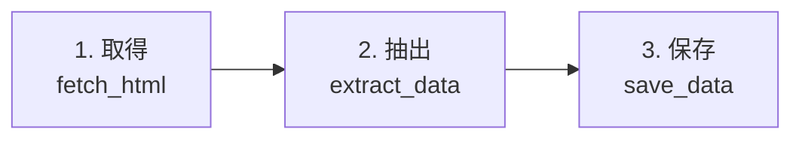
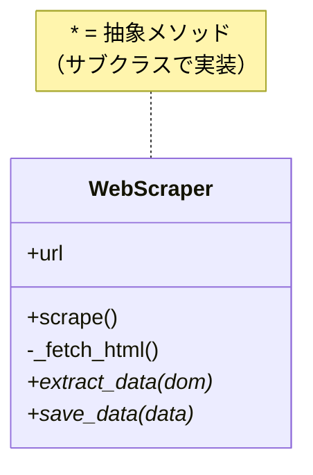

[@nqounet](https://x.com/nqounet)です。

前回は、スクレイピング処理には「取得→抽出→保存」という共通の骨格があることを発見しました。今回は、Mooを使ってこの骨格を「基底クラス」として定義していきます。

## このシリーズについて

このシリーズは「Mooで覚えるオブジェクト指向プログラミング」シリーズを読了した方を対象に、実践的なWebスクレイパーを作りながらオブジェクト指向設計を深く学ぶシリーズです。

シリーズ全体の目次は以下をご覧ください。



## 処理の骨格をクラスで表現する


前回整理した「処理の骨格」をおさらいしましょう。



この流れを、Mooを使ってクラスとして表現していきます。

## WebScraper基底クラスを作成する

まず、スクレイパーの「親クラス（基底クラス）」となる `WebScraper` クラスを作成します。

```perl
package WebScraper;
# 言語: perl
# バージョン: 5.36以上
# 依存: Moo, Mojo::UserAgent（Mojoliciousに含まれる）

use Moo;
use experimental qw(signatures);
use Mojo::UserAgent;

# スクレイピング対象のURL
has url => (
    is       => 'ro',
    required => 1,
);

# メインの処理メソッド：処理の「骨格」を定義
sub scrape ($self) {
    # 1. HTMLを取得
    my $dom = $self->_fetch_html();
    
    # 2. データを抽出（サブクラスで実装）
    my @data = $self->extract_data($dom);
    
    # 3. データを保存（サブクラスで実装）
    $self->save_data(@data);
    
    return @data;
}

# HTMLを取得する（共通処理）
sub _fetch_html ($self) {
    my $ua = Mojo::UserAgent->new;
    my $res = $ua->get($self->url)->result;
    
    if ($res->is_success) {
        return $res->dom;
    }
    die "取得失敗: " . $res->message;
}

# データを抽出する（サブクラスで必ず実装）
sub extract_data ($self, $dom) {
    die "extract_data must be implemented by subclass";
}

# データを保存する（サブクラスで必ず実装）
sub save_data ($self, @data) {
    die "save_data must be implemented by subclass";
}

1;
```

このクラスには3つの重要なポイントがあります。

### ポイント1: 処理の「骨格」を定義する`scrape`メソッド

```perl
sub scrape ($self) {
    my $dom = $self->_fetch_html();      # 1. 取得
    my @data = $self->extract_data($dom); # 2. 抽出
    $self->save_data(@data);              # 3. 保存
    return @data;
}
```

このメソッドは、「取得→抽出→保存」という処理の順番（骨格）を定義しています。この順番は全てのスクレイパーで共通です。

### ポイント2: 共通処理を実装する`_fetch_html`メソッド

```perl
sub _fetch_html ($self) {
    my $ua = Mojo::UserAgent->new;
    my $res = $ua->get($self->url)->result;
    # ...
}
```

HTMLの取得処理は全てのスクレイパーで同じなので、基底クラスで実装しています。メソッド名の先頭にアンダースコア（`_`）をつけているのは、「このメソッドはクラス内部でのみ使用する」という慣習的な表記です。

### ポイント3: サブクラスに実装を強制する「抽象メソッド」

```perl
sub extract_data ($self, $dom) {
    die "extract_data must be implemented by subclass";
}

sub save_data ($self, @data) {
    die "save_data must be implemented by subclass";
}
```

これらのメソッドは、基底クラスでは「実装がない」状態です。呼び出すと`die`でエラーになります。

これは「抽象メソッド」と呼ばれるパターンで、「このメソッドはサブクラスで必ず実装してね」という意味を持ちます。Perlには他の言語のような`abstract`キーワードはありませんが、`die`を使うことで同じ効果を実現しています。

## なぜこの設計が良いのか

この設計には以下のメリットがあります。

1. 処理の順番を保証: `scrape`メソッドで処理の順番が固定されているので、「取得→抽出→保存」の順番が必ず守られる
2. 共通処理を1箇所に: `_fetch_html`の実装は基底クラスに1つだけなので、修正時も1箇所だけで済む
3. 拡張ポイントが明確: `extract_data`と`save_data`をオーバーライドすれば、新しいスクレイパーを簡単に追加できる
4. コードの意図が明確: クラスの構造を見れば、どこが共通でどこがカスタマイズポイントかがすぐわかる

## クラスの構造を図解する

この設計を図にすると、以下のようになります。



`*`がついたメソッドは「抽象メソッド」であり、サブクラスでオーバーライドする必要があります。

## この基底クラスを使ってみる（失敗例）

まだサブクラスを作っていないので、WebScraperを直接使おうとするとどうなるでしょうか？

```perl
#!/usr/bin/env perl
use v5.36;
use lib '.';
use WebScraper;

my $scraper = WebScraper->new(url => 'file://./sample_news.html');
$scraper->scrape();  # ここでエラー！
```

実行結果:

```
extract_data must be implemented by subclass at WebScraper.pm line XX.
```

`extract_data`が実装されていないので、`die`でエラーになります。これは意図した動作です。基底クラスはあくまで「骨格」を定義するものであり、具体的な処理はサブクラスで実装する必要があります。

## 今回のまとめ

今回は以下のことを学びました。

- 処理の「骨格」を基底クラスの`scrape`メソッドで定義する
- 共通処理（`_fetch_html`）は基底クラスで実装する
- サブクラスで実装すべきメソッドは「抽象メソッド」として`die`で宣言する

## 次回予告

次回は、この`WebScraper`基底クラスを継承して、`NewsScraper`と`WeatherScraper`というサブクラスを作成します。`extends`を使って継承し、`extract_data`と`save_data`メソッドをオーバーライドして、それぞれのサイトに特化した処理を実装していきます。

「Mooで覚えるオブジェクト指向プログラミング」で学んだ継承とオーバーライドの知識が、ここで活きてきますよ！

お楽しみに！
