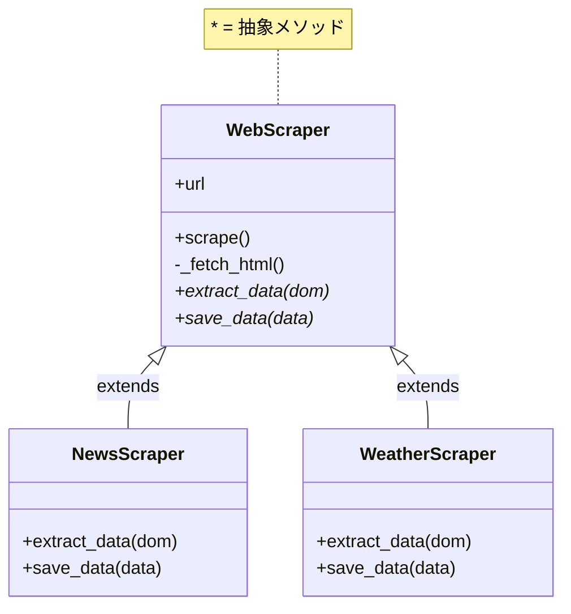
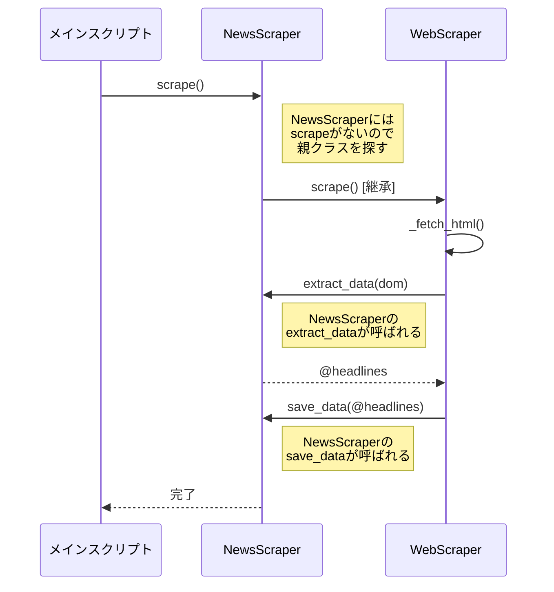

[@nqounet](https://x.com/nqounet)です。

前回は、`WebScraper`という基底クラスを作成し、`scrape`メソッドで処理の骨格を定義しました。今回は、この基底クラスを継承して、ニュースサイト用と天気予報サイト用のスクレイパーを作成します。

## このシリーズについて

このシリーズは「Mooで覚えるオブジェクト指向プログラミング」シリーズを読了した方を対象に、実践的なWebスクレイパーを作りながらオブジェクト指向設計を深く学ぶシリーズです。

シリーズ全体の目次は以下をご覧ください。



継承とオーバーライドについての基礎は、以下の記事で解説しています。






## NewsScraperクラスを作成する

まず、ニュースサイト用のスクレイパーを作成しましょう。`extends`を使って`WebScraper`クラスを継承し、抽象メソッドをオーバーライドします。

```perl
package NewsScraper;
# 言語: perl
# バージョン: 5.36以上
# 依存: Moo, WebScraper

use v5.36;
use Moo;
use experimental qw(signatures);

# WebScraperクラスを継承
extends 'WebScraper';


# extract_dataメソッドをオーバーライド
sub extract_data ($self, $dom) {
    my @headlines;
    
    # h2.headlineから見出しを抽出
    for my $headline ($dom->find('h2.headline')->each) {
        push @headlines, $headline->text;
    }
    
    return @headlines;
}

# save_dataメソッドをオーバーライド
sub save_data ($self, @data) {
    say "=== ニュース見出し一覧 ===";
    for my $headline (@data) {
        say "- $headline";
    }
}

1;
```

このクラスでは、基底クラスで`die`になっていた`extract_data`と`save_data`を、ニュースサイト用の具体的な処理でオーバーライドしています。

## WeatherScraperクラスを作成する

次に、天気予報サイト用のスクレイパーを作成します。

```perl
package WeatherScraper;
# 言語: perl
# バージョン: 5.36以上
# 依存: Moo, WebScraper

use v5.36;
use Moo;
use experimental qw(signatures);

# WebScraperクラスを継承
extends 'WebScraper';


# extract_dataメソッドをオーバーライド
sub extract_data ($self, $dom) {
    my @forecasts;
    
    # tr.day-forecastから天気予報を抽出
    for my $row ($dom->find('tr.day-forecast')->each) {
        my $date = $row->at('td.date')->text;
        my $weather = $row->at('td.weather')->text;
        my $temp = $row->at('td.temp')->text;
        push @forecasts, {
            date    => $date,
            weather => $weather,
            temp    => $temp,
        };
    }
    
    return @forecasts;
}

# save_dataメソッドをオーバーライド
sub save_data ($self, @data) {
    say "=== 週間天気予報 ===";
    for my $forecast (@data) {
        say "$forecast->{date}: $forecast->{weather} ($forecast->{temp})";
    }
}

1;
```

天気予報スクレイパーでは、`extract_data`で日付・天気・気温をハッシュリファレンスとして返し、`save_data`でわかりやすく整形して表示しています。

## クラスの継承関係を図解する

ここまでで作成したクラスの継承関係を図にすると、以下のようになります。



`WebScraper`を継承した`NewsScraper`と`WeatherScraper`が、それぞれ独自の`extract_data`と`save_data`を実装しています。

## 実際に動かしてみる

これらのクラスを使ってスクレイパーを動かすスクリプトを作成しましょう。

```perl
#!/usr/bin/env perl
# 言語: perl
# バージョン: 5.36以上
# 依存: NewsScraper, WeatherScraper

use v5.36;
use lib '.';
use NewsScraper;
use WeatherScraper;

# ニューススクレイパーを実行
my $news = NewsScraper->new(url => 'file://./sample_news.html');
$news->scrape();

say "";

# 天気スクレイパーを実行
my $weather = WeatherScraper->new(url => 'file://./sample_weather.html');
$weather->scrape();
```

このスクリプトを`run_scrapers.pl`として保存し、実行します。

```bash
$ perl run_scrapers.pl
=== ニュース見出し一覧 ===
- Perl 5.42.0が2025年7月にリリース
- PerlがTIOBEインデックスでトップ10に復帰
- Perl Toolchain Summit 2025が開催

=== 週間天気予報 ===
1月20日: 晴れ (12℃/3℃)
1月21日: 曇り (10℃/2℃)
1月22日: 雨 (8℃/5℃)
```

どちらも正常に動作しました！

## 何が起きているのか？

ここで、`$news->scrape()`を呼び出したときに何が起きているかを詳しく見てみましょう。



1. `NewsScraper`には`scrape`メソッドがないので、親クラス`WebScraper`の`scrape`が呼ばれる
2. `scrape`内で`$self->extract_data($dom)`が呼ばれる
3. `$self`は`NewsScraper`のインスタンスなので、`NewsScraper`の`extract_data`が呼ばれる
4. 同様に、`$self->save_data(@data)`では`NewsScraper`の`save_data`が呼ばれる

このように、親クラスで定義した処理の流れ（`scrape`）の中で、子クラスで定義した具体的な処理（`extract_data`, `save_data`）が呼び出される仕組みになっています。

## コピペと比較する

最初に書いたコピペだらけのスクリプトと、今回のクラス設計を比較してみましょう。

| 観点 | コピペアプローチ | クラス継承アプローチ |
|-----|----------------|-------------------|
| 共通処理の場所 | 各スクリプトに分散 | 基底クラスに集約 |
| 新しいサイトの追加 | ファイル全体をコピペ | `extends`して2メソッド実装 |
| 共通処理の修正 | 全ファイルを修正 | 基底クラスだけ修正 |
| コードの見通し | ファイルごとに異なる | 統一された構造 |

明らかにクラス継承アプローチの方が保守性が高いですね。

## 今回のまとめ

今回は以下のことを学びました。

- `extends`を使って基底クラスを継承する
- 抽象メソッド（`extract_data`, `save_data`）をオーバーライドして具体的な処理を実装する
- 親クラスの`scrape`メソッドから、子クラスのオーバーライドしたメソッドが呼び出される

## 次回予告

今回作成した`save_data`メソッドは、ニュースもお天気も「画面に表示」するだけでした。でも、天気データはファイルに保存したいこともありますよね。

次回は、「デフォルトの保存処理」を基底クラスに用意し、必要に応じてサブクラスでカスタマイズできるようにする方法を学びます。これは「Hook Methods（フックメソッド）」と呼ばれるテクニックです。

お楽しみに！
