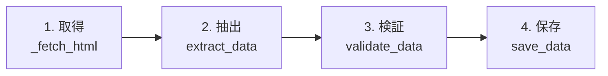

[@nqounet](https://x.com/nqounet)です。

前回は、`save_data`にデフォルト実装を用意し、サブクラスでは必要なときだけオーバーライドできるようにしました。今回は、もうひとつのフックメソッド「`validate_data`」を追加して、抽出したデータの検証機能を実装します。

## このシリーズについて

このシリーズは「Mooで覚えるオブジェクト指向プログラミング」シリーズを読了した方を対象に、実践的なWebスクレイパーを作りながらオブジェクト指向設計を深く学ぶシリーズです。

シリーズ全体の目次は以下をご覧ください。



## なぜデータ検証が必要なのか


Webスクレイピングでは、取得したデータが期待通りでないことがあります。

- Webサイトの構造が変わって、要素が見つからない
- 想定外の形式のデータが返ってくる
- 空のデータが返ってくる

こうした問題を早期に発見するために、データ検証の仕組みを追加しましょう。

## validate_dataフックメソッドを追加する

`scrape`メソッドの処理フローに、「検証」ステップを追加します。



基底クラス`WebScraper`を以下のように更新します。

```perl
package WebScraper;
# 言語: perl
# バージョン: 5.36以上
# 依存: Moo, Mojo::UserAgent（Mojoliciousに含まれる）

use Moo;
use experimental qw(signatures);
use Mojo::UserAgent;

has url => (
    is       => 'ro',
    required => 1,
);

has output_file => (
    is      => 'ro',
    default => sub { undef },
);

# 処理の骨格を定義（検証ステップを追加）
sub scrape ($self) {
    my $dom = $self->_fetch_html();       # 1. 取得
    my @data = $self->extract_data($dom); # 2. 抽出
    $self->validate_data(@data);          # 3. 検証（新規追加）
    $self->save_data(@data);              # 4. 保存
    return @data;
}

sub _fetch_html ($self) {
    my $ua = Mojo::UserAgent->new;
    my $res = $ua->get($self->url)->result;
    
    if ($res->is_success) {
        return $res->dom;
    }
    die "取得失敗: " . $res->message;
}

# 抽象メソッド
sub extract_data ($self, $dom) {
    die "extract_data must be implemented by subclass";
}

# フックメソッド: デフォルトは何もしない
sub validate_data ($self, @data) {
    # デフォルトでは検証をスキップ
    # サブクラスで必要に応じてオーバーライド
    return 1;
}

# フックメソッド: デフォルトの保存処理
sub save_data ($self, @data) {
    if ($self->output_file) {
        open my $fh, '>', $self->output_file
            or die "Cannot open file: $!";
        for my $item (@data) {
            if (ref $item eq 'HASH') {
                print $fh join(", ", map { "$_: $item->{$_}" } keys %$item) . "\n";
            } else {
                print $fh "$item\n";
            }
        }
        close $fh;
        say "結果を " . $self->output_file . " に保存しました";
    } else {
        for my $item (@data) {
            if (ref $item eq 'HASH') {
                say join(", ", map { "$_: $item->{$_}" } keys %$item);
            } else {
                say $item;
            }
        }
    }
}

1;
```

`validate_data`は「何もしない」がデフォルトです。つまり、検証が不要なスクレイパーは何もしなくてよいのです。

## NewsScraperに検証を追加する

ニューススクレイパーに、簡単なデータ検証を追加しましょう。「見出しが1つもなかったらエラー」というルールにします。

```perl
package NewsScraper;
# 言語: perl
# バージョン: 5.36以上
# 依存: Moo, WebScraper

use Moo;
use experimental qw(signatures);

extends 'WebScraper';

sub extract_data ($self, $dom) {
    my @headlines;
    for my $headline ($dom->find('h2.headline')->each) {
        push @headlines, $headline->text;
    }
    return @headlines;
}

# 検証処理を追加
sub validate_data ($self, @data) {
    if (@data == 0) {
        die "エラー: ニュースの見出しが1つも見つかりませんでした。\n"
          . "サイトの構造が変わった可能性があります。";
    }
    
    # 見出しの長さをチェック
    for my $headline (@data) {
        if (length($headline) > 200) {
            warn "警告: 見出しが200文字を超えています: $headline\n";
        }
    }
    
    say "検証OK: " . scalar(@data) . " 件のニュースを取得しました";
    return 1;
}

1;
```

## WeatherScraperには検証を追加しない

天気予報スクレイパーでは、特に検証は必要ないと判断しました。この場合、`validate_data`をオーバーライドする必要はありません。基底クラスのデフォルト実装（何もしない）がそのまま使われます。

```perl
package WeatherScraper;
# 言語: perl
# バージョン: 5.36以上
# 依存: Moo, WebScraper

use Moo;
use experimental qw(signatures);

extends 'WebScraper';

sub extract_data ($self, $dom) {
    my @forecasts;
    for my $row ($dom->find('tr.day-forecast')->each) {
        my $date = $row->at('td.date')->text;
        my $weather = $row->at('td.weather')->text;
        my $temp = $row->at('td.temp')->text;
        push @forecasts, {
            date    => $date,
            weather => $weather,
            temp    => $temp,
        };
    }
    return @forecasts;
}

sub save_data ($self, @data) {
    say "┌─────────────────────────────────┐";
    say "│       週間天気予報              │";
    say "├─────────┬────────┬──────────────┤";
    say "│ 日付    │ 天気   │ 気温         │";
    say "├─────────┼────────┼──────────────┤";
    for my $f (@data) {
        printf "│ %-7s │ %-6s │ %-12s │\n",
            $f->{date}, $f->{weather}, $f->{temp};
    }
    say "└─────────┴────────┴──────────────┘";
}

# validate_dataはオーバーライドしない
# → 基底クラスのデフォルト（何もしない）が使われる

1;
```

## 実行してみる

ニューススクレイパーを実行すると、検証メッセージが表示されます。

```perl
#!/usr/bin/env perl
use v5.36;
use lib '.';
use NewsScraper;
use WeatherScraper;

my $news = NewsScraper->new(url => 'file://./sample_news.html');
$news->scrape();

say "";

my $weather = WeatherScraper->new(url => 'file://./sample_weather.html');
$weather->scrape();
```

実行結果:

```
検証OK: 3 件のニュースを取得しました
Perl 5.40がリリースされました
Mojoliciousが10周年を迎える
CPANモジュール数が5万を突破

┌─────────────────────────────────┐
│       週間天気予報              │
├─────────┬────────┬──────────────┤
│ 日付    │ 天気   │ 気温         │
├─────────┼────────┼──────────────┤
│ 1月20日  │ 晴れ   │ 12℃/3℃      │
│ 1月21日  │ 曇り   │ 10℃/2℃      │
│ 1月22日  │ 雨     │ 8℃/5℃       │
└─────────┴────────┴──────────────┘
```

ニューススクレイパーでは「検証OK」のメッセージが表示されていますね。天気スクレイパーは検証をスキップしています。

## 空のHTMLで試してみる

検証が正しく動くか確認するため、空のHTMLを作成してテストしてみましょう。

```html
<!-- sample_empty.html -->
<!DOCTYPE html>
<html>
<head><title>空のサイト</title></head>
<body>
    <h1>お知らせはありません</h1>
</body>
</html>
```

```perl
my $news = NewsScraper->new(url => 'file://./sample_empty.html');
$news->scrape();  # ここでdieする
```

実行結果:

```
エラー: ニュースの見出しが1つも見つかりませんでした。
サイトの構造が変わった可能性があります。 at NewsScraper.pm line XX.
```

期待通り、検証でエラーが検出されて処理が停止しました。

## フックメソッドのパターンまとめ

ここまでで、2種類のフックメソッドを見てきました。

| メソッド | デフォルト動作 | オーバーライド目的 |
|---------|--------------|-----------------|
| `save_data` | 画面/ファイル出力 | カスタム形式の出力 |
| `validate_data` | 何もしない | データ検証の追加 |

どちらも「デフォルト動作があるが、必要ならカスタマイズできる」という点で共通しています。

## 今回のまとめ

今回は以下のことを学びました。

- 処理フローに「検証」ステップを追加する設計
- 「何もしない」デフォルト実装のフックメソッド
- サブクラスで必要なときだけ検証ロジックを追加する方法

## 次回予告

ここまでで、ニュースサイトと天気予報サイトの2つのスクレイパーを作成しました。でも、ECサイトの商品情報も取得したくなったらどうしましょう？

次回は、3つ目のスクレイパーを追加します。そのとき、基底クラス`WebScraper`を一切修正せずに、新しいサブクラスを追加するだけで対応できることを確認しましょう。これは「開放閉鎖原則（OCP）」と呼ばれる重要な設計原則です。

お楽しみに！
