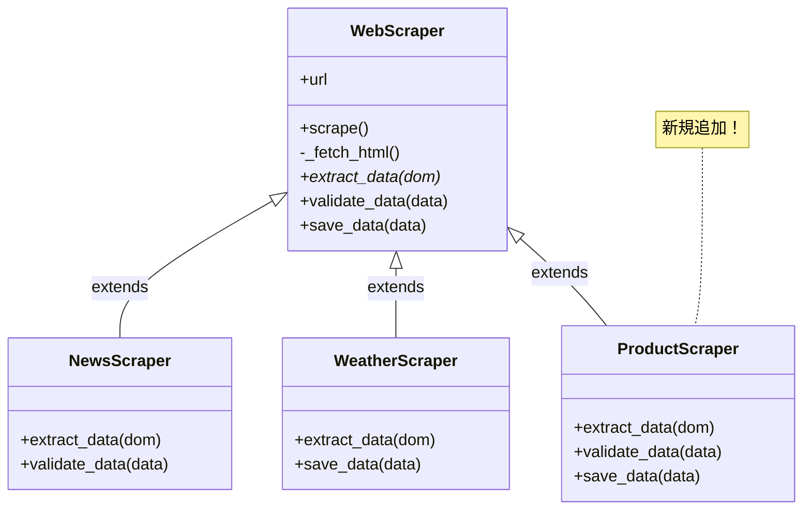

[@nqounet](https://x.com/nqounet)です。

前回は、`validate_data`フックメソッドを追加して、データ検証機能を実装しました。今回は、3つ目のスクレイパーを追加して、この設計の「拡張性」を検証します。

## このシリーズについて

このシリーズは「Mooで覚えるオブジェクト指向プログラミング」シリーズを読了した方を対象に、実践的なWebスクレイパーを作りながらオブジェクト指向設計を深く学ぶシリーズです。

シリーズ全体の目次は以下をご覧ください。



## ECサイトの商品情報を取得したい


ニュースと天気予報のスクレイパーがうまく動いているので、今度はECサイトから商品情報を取得するスクレイパーも作りたくなりました。

まず、サンプルHTMLを作成します。

```html
<!-- sample_products.html -->
<!DOCTYPE html>
<html>
<head>
    <title>サンプルECサイト</title>
</head>
<body>
    <h1>おすすめ商品</h1>
    <div class="product-list">
        <div class="product">
            <h2 class="name">プログラミングPerl 第4版</h2>
            <span class="price">¥5,280</span>
            <span class="stock">在庫あり</span>
        </div>
        <div class="product">
            <h2 class="name">初めてのPerl 第7版</h2>
            <span class="price">¥3,520</span>
            <span class="stock">在庫あり</span>
        </div>
        <div class="product">
            <h2 class="name">Effective Perl</h2>
            <span class="price">¥3,080</span>
            <span class="stock">在庫なし</span>
        </div>
    </div>
</body>
</html>
```

## ProductScraperを追加する

では、商品情報スクレイパーを作成しましょう。やることは簡単です。

1. `WebScraper`を継承する
2. `extract_data`をオーバーライドする
3. 必要なら`validate_data`や`save_data`もオーバーライドする

```perl
package ProductScraper;
# 言語: perl
# バージョン: 5.36以上
# 依存: Moo, WebScraper

use Moo;
use experimental qw(signatures);

extends 'WebScraper';

sub extract_data ($self, $dom) {
    my @products;
    
    for my $product ($dom->find('div.product')->each) {
        my $name = $product->at('h2.name')->text;
        my $price = $product->at('span.price')->text;
        my $stock = $product->at('span.stock')->text;
        
        push @products, {
            name  => $name,
            price => $price,
            stock => $stock,
        };
    }
    
    return @products;
}

# 在庫ありの商品だけ表示するカスタム保存処理
sub save_data ($self, @data) {
    say "=== 在庫あり商品一覧 ===";
    my $in_stock = 0;
    for my $product (@data) {
        if ($product->{stock} eq '在庫あり') {
            say "  $product->{name} ... $product->{price}";
            $in_stock++;
        }
    }
    say "（$in_stock 件の商品が在庫あり）";
}

# 商品データの検証
sub validate_data ($self, @data) {
    if (@data == 0) {
        die "エラー: 商品が見つかりませんでした";
    }
    
    for my $product (@data) {
        # 価格が数値で始まることを確認
        unless ($product->{price} =~ /^[¥$]?[\d,]+/) {
            warn "警告: 価格形式が不正です: $product->{name}";
        }
    }
    
    return 1;
}

1;
```

たったこれだけで、新しいスクレイパーが完成しました！

## 実行してみる

```perl
#!/usr/bin/env perl
use v5.36;
use lib '.';
use ProductScraper;

my $scraper = ProductScraper->new(url => 'file://./sample_products.html');
$scraper->scrape();
```

実行結果:

```
=== 在庫あり商品一覧 ===
  プログラミングPerl 第4版 ... ¥5,280
  初めてのPerl 第7版 ... ¥3,520
（2 件の商品が在庫あり）
```

期待通り動作しています！

## 注目すべきポイント：既存コードは一切変更していない

ここで非常に重要なポイントがあります。

`WebScraper.pm`、`NewsScraper.pm`、`WeatherScraper.pm`は、一切変更していません。

新しい`ProductScraper.pm`というファイルを追加しただけで、新機能（商品情報スクレイピング）を追加できました。



## これが「開放閉鎖原則（OCP）」

このような設計は、開放閉鎖原則（Open-Closed Principle, OCP）と呼ばれる重要な設計原則に従っています。

> ソフトウェアの構成要素は、拡張に対して開いていて、修正に対して閉じているべきである

簡単に言えば、こういうことです。

- 拡張に対して開いている: 新しい機能（新しいスクレイパー）を追加できる
- 修正に対して閉じている: 既存のコード（WebScraperや他のスクレイパー）を修正しなくてよい

## OCPのメリット

OCPに従った設計には、以下のメリットがあります。

1. 既存機能が壊れない: 既存コードを触らないので、動作中の機能に影響を与えない
2. テストが楽: 新しいクラスだけをテストすればよい
3. 並行開発が可能: 他の人がWebScraperを使っていても、自分はProductScraperを追加できる
4. 将来の拡張が予測可能: 新しいサイトを追加するときも、同じパターンで対応できる

## OCPに違反していた最初のコード

シリーズの最初で作ったコピペアプローチを思い出してください。

```perl
# 最初のアプローチ（OCPに違反）
# news_scraper.pl のコードをコピペして...
# weather_scraper.pl を作成
# さらにコピペして...
# product_scraper.pl を作成
```

このアプローチでは、共通処理を修正したいときに全てのファイルを変更する必要がありました。つまり「修正に対して開いていた」のです。

今回のクラス継承アプローチでは、共通処理は`WebScraper`に集約されており、新しいスクレイパーを追加するときも、既存のスクレイパーを修正するときも、影響範囲が限定されています。

## 4つ目のスクレイパーも簡単

さらにスクレイパーを追加したくなっても、パターンは同じです。

```perl
package BookingScraper;  # 例: 予約サイトスクレイパー
use Moo;
extends 'WebScraper';

sub extract_data ($self, $dom) {
    # 予約情報を抽出するロジック
}

# 必要ならvalidate_dataやsave_dataもオーバーライド

1;
```

これだけで新しいスクレイパーが追加できます。

## 今回のまとめ

今回は以下のことを学びました。

- 既存コードを修正せずに新しいスクレイパー（ProductScraper）を追加できた
- これは「開放閉鎖原則（OCP）」に従った設計のおかげ
- OCPに従うと、拡張が容易で、既存機能に影響を与えない

## 次回予告

次回は、ここまで作成してきた全機能を統合して、完成したWebスクレイパーシステムの全体像を確認します。ニュース・天気・商品情報を一括で取得できるスクリプトを作成し、クラス設計の成果を確認しましょう。

お楽しみに！
