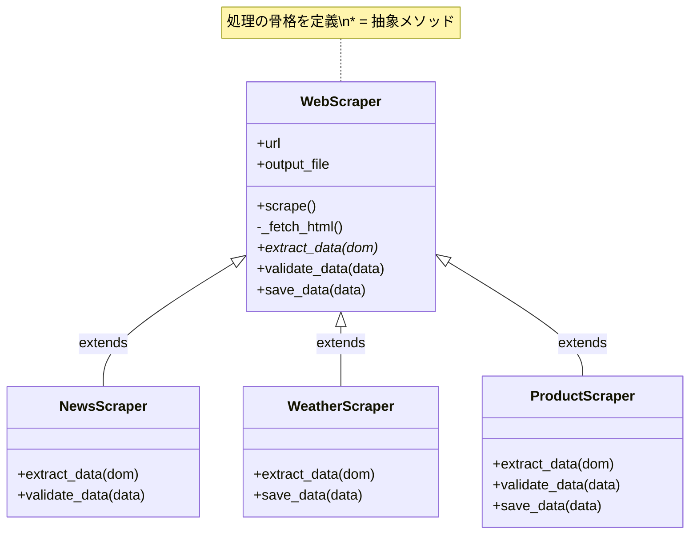
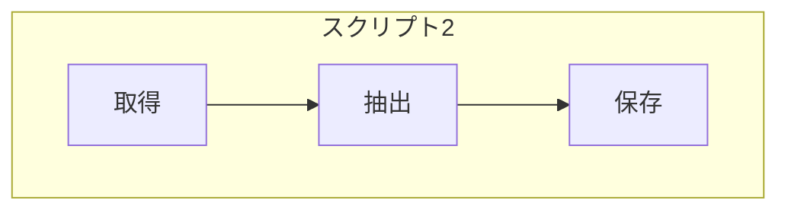
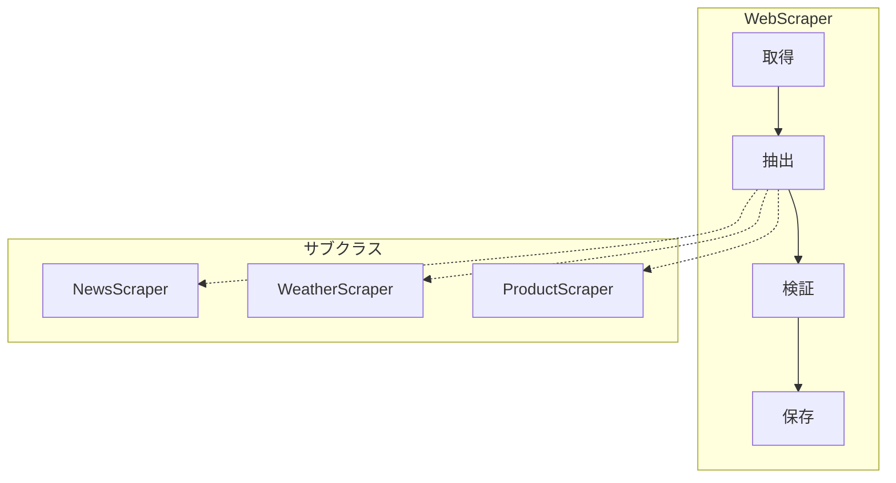

[@nqounet](https://x.com/nqounet)です。

前回は、ProductScraperを追加し、既存コードを修正せずに新機能を追加できることを確認しました。今回は、ここまで作成してきた全てのクラスを統合して、完成したWebスクレイパーシステムの全体像を確認しましょう。

## このシリーズについて

このシリーズは「Mooで覚えるオブジェクト指向プログラミング」シリーズを読了した方を対象に、実践的なWebスクレイパーを作りながらオブジェクト指向設計を深く学ぶシリーズです。

シリーズ全体の目次は以下をご覧ください。



## 完成したクラス構成


これまでに作成したクラスの全体像を図にすると、以下のようになります。



## 各クラスの役割

各クラスの役割を整理しましょう。

### WebScraper（基底クラス）

```perl
package WebScraper;
# 言語: perl
# バージョン: 5.36以上
# 依存: Moo, Mojo::UserAgent

use Moo;
use experimental qw(signatures);
use Mojo::UserAgent;

has url => (
    is       => 'ro',
    required => 1,
);

has output_file => (
    is      => 'ro',
    default => sub { undef },
);

# 処理の骨格（Template Method）
sub scrape ($self) {
    my $dom = $self->_fetch_html();       # 1. 取得
    my @data = $self->extract_data($dom); # 2. 抽出
    $self->validate_data(@data);          # 3. 検証
    $self->save_data(@data);              # 4. 保存
    return @data;
}

# 共通処理
sub _fetch_html ($self) {
    my $ua = Mojo::UserAgent->new;
    my $res = $ua->get($self->url)->result;
    
    if ($res->is_success) {
        return $res->dom;
    }
    die "取得失敗: " . $res->message;
}

# 抽象メソッド（サブクラスで必須）
sub extract_data ($self, $dom) {
    die "extract_data must be implemented by subclass";
}

# フックメソッド（オプション）
sub validate_data ($self, @data) {
    return 1;  # デフォルトは何もしない
}

# フックメソッド（デフォルト実装あり）
sub save_data ($self, @data) {
    if ($self->output_file) {
        open my $fh, '>', $self->output_file
            or die "Cannot open file: $!";
        for my $item (@data) {
            if (ref $item eq 'HASH') {
                print $fh join(", ", map { "$_: $item->{$_}" } keys %$item) . "\n";
            } else {
                print $fh "$item\n";
            }
        }
        close $fh;
        say "結果を " . $self->output_file . " に保存しました";
    } else {
        for my $item (@data) {
            if (ref $item eq 'HASH') {
                say join(", ", map { "$_: $item->{$_}" } keys %$item);
            } else {
                say $item;
            }
        }
    }
}

1;
```

役割: 処理の骨格（取得→抽出→検証→保存）を定義し、共通処理を実装します。

### NewsScraper, WeatherScraper, ProductScraper（サブクラス）

各サブクラスは、サイト固有の抽出ロジックを実装します。

| サブクラス | extract_data | validate_data | save_data |
|-----------|-------------|---------------|-----------|
| NewsScraper | ✓ 実装 | ✓ 実装 | デフォルト使用 |
| WeatherScraper | ✓ 実装 | デフォルト使用 | ✓ 実装 |
| ProductScraper | ✓ 実装 | ✓ 実装 | ✓ 実装 |

## 統合スクリプト

全てのスクレイパーを一括で実行するスクリプトを作成しましょう。

```perl
#!/usr/bin/env perl
# 言語: perl
# バージョン: 5.36以上
# 依存: NewsScraper, WeatherScraper, ProductScraper

use v5.36;
use lib '.';
use NewsScraper;
use WeatherScraper;
use ProductScraper;

say "=" x 50;
say "  Webスクレイパー統合システム";
say "=" x 50;
say "";

# スクレイパーの設定
my @scrapers = (
    {
        class => 'NewsScraper',
        url   => 'file://./sample_news.html',
        name  => 'ニュース',
    },
    {
        class => 'WeatherScraper',
        url   => 'file://./sample_weather.html',
        name  => '天気予報',
    },
    {
        class => 'ProductScraper',
        url   => 'file://./sample_products.html',
        name  => '商品情報',
    },
);

# 各スクレイパーを実行
for my $config (@scrapers) {
    say "【$config->{name}】";
    
    my $class = $config->{class};
    my $scraper = $class->new(url => $config->{url});
    
    eval {
        $scraper->scrape();
    };
    if ($@) {
        warn "エラーが発生しました: $@";
    }
    
    say "";
}

say "=" x 50;
say "  スクレイピング完了！";
say "=" x 50;
```

実行結果:

```
==================================================
  Webスクレイパー統合システム
==================================================

【ニュース】
検証OK: 3 件のニュースを取得しました
Perl 5.40がリリースされました
Mojoliciousが10周年を迎える
CPANモジュール数が5万を突破

【天気予報】
┌─────────────────────────────────┐
│       週間天気予報              │
├─────────┬────────┬──────────────┤
│ 日付    │ 天気   │ 気温         │
├─────────┼────────┼──────────────┤
│ 1月20日  │ 晴れ   │ 12℃/3℃      │
│ 1月21日  │ 曇り   │ 10℃/2℃      │
│ 1月22日  │ 雨     │ 8℃/5℃       │
└─────────┴────────┴──────────────┘

【商品情報】
=== 在庫あり商品一覧 ===
  プログラミングPerl 第4版 ... ¥5,280
  初めてのPerl 第7版 ... ¥3,520
（2 件の商品が在庫あり）

==================================================
  スクレイピング完了！
==================================================
```

3種類のスクレイパーが、それぞれ独自のフォーマットでデータを出力しています。

## 設計の振り返り

ここで、シリーズを通して構築した設計を振り返ってみましょう。

### 最初のアプローチ（コピペ）

```
news_scraper.pl ─┬─ HTTP取得コード
                 ├─ ニュース抽出コード
                 └─ 保存コード

weather_scraper.pl ─┬─ HTTP取得コード（コピペ）
                    ├─ 天気抽出コード
                    └─ 保存コード（コピペ）

product_scraper.pl ─┬─ HTTP取得コード（コピペ）
                    ├─ 商品抽出コード
                    └─ 保存コード（コピペ）
```

問題点: 同じコードが複数箇所に分散。修正時に全ファイルを変更する必要がある。

### 最終的なアプローチ（継承）

```
WebScraper.pm ─┬─ HTTP取得コード（共通）
               ├─ 処理の骨格（scrape）
               ├─ デフォルト保存処理
               └─ 抽象メソッド定義

NewsScraper.pm ─── ニュース抽出コード

WeatherScraper.pm ─┬─ 天気抽出コード
                   └─ カスタム保存処理

ProductScraper.pm ─┬─ 商品抽出コード
                   ├─ 検証処理
                   └─ カスタム保存処理
```

利点: 共通コードは1箇所。新しいスクレイパーはサブクラス追加のみ。

## 処理フローの比較

### 最初のアプローチ





### 最終的なアプローチ



処理の流れは基底クラスで一元管理し、具体的な処理だけをサブクラスに委譲しています。

## 拡張性の検証

この設計は、以下のような変更に簡単に対応できます。

| 変更内容 | 対応方法 |
|---------|---------|
| 新しいサイトを追加 | 新しいサブクラスを作成 |
| 全スクレイパーにログ機能追加 | WebScraperを修正（1箇所のみ） |
| 特定スクレイパーの出力形式変更 | そのサブクラスのsave_dataを修正 |
| HTTP取得時のタイムアウト設定 | WebScraperの_fetch_htmlを修正（1箇所のみ） |

## 今回のまとめ

今回は以下のことを確認しました。

- 全クラスの役割と構造の整理
- 統合スクリプトで全スクレイパーを一括実行
- 最初のアプローチと最終的なアプローチの比較
- 拡張性の高い設計の価値

## 次回予告

最終回では、私たちがこのシリーズで作り上げてきたものの正体を明かします。実は、この設計は「Template Methodパターン」という有名なデザインパターンだったのです！

パターンの正式な定義、Strategyパターンとの違い、そして「Hollywood Principle（制御の反転）」について解説します。

お楽しみに！
