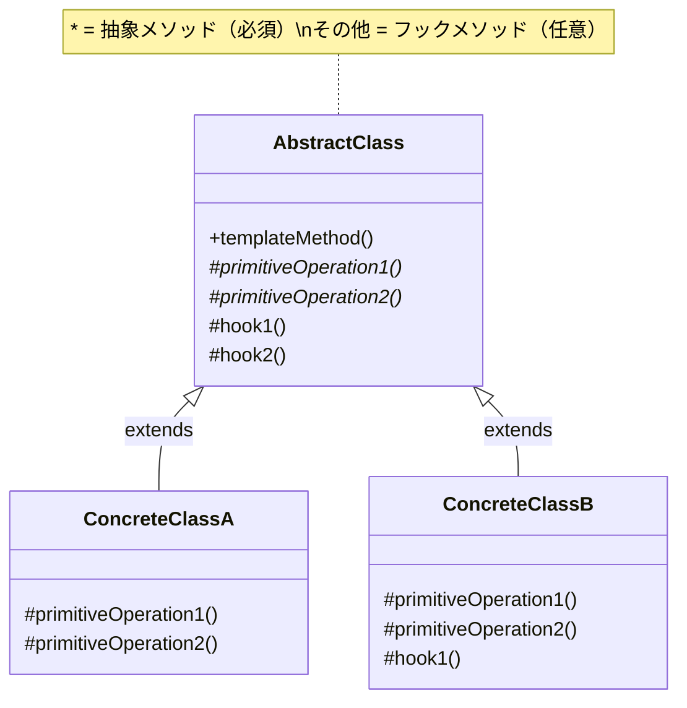
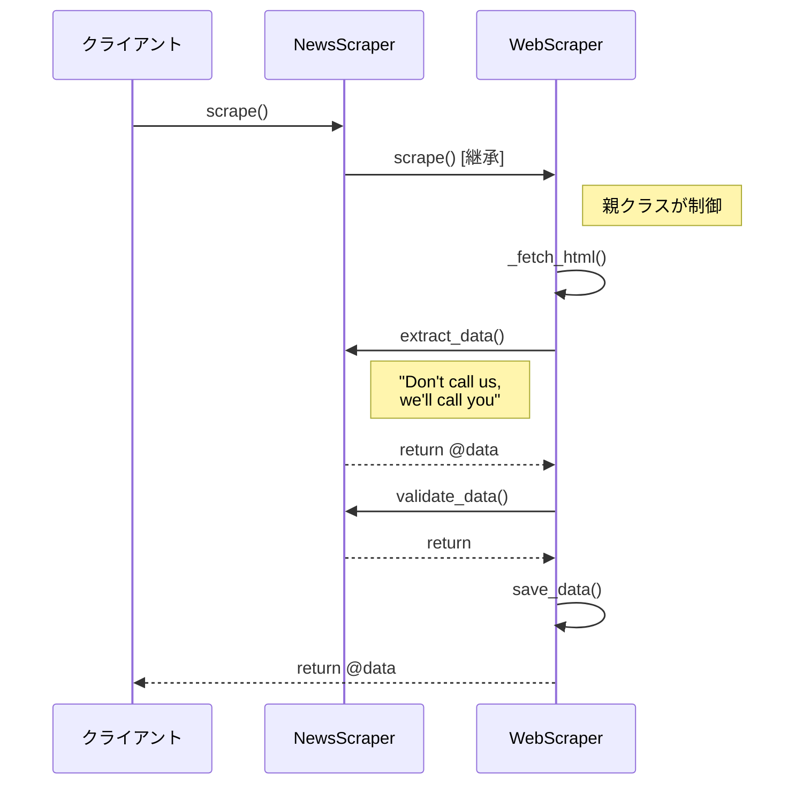

[@nqounet](https://x.com/nqounet)です。

いよいよ最終回です！今回は、このシリーズでこっそり学んできたものの正体を明かします。

## このシリーズについて

このシリーズは「Mooで覚えるオブジェクト指向プログラミング」シリーズを読了した方を対象に、実践的なWebスクレイパーを作りながらオブジェクト指向設計を深く学ぶシリーズです。

シリーズ全体の目次は以下をご覧ください。



## 作ってきたものの正体


これまでのシリーズで、私たちは以下のような設計を構築してきました。

- `WebScraper`基底クラスで「処理の骨格」を定義
- `scrape`メソッドで「取得→抽出→検証→保存」の順序を固定
- サブクラスで具体的な処理（`extract_data`等）をオーバーライド

この設計パターンは、Template Methodパターンという名前で知られています。

## Template Methodパターンとは

Template Methodパターンは、GoF（Gang of Four）が1994年に発表した23のデザインパターンの1つです。振る舞いデザインパターンのカテゴリに属します。

### 公式な定義

> Template Methodは、操作のアルゴリズムの骨格を定義し、そのいくつかのステップをサブクラスで再定義できるようにする。Template Methodは、アルゴリズムの構造を変えずに、アルゴリズムのある特定のステップを再定義することを可能にする。
> 
> — 「オブジェクト指向における再利用のためのデザインパターン」

### 私たちの実装との対応

| パターンの用語 | 私たちの実装 |
|--------------|------------|
| Abstract Class（抽象クラス） | WebScraper |
| Template Method（テンプレートメソッド） | scrape() |
| Primitive Operations（基本操作） | extract_data() |
| Hook Methods（フックメソッド） | validate_data(), save_data() |
| Concrete Classes（具象クラス） | NewsScraper, WeatherScraper, ProductScraper |

## Template Methodパターンの構造

このパターンの構造を図にすると、以下のようになります。



## Hollywood Principle

Template Methodパターンには、「Hollywood Principle（ハリウッド原則）」という重要な原則が適用されています。

> Don't call us, we'll call you.
> 
> （こっちから連絡するから、あなたから電話しないで）

これは、ハリウッドの映画オーディションでよく言われるセリフです。俳優（サブクラス）が監督（親クラス）に連絡するのではなく、監督が俳優を呼び出すという意味です。

### 私たちの実装で見る

```perl
# WebScraper（親クラス）の scrape メソッド
sub scrape ($self) {
    my $dom = $self->_fetch_html();
    my @data = $self->extract_data($dom);  # ← 親が子を呼び出す
    $self->validate_data(@data);           # ← 親が子を呼び出す
    $self->save_data(@data);               # ← 親が子を呼び出す
    return @data;
}
```

ポイントは、親クラスがサブクラスのメソッドを呼び出しているということです。サブクラスは`scrape`を呼び出しますが、その中で自分のメソッドが親クラスから呼び出されます。

これを図にすると、以下のようになります。



## Strategyパターンとの違い

「Mooで覚えるオブジェクト指向プログラミング」シリーズの続編である「ディスパッチャーを作ろう」では、Strategyパターンを学びました。

両者の違いを整理してみましょう。

| 観点 | Template Method | Strategy |
|-----|----------------|----------|
| 実現方法 | 継承（extends） | 委譲（has + Role） |
| 骨格の定義 | 親クラスで定義 | コンテキストクラスで定義 |
| 切り替えタイミング | コンパイル時（クラス定義時） | 実行時（オブジェクト生成時） |
| 関係性 | is-a関係 | has-a関係 |
| 柔軟性 | 低い（継承は変更困難） | 高い（実行時に差し替え可能） |
| コード量 | 少ない | やや多い |

### コードで見る違い

Template Methodパターン（本シリーズ）:

```perl
# 継承ベース
my $scraper = NewsScraper->new(url => $url);
$scraper->scrape();  # 振る舞いはクラスで決まる
```

Strategyパターン:

```perl
# 委譲ベース
my $extractor = NewsExtractor->new();  # 戦略オブジェクト
my $scraper = Scraper->new(
    url       => $url,
    extractor => $extractor,  # 振る舞いを注入
);
$scraper->scrape();  # 振る舞いは注入された戦略で決まる
```

### 使い分け

| こんなとき | おすすめのパターン |
|----------|-----------------|
| 処理の「順序」を固定したい | Template Method |
| 処理の「方法」を実行時に切り替えたい | Strategy |
| サブクラスで処理の一部だけ変えたい | Template Method |
| 複数の処理を組み合わせて使いたい | Strategy |

## Factory Methodパターンとの関係

Factory Methodパターンも継承ベースのパターンですが、Template Methodとは目的が異なります。

| 観点 | Template Method | Factory Method |
|-----|----------------|----------------|
| パターン分類 | 振る舞いパターン | 生成パターン |
| 主な関心 | 処理の骨格を定義 | オブジェクトの生成 |
| 焦点 | 「どの順番で処理するか」 | 「何を作るか」 |

実は、Factory MethodパターンはTemplate Methodパターンの「特殊化」と見なすことができます。Template Methodの「ステップ」が「オブジェクト生成」に特化したものがFactory Methodです。

## デザインパターンを学ぶ意義

このシリーズでは、あえて「Template Methodパターン」という名前を最後まで明かしませんでした。

理由は、パターンの名前よりも、パターンが解決する問題を先に理解してほしかったからです。

私たちは以下の流れでパターンを「発見」しました。

1. コピペで問題が発生する体験
2. 共通の処理手順（骨格）を発見
3. 継承で骨格と詳細を分離
4. フックメソッドで柔軟性を追加
5. OCPで拡張性を実証

この体験があるからこそ、「Template Methodパターン」という名前を聞いたとき、「ああ、あれのことか！」と実感を持って理解できるのです。

## シリーズのまとめ

このシリーズで学んだことを振り返りましょう。

| 回 | 学んだこと |
|----|----------|
| 第1回 | Webスクレイピングの基礎（Mojo::UserAgent, Mojo::DOM） |
| 第2回 | コピペの問題点、DRY原則 |
| 第3回 | 共通処理の発見、関数化 |
| 第4回 | 基底クラス、処理の骨格、抽象メソッド |
| 第5回 | 継承（extends）、オーバーライド |
| 第6回 | フックメソッド、デフォルト実装 |
| 第7回 | フックメソッドの拡張（validate_data） |
| 第8回 | 開放閉鎖原則（OCP） |
| 第9回 | システム統合、設計の振り返り |
| 第10回 | Template Methodパターン、Hollywood Principle |

## 参考文献

Template Methodパターンについてさらに学びたい方は、以下の書籍がおすすめです。





## おわりに

このシリーズを最後まで読んでいただき、ありがとうございました！

Webスクレイパーを作りながら、オブジェクト指向プログラミングの力を体験していただけたでしょうか。

デザインパターンは、先人たちが繰り返し直面した問題の「解決策のカタログ」です。パターンの名前を知っていると、他のエンジニアとの会話がスムーズになります。「あ、それTemplate Methodで解決できますね」と言えるようになると、コミュニケーションが格段に楽になります。

ぜひ、実際のプロジェクトでTemplate Methodパターンを使ってみてください。「コピペが多いな...」と感じたとき、それはTemplate Methodの出番かもしれませんよ！
