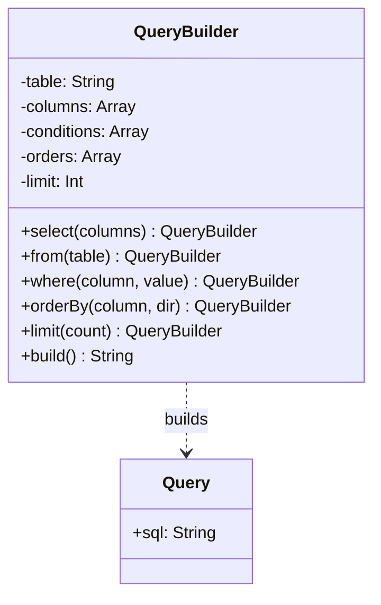

[@nqounet](https://x.com/nqounet)です。

前回はSQLインジェクションの危険性を体験しました。パラメータ地獄、セキュリティホール...問題が山積みですね。

でも大丈夫。今回からBuilderパターンを導入して、これらの問題をエレガントに解決していきます。いよいよ本題です！



## Builderパターンとは

Builderパターンは、GoF（Gang of Four）デザインパターンの1つで、複雑なオブジェクトの構築を段階的に行うパターンです。

核心は以下の3点です:

- 段階的構築: 必要なパーツを順番に追加していく
- Fluent Interface: メソッドチェーンで宣言的に記述
- 構築と表現の分離: 構築プロセスと最終結果を分ける

## パラメータ地獄からの脱出



### QueryBuilder.pm（Fluent Interface版）

```perl
# 言語: perl
# バージョン: 5.36以上
# 依存: Moo

package QueryBuilder;
use v5.36;
use Moo;

has _table      => (is => 'rw');
has _columns    => (is => 'rw', default => sub { [] });
has _conditions => (is => 'rw', default => sub { [] });
has _orders     => (is => 'rw', default => sub { [] });
has _limit      => (is => 'rw');

# テーブル指定
sub from ($self, $table) {
    $self->_table($table);
    return $self;  # メソッドチェーンのためにselfを返す
}

# カラム指定（省略時は*）
sub select ($self, @columns) {
    push $self->_columns->@*, @columns;
    return $self;
}

# WHERE条件
sub where ($self, $column, $value) {
    push $self->_conditions->@*, { column => $column, value => $value };
    return $self;
}

# ORDER BY
sub order_by ($self, $column, $dir = 'ASC') {
    push $self->_orders->@*, { column => $column, dir => $dir };
    return $self;
}

# LIMIT
sub limit ($self, $count) {
    $self->_limit($count);
    return $self;
}

# SQLを生成
sub build ($self) {
    my @columns = $self->_columns->@*;
    my $cols = @columns ? CORE::join(', ', @columns) : '*';
    
    my $sql = "SELECT $cols FROM " . $self->_table;
    
    if ($self->_conditions->@*) {
        my @wheres;
        for my $cond ($self->_conditions->@*) {
            push @wheres, "$cond->{column} = '$cond->{value}'";
        }
        $sql .= " WHERE " . CORE::join(' AND ', @wheres);
    }
    
    if ($self->_orders->@*) {
        my @orders;
        for my $ord ($self->_orders->@*) {
            push @orders, "$ord->{column} $ord->{dir}";
        }
        $sql .= " ORDER BY " . CORE::join(', ', @orders);
    }
    
    if ($self->_limit) {
        $sql .= " LIMIT " . $self->_limit;
    }
    
    return $sql;
}

1;
```

## Before / After

### Before（パラメータ地獄）

```perl
my $query = Query->new(
    table         => 'users',
    where_column  => 'status',
    where_value   => 'active',
    order_column  => 'created_at',
    order_dir     => 'DESC',
    limit_count   => 10,
    offset_count  => 0,
);
```

7個のパラメータ。何が必須で何が任意か分からない。

### After（Builderパターン）

```perl
my $sql = QueryBuilder->new
    ->from('users')
    ->where('status', 'active')
    ->order_by('created_at', 'DESC')
    ->limit(10)
    ->build;
```

美しい！各メソッドが自己文書化されており、意図が明確です。

## メソッドチェーンの秘密

Fluent Interfaceを実現する秘密は、各メソッドが`$self`を返すことです。

```perl
sub from ($self, $table) {
    $self->_table($table);
    return $self;  # ← これがポイント
}
```

これにより、`->from('users')->where('id', 1)`のように連続してメソッドを呼び出せます。

## SOLID原則との関係

Builderパターンは以下のSOLID原則に準拠しています:

- SRP（単一責任）: QueryBuilderは「クエリの構築」のみを担当
- OCP（開放閉鎖）: 新しい句（GROUP BYなど）を追加しても既存コードに影響なし

## まだ残る問題

今回のコードには、まだSQLインジェクションの脆弱性が残っています:

```perl
push @wheres, "$cond->{column} = '$cond->{value}'";  # 危険！
```

Builderパターンで構造は美しくなりましたが、値をそのまま埋め込んでいます。

次回は、プレースホルダーを導入してこの問題を完全に解決します。

## 今回のまとめ

今回はBuilderパターンを導入し、Fluent Interfaceを実装しました。

- メソッドチェーンで段階的にクエリを構築
- パラメータの順序を気にする必要がない
- 必要なメソッドだけを呼び出せる柔軟性
- コードが自己文書化され、意図が明確

次回は、プレースホルダーを導入してSQLインジェクションを完全に防ぎます。
