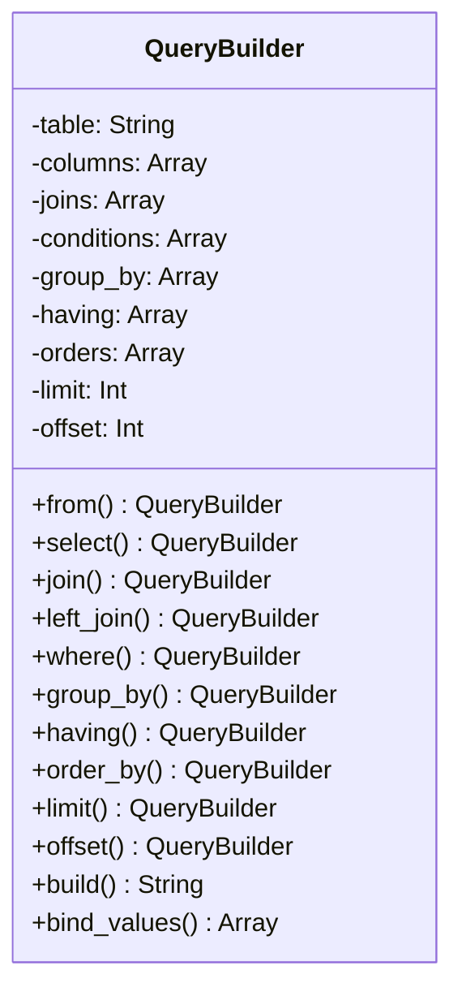

[@nqounet](https://x.com/nqounet)です。

前回はプレースホルダーでセキュリティを強化しました。今回は、JOIN句やGROUP BYなど、より複雑なクエリを構築する機能を追加します。QueryBuilderをパワーアップさせましょう！



## 機能追加の計画

以下の機能を追加します:

- JOIN句（INNER JOIN, LEFT JOIN）
- GROUP BY
- HAVING
- OFFSET（ページネーション用）



第4回から、機能がかなり増えましたね。でも安心してください。各メソッドが`$self`を返すおかげで、使う側のコードはシンプルなままです。

## QueryBuilder.pm（全機能版）

```perl
# 言語: perl
# バージョン: 5.36以上
# 依存: Moo

package QueryBuilder;
use v5.36;
use Moo;

has _table       => (is => 'rw');
has _columns     => (is => 'rw', default => sub { [] });
has _joins       => (is => 'rw', default => sub { [] });
has _conditions  => (is => 'rw', default => sub { [] });
has _group_by    => (is => 'rw', default => sub { [] });
has _having      => (is => 'rw', default => sub { [] });
has _orders      => (is => 'rw', default => sub { [] });
has _limit       => (is => 'rw');
has _offset      => (is => 'rw');
has _bind_values => (is => 'rw', default => sub { [] });

sub from ($self, $table) {
    $self->_table($table);
    return $self;
}

sub select ($self, @columns) {
    push $self->_columns->@*, @columns;
    return $self;
}

# JOIN句
sub join ($self, $table, $on_left, $on_right, $type = 'INNER') {
    push $self->_joins->@*, {
        type     => $type,
        table    => $table,
        on_left  => $on_left,
        on_right => $on_right,
    };
    return $self;
}

sub left_join ($self, $table, $on_left, $on_right) {
    return $self->join($table, $on_left, $on_right, 'LEFT');
}

sub where ($self, $column, $value) {
    push $self->_conditions->@*, { column => $column };
    push $self->_bind_values->@*, $value;
    return $self;
}

# GROUP BY
sub group_by ($self, @columns) {
    push $self->_group_by->@*, @columns;
    return $self;
}

# HAVING
sub having ($self, $column, $op, $value) {
    push $self->_having->@*, { column => $column, op => $op };
    push $self->_bind_values->@*, $value;
    return $self;
}

sub order_by ($self, $column, $dir = 'ASC') {
    push $self->_orders->@*, { column => $column, dir => $dir };
    return $self;
}

sub limit ($self, $count) {
    $self->_limit($count);
    return $self;
}

sub offset ($self, $count) {
    $self->_offset($count);
    return $self;
}

sub build ($self) {
    my @columns = $self->_columns->@*;
    my $cols = @columns ? CORE::join(', ', @columns) : '*';
    
    my $sql = "SELECT $cols FROM " . $self->_table;
    
    # JOIN
    for my $j ($self->_joins->@*) {
        $sql .= " $j->{type} JOIN $j->{table} ON $j->{on_left} = $j->{on_right}";
    }
    
    # WHERE
    if ($self->_conditions->@*) {
        my @wheres = map { "$_->{column} = ?" } $self->_conditions->@*;
        $sql .= " WHERE " . CORE::join(' AND ', @wheres);
    }
    
    # GROUP BY
    if ($self->_group_by->@*) {
        $sql .= " GROUP BY " . CORE::join(', ', $self->_group_by->@*);
    }
    
    # HAVING
    if ($self->_having->@*) {
        my @havings = map { "$_->{column} $_->{op} ?" } $self->_having->@*;
        $sql .= " HAVING " . CORE::join(' AND ', @havings);
    }
    
    # ORDER BY
    if ($self->_orders->@*) {
        my @orders = map { "$_->{column} $_->{dir}" } $self->_orders->@*;
        $sql .= " ORDER BY " . CORE::join(', ', @orders);
    }
    
    # LIMIT / OFFSET
    if ($self->_limit) {
        $sql .= " LIMIT " . $self->_limit;
        if ($self->_offset) {
            $sql .= " OFFSET " . $self->_offset;
        }
    }
    
    return $sql;
}

sub bind_values ($self) {
    return $self->_bind_values->@*;
}

1;
```

## 複雑なクエリの例

### JOIN句を使う

```perl
my $builder = QueryBuilder->new
    ->select('users.name', 'orders.total')
    ->from('users')
    ->join('orders', 'users.id', 'orders.user_id')
    ->where('orders.status', 'completed')
    ->order_by('orders.total', 'DESC');

say $builder->build;
```

出力:

```sql
SELECT users.name, orders.total FROM users INNER JOIN orders ON users.id = orders.user_id WHERE orders.status = ? ORDER BY orders.total DESC
```

### GROUP BYとHAVING

```perl
my $builder = QueryBuilder->new
    ->select('user_id', 'COUNT(*) as order_count', 'SUM(total) as total_amount')
    ->from('orders')
    ->group_by('user_id')
    ->having('SUM(total)', '>', 10000)
    ->order_by('total_amount', 'DESC');

say $builder->build;
```

出力:

```sql
SELECT user_id, COUNT(*) as order_count, SUM(total) as total_amount FROM orders GROUP BY user_id HAVING SUM(total) > ? ORDER BY total_amount DESC
```

### ページネーション

```perl
my $page = 3;
my $per_page = 20;

my $builder = QueryBuilder->new
    ->from('products')
    ->where('category', 'electronics')
    ->order_by('created_at', 'DESC')
    ->limit($per_page)
    ->offset(($page - 1) * $per_page);

say $builder->build;
```

出力:

```sql
SELECT * FROM products WHERE category = ? ORDER BY created_at DESC LIMIT 20 OFFSET 40
```

## OCPの実現

今回の拡張で、OCP（Open/Closed Principle: 開放閉鎖原則）が実現されていることに注目してください。

- 開放: 新しい機能（JOIN, GROUP BY等）を追加できた
- 閉鎖: 既存のコード（`from`, `where`, `build`）を変更する必要がなかった

Builderパターンは、新しい構築ステップを追加しやすい設計になっています。

## 今回のまとめ

今回はJOIN、GROUP BY、HAVING、OFFSETを追加し、実用的なクエリビルダーに近づきました。

- JOIN句で複数テーブルの結合が可能に
- GROUP BY / HAVINGで集計クエリを構築
- LIMIT / OFFSETでページネーション対応
- OCPに準拠した拡張性の高い設計

次回は、よく使うクエリパターンをDirectorクラスで再利用可能にします。
