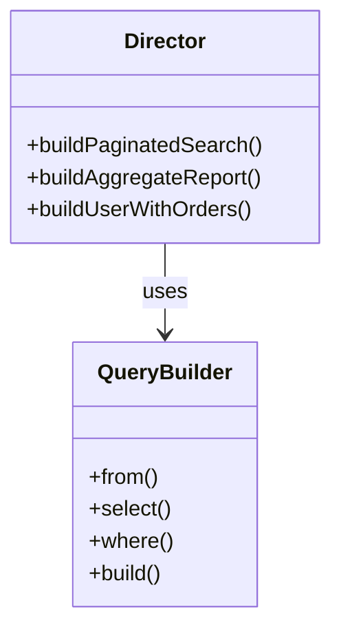

[@nqounet](https://x.com/nqounet)です。

前回はJOINやGROUP BYなど複雑なクエリを構築できるようになりました。でも、同じようなクエリを何度も書くのは面倒ですよね？今回は、よく使うクエリパターンをDirectorクラスで再利用可能にします。



## Directorとは

GoFのBuilderパターンには、Directorという役割があります。



Directorは「構築手順」を知っている役割です:

- Builder: 個々のパーツを構築するメソッドを提供
- Director: パーツを組み合わせて特定のパターンを作る

## QueryDirector.pm

```perl
# 言語: perl
# バージョン: 5.36以上
# 依存: Moo, QueryBuilder

package QueryDirector;
use v5.36;
use Moo;
use QueryBuilder;

# ページネーション付き検索
sub build_paginated_search ($self, %opts) {
    my $table    = $opts{table};
    my $filters  = $opts{filters} // {};
    my $order_by = $opts{order_by} // 'id';
    my $order    = $opts{order} // 'ASC';
    my $page     = $opts{page} // 1;
    my $per_page = $opts{per_page} // 20;
    
    my $builder = QueryBuilder->new->from($table);
    
    for my $column (keys $filters->%*) {
        $builder->where($column, $filters->{$column});
    }
    
    $builder->order_by($order_by, $order)
            ->limit($per_page)
            ->offset(($page - 1) * $per_page);
    
    return $builder;
}

# ユーザー別集計レポート
sub build_user_aggregate ($self, %opts) {
    my $table      = $opts{table};
    my $sum_column = $opts{sum_column};
    my $min_total  = $opts{min_total} // 0;
    
    my $builder = QueryBuilder->new
        ->select('user_id', "COUNT(*) as count", "SUM($sum_column) as total")
        ->from($table)
        ->group_by('user_id');
    
    if ($min_total > 0) {
        $builder->having("SUM($sum_column)", '>', $min_total);
    }
    
    $builder->order_by('total', 'DESC');
    
    return $builder;
}

# ユーザーと関連注文を取得
sub build_user_with_orders ($self, %opts) {
    my $user_id = $opts{user_id};
    my $status  = $opts{status};
    
    my $builder = QueryBuilder->new
        ->select('users.id', 'users.name', 'orders.id as order_id', 'orders.total')
        ->from('users')
        ->left_join('orders', 'users.id', 'orders.user_id')
        ->where('users.id', $user_id);
    
    if ($status) {
        $builder->where('orders.status', $status);
    }
    
    $builder->order_by('orders.created_at', 'DESC');
    
    return $builder;
}

# 最近のアクティブユーザー
sub build_recent_active_users ($self, %opts) {
    my $days  = $opts{days} // 7;
    my $limit = $opts{limit} // 100;
    
    return QueryBuilder->new
        ->select('users.*', 'COUNT(orders.id) as order_count')
        ->from('users')
        ->join('orders', 'users.id', 'orders.user_id')
        ->group_by('users.id')
        ->having('COUNT(orders.id)', '>', 0)
        ->order_by('order_count', 'DESC')
        ->limit($limit);
}

1;
```

## 使い方

### ページネーション付き検索

```perl
use QueryDirector;

my $director = QueryDirector->new;

# 3ページ目のアクティブユーザーを取得
my $builder = $director->build_paginated_search(
    table    => 'users',
    filters  => { status => 'active', role => 'member' },
    order_by => 'created_at',
    order    => 'DESC',
    page     => 3,
    per_page => 25,
);

say $builder->build;
# SELECT * FROM users WHERE status = ? AND role = ? ORDER BY created_at DESC LIMIT 25 OFFSET 50
```

### 集計レポート

```perl
# 購入金額が10000円以上のユーザーを集計
my $builder = $director->build_user_aggregate(
    table      => 'orders',
    sum_column => 'total',
    min_total  => 10000,
);

say $builder->build;
# SELECT user_id, COUNT(*) as count, SUM(total) as total FROM orders GROUP BY user_id HAVING SUM(total) > ? ORDER BY total DESC
```

### ユーザーと注文情報

```perl
# 特定ユーザーの完了済み注文を取得
my $builder = $director->build_user_with_orders(
    user_id => 42,
    status  => 'completed',
);

say $builder->build;
# SELECT users.id, users.name, orders.id as order_id, orders.total FROM users LEFT JOIN orders ON users.id = orders.user_id WHERE users.id = ? AND orders.status = ? ORDER BY orders.created_at DESC
```

## Directorの利点

Directorパターンの利点:

- 定型パターンの再利用: 同じクエリパターンを何度も書く必要がない
- 知識の集約: 「どのテーブルをどうJOINするか」の知識がDirectorに集約される
- 一貫性: アプリケーション全体で同じクエリパターンを使用
- テスタビリティ: Directorのメソッドをユニットテストできる

## Directorなしでも良い場合

すべてのクエリにDirectorが必要なわけではありません:

- 一度しか使わないクエリ → 直接Builderを使う
- 単純なクエリ → 直接Builderを使う
- 繰り返し使うパターン → Directorにまとめる

## 今回のまとめ

今回はDirectorパターンを導入し、定型クエリを再利用可能にしました。

- Directorは「構築手順」を知っている役割
- よく使うパターンをメソッドとして定義
- アプリケーション全体で一貫したクエリ生成
- ビジネスロジックに名前を付けて再利用

次回はバリデーションとテストを追加して、シリーズを完成させます。
