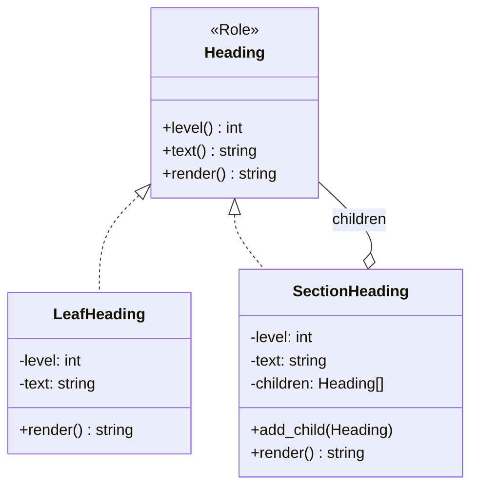

## 前回の振り返り

前回は、階層構造をif/else条件分岐で表現しようとして、**壁にぶつかり**ました。レベル差の計算、HTMLタグの開閉、状態管理が複雑に絡み合い、条件分岐が爆発する問題を体験しました。



今回は、この問題を解決する**Compositeパターン**を導入します。

## Compositeパターンとは

Compositeパターンは、**部分-全体階層**を統一的に扱うためのデザインパターンです。



### 3つの構成要素

1. **Component（Heading Role）**: 共通インターフェースを定義
2. **Leaf（LeafHeading）**: 子を持たない末端要素
3. **Composite（SectionHeading）**: 子を持つ複合要素

ポイントは、**LeafとCompositeが同じインターフェース（Role）を実装**していること。これにより、「子を持つ要素」も「持たない要素」も、同じ`render()`メソッドで処理できます。

## よくある例との比較

Compositeパターンの典型例はファイルシステムです：

- **Leaf**: ファイル（他のファイルを含まない）
- **Composite**: ディレクトリ（ファイルや他のディレクトリを含む）

私たちのMarkdown目次では：

- **Leaf**: 子見出しを持たない見出し
- **Composite**: 子見出しを持つセクション

## Heading Roleの実装

まず、共通インターフェースを定義するRoleを作成します。

```perl
package Heading;
use v5.36;
use Moo::Role;

requires 'level';
requires 'text';
requires 'render';

1;
```

`requires`で、このRoleを実装するクラスが必ず提供すべきメソッドを宣言します。

## LeafHeadingクラスの実装

子を持たない末端の見出しです。

```perl
package LeafHeading;
use v5.36;
use Moo;

with 'Heading';

has 'level' => (
    is       => 'ro',
    required => 1,
);

has 'text' => (
    is       => 'ro',
    required => 1,
);

sub render ($self, $indent = 0) {
    my $spaces = '  ' x $indent;
    return $spaces . '- ' . $self->text;
}

1;
```

`render`メソッドは、インデントレベルを受け取り、その分のスペースを先頭に付けて見出しを返します。

## SectionHeadingクラスの実装

子を持つセクション見出しです。

```perl
package SectionHeading;
use v5.36;
use Moo;

with 'Heading';

has 'level' => (
    is       => 'ro',
    required => 1,
);

has 'text' => (
    is       => 'ro',
    required => 1,
);

has 'children' => (
    is      => 'ro',
    default => sub { [] },
);

sub add_child ($self, $child) {
    push $self->children->@*, $child;
    return $self;
}

sub render ($self, $indent = 0) {
    my $spaces = '  ' x $indent;
    my @lines = ($spaces . '- ' . $self->text);
    
    for my $child ($self->children->@*) {
        push @lines, $child->render($indent + 1);
    }
    
    return join("\n", @lines);
}

1;
```

### コードの解説

#### `children`属性

```perl
has 'children' => (
    is      => 'ro',
    default => sub { [] },
);
```

子要素を格納する配列リファレンス。`default => sub { [] }`で、インスタンスごとに新しい空配列を生成します。

#### `add_child`メソッド

```perl
sub add_child ($self, $child) {
    push $self->children->@*, $child;
    return $self;
}
```

子要素を追加します。`return $self`でメソッドチェーンを可能にしています。

#### `render`メソッド（再帰的処理）

```perl
sub render ($self, $indent = 0) {
    my $spaces = '  ' x $indent;
    my @lines = ($spaces . '- ' . $self->text);
    
    for my $child ($self->children->@*) {
        push @lines, $child->render($indent + 1);
    }
    
    return join("\n", @lines);
}
```

自分自身をレンダリングした後、各子要素の`render`を呼び出します。子要素も同じ`render`メソッドを持っているので、子がさらに子を持っていれば、その子も再帰的に処理されます。

これが**Compositeパターンの威力**です。

## 使用例：ツリー構造を手動で構築

まずは手動でツリー構造を構築してみましょう。

```perl
#!/usr/bin/env perl
use v5.36;
use lib '.';
use LeafHeading;
use SectionHeading;

# ツリー構造を構築
my $root = SectionHeading->new(
    level => 1,
    text  => 'はじめに',
);

my $chapter1 = SectionHeading->new(
    level => 2,
    text  => '第1章',
);

my $section1_1 = LeafHeading->new(
    level => 3,
    text  => 'セクション1.1',
);

my $chapter2 = LeafHeading->new(
    level => 2,
    text  => '第2章',
);

# 親子関係を設定
$chapter1->add_child($section1_1);
$root->add_child($chapter1);
$root->add_child($chapter2);

# レンダリング
say $root->render;
```

### 実行結果

```
- はじめに
  - 第1章
    - セクション1.1
  - 第2章
```

条件分岐なしで、再帰的に正しい階層構造がレンダリングされました！

## 関連する構造パターン

Compositeと同じく「構造パターン」に分類されるパターン：

- [Decoratorパターン（ログ解析パイプライン）](/2026/01/19/211737/) - 動的な責任追加
- [Proxyパターン（ブルートフォース攻撃）](/2026/01/14/004249/) - アクセス制御の構造
- [Facadeパターン（レポートジェネレーター）](/2026/01/12/230702/) - インターフェース簡素化

Compositeとの違いは、**部分-全体階層の統一的扱い**にあります。

## 完成コード

### Heading Role

```perl
package Heading;
use v5.36;
use Moo::Role;

requires 'level';
requires 'text';
requires 'render';

1;
```

### LeafHeading

```perl
package LeafHeading;
use v5.36;
use Moo;

with 'Heading';

has 'level' => (
    is       => 'ro',
    required => 1,
);

has 'text' => (
    is       => 'ro',
    required => 1,
);

sub render ($self, $indent = 0) {
    my $spaces = '  ' x $indent;
    return $spaces . '- ' . $self->text;
}

1;
```

### SectionHeading

```perl
package SectionHeading;
use v5.36;
use Moo;

with 'Heading';

has 'level' => (
    is       => 'ro',
    required => 1,
);

has 'text' => (
    is       => 'ro',
    required => 1,
);

has 'children' => (
    is      => 'ro',
    default => sub { [] },
);

sub add_child ($self, $child) {
    push $self->children->@*, $child;
    return $self;
}

sub render ($self, $indent = 0) {
    my $spaces = '  ' x $indent;
    my @lines = ($spaces . '- ' . $self->text);
    
    for my $child ($self->children->@*) {
        push @lines, $child->render($indent + 1);
    }
    
    return join("\n", @lines);
}

1;
```

## まとめ

今回は、Compositeパターンを導入して、見出しのツリー構造を表現できるようにしました。

学んだこと：

- Compositeパターンの3つの構成要素（Component、Leaf、Composite）
- `Moo::Role`の`requires`で共通インターフェースを定義
- 再帰的な`render`メソッドでツリー全体を処理
- 条件分岐なしで階層構造をレンダリング

現時点では、ツリー構造を手動で構築しています。次回は、**パーサー**を実装して、抽出した見出しの配列から自動的にツリー構造を構築します。



