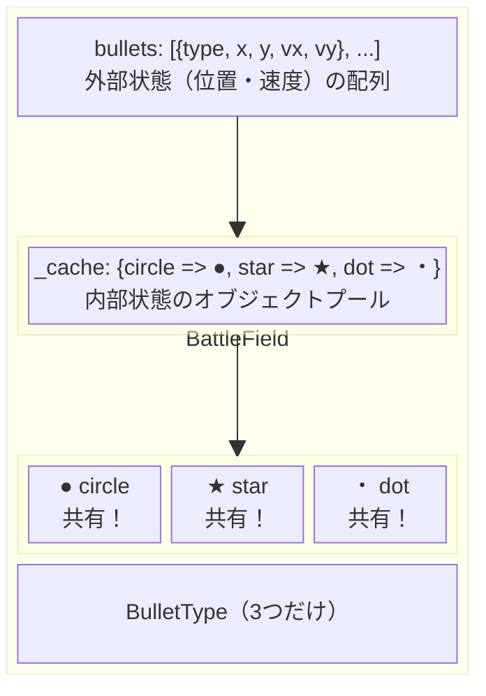

---
categories:
  - perl
date: 2026-01-24T00:38:27+09:00
description: BattleFieldクラスで弾の位置を管理し、毎フレーム更新・描画。完成した弾幕シューティングエンジンの全体像をお見せします。
draft: false
epoch: 1769182707
image: /public_images/2026/flyweight-series-header.png
iso8601: 2026-01-24T00:38:27+09:00
series:
  - PerlとMooで弾幕シューティングを作ってみよう
series_order: 5
tags:
  - perl
  - moo
  - game
  - tutorial
title: 【第5回】完成！弾幕シューティングエンジン
---

いよいよ最終段階です！これまで作ってきたクラスを統合して、「弾幕シューティングエンジン」を完成させましょう。




## これまでの振り返り

| 回 | 作ったもの | 役割 |
|----|----------|------|
| 第1回 | `Bullet` クラス（素朴版） | 問題発見：メモリ爆発 |
| 第2回 | `BulletType` クラス | 内部状態（形状、色、サイズ）を管理 |
| 第3回 | `BulletFactory` クラス | オブジェクトプール管理 |
| 第4回 | `render($x, $y)` メソッド | 外部状態を渡して描画 |

今回作るもの：

- `BattleField` クラス：弾幕全体を管理するクラス
- 弾の生成、移動、描画を一元管理
- 完成した弾幕シューティングエンジン

## BattleFieldクラスの設計

`BattleField` クラスは、弾幕シューティングの「戦場」を表します：

```perl
package BattleField {
    use Moo;

    has width   => (is => 'ro', required => 1);  # 画面幅
    has height  => (is => 'ro', required => 1);  # 画面高さ
    has factory => (is => 'ro', required => 1);  # BulletFactory
    has bullets => (is => 'ro', default => sub { [] });  # 弾の配列

    sub spawn { ... }   # 弾を生成
    sub update { ... }  # 弾を移動
    sub render { ... }  # 弾を描画
    sub run { ... }     # ゲームループ
}
```

## 完成版コード

それでは、完成版のコードをお見せします：

```perl
#!/usr/bin/env perl
use v5.36;
use Time::HiRes qw(sleep);

# ============================================================
# BulletType: 弾の種類（内部状態）
# ============================================================
package BulletType {
    use Moo;

    has name  => (is => 'ro', required => 1);
    has char  => (is => 'ro', required => 1);
    has color => (is => 'ro', default => 'white');

    sub render($self, $x, $y, $screen) {
        my $ix = int($x);
        my $iy = int($y);
        return if $iy < 0 || $iy >= @$screen;
        return if $ix < 0 || $ix >= length($screen->[$iy]);
        substr($screen->[$iy], $ix, 1) = $self->char;
    }
}

# ============================================================
# BulletFactory: 弾の種類を管理（オブジェクトプール）
# ============================================================
package BulletFactory {
    use Moo;

    has _cache => (is => 'ro', default => sub { {} });

    has _definitions => (
        is => 'ro',
        default => sub {
            {
                circle => { name => 'circle', char => '●' },
                star   => { name => 'star',   char => '★' },
                dot    => { name => 'dot',    char => '・' },
                arrow  => { name => 'arrow',  char => '→' },
                wave   => { name => 'wave',   char => '〜' },
            }
        },
    );

    sub get($self, $key) {
        my $cache = $self->_cache;
        my $defs  = $self->_definitions;
        $cache->{$key} //= BulletType->new(%{$defs->{$key}});
    }

    sub count($self) {
        scalar keys %{$self->_cache};
    }

    sub types($self) {
        sort keys %{$self->_cache};
    }
}

# ============================================================
# BattleField: 戦場を管理（弾の生成・移動・描画）
# ============================================================
package BattleField {
    use Moo;

    has width   => (is => 'ro', required => 1);
    has height  => (is => 'ro', required => 1);
    has factory => (is => 'ro', required => 1);
    has bullets => (is => 'ro', default => sub { [] });

    # 弾を生成
    sub spawn($self, $type_key, $x, $y, $vx, $vy) {
        push @{$self->bullets}, {
            type => $self->factory->get($type_key),
            x    => $x,
            y    => $y,
            vx   => $vx,
            vy   => $vy,
        };
    }

    # 弾幕パターン: 放射状
    sub spawn_radial($self, $type_key, $cx, $cy, $count, $speed) {
        for my $i (0 .. $count - 1) {
            my $angle = $i * (360 / $count) * 3.14159 / 180;
            $self->spawn(
                $type_key,
                $cx, $cy,
                cos($angle) * $speed,
                sin($angle) * $speed * 0.5,
            );
        }
    }

    # 弾幕パターン: 螺旋
    sub spawn_spiral($self, $type_key, $cx, $cy, $waves, $per_wave, $speed) {
        for my $wave (0 .. $waves - 1) {
            for my $i (0 .. $per_wave - 1) {
                my $angle = ($i * (360 / $per_wave) + $wave * 15) * 3.14159 / 180;
                push @{$self->bullets}, {
                    type => $self->factory->get($type_key),
                    x    => $cx,
                    y    => $cy,
                    vx   => cos($angle) * $speed,
                    vy   => sin($angle) * $speed * 0.5,
                    born => $wave * 2,  # 遅延生成
                };
            }
        }
    }

    # 弾を移動
    sub update($self, $frame) {
        my @alive;
        for my $b (@{$self->bullets}) {
            # 遅延生成チェック
            next if defined $b->{born} && $frame < $b->{born};

            # 移動
            $b->{x} += $b->{vx};
            $b->{y} += $b->{vy};

            # 画面内なら生存
            if ($b->{x} >= -5 && $b->{x} < $self->width + 5 &&
                $b->{y} >= -5 && $b->{y} < $self->height + 5) {
                push @alive, $b;
            }
        }
        @{$self->bullets} = @alive;
    }

    # 描画
    sub render($self, $frame) {
        my @screen = map { " " x $self->width } (1 .. $self->height);

        for my $b (@{$self->bullets}) {
            next if defined $b->{born} && $frame < $b->{born};
            $b->{type}->render($b->{x}, $b->{y}, \@screen);
        }

        return \@screen;
    }

    # 統計を表示
    sub stats($self) {
        my $bullet_count = scalar @{$self->bullets};
        my $type_count = $self->factory->count;
        return "弾: $bullet_count 発 / BulletType: $type_count 種類";
    }
}

# ============================================================
# メイン処理
# ============================================================
my $WIDTH  = 60;
my $HEIGHT = 25;
my $FRAMES = 20;

my $factory = BulletFactory->new;
my $field = BattleField->new(
    width   => $WIDTH,
    height  => $HEIGHT,
    factory => $factory,
);

# 弾幕を生成
my $cx = $WIDTH / 2;
my $cy = $HEIGHT / 2;

# 3種類の弾幕パターンを重ねる
$field->spawn_spiral('circle', $cx, $cy, 3, 12, 1.5);
$field->spawn_spiral('star',   $cx, $cy, 2, 8,  1.2);
$field->spawn_radial('dot',    $cx, $cy, 16, 2.0);

# 初期統計
say "=== 弾幕シューティングエンジン ===";
say $field->stats;
say "";
say "使用中のBulletType: " . join(", ", $factory->types);
say "";
say "アニメーション開始...";
sleep(1);

# ゲームループ
print "\e[2J";
for my $frame (0 .. $FRAMES) {
    my $screen = $field->render($frame);

    print "\e[H";
    for my $row (@$screen) {
        say $row;
    }

    say "-" x $WIDTH;
    say "Frame: $frame / $FRAMES | " . $field->stats;

    $field->update($frame);
    sleep(0.15);
}

# 最終統計
print "\e[" . ($HEIGHT + 3) . ";1H";
say "";
say "=== 完成！ ===";
say "弾幕シューティングエンジンが動作しました。";
say "";
say "ポイント:";
say "  ✓ 大量の弾を少数のBulletTypeオブジェクトで管理";
say "  ✓ BulletFactoryでオブジェクトプールを実現";
say "  ✓ BattleFieldで弾の生成・移動・描画を一元管理";
```

## 実行結果

```
=== 弾幕シューティングエンジン ===
弾: 68 発 / BulletType: 3 種類

使用中のBulletType: circle, dot, star

アニメーション開始...

(アニメーションが表示される)

=== 完成！ ===
弾幕シューティングエンジンが動作しました。

ポイント:
  ✓ 大量の弾を少数のBulletTypeオブジェクトで管理
  ✓ BulletFactoryでオブジェクトプールを実現
  ✓ BattleFieldで弾の生成・移動・描画を一元管理
```

## クラス構成図

完成したシステムの全体像をまとめます：



## 次回予告

弾幕シューティングエンジンが完成しました！

次回（最終回）では、私たちが作ってきたこのシステムが、実は有名なデザインパターンの一つだったことを明かします。そのパターンの名前は…？

お楽しみに！

## 今回のまとめ

- `BattleField` クラスで弾幕全体を管理
- `spawn_radial`、`spawn_spiral` で弾幕パターンを生成
- `update` で弾を移動、`render` で描画
- 68発の弾を3つの `BulletType` オブジェクトで管理
- 完成した弾幕シューティングエンジン！
- 次回：このパターンの正体を明かす

## 今回の完成コード

（上記の完成版コードと同じ）
