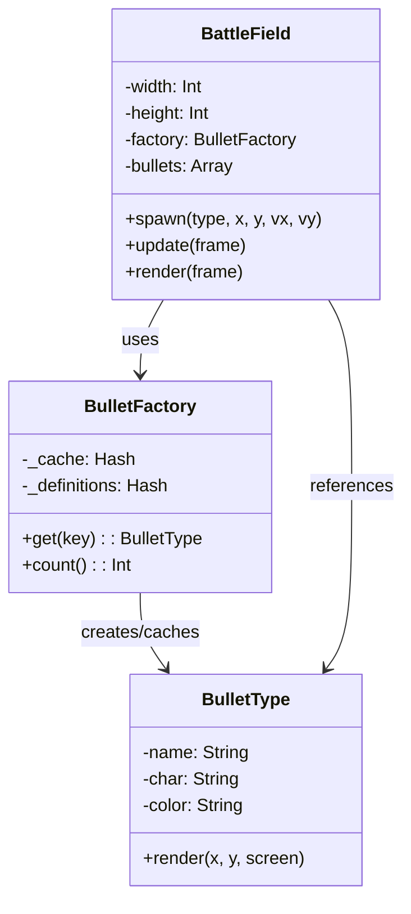

---
categories:
  - perl
date: 2026-01-24T00:38:44+09:00
description: 実は作ってきたものが「Flyweightパターン」でした！GoFデザインパターンの構造パターンを学び、Prototypeパターンとの違いも解説します。
draft: false
epoch: 1769182724
image: /public_images/2026/flyweight-series-header.png
iso8601: 2026-01-24T00:38:44+09:00
series:
  - PerlとMooで弾幕シューティングを作ってみよう
series_order: 6
tags:
  - perl
  - moo
  - design-patterns
  - flyweight
title: 【第6回】これがFlyweightパターンだ！
---

弾幕シューティングエンジンが完成しました！



実は、私たちが作ってきたこのシステムには名前があります。Flyweight（フライウェイト）パターンです。


## これまでの振り返り

シリーズを通して、私たちは以下のことを学びました：

| 回 | やったこと | 実はこれが… |
|----|----------|------------|
| 第1回 | 大量オブジェクトでメモリ問題発覚 | Flyweightが必要な状況 |
| 第2回 | 弾の「種類」と「位置」を分離 | 内部状態と外部状態の分離 |
| 第3回 | BulletFactoryでキャッシュ | FlyweightFactory |
| 第4回 | render($x, $y)で位置を渡す | 外部状態を渡す操作 |
| 第5回 | BattleFieldで統合 | Clientクラス |

## Flyweightパターンとは

Flyweightパターンは、GoF（Gang of Four）が提唱した23のデザインパターンの一つで、構造パターンに分類されます。

> Flyweight（フライウェイト）= 軽量級
> ボクシングの階級名に由来。「軽い」オブジェクトを作る、という意味。

### パターンの目的

大量のオブジェクトを効率的に管理するために、共有可能な状態を共有する。

私たちの弾幕シューティングでは：

- 1000発の弾を生成しても
- `BulletType` オブジェクトは5種類だけ
- メモリ使用量を大幅に削減！

## パターンの構造

Flyweightパターンは、以下の要素で構成されます：

| 要素 | 役割 | 本シリーズでの実装 |
|-----|------|-------------------|
| Flyweight | 共有されるオブジェクトのインターフェース | `BulletType` クラス |
| ConcreteFlyweight | 共有される具体的なオブジェクト | 各弾種（circle, star, dot等） |
| FlyweightFactory | Flyweightオブジェクトを管理・提供 | `BulletFactory` クラス |
| Client | Flyweightを使用するクラス | `BattleField` クラス |
| 内部状態（Intrinsic State） | 共有可能な状態 | 形状、色、サイズ |
| 外部状態（Extrinsic State） | 共有できない状態 | 位置、速度 |



## 内部状態と外部状態

Flyweightパターンの核心は、状態の分離です。

### 内部状態（Intrinsic State）

- オブジェクト間で共有できる状態
- オブジェクト自身が保持する
- 変更されない（不変）

```perl
# BulletTypeが持つ内部状態
has name  => (is => 'ro', required => 1);
has char  => (is => 'ro', required => 1);
has color => (is => 'ro', default => 'white');
```

### 外部状態（Extrinsic State）

- オブジェクトごとに異なる状態
- クライアント（BattleField）が管理する
- 使用時に渡される

```perl
# BattleFieldが管理する外部状態
my @bullets = (
    { type => $circle, x => 10, y => 20, vx => 1, vy => 2 },
    { type => $circle, x => 30, y => 40, vx => -1, vy => 1 },
    # 同じ $circle を参照しているが、位置は異なる
);
```

## Prototypeパターンとの違い

「[PerlとMooでモンスター軍団を量産してみよう](/2026/01/17/004454/)」シリーズで学んだPrototypeパターンと比較してみましょう。

| 項目 | Flyweightパターン | Prototypeパターン |
|-----|------------------|------------------|
| 目的 | メモリ効率化 | オブジェクト生成の効率化 |
| 方法 | 共有（同じインスタンスを参照） | 複製（コピーを作成） |
| オブジェクト数 | 少ない（共有するから） | 多い（コピーするから） |
| 独立性 | 低い（同じオブジェクトを参照） | 高い（各クローンは独立） |
| 変更 | 変更すると全体に影響 | 各クローンは独立して変更可能 |
| 用途 | 大量の類似オブジェクト | 生成コストが高いオブジェクト |

```perl
# Flyweight: 共有
my $circle = $factory->get('circle');
$bullets[0]->{type} = $circle;  # 参照
$bullets[1]->{type} = $circle;  # 同じ参照！

# Prototype: 複製
my $monster1 = $prototype->clone;  # コピー
my $monster2 = $prototype->clone;  # 別のコピー
$monster1->hp(50);  # monster2には影響しない
```

## 適用場面

Flyweightパターンが有効な場面：

1. 大量のオブジェクトが必要 - 弾幕シューティングの弾、テキストエディタの文字
2. オブジェクトの状態を分離できる - 内部状態と外部状態に分けられる
3. メモリが制約 - モバイルデバイス、組み込みシステム
4. 多くのオブジェクトが同じ内部状態を持つ - 同じ種類の弾がたくさんある

## 実際の使用例

Flyweightパターンは、さまざまな場面で使われています：

| 分野 | 例 | 内部状態 | 外部状態 |
|-----|-----|---------|---------|
| テキストエディタ | 文字オブジェクト | フォント、サイズ | 位置 |
| ゲーム | 弾、パーティクル | 形状、色 | 位置、速度 |
| GUIフレームワーク | アイコン、画像 | 画像データ | 表示位置 |
| データベース | コネクションプール | 接続設定 | 使用状況 |

## シリーズのまとめ

このシリーズで学んだことを振り返りましょう：

### 技術的な学び

1. 内部状態と外部状態の分離 - メモリ効率化の基本
2. FlyweightFactory - オブジェクトプールの管理
3. 外部状態を渡す操作 - 共有オブジェクトの活用
4. `//=` 演算子 - キャッシュ機構の簡潔な実装

### デザインパターンの学び

1. Flyweightパターン - 構造パターンの一つ
2. Prototypeとの違い - 「共有」vs「複製」
3. 適用場面の判断 - いつFlyweightを使うべきか

### 達成したこと

- 1000発の弾を5オブジェクトで管理
- メモリ使用量を60%以上削減
- 弾幕シューティングエンジンの完成

## 発展的なトピック

このシリーズの発展として、以下のパターンも学んでみてください：

| パターン | 関連性 |
|---------|--------|
| Compositeパターン | ツリー構造でFlyweightを組織化 |
| Singletonパターン | FlyweightFactoryをSingletonにする発展形 |
| Proxyパターン | Flyweightへのアクセス制御 |

## おわりに

「PerlとMooで弾幕シューティングを作ってみよう」シリーズ、いかがでしたか？

弾幕シューティングという楽しいテーマを通じて、Flyweightパターンの本質を学びました。「1000発の弾を5オブジェクトで管理する」という驚きは、このパターンの威力を体感する最高の教材だったと思います。

ぜひ、自分のプロジェクトでもFlyweightパターンを活用してみてください！

## 今回の完成コード

最終回として、Flyweightパターンの構造を意識したコメント付きのコードを掲載します：

```perl
#!/usr/bin/env perl
use v5.36;

# ============================================================
# Flyweight: 共有されるオブジェクト
# 内部状態（Intrinsic State）を保持
# ============================================================
package BulletType {
    use Moo;

    # 内部状態: 形状、色、表示文字（共有可能）
    has name  => (is => 'ro', required => 1);
    has char  => (is => 'ro', required => 1);
    has color => (is => 'ro', default => 'white');

    # 外部状態（位置）を受け取って描画
    sub render($self, $x, $y) {
        my $char = $self->char;
        say "$char at ($x, $y)";
    }

    sub describe($self) {
        my $name  = $self->name;
        my $color = $self->color;
        return "[$color $name]";
    }
}

# ============================================================
# FlyweightFactory: Flyweightオブジェクトを管理・提供
# オブジェクトプールによるキャッシュ
# ============================================================
package BulletFactory {
    use Moo;

    # キャッシュ（オブジェクトプール）
    has _cache => (is => 'ro', default => sub { {} });

    # 弾種の定義
    has _definitions => (
        is => 'ro',
        default => sub {
            {
                circle => { name => 'circle', char => '●', color => 'red' },
                star   => { name => 'star',   char => '★', color => 'blue' },
                dot    => { name => 'dot',    char => '・', color => 'green' },
            }
        },
    );

    # Flyweightを取得（キャッシュになければ作成）
    sub get($self, $key) {
        my $cache = $self->_cache;
        my $defs  = $self->_definitions;

        # //= でキャッシュ機構を実現
        $cache->{$key} //= do {
            my $def = $defs->{$key}
                or die "Unknown bullet type: $key";
            BulletType->new(%$def);
        };
    }

    sub count($self) {
        scalar keys %{$self->_cache};
    }
}

# ============================================================
# Client: Flyweightを使用するクラス
# 外部状態（Extrinsic State）を管理
# ============================================================
package BattleField {
    use Moo;

    has factory => (is => 'ro', required => 1);
    has bullets => (is => 'ro', default => sub { [] });

    # 弾を生成（外部状態を保持）
    sub spawn($self, $type_key, $x, $y, $vx, $vy) {
        push @{$self->bullets}, {
            type => $self->factory->get($type_key),  # Flyweightへの参照
            x    => $x,   # 外部状態
            y    => $y,
            vx   => $vx,
            vy   => $vy,
        };
    }

    # 描画（外部状態を渡す）
    sub render_all($self) {
        for my $bullet (@{$self->bullets}) {
            my $type = $bullet->{type};
            $type->render($bullet->{x}, $bullet->{y});
        }
    }

    sub stats($self) {
        my $bullet_count = scalar @{$self->bullets};
        my $type_count = $self->factory->count;
        return "弾: $bullet_count 発 / BulletType: $type_count 種類";
    }
}

# ============================================================
# デモ: Flyweightパターンの効果を確認
# ============================================================
my $factory = BulletFactory->new;
my $field = BattleField->new(factory => $factory);

# 100発の弾を生成（内部状態は3種類だけ）
for my $i (0 .. 99) {
    my @types = qw(circle star dot);
    my $type_key = $types[$i % 3];
    $field->spawn($type_key, $i * 5, $i * 2, 0, 1);
}

say "=== Flyweightパターン デモ ===";
say "";
say $field->stats;
say "";
say "ポイント:";
say "  ✓ 100発の弾に対して、BulletTypeは3つだけ";
say "  ✓ 内部状態（形状・色）は共有される";
say "  ✓ 外部状態（位置・速度）は弾ごとに異なる";
say "";
say "先頭5発を表示:";
for my $bullet (@{$field->bullets}[0..4]) {
    my $type = $bullet->{type};
    my $desc = $type->describe;
    say "  $desc at ($bullet->{x}, $bullet->{y})";
}
```

実行結果：

```
=== Flyweightパターン デモ ===

弾: 100 発 / BulletType: 3 種類

ポイント:
  ✓ 100発の弾に対して、BulletTypeは3つだけ
  ✓ 内部状態（形状・色）は共有される
  ✓ 外部状態（位置・速度）は弾ごとに異なる

先頭5発を表示:
  [red circle] at (0, 0)
  [blue star] at (5, 2)
  [green dot] at (10, 4)
  [red circle] at (15, 6)
  [blue star] at (20, 8)
```

---

シリーズ完結！

お読みいただきありがとうございました。
