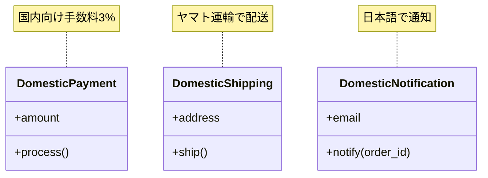

---
categories:
  - tech
date: 2026-01-25T00:08:34+09:00
description: Perlで作る注文フローの国別キット第1回。国内市場向けの注文フローを決済・配送・通知の3クラスで実装し、シンプルな連携を体験します
draft: false
epoch: 1769267314
image: /public_images/2026/abstract-factory-header.png
iso8601: 2026-01-25T00:08:34+09:00
series:
  - Perlで作る注文フローの国別キット
tags:
  - perl
  - moo
  - e-commerce
  - payment
  - shipping
title: '国内注文処理の実装 - 決済・配送・通知の基本'
---

Perlで作る注文フローの国別キット。第1回は国内注文だけを想定した、シンプルな注文フローを作成します。


この記事は[Mooで覚えるオブジェクト指向プログラミング](/2026/01/02/233311/)を読みPerlでのオブジェクト思考プログラミングの基礎を習得した方や、[PerlとMooでAPIレスポンスシミュレーターを作ってみよう](/2026/01/17/132411/)でFactory Methodパターンを学んだ方を対象としています。

## シリーズの目標

このシリーズでは、ECサイトの注文処理を題材に、決済・配送・通知といった複数の処理を一貫したセットとして管理する設計パターンを学びます。最終的には「いつこのパターンを使うべきか」「どんな限界があるか」まで踏み込んで解説します。

## この記事で学ぶこと

- 国内市場向けの注文フローを実装する
- 決済・配送・通知の3クラスを作成する
- 3クラスの単純な連携で注文処理を完成させる

## 想定する題材

架空のECサイト「ペルマート」の注文処理システムを作ります。まずは国内市場のみを対象とし、以下の流れで注文を処理します。

1. 決済処理（DomesticPayment）
2. 配送手配（DomesticShipping）
3. 完了通知（DomesticNotification）

## 決済クラスの実装

国内向け決済を処理するクラスを作成します。

```perl
package DomesticPayment;
use v5.36;
use Moo;

has amount => (is => 'ro', required => 1);

sub process ($self) {
    my $fee = int($self->amount * 0.03);  # 国内手数料 3%
    my $total = $self->amount + $fee;
    say "【国内決済】金額: ¥" . $self->amount . " + 手数料: ¥$fee = 合計: ¥$total";
    return $total;
}

1;
```

`DomesticPayment`クラスは以下の特徴を持ちます。

- `amount`属性で決済金額を保持
- `process`メソッドで国内向け手数料（3%）を計算
- 決済処理の結果として合計金額を返す

## 配送クラスの実装

続いて、国内向け配送を処理するクラスを作成します。

```perl
package DomesticShipping;
use v5.36;
use Moo;

has address => (is => 'ro', required => 1);

sub ship ($self) {
    say "【国内配送】お届け先: " . $self->address;
    say "  配送業者: ヤマト運輸";
    say "  配送日数: 1-2営業日";
    return { carrier => 'yamato', days => 2 };
}

1;
```

`DomesticShipping`クラスは以下の特徴を持ちます。

- `address`属性でお届け先住所を保持
- `ship`メソッドで国内向け配送手配を実行
- 配送業者と配送日数の情報を返す

## 通知クラスの実装

注文完了を顧客に通知するクラスを作成します。

```perl
package DomesticNotification;
use v5.36;
use Moo;

has email => (is => 'ro', required => 1);

sub notify ($self, $order_id) {
    say "【国内通知】$order_id の注文確認メールを送信";
    say "  宛先: " . $self->email;
    say "  言語: 日本語";
    return 1;
}

1;
```

`DomesticNotification`クラスは以下の特徴を持ちます。

- `email`属性で通知先メールアドレスを保持
- `notify`メソッドで日本語の注文確認メールを送信
- 注文IDを引数に受け取り、通知を実行

## 注文処理の実行

3つのクラスを使って注文処理を実行するスクリプトを作成します。

```perl
#!/usr/bin/env perl
use v5.36;

# 各クラスをインライン定義
# （実際のプロジェクトでは別ファイルに分けます）

package DomesticPayment;
use v5.36;
use Moo;

has amount => (is => 'ro', required => 1);

sub process ($self) {
    my $fee = int($self->amount * 0.03);  # 国内手数料 3%
    my $total = $self->amount + $fee;
    say "【国内決済】金額: ¥" . $self->amount . " + 手数料: ¥$fee = 合計: ¥$total";
    return $total;
}

package DomesticShipping;
use v5.36;
use Moo;

has address => (is => 'ro', required => 1);

sub ship ($self) {
    say "【国内配送】お届け先: " . $self->address;
    say "  配送業者: ヤマト運輸";
    say "  配送日数: 1-2営業日";
    return { carrier => 'yamato', days => 2 };
}

package DomesticNotification;
use v5.36;
use Moo;

has email => (is => 'ro', required => 1);

sub notify ($self, $order_id) {
    say "【国内通知】$order_id の注文確認メールを送信";
    say "  宛先: " . $self->email;
    say "  言語: 日本語";
    return 1;
}

package main;
use v5.36;

# 注文情報
my $order_id = 'ORD-2026-0001';
my $amount = 5000;
my $address = '東京都渋谷区1-2-3';
my $email = 'customer@example.com';

say "=" x 50;
say "注文処理開始: $order_id";
say "=" x 50;

# 1. 決済処理
my $payment = DomesticPayment->new(amount => $amount);
my $total = $payment->process;

say "";

# 2. 配送手配
my $shipping = DomesticShipping->new(address => $address);
my $delivery_info = $shipping->ship;

say "";

# 3. 完了通知
my $notification = DomesticNotification->new(email => $email);
$notification->notify($order_id);

say "";
say "=" x 50;
say "注文処理完了";
say "=" x 50;
```

実行すると以下のように出力されます。

```
==================================================
注文処理開始: ORD-2026-0001
==================================================
【国内決済】金額: ¥5000 + 手数料: ¥150 = 合計: ¥5150

【国内配送】お届け先: 東京都渋谷区1-2-3
  配送業者: ヤマト運輸
  配送日数: 1-2営業日

【国内通知】ORD-2026-0001 の注文確認メールを送信
  宛先: customer@example.com
  言語: 日本語

==================================================
注文処理完了
==================================================
```

## 現在の設計の特徴

ここまでで実装した設計には以下の特徴があります。

- 各クラスが単一の責務を持つ（決済・配送・通知）
- 国内市場専用のシンプルな実装
- 3クラスの連携が明確で理解しやすい



## まとめ

この記事では以下を学びました。

- 国内市場向けの注文フローを決済・配送・通知の3クラスで実装した
- 各クラスが単一の責務を持つシンプルな設計を構築した
- 3クラスの連携で注文処理を完成させた

次回は海外市場対応を追加し、分岐処理が増えることで起きる問題を体験します。
