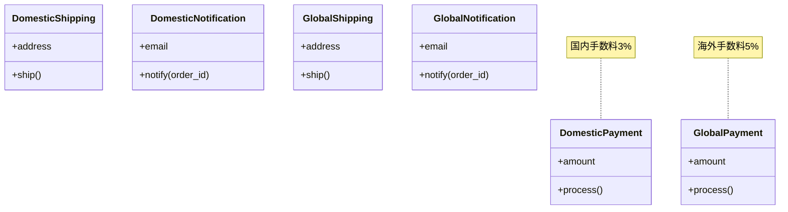

---
categories:
  - tech
date: 2026-01-25T00:08:51+09:00
description: Perlで作る注文フローの国別キット第2回。海外市場対応を追加すると、if/elseが増殖し可読性が低下する問題を体験します
draft: false
epoch: 1769267331
image: /public_images/2026/abstract-factory-header.png
iso8601: 2026-01-25T00:08:51+09:00
series:
  - Perlで作る注文フローの国別キット
tags:
  - perl
  - refactoring
  - anti-pattern
  - conditional-complexity
title: '海外対応で分岐だらけに - if/else地獄の始まり'
---

第2回では海外市場対応を追加します。国内用クラスに加えて海外用クラスを作成し、if/elseで切り替える方式の問題点を体験しましょう。

## 前回の振り返り

前回は国内市場向けの注文フローを実装しました。

- DomesticPayment（国内決済）
- DomesticShipping（国内配送）
- DomesticNotification（国内通知）

今回は海外市場対応を追加し、クラス数が倍増する様子を見ていきます。

## この記事で学ぶこと

- 海外市場向けの決済・配送・通知クラスを追加する
- if/elseによる市場判定の問題点を理解する
- クラス増加に伴う保守性の低下を体験する

## 海外向け決済クラス

海外決済用のクラスを作成します。手数料率が異なり、ドル表記になります。

```perl
package GlobalPayment;
use v5.36;
use Moo;

has amount => (is => 'ro', required => 1);

sub process ($self) {
    my $fee = int($self->amount * 0.05);  # 海外手数料 5%
    my $total = $self->amount + $fee;
    say "【海外決済】Amount: \$" . $self->amount . " + Fee: \$$fee = Total: \$$total";
    return $total;
}

1;
```

国内決済との違いは以下の通りです。

- 手数料率: 3% → 5%
- 表記: 円（¥）→ ドル（$）
- ラベル: 国内決済 → 海外決済

## 海外向け配送クラス

海外配送用のクラスを作成します。配送業者と日数が大きく異なります。

```perl
package GlobalShipping;
use v5.36;
use Moo;

has address => (is => 'ro', required => 1);

sub ship ($self) {
    say "【海外配送】Delivery to: " . $self->address;
    say "  Carrier: FedEx International";
    say "  Estimated: 5-10 business days";
    return { carrier => 'fedex', days => 10 };
}

1;
```

## 海外向け通知クラス

海外顧客向けの通知クラスを作成します。英語でメールを送信します。

```perl
package GlobalNotification;
use v5.36;
use Moo;

has email => (is => 'ro', required => 1);

sub notify ($self, $order_id) {
    say "【海外通知】Order confirmation for $order_id sent";
    say "  To: " . $self->email;
    say "  Language: English";
    return 1;
}

1;
```

## if/elseによる市場判定

国内と海外を切り替えるために、if/elseを使った判定ロジックを追加します。

```perl
#!/usr/bin/env perl
use v5.36;

# --- 国内向けクラス ---
package DomesticPayment;
use v5.36;
use Moo;

has amount => (is => 'ro', required => 1);

sub process ($self) {
    my $fee = int($self->amount * 0.03);
    my $total = $self->amount + $fee;
    say "【国内決済】金額: ¥" . $self->amount . " + 手数料: ¥$fee = 合計: ¥$total";
    return $total;
}

package DomesticShipping;
use v5.36;
use Moo;

has address => (is => 'ro', required => 1);

sub ship ($self) {
    say "【国内配送】お届け先: " . $self->address;
    say "  配送業者: ヤマト運輸";
    say "  配送日数: 1-2営業日";
    return { carrier => 'yamato', days => 2 };
}

package DomesticNotification;
use v5.36;
use Moo;

has email => (is => 'ro', required => 1);

sub notify ($self, $order_id) {
    say "【国内通知】$order_id の注文確認メールを送信";
    say "  宛先: " . $self->email;
    say "  言語: 日本語";
    return 1;
}

# --- 海外向けクラス ---
package GlobalPayment;
use v5.36;
use Moo;

has amount => (is => 'ro', required => 1);

sub process ($self) {
    my $fee = int($self->amount * 0.05);
    my $total = $self->amount + $fee;
    say "【海外決済】Amount: \$" . $self->amount . " + Fee: \$$fee = Total: \$$total";
    return $total;
}

package GlobalShipping;
use v5.36;
use Moo;

has address => (is => 'ro', required => 1);

sub ship ($self) {
    say "【海外配送】Delivery to: " . $self->address;
    say "  Carrier: FedEx International";
    say "  Estimated: 5-10 business days";
    return { carrier => 'fedex', days => 10 };
}

package GlobalNotification;
use v5.36;
use Moo;

has email => (is => 'ro', required => 1);

sub notify ($self, $order_id) {
    say "【海外通知】Order confirmation for $order_id sent";
    say "  To: " . $self->email;
    say "  Language: English";
    return 1;
}

# --- メイン処理 ---
package main;
use v5.36;

sub process_order ($order_id, $market, $amount, $address, $email) {
    say "=" x 50;
    say "注文処理開始: $order_id (市場: $market)";
    say "=" x 50;

    my ($payment, $shipping, $notification);

    # 市場ごとに分岐
    if ($market eq 'domestic') {
        $payment = DomesticPayment->new(amount => $amount);
        $shipping = DomesticShipping->new(address => $address);
        $notification = DomesticNotification->new(email => $email);
    }
    elsif ($market eq 'global') {
        $payment = GlobalPayment->new(amount => $amount);
        $shipping = GlobalShipping->new(address => $address);
        $notification = GlobalNotification->new(email => $email);
    }
    else {
        die "Unknown market: $market";
    }

    # 処理実行
    my $total = $payment->process;
    say "";
    my $delivery_info = $shipping->ship;
    say "";
    $notification->notify($order_id);

    say "";
    say "=" x 50;
    say "注文処理完了";
    say "=" x 50;
    say "";
}

# 国内注文
process_order('ORD-2026-0001', 'domestic', 5000, '東京都渋谷区1-2-3', 'tanaka@example.com');

# 海外注文
process_order('ORD-2026-0002', 'global', 100, '123 Main St, New York, NY', 'john@example.com');
```

実行結果は以下のようになります。

```
==================================================
注文処理開始: ORD-2026-0001 (市場: domestic)
==================================================
【国内決済】金額: ¥5000 + 手数料: ¥150 = 合計: ¥5150

【国内配送】お届け先: 東京都渋谷区1-2-3
  配送業者: ヤマト運輸
  配送日数: 1-2営業日

【国内通知】ORD-2026-0001 の注文確認メールを送信
  宛先: tanaka@example.com
  言語: 日本語

==================================================
注文処理完了
==================================================

==================================================
注文処理開始: ORD-2026-0002 (市場: global)
==================================================
【海外決済】Amount: $100 + Fee: $5 = Total: $105

【海外配送】Delivery to: 123 Main St, New York, NY
  Carrier: FedEx International
  Estimated: 5-10 business days

【海外通知】Order confirmation for ORD-2026-0002 sent
  To: john@example.com
  Language: English

==================================================
注文処理完了
==================================================
```

## 現在の設計の問題点

この設計には以下の問題があります。

1. クラス数が6個に倍増した
2. 市場判定のif/elseが3組必要
3. 新しい市場を追加するたびにif/elseが増える



## 今後の問題を予感させる

現在のif/else方式では、以下の問題が発生しやすくなります。

- 新市場追加時に分岐を追加し忘れる
- 決済は国内、配送は海外といった組み合わせミスが起きやすい
- 分岐が増えるとテストケースが爆発する

次回は、この組み合わせミスが実際に業務事故につながる例を見ていきます。

## まとめ

この記事では以下を学びました。

- 海外市場向けの3クラス（決済・配送・通知）を追加した
- if/elseによる市場判定の実装方法を確認した
- クラス数の増加と分岐の増殖という問題点を認識した

次回は、国内配送に海外決済が紛れ込むという組み合わせミスで起きる業務事故を体験します。
