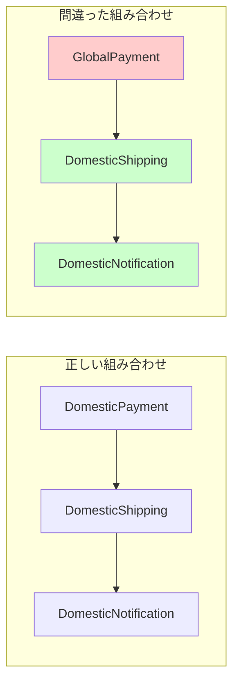

第3回では、製品ファミリの不一致で起きる業務事故を体験します。国内配送に海外決済が紛れ込むと何が起きるのでしょうか。


## 前回の振り返り

前回は海外市場対応を追加し、if/elseによる市場判定を実装しました。

- クラス数が3個から6個に増加
- 市場判定のif/elseが増殖
- 組み合わせミスが起きやすい構造

今回はその「組み合わせミス」が実際に発生するとどうなるか見ていきます。

## この記事で学ぶこと

- 製品ファミリの不一致とはどのような状態か
- 組み合わせミスが業務にどのような影響を与えるか
- 手動管理の限界を理解する

## 事故が起きるコード

以下のコードには、意図しないバグが含まれています。

```perl
#!/usr/bin/env perl
use v5.36;

# --- 国内向けクラス ---
package DomesticPayment;
use v5.36;
use Moo;

has amount => (is => 'ro', required => 1);

sub process ($self) {
    my $fee = int($self->amount * 0.03);
    my $total = $self->amount + $fee;
    say "【国内決済】金額: ¥" . $self->amount . " + 手数料: ¥$fee = 合計: ¥$total";
    return $total;
}

package DomesticShipping;
use v5.36;
use Moo;

has address => (is => 'ro', required => 1);

sub ship ($self) {
    say "【国内配送】お届け先: " . $self->address;
    say "  配送業者: ヤマト運輸";
    say "  配送日数: 1-2営業日";
    return { carrier => 'yamato', days => 2 };
}

package DomesticNotification;
use v5.36;
use Moo;

has email => (is => 'ro', required => 1);

sub notify ($self, $order_id) {
    say "【国内通知】$order_id の注文確認メールを送信";
    say "  宛先: " . $self->email;
    say "  言語: 日本語";
    return 1;
}

# --- 海外向けクラス ---
package GlobalPayment;
use v5.36;
use Moo;

has amount => (is => 'ro', required => 1);

sub process ($self) {
    my $fee = int($self->amount * 0.05);
    my $total = $self->amount + $fee;
    say "【海外決済】Amount: \$" . $self->amount . " + Fee: \$$fee = Total: \$$total";
    return $total;
}

package GlobalShipping;
use v5.36;
use Moo;

has address => (is => 'ro', required => 1);

sub ship ($self) {
    say "【海外配送】Delivery to: " . $self->address;
    say "  Carrier: FedEx International";
    say "  Estimated: 5-10 business days";
    return { carrier => 'fedex', days => 10 };
}

package GlobalNotification;
use v5.36;
use Moo;

has email => (is => 'ro', required => 1);

sub notify ($self, $order_id) {
    say "【海外通知】Order confirmation for $order_id sent";
    say "  To: " . $self->email;
    say "  Language: English";
    return 1;
}

# --- メイン処理（バグあり） ---
package main;
use v5.36;

sub process_order_buggy ($order_id, $market, $amount, $address, $email) {
    say "=" x 50;
    say "注文処理開始: $order_id (市場: $market)";
    say "=" x 50;

    my ($payment, $shipping, $notification);

    # ★バグ: 決済だけ海外、配送と通知は国内になっている
    if ($market eq 'domestic') {
        $payment = GlobalPayment->new(amount => $amount);  # ← 間違い!
        $shipping = DomesticShipping->new(address => $address);
        $notification = DomesticNotification->new(email => $email);
    }
    elsif ($market eq 'global') {
        $payment = GlobalPayment->new(amount => $amount);
        $shipping = GlobalShipping->new(address => $address);
        $notification = GlobalNotification->new(email => $email);
    }
    else {
        die "Unknown market: $market";
    }

    my $total = $payment->process;
    say "";
    my $delivery_info = $shipping->ship;
    say "";
    $notification->notify($order_id);

    say "";
    say "=" x 50;
    say "注文処理完了";
    say "=" x 50;
}

# 国内注文を処理（しかしバグで海外決済が適用される）
process_order_buggy('ORD-2026-0003', 'domestic', 5000, '大阪市北区4-5-6', 'yamada@example.com');
```

## 事故の結果

上記のコードを実行すると、以下のように出力されます。

```
==================================================
注文処理開始: ORD-2026-0003 (市場: domestic)
==================================================
【海外決済】Amount: $5000 + Fee: $250 = Total: $5250

【国内配送】お届け先: 大阪市北区4-5-6
  配送業者: ヤマト運輸
  配送日数: 1-2営業日

【国内通知】ORD-2026-0003 の注文確認メールを送信
  宛先: yamada@example.com
  言語: 日本語

==================================================
注文処理完了
==================================================
```

何が問題でしょうか？

## 業務への影響

この事故では以下の問題が発生しています。

1. 手数料が3%（¥150）ではなく5%（$250）で計算された
2. 円表記ではなくドル表記になっている
3. 配送と通知は国内向けなのに、決済だけ海外設定

これは実際の業務では以下のような事態を引き起こします。

- 顧客に誤った請求金額が表示される
- 経理処理で通貨の不整合が発生する
- 顧客からのクレームが発生する

## なぜこの事故が起きるのか

この問題の根本原因は「製品ファミリの一貫性が保証されていない」ことです。



現在の設計では、決済・配送・通知を個別に生成しているため、どの組み合わせでもコンパイルが通ってしまいます。

## 手動管理の限界

if/elseで正しい組み合わせを維持するには、以下を常に確認する必要があります。

- 決済クラスが市場に合っているか
- 配送クラスが市場に合っているか
- 通知クラスが市場に合っているか

市場が増えると、この確認作業が指数関数的に増加します。

| 市場数 | クラス数 | 確認ポイント |
|-------|---------|------------|
| 2 | 6 | 6箇所 |
| 3 | 9 | 9箇所 |
| 5 | 15 | 15箇所 |

人間の注意力には限界があり、必ずミスが発生します。

## 解決策の方向性

この問題を解決するには「市場ごとの製品セットをまとめて生成する仕組み」が必要です。

- 国内市場 → 国内決済 + 国内配送 + 国内通知をセットで提供
- 海外市場 → 海外決済 + 海外配送 + 海外通知をセットで提供

個別に生成するのではなく、セット（ファミリ）として一括生成することで組み合わせミスを防ぎます。

次回はこの考え方をコードに落とし込み、Abstract Factoryパターンを導入します。

## まとめ

この記事では以下を学びました。

- 製品ファミリの不一致とは、セットであるべきクラスが混在する状態
- 組み合わせミスは手数料誤計算などの業務事故につながる
- if/elseによる手動管理には限界がある
- 解決には「セットとして生成する仕組み」が必要

次回は、国別Factoryを定義してこの問題を解決します。
