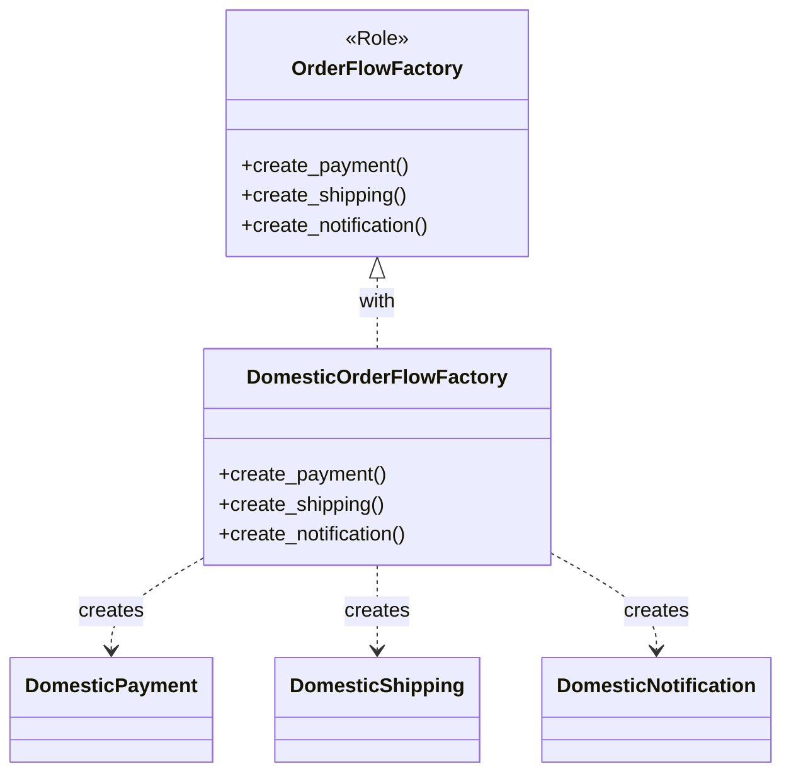

---
categories:
  - tech
date: 2026-01-25T00:09:25+09:00
description: Perlで作る注文フローの国別キット第4回。OrderFlowFactoryロールを定義し、製品ファミリを一括生成する仕組みを導入します
draft: false
epoch: 1769267365
image: /public_images/2026/abstract-factory-header.png
iso8601: 2026-01-25T00:09:25+09:00
series:
  - Perlで作る注文フローの国別キット
tags:
  - perl
  - moo
  - role
  - abstract-factory
  - dependency-inversion
title: '国別Factoryで一貫性を保つ - Abstract Factory導入'
---

第4回では、前回発生した組み合わせミスを防ぐために「国別Factory」を導入します。製品ファミリを一括生成する仕組みを作りましょう。


## 前回の振り返り

前回は製品ファミリの不一致による業務事故を体験しました。

- 国内配送に海外決済が紛れ込んだ
- 手数料計算が狂い、業務事故が発生した
- if/elseによる手動管理には限界がある

今回はこの問題を「Factory」という仕組みで解決します。

## この記事で学ぶこと

- OrderFlowFactoryロール（抽象Factory）を定義する
- 製品ファミリを一括生成するインターフェースを設計する
- クライアントコードをFactory経由に変更する

## Factoryの役割

Factoryとは「製品を生成する責任を持つオブジェクト」です。今回は以下の責任を持たせます。

- 決済オブジェクトの生成
- 配送オブジェクトの生成
- 通知オブジェクトの生成

これらを1つのFactoryにまとめることで、必ず正しい組み合わせが生成されるようにします。

## OrderFlowFactoryロールの定義

まず、すべてのFactoryが持つべきメソッドを定義するロールを作成します。

```perl
package OrderFlowFactory;
use v5.36;
use Moo::Role;

requires 'create_payment';
requires 'create_shipping';
requires 'create_notification';

1;
```

このロールは3つのメソッドを要求します。

- `create_payment`: 決済オブジェクトを生成
- `create_shipping`: 配送オブジェクトを生成
- `create_notification`: 通知オブジェクトを生成

ロールを使用するクラスは、必ずこれらのメソッドを実装しなければなりません。

## 国内向けFactoryの実装

国内市場向けの製品セットを生成するFactoryを実装します。

```perl
package DomesticOrderFlowFactory;
use v5.36;
use Moo;

with 'OrderFlowFactory';

sub create_payment ($self, %args) {
    return DomesticPayment->new(%args);
}

sub create_shipping ($self, %args) {
    return DomesticShipping->new(%args);
}

sub create_notification ($self, %args) {
    return DomesticNotification->new(%args);
}

1;
```

このFactoryは必ず国内向けの3製品をセットで提供します。決済だけ海外になるという事故は構造的に起きません。

## Factoryを使った注文処理

Factoryを使うようにクライアントコードを変更します。

```perl
#!/usr/bin/env perl
use v5.36;

# --- 製品クラス（国内） ---
package DomesticPayment;
use v5.36;
use Moo;

has amount => (is => 'ro', required => 1);

sub process ($self) {
    my $fee = int($self->amount * 0.03);
    my $total = $self->amount + $fee;
    say "【国内決済】金額: ¥" . $self->amount . " + 手数料: ¥$fee = 合計: ¥$total";
    return $total;
}

package DomesticShipping;
use v5.36;
use Moo;

has address => (is => 'ro', required => 1);

sub ship ($self) {
    say "【国内配送】お届け先: " . $self->address;
    say "  配送業者: ヤマト運輸";
    say "  配送日数: 1-2営業日";
    return { carrier => 'yamato', days => 2 };
}

package DomesticNotification;
use v5.36;
use Moo;

has email => (is => 'ro', required => 1);

sub notify ($self, $order_id) {
    say "【国内通知】$order_id の注文確認メールを送信";
    say "  宛先: " . $self->email;
    say "  言語: 日本語";
    return 1;
}

# --- 抽象Factoryロール ---
package OrderFlowFactory;
use v5.36;
use Moo::Role;

requires 'create_payment';
requires 'create_shipping';
requires 'create_notification';

# --- 国内向けFactory ---
package DomesticOrderFlowFactory;
use v5.36;
use Moo;

with 'OrderFlowFactory';

sub create_payment ($self, %args) {
    return DomesticPayment->new(%args);
}

sub create_shipping ($self, %args) {
    return DomesticShipping->new(%args);
}

sub create_notification ($self, %args) {
    return DomesticNotification->new(%args);
}

# --- メイン処理 ---
package main;
use v5.36;

sub process_order_with_factory ($factory, $order_id, $amount, $address, $email) {
    say "=" x 50;
    say "注文処理開始: $order_id";
    say "=" x 50;

    # Factoryから製品を生成
    my $payment = $factory->create_payment(amount => $amount);
    my $shipping = $factory->create_shipping(address => $address);
    my $notification = $factory->create_notification(email => $email);

    # 処理実行
    my $total = $payment->process;
    say "";
    my $delivery_info = $shipping->ship;
    say "";
    $notification->notify($order_id);

    say "";
    say "=" x 50;
    say "注文処理完了";
    say "=" x 50;
}

# Factoryを作成して注文処理
my $domestic_factory = DomesticOrderFlowFactory->new;
process_order_with_factory(
    $domestic_factory,
    'ORD-2026-0004',
    5000,
    '東京都渋谷区1-2-3',
    'customer@example.com'
);
```

## 設計の改善点

Factory導入により、以下の改善が得られました。

1. 製品生成をFactoryに集約
2. 組み合わせミスが構造的に発生しない
3. 市場の追加はFactoryクラスの追加で対応



## クライアントの依存先の変化

以前のコードでは、クライアントが個々の製品クラスを直接知る必要がありました。

```perl
# Before: 個別のクラスを直接生成
$payment = DomesticPayment->new(amount => $amount);
$shipping = DomesticShipping->new(address => $address);
```

Factoryを導入した後は、Factoryを経由するだけになります。

```perl
# After: Factoryを経由して生成
$payment = $factory->create_payment(amount => $amount);
$shipping = $factory->create_shipping(address => $address);
```

クライアントはFactoryのインターフェースのみに依存し、具体的な製品クラスを知る必要がなくなりました。これは依存性逆転の原則（DIP）に沿った設計です。

## まとめ

この記事では以下を学びました。

- OrderFlowFactoryロールを定義し、3つのcreateメソッドを要求した
- DomesticOrderFlowFactoryが国内向け製品セットを一括生成する
- クライアントはFactoryのみに依存し、具体的な製品クラスを知らなくてよい
- 組み合わせミスが構造的に発生しなくなった

次回は海外向けFactory（GlobalOrderFlowFactory）を実装し、複数のFactoryを切り替える仕組みを完成させます。
