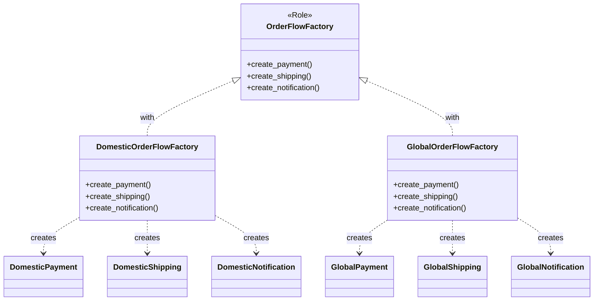

第5回では、国内向けに加えて海外向けのFactoryも実装し、市場ごとのFactory切り替えを実現します。

## 前回の振り返り

前回はOrderFlowFactoryロールを定義し、DomesticOrderFlowFactoryを実装しました。

- 製品生成をFactoryに集約した
- 組み合わせミスが構造的に発生しなくなった
- クライアントはFactoryのみに依存するようになった

今回は海外向けFactoryを追加し、複数のFactoryを使い分ける仕組みを完成させます。

## この記事で学ぶこと

- GlobalOrderFlowFactoryを実装する
- 複数のConcreteFactoryを切り替える方法を理解する
- ポリモーフィズムによるFactory選択を体験する

## 海外向け製品クラスの確認

第2回で作成した海外向け製品クラスを再確認します。

```perl
package GlobalPayment;
use v5.36;
use Moo;

has amount => (is => 'ro', required => 1);

sub process ($self) {
    my $fee = int($self->amount * 0.05);
    my $total = $self->amount + $fee;
    say "【海外決済】Amount: \$" . $self->amount . " + Fee: \$$fee = Total: \$$total";
    return $total;
}

1;
```

```perl
package GlobalShipping;
use v5.36;
use Moo;

has address => (is => 'ro', required => 1);

sub ship ($self) {
    say "【海外配送】Delivery to: " . $self->address;
    say "  Carrier: FedEx International";
    say "  Estimated: 5-10 business days";
    return { carrier => 'fedex', days => 10 };
}

1;
```

```perl
package GlobalNotification;
use v5.36;
use Moo;

has email => (is => 'ro', required => 1);

sub notify ($self, $order_id) {
    say "【海外通知】Order confirmation for $order_id sent";
    say "  To: " . $self->email;
    say "  Language: English";
    return 1;
}

1;
```

## 海外向けFactoryの実装

GlobalOrderFlowFactoryを実装します。

```perl
package GlobalOrderFlowFactory;
use v5.36;
use Moo;

with 'OrderFlowFactory';

sub create_payment ($self, %args) {
    return GlobalPayment->new(%args);
}

sub create_shipping ($self, %args) {
    return GlobalShipping->new(%args);
}

sub create_notification ($self, %args) {
    return GlobalNotification->new(%args);
}

1;
```

DomesticOrderFlowFactoryと同じインターフェースを持ちますが、生成する製品クラスが異なります。

## 完成コード

2つのFactoryを使い分ける完成版のコードです。

```perl
#!/usr/bin/env perl
use v5.36;

# --- 製品クラス（国内） ---
package DomesticPayment;
use v5.36;
use Moo;

has amount => (is => 'ro', required => 1);

sub process ($self) {
    my $fee = int($self->amount * 0.03);
    my $total = $self->amount + $fee;
    say "【国内決済】金額: ¥" . $self->amount . " + 手数料: ¥$fee = 合計: ¥$total";
    return $total;
}

package DomesticShipping;
use v5.36;
use Moo;

has address => (is => 'ro', required => 1);

sub ship ($self) {
    say "【国内配送】お届け先: " . $self->address;
    say "  配送業者: ヤマト運輸";
    say "  配送日数: 1-2営業日";
    return { carrier => 'yamato', days => 2 };
}

package DomesticNotification;
use v5.36;
use Moo;

has email => (is => 'ro', required => 1);

sub notify ($self, $order_id) {
    say "【国内通知】$order_id の注文確認メールを送信";
    say "  宛先: " . $self->email;
    say "  言語: 日本語";
    return 1;
}

# --- 製品クラス（海外） ---
package GlobalPayment;
use v5.36;
use Moo;

has amount => (is => 'ro', required => 1);

sub process ($self) {
    my $fee = int($self->amount * 0.05);
    my $total = $self->amount + $fee;
    say "【海外決済】Amount: \$" . $self->amount . " + Fee: \$$fee = Total: \$$total";
    return $total;
}

package GlobalShipping;
use v5.36;
use Moo;

has address => (is => 'ro', required => 1);

sub ship ($self) {
    say "【海外配送】Delivery to: " . $self->address;
    say "  Carrier: FedEx International";
    say "  Estimated: 5-10 business days";
    return { carrier => 'fedex', days => 10 };
}

package GlobalNotification;
use v5.36;
use Moo;

has email => (is => 'ro', required => 1);

sub notify ($self, $order_id) {
    say "【海外通知】Order confirmation for $order_id sent";
    say "  To: " . $self->email;
    say "  Language: English";
    return 1;
}

# --- 抽象Factoryロール ---
package OrderFlowFactory;
use v5.36;
use Moo::Role;

requires 'create_payment';
requires 'create_shipping';
requires 'create_notification';

# --- 国内向けFactory ---
package DomesticOrderFlowFactory;
use v5.36;
use Moo;

with 'OrderFlowFactory';

sub create_payment ($self, %args) {
    return DomesticPayment->new(%args);
}

sub create_shipping ($self, %args) {
    return DomesticShipping->new(%args);
}

sub create_notification ($self, %args) {
    return DomesticNotification->new(%args);
}

# --- 海外向けFactory ---
package GlobalOrderFlowFactory;
use v5.36;
use Moo;

with 'OrderFlowFactory';

sub create_payment ($self, %args) {
    return GlobalPayment->new(%args);
}

sub create_shipping ($self, %args) {
    return GlobalShipping->new(%args);
}

sub create_notification ($self, %args) {
    return GlobalNotification->new(%args);
}

# --- メイン処理 ---
package main;
use v5.36;

sub process_order ($factory, $order_id, $amount, $address, $email) {
    say "=" x 50;
    say "注文処理開始: $order_id";
    say "=" x 50;

    my $payment = $factory->create_payment(amount => $amount);
    my $shipping = $factory->create_shipping(address => $address);
    my $notification = $factory->create_notification(email => $email);

    my $total = $payment->process;
    say "";
    my $delivery_info = $shipping->ship;
    say "";
    $notification->notify($order_id);

    say "";
    say "=" x 50;
    say "注文処理完了";
    say "=" x 50;
    say "";
}

# 国内注文
my $domestic_factory = DomesticOrderFlowFactory->new;
process_order($domestic_factory, 'ORD-2026-0005', 5000, '東京都渋谷区1-2-3', 'tanaka@example.com');

# 海外注文
my $global_factory = GlobalOrderFlowFactory->new;
process_order($global_factory, 'ORD-2026-0006', 100, '123 Main St, New York, NY', 'john@example.com');
```

実行すると以下のように出力されます。

```
==================================================
注文処理開始: ORD-2026-0005
==================================================
【国内決済】金額: ¥5000 + 手数料: ¥150 = 合計: ¥5150

【国内配送】お届け先: 東京都渋谷区1-2-3
  配送業者: ヤマト運輸
  配送日数: 1-2営業日

【国内通知】ORD-2026-0005 の注文確認メールを送信
  宛先: tanaka@example.com
  言語: 日本語

==================================================
注文処理完了
==================================================

==================================================
注文処理開始: ORD-2026-0006
==================================================
【海外決済】Amount: $100 + Fee: $5 = Total: $105

【海外配送】Delivery to: 123 Main St, New York, NY
  Carrier: FedEx International
  Estimated: 5-10 business days

【海外通知】Order confirmation for ORD-2026-0006 sent
  To: john@example.com
  Language: English

==================================================
注文処理完了
==================================================
```

## 現在の設計構造

Factoryによる製品ファミリ生成の構造を図示します。



## ポリモーフィズムの効果

`process_order`関数は、どのFactoryを受け取っても同じように動作します。

```perl
# Factoryの型に関係なく同じ処理
my $payment = $factory->create_payment(amount => $amount);
my $shipping = $factory->create_shipping(address => $address);
my $notification = $factory->create_notification(email => $email);
```

これがポリモーフィズムの効果です。クライアントコードはFactoryのインターフェースのみを知っていればよく、具体的なクラス（DomesticかGlobalか）を意識する必要がありません。

## クラス数の推移

ここまでのシリーズでのクラス数の変化を振り返ります。

| 回 | クラス数 | 内訳 |
|----|---------|------|
| 第1回 | 3 | 国内製品3 |
| 第2回 | 6 | 国内3 + 海外3 |
| 第5回 | 10 | 製品6 + ロール1 + Factory2 + main1 |

クラス数は増えましたが、組み合わせミスが構造的に発生しなくなったことが重要な改善点です。

## まとめ

この記事では以下を学びました。

- GlobalOrderFlowFactoryを実装し、海外向け製品セットを生成できるようにした
- DomesticとGlobalの2つのFactoryを切り替えて使用する方法を確認した
- ポリモーフィズムにより、クライアントコードはFactoryの具体クラスを知らなくてよい

次回は、OrderProcessorクラスを作成し、Factoryを外部から注入（DI）できる設計に進化させます。
