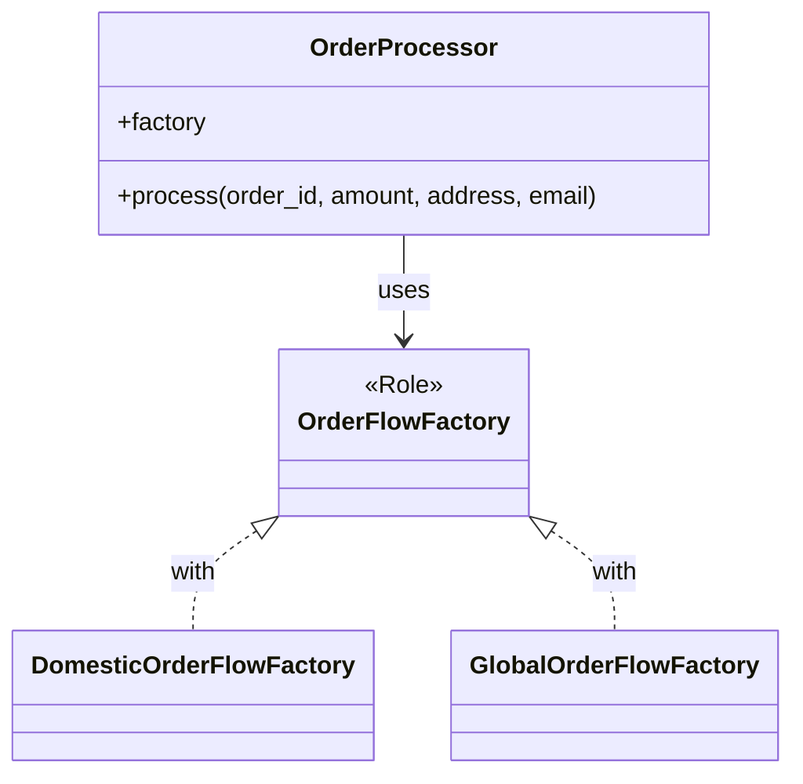
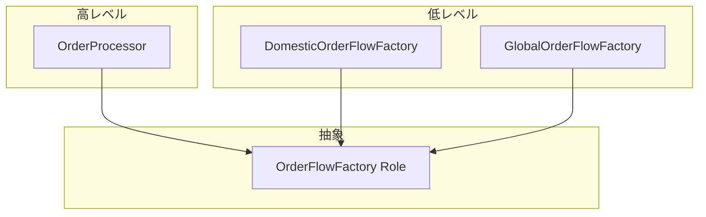

第6回では、OrderProcessorクラスを導入し、Factoryを外部から注入できる設計に進化させます。

## 前回の振り返り

前回は国内/海外の2つのFactoryを実装し、製品ファミリの一括生成を完成させました。

- DomesticOrderFlowFactoryとGlobalOrderFlowFactoryを実装
- ポリモーフィズムにより、クライアントはFactoryの具体クラスを知らなくてよい
- クラス数は10個に増加

今回はクライアントコードを「OrderProcessor」クラスにまとめ、Factoryを外部から注入できるようにします。

## この記事で学ぶこと

- OrderProcessorクラスを定義する
- 依存性注入（Dependency Injection）を実装する
- 疎結合設計のメリットを理解する

## 依存性注入とは

依存性注入（DI）とは、クラスが必要とするオブジェクトを外部から渡す設計パターンです。

クラス内部でオブジェクトを生成するのではなく、コンストラクタや属性を通じて外部から受け取ります。これにより以下のメリットが得られます。

- クラス間の結合度が下がる
- テスト時にモックを注入できる
- Factoryを差し替えるだけで動作が変わる

## OrderProcessorクラスの定義

Factoryを保持し、注文処理を実行するOrderProcessorクラスを定義します。

```perl
package OrderProcessor;
use v5.36;
use Moo;

# Factoryを外部から注入
has factory => (
    is       => 'ro',
    required => 1,
);

sub process ($self, $order_id, $amount, $address, $email) {
    say "=" x 50;
    say "注文処理開始: $order_id";
    say "=" x 50;

    # Factoryから製品を生成
    my $payment = $self->factory->create_payment(amount => $amount);
    my $shipping = $self->factory->create_shipping(address => $address);
    my $notification = $self->factory->create_notification(email => $email);

    # 処理実行
    my $total = $payment->process;
    say "";
    my $delivery_info = $shipping->ship;
    say "";
    $notification->notify($order_id);

    say "";
    say "=" x 50;
    say "注文処理完了";
    say "=" x 50;

    return {
        total         => $total,
        delivery_info => $delivery_info,
    };
}

1;
```

以下が重要なポイントです。

- `factory`属性でFactoryオブジェクトを保持
- `required => 1`により、Factory未指定時はエラー
- `process`メソッド内でFactoryを使って製品を生成

## 完成コード

OrderProcessorを使った完成版のコードです。

```perl
#!/usr/bin/env perl
use v5.36;

# --- 製品クラス（国内） ---
package DomesticPayment;
use v5.36;
use Moo;

has amount => (is => 'ro', required => 1);

sub process ($self) {
    my $fee = int($self->amount * 0.03);
    my $total = $self->amount + $fee;
    say "【国内決済】金額: ¥" . $self->amount . " + 手数料: ¥$fee = 合計: ¥$total";
    return $total;
}

package DomesticShipping;
use v5.36;
use Moo;

has address => (is => 'ro', required => 1);

sub ship ($self) {
    say "【国内配送】お届け先: " . $self->address;
    say "  配送業者: ヤマト運輸";
    say "  配送日数: 1-2営業日";
    return { carrier => 'yamato', days => 2 };
}

package DomesticNotification;
use v5.36;
use Moo;

has email => (is => 'ro', required => 1);

sub notify ($self, $order_id) {
    say "【国内通知】$order_id の注文確認メールを送信";
    say "  宛先: " . $self->email;
    say "  言語: 日本語";
    return 1;
}

# --- 製品クラス（海外） ---
package GlobalPayment;
use v5.36;
use Moo;

has amount => (is => 'ro', required => 1);

sub process ($self) {
    my $fee = int($self->amount * 0.05);
    my $total = $self->amount + $fee;
    say "【海外決済】Amount: \$" . $self->amount . " + Fee: \$$fee = Total: \$$total";
    return $total;
}

package GlobalShipping;
use v5.36;
use Moo;

has address => (is => 'ro', required => 1);

sub ship ($self) {
    say "【海外配送】Delivery to: " . $self->address;
    say "  Carrier: FedEx International";
    say "  Estimated: 5-10 business days";
    return { carrier => 'fedex', days => 10 };
}

package GlobalNotification;
use v5.36;
use Moo;

has email => (is => 'ro', required => 1);

sub notify ($self, $order_id) {
    say "【海外通知】Order confirmation for $order_id sent";
    say "  To: " . $self->email;
    say "  Language: English";
    return 1;
}

# --- 抽象Factoryロール ---
package OrderFlowFactory;
use v5.36;
use Moo::Role;

requires 'create_payment';
requires 'create_shipping';
requires 'create_notification';

# --- 国内向けFactory ---
package DomesticOrderFlowFactory;
use v5.36;
use Moo;

with 'OrderFlowFactory';

sub create_payment ($self, %args) {
    return DomesticPayment->new(%args);
}

sub create_shipping ($self, %args) {
    return DomesticShipping->new(%args);
}

sub create_notification ($self, %args) {
    return DomesticNotification->new(%args);
}

# --- 海外向けFactory ---
package GlobalOrderFlowFactory;
use v5.36;
use Moo;

with 'OrderFlowFactory';

sub create_payment ($self, %args) {
    return GlobalPayment->new(%args);
}

sub create_shipping ($self, %args) {
    return GlobalShipping->new(%args);
}

sub create_notification ($self, %args) {
    return GlobalNotification->new(%args);
}

# --- OrderProcessor（DI対応） ---
package OrderProcessor;
use v5.36;
use Moo;

has factory => (
    is       => 'ro',
    required => 1,
);

sub process ($self, $order_id, $amount, $address, $email) {
    say "=" x 50;
    say "注文処理開始: $order_id";
    say "=" x 50;

    my $payment = $self->factory->create_payment(amount => $amount);
    my $shipping = $self->factory->create_shipping(address => $address);
    my $notification = $self->factory->create_notification(email => $email);

    my $total = $payment->process;
    say "";
    my $delivery_info = $shipping->ship;
    say "";
    $notification->notify($order_id);

    say "";
    say "=" x 50;
    say "注文処理完了";
    say "=" x 50;
    say "";

    return { total => $total, delivery_info => $delivery_info };
}

# --- メイン処理 ---
package main;
use v5.36;

# 国内向けProcessorを作成
my $domestic_processor = OrderProcessor->new(
    factory => DomesticOrderFlowFactory->new
);

$domestic_processor->process(
    'ORD-2026-0007', 5000, '東京都渋谷区1-2-3', 'tanaka@example.com'
);

# 海外向けProcessorを作成
my $global_processor = OrderProcessor->new(
    factory => GlobalOrderFlowFactory->new
);

$global_processor->process(
    'ORD-2026-0008', 100, '123 Main St, New York, NY', 'john@example.com'
);
```

## 設計の改善点

DI導入により、以下の改善が得られました。

1. OrderProcessorが汎用的なクラスになった
2. Factoryを差し替えるだけで国内/海外を切り替えられる
3. テスト時にモックFactoryを注入できる



## 依存性逆転の原則（DIP）

現在の設計は依存性逆転の原則（DIP: Dependency Inversion Principle）に従っています。

- OrderProcessor（高レベルモジュール）は、具体的なFactory（低レベルモジュール）に依存しない
- 両者はOrderFlowFactoryロール（抽象）に依存する
- Factory実装を変更しても、OrderProcessorは変更不要



矢印がすべて抽象（OrderFlowFactory Role）に向かっていることに注目してください。これが依存性の逆転です。

## Factoryを切り替える例

設定に基づいてFactoryを選択する例を示します。

```perl
# 市場に応じてFactoryを選択
my %factories = (
    domestic => DomesticOrderFlowFactory->new,
    global   => GlobalOrderFlowFactory->new,
);

my $market = 'domestic';  # 設定から取得する想定
my $processor = OrderProcessor->new(factory => $factories{$market});

$processor->process('ORD-2026-0009', 3000, '名古屋市中区', 'user@example.com');
```

市場の切り替えはFactoryの選択だけで完了します。OrderProcessorのコードは一切変更しません。

## まとめ

この記事では以下を学びました。

- OrderProcessorクラスを定義し、Factoryを属性として保持するようにした
- 依存性注入（DI）により、Factoryを外部から注入できるようにした
- 依存性逆転の原則（DIP）に従った疎結合設計を実現した

次回は、EU市場を追加してOpen-Closed Principle（OCP）を確認します。既存コードを変更せずに拡張できることを体験しましょう。
