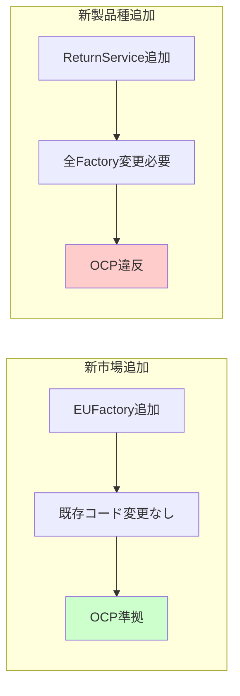
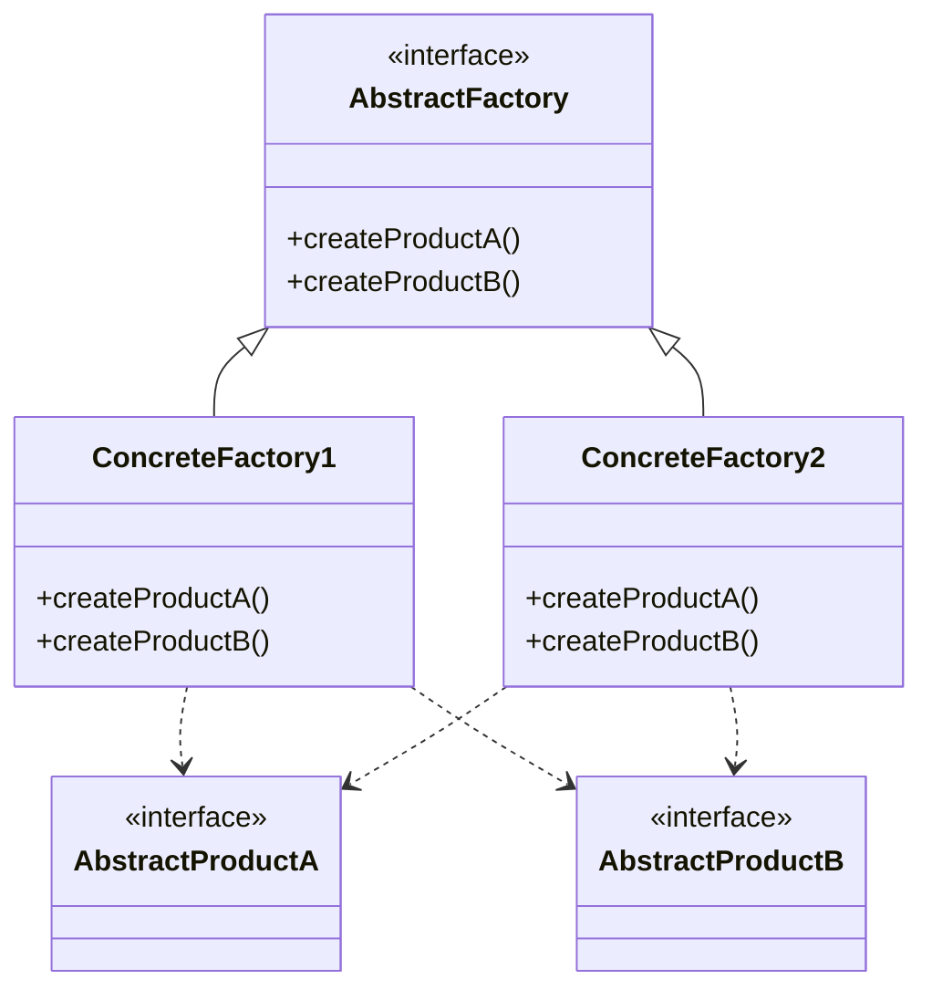
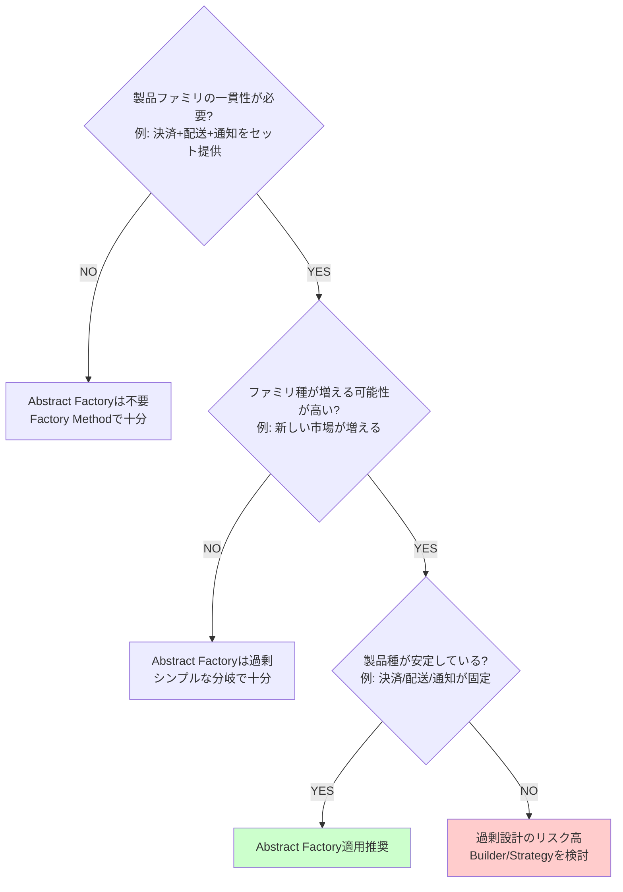
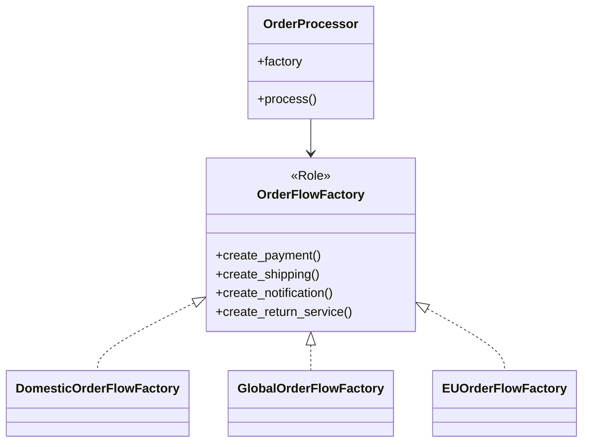

---
categories:
  - tech
date: 2026-01-25T00:10:33+09:00
description: Perlで作る注文フローの国別キット第8回（最終回）。返品処理を追加すると全Factoryの改修が必要になる問題を検証し、Abstract Factoryパターンの適用判断基準を明らかにします
draft: false
epoch: 1769267433
image: /public_images/2026/abstract-factory-header.png
iso8601: 2026-01-25T00:10:33+09:00
series:
  - Perlで作る注文フローの国別キット
tags:
  - perl
  - design-patterns
  - trade-offs
  - yagni
  - refactoring-limits
  - solid-principles
title: '返品フロー追加で見えた限界 - Abstract Factoryの適用判断'
---

第8回（最終回）では、返品フローを追加してパターンの限界を検証します。そして、このパターンの正式名称を明かします。


## 前回の振り返り

前回はEU市場を追加し、OCPを確認しました。

- 既存のコードを変更せずに新市場を追加できた
- Open-Closed Principle（OCP）を満たす設計
- クラス数は14個に増加

今回は「新しい製品種」を追加した場合に何が起きるかを検証します。

## この記事で学ぶこと

- 返品処理（新製品種）追加時の変更量を検証する
- OCPとSRPの衝突を理解する
- Abstract Factoryパターンの適用判断基準を学ぶ

## 新しい製品種の追加要件

ECサイトに返品機能を追加する要件が発生しました。

- 国内返品: 着払いで返送、返金3営業日
- 海外返品: 国際便で返送、返金10営業日
- EU返品: EU内便で返送、返金5営業日

各市場で返品処理が異なるため、Factoryに追加する必要があります。

## 返品クラスの実装

各市場向けの返品クラスを作成します。

```perl
package DomesticReturnService;
use v5.36;
use Moo;

has order_id => (is => 'ro', required => 1);

sub process_return ($self) {
    say "【国内返品】注文 " . $self->order_id . " の返品処理";
    say "  返送方法: 着払い";
    say "  返金目安: 3営業日";
    return { refund_days => 3 };
}

1;
```

```perl
package GlobalReturnService;
use v5.36;
use Moo;

has order_id => (is => 'ro', required => 1);

sub process_return ($self) {
    say "【海外返品】Return for order " . $self->order_id;
    say "  Shipping: International prepaid label";
    say "  Refund ETA: 10 business days";
    return { refund_days => 10 };
}

1;
```

```perl
package EUReturnService;
use v5.36;
use Moo;

has order_id => (is => 'ro', required => 1);

sub process_return ($self) {
    say "【EU返品】Retour pour commande " . $self->order_id;
    say "  Envoi: Étiquette prépayée UE";
    say "  Délai remboursement: 5 jours ouvrés";
    return { refund_days => 5 };
}

1;
```

## Factoryロールの変更

OrderFlowFactoryロールに新しいメソッドを追加する必要があります。

```perl
package OrderFlowFactory;
use v5.36;
use Moo::Role;

requires 'create_payment';
requires 'create_shipping';
requires 'create_notification';
requires 'create_return_service';  # ★新しいメソッドを追加

1;
```

## 全Factoryの改修

ロールに新しいメソッドを追加したため、すべてのConcreteFactoryに同じメソッドを実装する必要があります。

DomesticOrderFlowFactoryへの追加です。

```perl
package DomesticOrderFlowFactory;
use v5.36;
use Moo;

with 'OrderFlowFactory';

sub create_payment ($self, %args) { DomesticPayment->new(%args) }
sub create_shipping ($self, %args) { DomesticShipping->new(%args) }
sub create_notification ($self, %args) { DomesticNotification->new(%args) }

# ★新メソッド追加
sub create_return_service ($self, %args) {
    return DomesticReturnService->new(%args);
}

1;
```

GlobalOrderFlowFactoryへの追加です。

```perl
package GlobalOrderFlowFactory;
use v5.36;
use Moo;

with 'OrderFlowFactory';

sub create_payment ($self, %args) { GlobalPayment->new(%args) }
sub create_shipping ($self, %args) { GlobalShipping->new(%args) }
sub create_notification ($self, %args) { GlobalNotification->new(%args) }

# ★新メソッド追加
sub create_return_service ($self, %args) {
    return GlobalReturnService->new(%args);
}

1;
```

EUOrderFlowFactoryへの追加です。

```perl
package EUOrderFlowFactory;
use v5.36;
use Moo;

with 'OrderFlowFactory';

sub create_payment ($self, %args) { EUPayment->new(%args) }
sub create_shipping ($self, %args) { EUShipping->new(%args) }
sub create_notification ($self, %args) { EUNotification->new(%args) }

# ★新メソッド追加
sub create_return_service ($self, %args) {
    return EUReturnService->new(%args);
}

1;
```

## 変更量の定量的評価

返品機能追加で発生した変更を定量化します。

| 追加/変更項目 | 数量 |
|-------------|------|
| 新規クラス（ReturnService） | 3個 |
| 変更ファイル（Factoryロール） | 1個 |
| 変更ファイル（ConcreteFactory） | 3個 |
| 追加メソッド | 4個（ロール1 + Factory3） |
| 追加行数（概算） | 約80行 |

## EU市場追加との比較

前回（第7回）と今回の変更量を比較します。

| 追加内容 | 変更ファイル数 | 追加行数 | 影響クラス数 | 判定 |
|---------|--------------|---------|-------------|------|
| 新市場（EU）追加 | 0 | 約60行 | 0 | 軽い |
| 新製品種（返品）追加 | 4 | 約80行 | 4 | 重い |

新市場追加では既存コードを変更しませんでしたが、新製品種追加では4ファイルの修正が必要でした。

## OCP vs SRPの衝突

この違いはSOLID原則の衝突によるものです。

OCP（Open-Closed Principle）について考えます。

- 新しいファミリ（市場）追加は容易
- 既存コードを変更せずに拡張できる

SRP（Single Responsibility Principle）について考えます。

- 新しい製品種追加で、全Factoryに責任が増える
- Factoryが「決済/配送/通知/返品」の4つの責任を持つようになる



## Abstract Factoryパターン

ここで、このシリーズで使ってきたパターンの名前を明かします。

「Abstract Factory」パターンです。

GoF（Gang of Four）が定義したデザインパターンの1つで、以下の特徴を持ちます。

- 関連するオブジェクト群（製品ファミリ）を一括生成する
- クライアントは抽象Factory経由で製品を取得し、具体クラスを知らない
- 新しいファミリ追加は容易だが、新しい製品種追加は重い



## 適用判断フローチャート

Abstract Factoryパターンを使うべきかどうかの判断基準です。



## 他パターンとの使い分け

| 状況 | 推奨パターン | 理由 |
|-----|-------------|------|
| 製品ファミリの一貫性が必要 & 製品種が安定 | Abstract Factory | ファミリ追加はOCP準拠で容易 |
| 製品ファミリの一貫性が必要 & 製品種が不安定 | Builder | 段階的構築で柔軟に対応 |
| 製品ファミリの一貫性が不要 & 単一製品生成 | Factory Method | 継承ベースでシンプル |
| 既存オブジェクトの複製 | Prototype | 複製ベースで生成コスト削減 |

## シリーズまとめ

このシリーズで学んだことを振り返ります。

1. 国内注文処理をシンプルに実装した
2. 海外対応でif/else分岐が増殖した
3. 組み合わせミスで業務事故が発生した
4. Abstract FactoryロールでインターフェースをAbstract Factoryで解決した
5. 国内/海外Factoryで製品ファミリを一括生成した
6. OrderProcessorでDIを実現した
7. EU市場追加でOCPを確認した
8. 返品フロー追加でパターンの限界を検証した

Abstract Factoryパターンは強力ですが、適用条件を見極めることが重要です。

- 製品ファミリの一貫性が業務上必須である
- ファミリ種（市場など）が増える可能性が高い
- 製品種（決済/配送など）が安定している

これらの条件がすべて揃った場合にのみ、Abstract Factoryパターンを検討してください。

## 最終的なクラス構成



## まとめ

この記事では以下を学びました。

- 返品処理（新製品種）追加で全Factoryの改修が必要になった
- 新市場追加（OCP準拠）と新製品種追加（OCP違反）の違いを確認した
- Abstract Factoryパターンの名前と適用判断基準を学んだ
- 製品種が安定していることがパターン適用の重要条件

このシリーズを通じて、製品ファミリの一貫性を保つ設計パターンを体験しました。パターンの便利さと限界の両方を理解し、適切な場面で活用してください。
