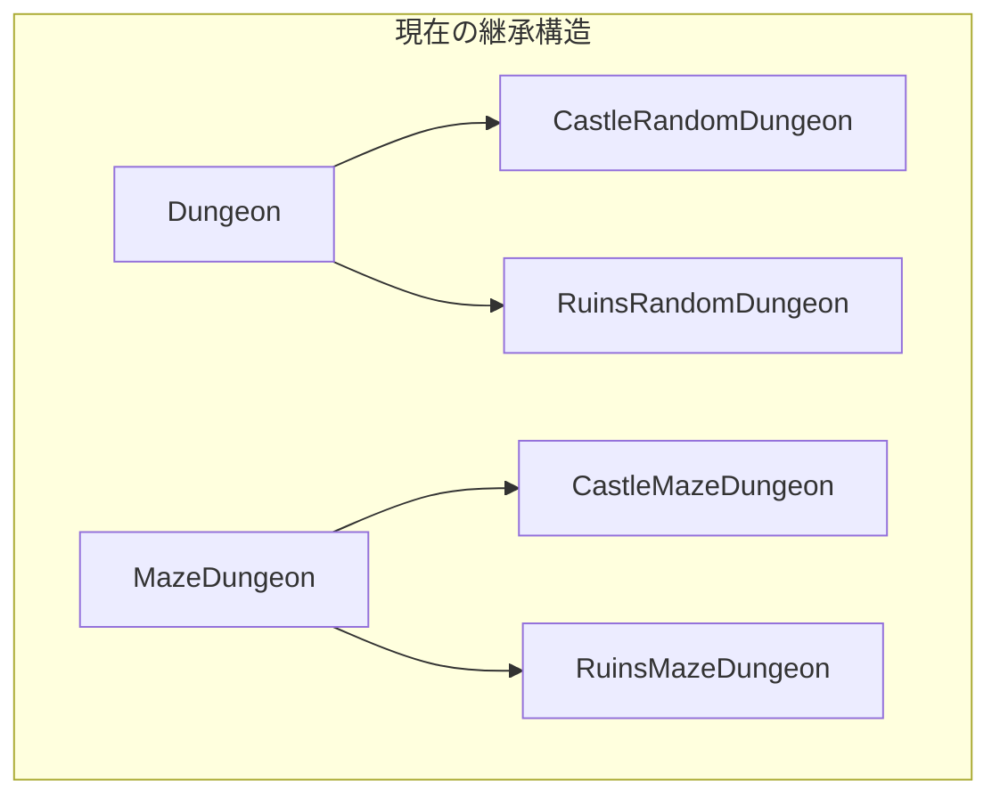

PerlとMooで「ランダムダンジョンジェネレーター」を作る連載の第3回です。



前回は迷路型アルゴリズムを追加しましたが、コードの重複が発生していました。
今回は「テーマ」という新しい軸を追加しようとして、さらに深刻な問題に直面します。


## テーマを追加したい

現在のダンジョンは、壁が`#`で床が`.`という単純な表示です。
もっと視覚的に楽しくするために、テーマを追加してみましょう。

- 洞窟（Cave）: 現在の表示（`#`と`.`）
- 城（Castle）: 石壁`█`と石床`░`
- 遺跡（Ruins）: 崩れた壁`▓`と苔むした床`▒`

## 素直に実装してみる

素直に考えると、テーマごとにモジュールを作ることになります。

まず、洞窟テーマのランダム配置ダンジョンを継承して、城テーマを作ってみましょう。

```perl
# CastleRandomDungeon.pm - 城テーマ×ランダム配置
package CastleRandomDungeon;
use v5.36;
use Moo;

extends 'Dungeon';  # ランダム配置を継承

# 表示をオーバーライド
sub render ($self) {
    my $map    = $self->map;
    my $output = '';

    for my $row ( $map->@* ) {
        for my $cell ( $row->@* ) {
            if ( $cell eq '#' ) {
                $output .= '█';  # 石壁
            }
            else {
                $output .= '░';  # 石床
            }
        }
        $output .= "\n";
    }

    return $output;
}

1;
```

同様に、遺跡テーマも作ります。

```perl
# RuinsRandomDungeon.pm - 遺跡テーマ×ランダム配置
package RuinsRandomDungeon;
use v5.36;
use Moo;

extends 'Dungeon';

sub render ($self) {
    my $map    = $self->map;
    my $output = '';

    for my $row ( $map->@* ) {
        for my $cell ( $row->@* ) {
            if ( $cell eq '#' ) {
                $output .= '▓';  # 崩れた壁
            }
            else {
                $output .= '▒';  # 苔むした床
            }
        }
        $output .= "\n";
    }

    return $output;
}

1;
```

## 迷路型も同じことをする

迷路型アルゴリズムにも城テーマと遺跡テーマを追加します。

```perl
# CastleMazeDungeon.pm - 城テーマ×迷路型
package CastleMazeDungeon;
use v5.36;
use Moo;

extends 'MazeDungeon';

sub render ($self) {
    my $map    = $self->map;
    my $output = '';

    for my $row ( $map->@* ) {
        for my $cell ( $row->@* ) {
            if ( $cell eq '#' ) {
                $output .= '█';
            }
            else {
                $output .= '░';
            }
        }
        $output .= "\n";
    }

    return $output;
}

1;
```

```perl
# RuinsMazeDungeon.pm - 遺跡テーマ×迷路型
package RuinsMazeDungeon;
use v5.36;
use Moo;

extends 'MazeDungeon';

sub render ($self) {
    my $map    = $self->map;
    my $output = '';

    for my $row ( $map->@* ) {
        for my $cell ( $row->@* ) {
            if ( $cell eq '#' ) {
                $output .= '▓';
            }
            else {
                $output .= '▒';
            }
        }
        $output .= "\n";
    }

    return $output;
}

1;
```

## クラス爆発の発生

ここまでで、以下のクラスが必要になりました。

| アルゴリズム＼テーマ | 洞窟 | 城 | 遺跡 |
|---|---|---|---|
| ランダム配置 | Dungeon | CastleRandomDungeon | RuinsRandomDungeon |
| 迷路型 | MazeDungeon | CastleMazeDungeon | RuinsMazeDungeon |

2種類のアルゴリズム × 3種類のテーマ = 6クラス

これだけでも多いですが、さらにアルゴリズムを1つ追加するとどうなるでしょうか？

## 部屋区分型アルゴリズムを追加すると...

「部屋区分型（BSP）」というアルゴリズムを追加したいとします。
すると、以下のようになります。

| アルゴリズム＼テーマ | 洞窟 | 城 | 遺跡 |
|---|---|---|---|
| ランダム配置 | Dungeon | CastleRandomDungeon | RuinsRandomDungeon |
| 迷路型 | MazeDungeon | CastleMazeDungeon | RuinsMazeDungeon |
| 部屋区分型 | BSPDungeon | CastleBSPDungeon | RuinsBSPDungeon |

3種類のアルゴリズム × 3種類のテーマ = 9クラス

## さらにテーマを追加すると...

新しいテーマ「水中神殿」を追加したいとします。

| アルゴリズム＼テーマ | 洞窟 | 城 | 遺跡 | 水中神殿 |
|---|---|---|---|---|
| ランダム配置 | Dungeon | Castle... | Ruins... | UnderwaterTemple... |
| 迷路型 | Maze... | Castle... | Ruins... | UnderwaterTemple... |
| 部屋区分型 | BSP... | Castle... | Ruins... | UnderwaterTemple... |

3種類のアルゴリズム × 4種類のテーマ = 12クラス

## これはアンチパターン

このような状況を「クラス爆発」と呼びます。
以下の問題があります。

- 新しいアルゴリズムを追加するたびに、全テーマ分のクラスが必要
- 新しいテーマを追加するたびに、全アルゴリズム分のクラスが必要
- `render`メソッドの修正が、全クラスに波及する
- 組み合わせが増えると、管理が困難になる

これは単一責任原則（SRP）とオープン・クローズド原則（OCP）の両方に違反しています。

単一責任原則（SRP）とは「1つのクラスは1つの責任だけを持つべき」という原則です。
`CastleMazeDungeon`は「迷路生成」と「城テーマでの表示」という2つの責任を持っています。

オープン・クローズド原則（OCP）とは「拡張に対して開いていて、修正に対して閉じているべき」という原則です。
現在の設計では、新しいアルゴリズムを追加するたびに既存のクラス構造に影響を与えてしまいます。

## 問題の本質

問題の本質は、「アルゴリズム」と「テーマ」という2つの独立した変動軸を、継承という1つの軸で表現しようとしていることです。



継承は「is-a」関係を表現するのに適していますが、複数の変動軸を持つ場合には適していません。

「is-a」関係とは「〜は〜である」という関係です。
例えば「CastleMazeDungeon is a MazeDungeon（城迷路ダンジョンは迷路ダンジョンである）」は成り立ちます。
しかし、「城テーマ」と「迷路アルゴリズム」は独立した概念であり、継承では表現しきれません。

## 解決の糸口

この問題を解決するには、「アルゴリズム」と「テーマ」を独立したクラス階層として分離する必要があります。

- アルゴリズム: ランダム配置、迷路型、部屋区分型
- テーマ: 洞窟、城、遺跡、水中神殿

それぞれを独立させれば、3 + 4 = 7クラスで済みます。
3 × 4 = 12クラスではなく、3 + 4 = 7クラスです。

この「抽象と実装を分離する」設計パターンが、次回紹介する「Bridgeパターン」です。

## 今回のまとめ

第3回では、クラス爆発問題を体験しました。

- テーマという新しい軸を追加しようとした
- アルゴリズム × テーマ の組み合わせでクラスが爆発
- 継承だけでは複数の変動軸を扱えない
- 3 × 4 = 12 クラスが必要になる事態

このままでは、コードの保守が大変です。
でも安心してください。

次回は、この問題を解決する「Bridgeパターン」を導入します。
12クラス必要だった設計が、わずか7クラスで実現できるようになります。
その秘密は「委譲」というテクニックにあります！


