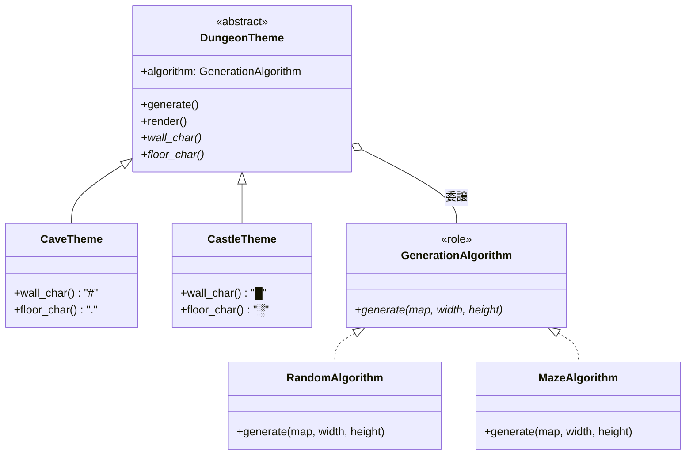

PerlとMooで「ランダムダンジョンジェネレーター」を作る連載の第4回です。



前回はクラス爆発問題に直面しました。
今回はBridgeパターンを導入して、この問題を解決します。


## Bridgeパターンとは

Bridgeパターンは、「抽象」と「実装」を分離して、それぞれを独立に拡張できるようにする設計パターンです。

GoF（Gang of Four）の23デザインパターンの1つで、構造パターン（Structural Pattern）に分類されます。

今回のダンジョンジェネレーターでは、以下のように分離します。

- 抽象（Abstraction）: テーマ（表示方法）
- 実装（Implementor）: アルゴリズム（生成方法）

## 設計図



テーマとアルゴリズムが独立したクラス階層になっています。
テーマはアルゴリズムを「持って」いて、生成処理を委譲します。

「委譲（delegation）」とは、あるオブジェクトが別のオブジェクトに仕事を任せることです。
継承が「親クラスの能力を引き継ぐ」のに対し、委譲は「他のクラスに仕事を頼む」考え方です。

今回の場合、`DungeonTheme`は自分でダンジョンを生成せず、`algorithm`に`generate`を呼び出して任せています。

## アルゴリズムをRoleとして定義

まず、生成アルゴリズムのインターフェースをMoo Roleとして定義します。

```perl
# GenerationAlgorithm.pm - アルゴリズムのRole
package GenerationAlgorithm;
use v5.36;
use Moo::Role;

# サブクラスで実装必須
requires 'generate';

1;
```

`requires`で`generate`メソッドの実装を強制しています。
このRoleを適用するクラスは、必ず`generate`メソッドを実装しなければなりません。

## ランダム配置アルゴリズム

```perl
# RandomAlgorithm.pm - ランダム配置アルゴリズム
package RandomAlgorithm;
use v5.36;
use Moo;

with 'GenerationAlgorithm';

sub generate ( $self, $map, $width, $height ) {
    for my $y ( 1 .. $height - 2 ) {
        for my $x ( 1 .. $width - 2 ) {
            if ( rand() < 0.7 ) {
                $map->[$y][$x] = '.';
            }
        }
    }
}

1;
```

## 迷路型アルゴリズム

```perl
# MazeAlgorithm.pm - 迷路型アルゴリズム
package MazeAlgorithm;
use v5.36;
use Moo;

with 'GenerationAlgorithm';

has visited => (
    is      => 'rw',
    lazy    => 1,
    default => sub { {} },
);

sub generate ( $self, $map, $width, $height ) {
    $self->visited( {} );    # リセット
    $self->_carve( $map, $width, $height, 1, 1 );
}

sub _carve ( $self, $map, $width, $height, $x, $y ) {
    my $visited = $self->visited;

    $map->[$y][$x] = '.';
    $visited->{"$x,$y"} = 1;

    my @directions = ( [ 0, -2 ], [ 0, 2 ], [ -2, 0 ], [ 2, 0 ] );
    @directions = sort { rand() <=> rand() } @directions;

    for my $dir (@directions) {
        my ( $dx, $dy ) = $dir->@*;
        my $nx = $x + $dx;
        my $ny = $y + $dy;

        if (   $nx > 0
            && $nx < $width - 1
            && $ny > 0
            && $ny < $height - 1
            && !$visited->{"$nx,$ny"} )
        {
            $map->[ $y + $dy / 2 ][ $x + $dx / 2 ] = '.';
            $self->_carve( $map, $width, $height, $nx, $ny );
        }
    }
}

1;
```

## テーマの基底クラス

テーマの基底クラスを作成します。
アルゴリズムを属性として持ち、生成処理を委譲します。

```perl
# DungeonTheme.pm - テーマの基底クラス
package DungeonTheme;
use v5.36;
use Moo;

# アルゴリズムを注入
has algorithm => (
    is       => 'ro',
    required => 1,
    does     => 'GenerationAlgorithm',
);

has width  => ( is => 'ro', default => 41 );
has height => ( is => 'ro', default => 11 );

has map => (
    is      => 'rw',
    lazy    => 1,
    builder => '_build_map',
);

sub _build_map ($self) {
    my @map;
    for my $y ( 0 .. $self->height - 1 ) {
        my @row;
        for my $x ( 0 .. $self->width - 1 ) {
            push @row, '#';
        }
        push @map, \@row;
    }
    return \@map;
}

# 生成をアルゴリズムに委譲
sub generate ($self) {
    $self->algorithm->generate( $self->map, $self->width, $self->height );
}

# 表示（テーマごとにオーバーライド）
sub render ($self) {
    my $map    = $self->map;
    my $output = '';

    for my $row ( $map->@* ) {
        for my $cell ( $row->@* ) {
            if ( $cell eq '#' ) {
                $output .= $self->wall_char;
            }
            else {
                $output .= $self->floor_char;
            }
        }
        $output .= "\n";
    }

    return $output;
}

# サブクラスでオーバーライド
sub wall_char ($self)  { '#' }
sub floor_char ($self) { '.' }

1;
```

`algorithm`属性には`does => 'GenerationAlgorithm'`を指定しています。
これにより、`GenerationAlgorithm`ロールを適用したオブジェクトのみを受け入れます。

`does`オプションは、渡されたオブジェクトが指定したRoleを持っているかチェックします。
もし`RandomAlgorithm`や`MazeAlgorithm`以外のオブジェクトを渡すと、エラーになります。
これにより、型安全性が確保されます。

## テーマの具象クラス

各テーマは基底クラスを継承して、表示文字だけを変更します。

```perl
# CaveTheme.pm - 洞窟テーマ
package CaveTheme;
use v5.36;
use Moo;

extends 'DungeonTheme';

# デフォルトのまま（#と.）

1;
```

```perl
# CastleTheme.pm - 城テーマ
package CastleTheme;
use v5.36;
use Moo;

extends 'DungeonTheme';

sub wall_char ($self)  { '█' }
sub floor_char ($self) { '░' }

1;
```

```perl
# RuinsTheme.pm - 遺跡テーマ
package RuinsTheme;
use v5.36;
use Moo;

extends 'DungeonTheme';

sub wall_char ($self)  { '▓' }
sub floor_char ($self) { '▒' }

1;
```

## 使用例

テーマとアルゴリズムを自由に組み合わせられます。

```perl
#!/usr/bin/env perl
# bridge_demo.pl - Bridgeパターンによるダンジョン生成
use v5.36;
use lib '.';

use CastleTheme;
use MazeAlgorithm;

# 城テーマ × 迷路型アルゴリズム
my $dungeon = CastleTheme->new(
    algorithm => MazeAlgorithm->new,
    width     => 41,
    height    => 11,
);

$dungeon->generate;
print $dungeon->render;
```

実行結果は以下のようになります。

```
█████████████████████████████████████████
█░█░░░░░█░░░░░█░░░░░░░█░█░░░░░█░░░░░░░░░█
█░█░███░█░███░█░█████░█░█░███░█░███████░█
█░█░░░█░█░░░█░█░█░░░█░█░█░█░░░█░░░░░░░█░█
█░███░█░███░█░█░█░█░█░█░█░█░█████████░█░█
█░░░░░█░░░░░█░░░█░█░░░█░░░█░░░░░░░░░░░█░█
█████░█████░█████░█░███████████████░███░█
█░░░█░░░░░█░░░░░█░█░█░░░░░░░░░░░░░█░░░█░█
█░█░█████░█████░█░█░█░███████████░███░█░█
█░█░░░░░░░░░░░░░█░░░█░░░░░░░░░░░░░░░█░░░█
█████████████████████████████████████████
```

城テーマで迷路型のダンジョンが生成されました。

## クラス数の比較

Bridgeパターン導入前後でクラス数を比較してみましょう。

導入前（継承ベース）の場合は以下のクラスが必要でした。

```
2アルゴリズム × 3テーマ = 6クラス
```

Bridgeパターン導入後は以下の通りです。

```
アルゴリズム: 2クラス + 1ロール = 3モジュール
テーマ:       3クラス + 1基底   = 4モジュール
合計:         7モジュール
```

現時点ではあまり差がありませんが、組み合わせが増えると効果が顕著になります。

3アルゴリズム × 4テーマの場合は以下のようになります。

- 導入前: 3 × 4 = 12クラス
- 導入後: 3 + 4 + 2（ロール・基底） = 9モジュール

4アルゴリズム × 5テーマの場合は以下の通りです。

- 導入前: 4 × 5 = 20クラス
- 導入後: 4 + 5 + 2 = 11モジュール

## 今回のまとめ

第4回では、Bridgeパターンを導入してクラス爆発問題を解決しました。

- アルゴリズムをRoleとして分離（Implementor）
- テーマを基底クラスで統一（Abstraction）
- 委譲により、テーマとアルゴリズムを自由に組み合わせ
- n × m クラスが n + m クラスに削減

次回は、新しいテーマ「水中神殿」を追加して、Bridgeパターンの拡張性を体験します。
既存のコードを変更せずに、1クラス追加するだけで済むことを確認しましょう。


